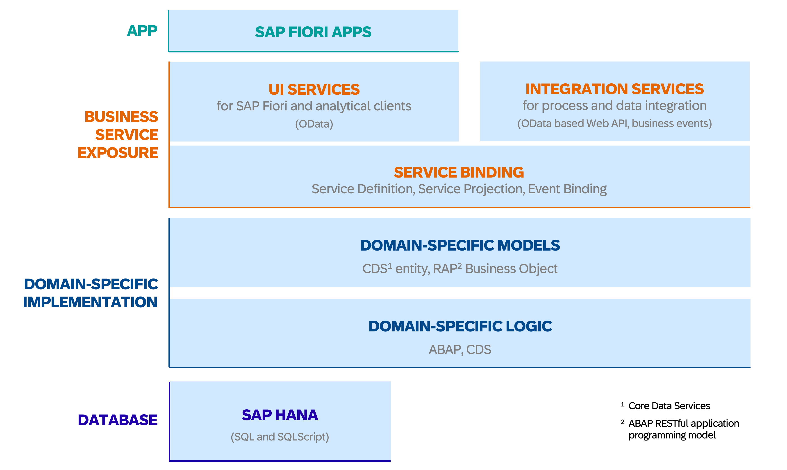

{: .no_toc}
# ABAP RESTful Application Programming Model (RAP)

1. TOC
{:toc}

## Einleitung
Das [ABAP RESTful Application Programming Model](https://help.sap.com/docs/ABAP_PLATFORM_NEW/fc4c71aa50014fd1b43721701471913d/289477a81eec4d4e84c0302fb6835035.html?locale=en-US), kurz _RAP_, wurde seitens der SAP 2018 erstmalig vorgestellt und ist seit dem S/4HANA Release 1909 nutzbar. Konzeptuell weist es viele Parallelen zum [ABAP-Programming Model for SAP Fiori](https://help.sap.com/docs/ABAP_PLATFORM/cc0c305d2fab47bd808adcad3ca7ee9d/3b77569ca8ee4226bdab4fcebd6f6ea6.html?mt=de-DE) auf und kann daher als dessen spiritueller Nachfolger gesehen werden.  

Beide Programmiermodelle geben die nötigen Entwicklungsobjekte und deren Zusammenspiel vor um in einem S/4HANA System Applikationen und Schnittstellen mit eigener Datenhaltung aufzubauen. Die Weiterentwicklung zu RAP hat die Entwicklung nochmals deutlich vereinfacht und kommt gänzlich ohne SAP GUI Transaktionen oder SEGW Services aus. Auch bei RAP dreht sich die gesamte Anwendungslogik um ein sogenanntes Business Objekt, das Datenhaltung und vorhandene Businesslogik definiert und Konsumenten anbietet. Erste Wahl sollte RAP sein, wenn transaktionale Fiori Elements Applikationen zu entwickeln sind (List Report & Object Page). Aber auch rein lesende APIs, SAPUI5 Freestyle Apps oder SAP-fremde UI-Technologien lassen sich mit RAP umsetzen durch die Nutzung der resultierenden OData-Services.

RAP bildet dabei das komplette E2E-Szenario von der Datenbankschicht bis hin zum veröffentlichten OData-Service ab. Das Business Objekt (BO) wird einerseits durch das virtuelle Datenmodell (VDM) sowie andererseits durch das (optional) verfügbare Verhalten definiert. Im VDM werden durch die Anlage von CDS-Views die Felder aus der Datenbank selektiert und über Beziehungen zwischen den CDS-Views der BO Composition Tree festgelegt. Dieser besteht immer aus einer Wurzel-Entität (Root, beispielsweise eine Reise mit entsprechend möglichen Instanzen) und beliebig vielen Kind-Entitäten (etwa eine oder mehrere Instanzen von Flugbuchungen unterhalb der Reise). Dieser Kompositionsbaum kann beliebig tief aufgebaut werden. Jede Kind-Entität kann dabei lediglich gemeinsam mit ihrem direkten Elter exististieren und dessen Schlüssel ist Teil des eigenen.  

## Empfehlungen / Best Practices 
>* RAP sollte [frühestens ab Release 2021](https://pages.community.sap.com/topics/abap/rap) produktiv genutzt werden. Setzen Sie sich bei Bedarf detailliert mit dem eingeschränkten Funktionsumfang im Release 1909 sowie 2020 (wie das Fehlen von Validations, Determinations, Draft, ...) auseinander!  
* In der Regel sollten Sie für Neuentwicklungen das integrierte Draft-Konzept nutzen und lediglich bei triftigen Gründen darauf verzichten.
* Da RAP als Technologie relativ neu ist gibt es teils eklatante Unterschiede je nach S/4HANA Release. Machen Sie sich mit den Einschränkungen ihres Systems vorab vertraut!  
* Wann immer möglich sollten neue Applikationen mit Fiori Elements umgesetzt werden. SAPUI5 Freestyle-Apps verlocken gerne dazu, sich durch zusätzliche Freiheiten in erhöhte Komplexität locken zu lassen und führen in der Regel zu deutlichem Mehraufwand.
* Vergessen Sie nicht, Ihre Entwicklungen mit RAP zur Erweiterbarkeit für andere Konsumenten freizugeben, falls dies gewünscht ist.
{: .highlight}

## Managed Entwicklungen mit RAP
Per Definition trennt das RAP-Framework die einzelnen Entwicklungsobjekte ohnehin und gibt dadurch die Softwarearchitektur und eine saubere Trennung bereits vor. Die tatsächliche Anwendungslogik wird dabei strikt von der Datenhaltung getrennt. Diese strikten Vorgaben des Framework erleichtern Entwickler:innen das Orientieren und Implementieren von Anwendungen und nimmt viel Arbeit diesbezüglich ab. Das nachstehende Bild zeigt das grobe Zusammenspiel der Teilelemente in RAP Programmierungen.  

  
RAP Big Picture, © SAP
{: .img-caption}

### Datenbankebene
Bei Neuentwicklungen sollte stets das Managed Szenario genutzt werden um möglichst viele Funktionalitäten (CRUD-Handlung, Draft, ...) automatisiert vom Framework zu nutzen und manuellen Entwicklungsaufwand zu reduzieren. Einige Unterschiede im [Unmanaged Szenario](#unmanaged-szenario) finden Sie im entsprechenden Abschnitt weiter unten. Auf unterster Ebene wird das Datenmodell für das RAP Business Objekt klassisch via DDIC Tabellen oder auf neueren Systemen mit CDS Tabellenentitäten erstellt. Jeder Knoten, der später über RAP als eigenes EntitySet veröffentlicht werden soll, erhält eine eigene Datenhaltung. Es ist darauf zu achten, UUIDs als Schlüssel zu verwenden und den UUID-Schlüssel aller hierarchisch obergeordneten Knoten mit einzubeziehen.

### Virtuelles Datenmodell
Basierend auf den Tabellen wird nun das Virtuelle Datenmodell (VDM) via CDS Views aufgebaut - mehr Informationen zu diesem Entwicklungsobjekt finden Sie im Kapitel [Core Data Services](../core-data-services/index.md). Gemäß der SAP-Empfehlungen sollten hierfür mehrere Ebenen bzw. Layer aufgebaut werden (von unten nach oben):
* **DB-Tabelle**
* **I_** Basic Interface View (Umbenennung der Felder, ... entfällt ggf. bei Nutzung von CDS Table Entities)  
* **R_** Restricted Base View (Reuse Layer, Composition Tree für RAP mit App-Spezifika)
* **I_** (optional) Composite Interface View, Freigegebene API zur Erweiterung basierend auf dem R_View
* **C_** Projection View (Consumption Layer, Projektion mit App-spezifischen UI-Annotationen)  

Um bereits im CDS-View zu signalisieren, dass Ihre CDS-Views für RAP genutzt werden können Sie das Suffix _TP im Namen verwenden. Die SAP empfiehlt dies zwar - aus unserer Sicht kann jedoch darauf verzichtet werden.  

Pro Business Objekt gibt es maximal einen Restricted Layer, zu dem auch das BO Verhalten definiert wird. Verwenden dieses BO jedoch mehrere, separate Applikationen haben Sie die Möglichkeit, später mehrere Consumption Layer anzulegen und können dort App-spezifische Virtuelle Felder im CDS an dieser Stelle ergänzen oder überflüssige Felder für den jeweiligen Use-Case aus der Selektion entfernen. Sind virtuelle Felder aber für das gesamte RAP BO relevant und gültig sollten sie entsprechend bereits tiefer im Reuse Layer eingeführt werden. Selbiges gilt für die Verknüpfung von Wertehilfen oder sprachspezifischen Texten, die im BO global genutzt werden sollen.

### Behavior Definition & Pool
Aufbauen auf dem Root Reuse CDS View wird in der nächsten RAP-Schicht eine zentrale Behavior Definition angelegt. Diese definiert das verfügbare transaktionale Verhalten zum Business Objekt und enthält zentrale Konfigurationen dafür. Sie ist einmalig und es können nicht mehrere Behavior Definitions zu einem gegebenen CDS Composition Tree existieren. Jeder Knoten des Baumes ist einzeln in der Behavior Definition aufgeführt und kann mit einem Alias versehen werden und kann im Anschluss via [EML](#entity-manipulation-language-eml) unter diesem angesprochen werden.

### Behavior Projection
Die zuvor genannte Behavior Definition existiert einmalig und zentral zu jedem Business Object (Composition Tree) und legt fest, welches Verhalten dieses BO grundsätzlich zur Verfügung stellt. Das BO kann nun jedoch in mehreren (oder keinen) Fiori Applikationen verwendet werden und hier unterscheiden sich die konkreten Anforderungen in der Regel. Beispielsweise soll nur die App für bestimmte Anwender erlauben, bestehende Instanzen zu löschen - dafür wird für andere Anwender die Neuanlage von Instanzen weniger relevant sein. Die Projection-Schicht ermöglich daher, das zur Verfügung stehende Verhalten des RAP BOs für jede einzelne App oder API einzuschränken. Validierungen und Determinierungen jedoch werden für das BO immer automatisch angewendet. Action beispielsweise lassen sich in der Behavior Projection ignorieren, indem sie eben nicht zur Verwendung freigegeben werden. Ähnlich hierzu werden in den CDS Projection Schicht die anzuzeigenden Felder eingeschränkt. Die Behavior Projection bezieht sich auf eine Root Consumption CDS View und diese wird später für die Service Definition genutzt.

### OData Veröffentlichung
Der eigentliche OData Service wird im RAP Framework nicht mehr wie zuvor üblich über die Transaktion SEGW veröffentlicht. Vielmehr übernimmt die Generierung und Bereitstellung das Framework automatisiert und mit lediglich wenigen Konfigurationen ihrerseits.  

Zunächst müssen Sie aufbauen auf Ihrem Root Consumption CDS View eine **Service Definition** erstellen. Diese listet all zu veröffentlichenden Consumption CDS Views auf und ermöglicht die Vergabe eines Alias pro Quelle. Unter diesem Alias ist die Entität im OData-Service später als EntitySet verfügbar. Andere, verknüpfte CDS Views beispielsweise als Stammdatenquellen müssen nicht explizit aufgenommen werden, diese werden bei Referenzierung aus veröffentlichten CDS-Views automatisch Teil des Services.

Aufbauend auf der Service Definition wird im nächsten Schritt ein **Service Binding** angelegt. Hier können Sie festlegen ob der OData Service zur Nutzung von Fiori Oberflächen, für analytische Szenarien oder einfach als Web-API gedacht ist. Außerdem entscheiden Sie sich für OData V2 oder V4. Nach dem Pulishen können Sie für UI Services direkt die Fiori Preview aufrufen oder andernfalls beispielsweise via /IWFND/GW_CLIENT den OData-Service konsumieren und gelieferte Daten testen. Vor S/4HANA 2025 ist für V4-Aktivierungen On-Premise die Nutzung der Transaktion /IWFND/V4_ADMIN nötig.

## Weitergehende RAP-Funktionalitäten

### RAP Unit Testing
Das RAP Framework unterstützt natürlich auch die Erstellung von Unit Tests um eine hohe Anwendungsqualität als Priorität im Entwicklungszyklus zu unterstützen. Hierzu werden im Behavior Pool des Business Objects lokale Testklassen definiert um darin zum Beispiel die korrekte Funktionsweise einer RAP Validation zu überprüfen oder sicherzustellen, dass das Durchlaufen einer Action zum gewünschten Ergebnis führt. Diese rufen dann direkt die ABAP-Methoden der `class_under_test` auf und können im ATC durchlaufen und ausgewertet werden. Alternativ kann eine separate Testklasse definiert werden, die über EML das RAP BO testet; auch hier können genutzte Stammdaten über CDS Test Doubles gemockt und verwendet werden - die Referenz zum BO wird durch ein ABAP Doc Kommentar `"! @testing BDEF:<rap_bo_name>` hergestellt. Weiterführende Informationen und konkrete Beispiele stehen unter anderem in diesem [RAP Workshop](https://github.com/SAP-samples/abap-platform-rap-workshops/tree/main/rap4xx/rap400#readme) zur Verfügung.

### Erweiterbarkeit
Seit dem S/4 Release 2022 besteht die Möglichkeit, RAP Business Objecte zu erweitern. Wenn der Ersteller eines BOs (z.B. SAP, Partner, Kunde) dies zur Erweiterbarkeit freigegeben hat bestehen hier weitreichende Möglichkeiten, die ausgelieferte Funktionalität des BOs zu erweitern und an die Business-Anforderungen anzupassen. Szenarien sind etwa das Hinzufügen neuer Feld durch [Data Model Extensions](https://help.sap.com/docs/abap-cloud/abap-rap/develop-data-model-extensions), Hinzufügen von Verhalten über [Behavior Extensions](https://help.sap.com/docs/abap-cloud/abap-rap/develop-behavior-extensions) oder komplett neue Knoten im BO Kompositionsbaum durch sogenannte [Node Extensions](https://help.sap.com/docs/abap-cloud/abap-rap/develop-node-extensions). Beachten Sie in Ihren eigenen Entwicklungen, sämtliche Entwicklungsobjekte für die Erweiterung freizugeben, falls dies gewünscht ist. Ein praktisches Hands-On steht im [RAP-Kurs 630](https://github.com/SAP-samples/abap-platform-rap630) zur Verfügung.

### Unmanaged Szenario
Wenn Sie Ihre Anwendung nicht auf der _grünen Wiese_ entwickeln können bietet das `unmanaged` Szenario die Möglichkeit, auch bestehendes Legacy-Coding über ein RAP BO zu veröffentlichen. Hier haben Sie leider nicht die komfortablen Features zu CRUD out-of-the-box. Stattdessen müssen Sie sowohl die Interaktionsphase als auch die Speichersequenz komplett selbst implementieren. In der lokalen Klasse `cl_abap_behavior_saver` wird dazu programmiert, wie die Änderungen aus der Interaktionsphase über ihr bestehendes Legacy-Coding (wie z.B. BAPIs) persistiert wird und Änderungen, Löschungen oder Neuanlagen verbucht werden. Die Möglichkeit des manuell zu implementierenden `unmanaged save` oder `additional save` haben Sie bei Bedarf jedoch auch im `managed` Szenario. Ein Hands-On können Sie [hier](https://github.com/SAP-samples/abap-platform-rap-opensap/blob/main/week4/unit3.md) finden.

### Entity Manipulation Language (EML)
Die Entity Manipulation Language würde extra für das RAP Framework zum ABAP Kernel hinzugefügt und erlaubt die Nutzung und Interaktion mit RAP Business Objecten aus ABAP Code heraus. Sie können Ihre BOs oder von der SAP freigegebene auf diese Weise also auch in individuellen Entwicklungen aufrufen. Es bestehen unter anderem Möglichkeiten zur Anlage neuer Instanzen, Aufruf von Action, Bearbeitung von Feldwerten und ähnlichem. Alle Knoten des Kompositionsbaumes können über die entsprechende Syntax genutzt werden. Für mehr Informationen bietet sich das [EML Cheat Sheet](https://github.com/SAP-samples/abap-cheat-sheets/blob/main/08_EML_ABAP_for_RAP.md) als weiterführende Quelle an.

### RAP Feature Showcase App
Die SAP stellt ein zentrales Repository bereit, das als Beispielapplikation in ihrem S/4 System installiert werden kann. Diese [RAP Feature Showcase App](https://github.com/SAP-samples/abap-platform-fiori-feature-showcase) zeigt Ihnen interaktiv, welche Funktionalitäten mit RAP und Fiori Elements generell umgesetzt werden können und hilft Ihnen dabei, die nötigen Entwicklungen direkt im System nachzuvollziehen. Nach der Installation können Sie die App auf Ihrem S/4 System ausführen und alle verfügbaren Möglichkeiten erkunden. Die App gibt auch konkrete Auskunft dazu, wie bestimmte Funktionen umgesetzt werden können.

### Migration von CDS-generiertem BOPF
Sie haben die Möglichkeit, bestehende BOPF-Anwendungen in das modernere RAP Framework zu migrieren, wenn diese nicht mit der BOBX-Transaktion sondern über @ObjectModel-Annotationen aus CDS heraus generiert wurden. Weitere Informationen zur Vorgehensweise finden Sie im offiziellen [Migration Guide Migration von CDS-generiertem BOPF zu RAP](https://help.sap.com/docs/SAP_S4HANA_ON-PREMISE/0a54d0c8a2be4136a8b5d41a367dd537/2e48e205756c4dafb02ef0e2ff14b1bc.html?locale=en-US).  

## Verfügbarkeitsübersicht der Features
Wie oben erwähnt machte das RAP-Framework insbesondere direkt nach Release große Sprünge von S/4 Version zu S/4 Version. Welche Features Sie daher nutzen können hängt stark von Ihrem Systemstand ab. Vor dem Release 2021 ist in den meisten Fällen von der Nutzung abzuraten. Die folgende Auflistung soll Ihnen eine erste Orientierung ermöglichen, welche Features ab wann unterstützt werden und was künftig erwartet werden kann.

**1909**
+ Erstes Release von RAP, EML in ABAP Syntax
+ Nur Unterstützung von Queries (read-only) und unmanaged transaktionalen Apps mit Legacy-Coding.
+ Nur OData v2

**2020**
+ Virtuelle Elemente im CDS-View fürs RAP-BO (vgl. Transiente Felder im BOPF)
+ Managed Scenario, Unmanaged/Additional Save (Custom Save Handler), Unmanaged Lock
+ Draft Scenario (total eTag)
+ OData v4
+ Type & Control MappingOData Navigation über mehr als zwei BO-Hierarchie-Ebenen
+ Dokumentation via Knowledge Transfer Document für Behavior Definition, Service Binding
+ Actions/Functions erlauben andere Entitäten / Strukturen als Result-Rückgabeparameter
+ Control-Struktur für Create liefert Information, welche Felder nicht vom Client befüllt wurden
+ Dynamisches Operation/Feature Control
+ Einführung der DVM (Determinations-Validations-Machine) mit Trigger Operationen + Feldern

**2021**
+ Zusätzliche Implementierung für Draft Actions
+ Simulationsmodus für COMMIT ENTITIES (EML)
+ Singleton-Root-Instanz für Multi-Line Editierung mehrerer Haupt-Entitäten (Customizing-Einträge, etc.)
+ Zusätzliche Actions, Functions in Behavior Projection
+ InA Service für CDS Analytische Queries

**2022**
+ Erweiterbarkeit von RAP Business Objekten
+ Business Events (Define & Raise)
+ Abstraktions-Ebene via Business Object Interface
+ Large Objects (Binärdateien, Datei-Upload)
+ ADT-Wizard: Generate ABAP Repository Objects (RAP-Generierung auf Basis einer Datenbanktabelle)
+ Instance Factory Actions zur Erzeugung von Entitäten
+ Read Access Logging für RAP BOs

**2023**
+ Side Effects zum Triggern von Feld-Aktualisierungen
+ Erweiterbarkeit von Service Definitions
+ Initiales Release des Background Processing Framework
+ Migrations-Tool für bestehende BOPF BOs (siehe unten)
+ Consumption von Business Events

**2025, verfügbar ab Herbst**
+ Ausschließlich CDS-basiertes Datenmodell (CDS Table Entities als Persistenz, CDS Simple Types, CDS Exact Cardinalities, CDS Scalar Functions, CDS Aspects - allerdings ohne Draft und simple ENUMs)
+ RAP-Modellierung von Hierarchien
+ Kollaborativer Draft (Parallele Zusammenarbeit an einer BO-Instanz)
+ Fiori Elements Tabellen zur Anzeige und Änderung von RAP-Hierarchien
  
## Weiterführende Quellen
+ [RAP Cloud Documentation](https://help.sap.com/docs/ABAP_PLATFORM_NEW/fc4c71aa50014fd1b43721701471913d/289477a81eec4d4e84c0302fb6835035.html?locale=en-US)
+ [EML Cheat Sheet](https://github.com/SAP-samples/abap-cheat-sheets/blob/main/08_EML_ABAP_for_RAP.md)
+ [RAP Feature Matrix der Software Heroes](https://software-heroes.com/en/abap-feature-matrix)
+ [RAP Feature Cheat Sheet](https://www.brandeis.de/blog/cheat-sheet-sap-rap-basics-de)
+ [Migration von CDS-generiertem BOPF zu RAP über Migration Guide](https://help.sap.com/docs/SAP_S4HANA_ON-PREMISE/0a54d0c8a2be4136a8b5d41a367dd537/2e48e205756c4dafb02ef0e2ff14b1bc.html?locale=en-US)  
+ [RAP Feature Showcase App](https://github.com/SAP-samples/abap-platform-fiori-feature-showcase)  
+ [SAP Samples: RAP Repositories](https://github.com/orgs/SAP-samples/repositories?q=rap)
+ [SAP Learning Course: Building Apps with RAP](https://learning.sap.com/courses/building-apps-with-the-abap-restful-application-programming-model)
+ [SAP Learning Journey: Creating a Fiori Elements App with RAP OData V4](https://learning.sap.com/learning-journeys/getting-started-with-creating-an-sap-fiori-elements-app-based-on-an-odata-v4-rap-service)
+ [SAP Technology Blog: Getting Started with RAP](https://community.sap.com/t5/technology-blog-posts-by-sap/getting-started-with-the-abap-restful-application-programming-model-rap/ba-p/13420829)
