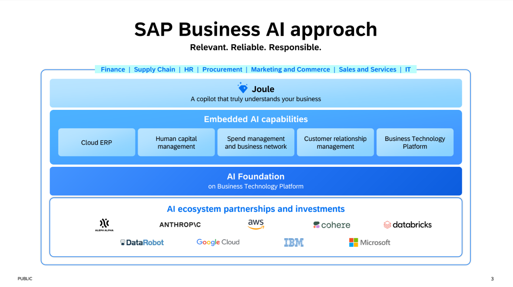
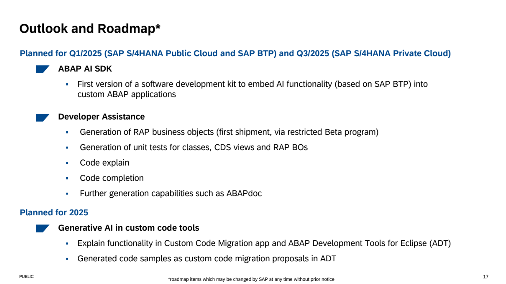
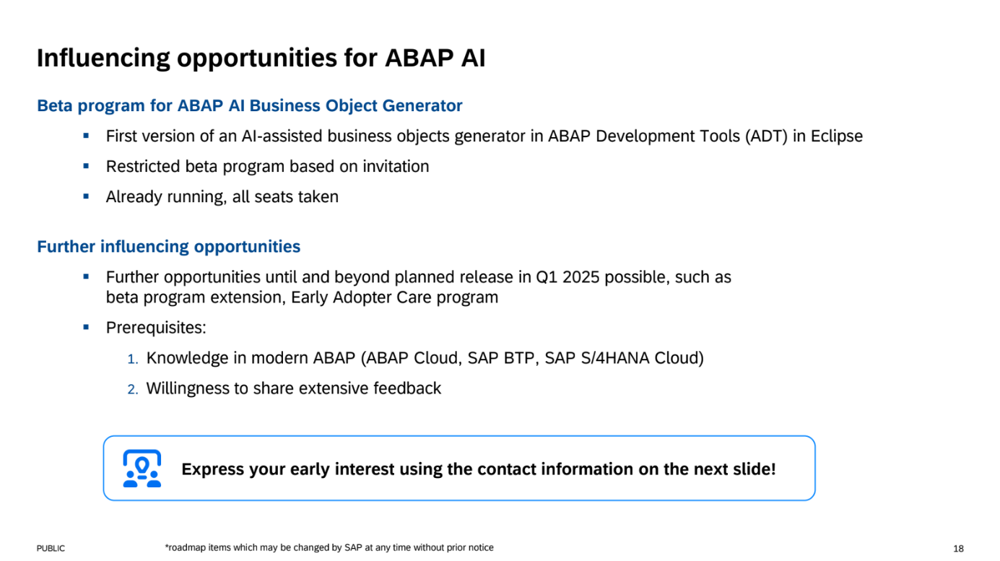

{: .no_toc}
# Generative künstliche Intelligenz (genAI)

1. TOC
{:toc}

## KI in der Entwicklung - Ein Thema mit großer Bedeutung und Dynamik

Das Thema generative KI (im folgenden in Kurzform KI genannt) ist das Thema, an dem man auch in der SAP-Entwicklung nicht mehr vorbeikommt. Produkte/Lösungen wie ChatGPT,  Microsoft Copilot, Google GEMINI und natürlich SAP selbst mit Joule werden überall diskutiert und finden in Lösungen ihre praktische Anwendung. Auch in der Softwareentwicklung werden diese Lösungen eingesetzt, sogar in der ABAP Entwicklung gibt es entsprechende AI Unterstützung. Die Entwicklung in diesem Bereich geht rasant von statten und in kurzen Zyklen stehen immer neuere Features zur Verfügung und die Ergebnisse werden immer besser.

Was hier in der Zukunft noch kommen wird ist sehr spannend und aktuell nicht vorhersehbar. In diesem Kapitel wollen wir allgemeine Hilfestellungen für eine Entscheidungsfindung für die Nutzung/Anwendung von AI Lösungen in der Softwareentwicklung geben. Wir wollen bewusst nicht alle Softwarelösungen vorstellen und können auch nicht ins Detail gehen einzelner Lösung gehen. Aber als Leitfaden wollen wir Ihnen generelle Hinweise und mögliche Anwendungsszenarien geben.  
KI stellt Werkzeuge zur Verfügung die dabei helfen bessere Software schneller zu entwickeln. Auch wenn die KI sich rasant weiterentwickelt, wird die KI den menschlichen Entwickler nicht ersetzen können. Als Grundlage guter Entwicklung ist auch mit KI ein gutes Wissen zu moderner Softwarewentwicklung unabdingbar. Die KI kann in der Entwicklung in den verschiedenen Phasen der Softwareentwicklung unterstützen. Hierzu geben wir Ihnen ein paar Beispiele in denen der Einsatz von KI Effizienzgewinne bringt.

## Hilfestellungen für die Entscheidungsfindung zum Einsatz von KI und KI-Tools

Bevor der Einsatz von KI im Bereich der Entwicklung erfolgen kann, müssen wichtige Fragestellungen beleuchtet, geklärt und zur Entscheidungsfindung herangezogen werden:

- Welche Sicherheitsanforderungen werden an die AI gestellt?
  - Private Space vs. Public Space
    - Private Space: AI Modelle und -Daten werden geschützt und sind vor unbefugtem Zugriff abgesichert
    - Public Space: AI-Systeme und -Daten sind für die breite Öffentlichkeit zugänglich wo ist hier die Datenhaltung - in der EU?
- Welche Modelle werden verwendet?
  - LLM Large Language Model
    - ML Machine Learning
    - Deep Learning
    - Neuronale Netze
    - Andere, wenn ja welche?
- Werden Third-Party AI Produkte verwendet, ja ja welche?
- Welche Datenbasis wurde/wird für das Trainieren verwendet?
- Werden eigene Unternehmensdaten für das Trainieren der Modelle verwendet?
  - Wie ist sichergestellt, dass die Daten „beim Unternehmen verbleiben“ und nicht weiterverwendet werden?
- Erfüllt die Lösung geltenden Regelungen/gesetzliche Vorgaben (z.B. EU AI Act, DSGVO/GDPR, ... )  
- Wie ist die AI Lösung gemäß den [EU Kritikalitätsstufen](https://www.trail-ml.com/blog/eu-ai-act-how-risk-is-classified) (minimales/kein Risiko, Begrenzt, Hoch, Inakzeptabel) eingruppiert
- Wird sichergestellt dass die Lösung keine urheberrechtlich geschützen Daten oder Inhalte verwendet? Wie wird dies sichergestellt?
- Kann die Speicherung von Prompts deaktiviert werden? Wo werden die Prompts gespeichert?
- Hat das Unternehmen welches die Lösung entwickelt hat/vertreibt ein „AI-Ethik-Fundament“, Beispielhaft sei hier die SAP genannt „[KI Ethik Handbuch](https://www.sap.com/germany/products/artificial-intelligence/ai-ethics.html)“
- Was ist der Inhalt? Wie passt dieser auf die eigene Unternehmenskultur oder gar mit dem eigenen AI Ethik Fundament?

Neben den oben genannten Fragestellungen birgt der Einsatz von KI auch Themen-/Problemfelder wie man mit ethischen Bedenken der aus den Trainingsdaten übernommenen „Voreingenommenheit“ von KI Modellen (Schlagwort ist hier der sogenannte BIAS) umgeht bzw. wie man dieser begegnet/entgegnet?  
Ein wichtiger Aspekt ist bei Nutzung von KI ist das Thema der Ergebnisprüfung. Von KI produzierte Ergebnisse können algorithmische Verzerrungen („Halluzinationen“) enthalten und/oder fehlerhaft sein. Es ist wichtig das derartige Ergebnisse durch sachkundige und erfahrene Entwickler überprüft wird. Da die Ergebnisse von KI immer besser werden, wird es dementsprechend auch immer schwieriger Fehler oder Unrichtigkeiten zu erkennen. Insbesondere wenn weniger erfahrene Entwickler KI einsetzen.
Hierzu sei auf das Ergebnis einer [Studie der Purdue University, West Lafayette, USA](https://dl.acm.org/doi/pdf/10.1145/3613904.3642596) im Rahmen der Konferenz CHI 2024 verwiesen, die zu dem Ergebnis kommt, dass 39% der Fehler im Ergebnis einer KI unerkannt geblieben sind, da die Fragen „höflich“ beantwortet wurden. Deshalb Empfehlen wir die Ergebnisse sachlich und besonnen zu prüfen und zu validieren.

## SAP AI Roadmaps und Tools für die Entwicklung

{: .note }
Die Tools und Lösungen der KI Tools von SAP hat sich seit Beginn der Erstellung des Leitfadens massiv entwickelt. Daher werden hier vor der Freigabe aktualisierte Informationen bereitgestellt.  
Daten zu Joule for Developer und Joule for Consultants und aktuelle Roadmaps (Teched 2025) müssen hier noch bereitgestellt werden.
Finale Info in dieser Box: Die hier genannten Informationen stellen den Stand zum Zeitpunkt der Freigabe des ABAP-Leitfadens dar. Bitte prüfen Sie die SAP-Seiten für offizielle Informationen.  
*Genereller Disclamer zu diesem Teilbereich: Aktuell (Juli 2024) sind die Tools der SAP im Bereich der AI Unterstützung in der ABAP Entwicklung noch nicht verfügbar, diese befinden sich in der Entwicklung. Deshalb kann hier nur über den aktuellen Entwicklungsstand und die darüber verfügbaren Informationen eine Einschätzung gegeben werden. Dies bitte immer berücksichtigen.*

### Aktueller Stand des Ansatzes der AI Unterstützung im SAP Umfeld:

Quelle SAP – DSAG Online Session 11.07.2024 – Einsatzszenarion von gen. AI in der modernen ABAP Entwicklung
{: .img-caption}

Zentrale Komponente ist “SAP Joule“, für die Integration der einzeln Modelle dient die „AI Foundation“ auf der BTP. Dies ist auch die Basis für die technische Verfügungstellung der AI Unterstützung für ABAP.

Geplant sind aktuell drei Bereiche der Unterstützung im ABAP Entwicklungsumfeld:

- **Accelerate**
  - Hier plant SAP aktuell 4 Anwendungsfälle
    - Generierung von RAP Business Objekten (BO‘s) und Services
    - Generierung von Unit-Tests für ABAP Klassen, CDS-Views und RAP BO‘s
    - Erläuterung/“Erklärung“ von bereits existierendem (Legacy) code
    - Hilfe bei Code Snippets, Codeanalysen, Dokumentation, vorhanden Hilfsinhalte und Code Prognosen (prediction) 
- **Transform**
  - Unterstützung bei der Migration von kundeneigenem Code in ABAP Cloud. Eingebunden als Plugin in den ABAP Development Tools soll hier eine Migrationsunterstüzung erfolgen, ebenso soll eine Implementierung der AI im „ABAP Test Cockpit Cloud“ erfolgen.
- **Empower**
  - Geplant ist hier, die Integration von AI Szenarien mit einem AI-SDK in kundeneigene Entwicklungen zu unterstützen

Ausblick auf die SAP Entwicklung und die geplante Roadmap (Stand Juli 2024)

Aktuelle Roadmap
{: .img-caption}

Einflussmöglichkeiten
{: .img-caption}

## Anwendungsfälle für generative KI in der Softwareentwicklung

Der Einsatz von den offiziellen SAP Tools wie Joule für Developer erfordern den Einsatz von Cloud Systemen wie BTP oder zumindest einen Systembetrieb in der private Cloud in Verbindung mit den entsprechenden Verträgen. Daher wird sicher noch einige Zeit vergehen, bis sich KI im Alltag des ABAP Entwicklers dauerhaft und voll integriert wiederfindet. 
Anhand von Beispielen möchten wir Ihnen erläutern in welchen Bereichen der SAP-Anwendungsentwicklung generative KI bereits jetzt unterstützend eingesetzt werden kann und welchen Nutzen Sie daraus gewinnen können.  
Da es verschiedene Tools gibt und die o.g. Fragestellungen in Unternehmen zu unterschiedlichen Lösungen und Anbieter führen können, nennen wir hier keine konkreten Tools, sondern möchten Ihnen den Anwendungsfall beschreiben und Ihnen Inpiration geben, auch chatbasierte Tools in der Entwicklung einzusetzen.

### KI zur Erstellung, Prüfung und Aufbereitung von Kundenanforderungen

KI eignet sich besonders gut zur Texterstellung, Prüfung und Aufbereitung. Gute Anwendungen basieren auf gut definierten Anforderungen. Um gute Anforderungen zu erhalten, können Sie von Fachanwendern erstellte Anforderungen, die in strukturierter Form vorliegen oder erstellt werden sollen durch KI-Tools analysieren, auf Logik und Konsistenz prüfen und ggf. aufbereiten und strukturieren zu lassen. Hier kann die Stärke von KI auch ohne SAP-Integration Ihnen helfen die Basis für Softwareentwicklung auf ein stabiles Fundament: gut definierte Anforderungen, zu stellen.  

### KI als Werkzeug bei Dokumentationserstellung

Ein Anwendungsszenario ist die unterstützende Erstellung der Dokumentation einer Eigenentwicklung. So können aktuell verfügbare Chatbasierte Tools vom Entwickler oder dem für die Entwicklung zuständigen Mitarbeiter verwendet werden, um die technische Dokumentation der Anwendung zu erstellen. Dazu muss der generativen KI die Aufgabe (also das gewünschte Ergebnis: Erstelle eine technische Dokumentation), der Kontext und Zweck der Anwendung mitgeteilt werden. Für die technischen Details wird der Code der wichtigsten Klassen, die die Geschäftslogik enthält und ergänzende Informationen in das Chat Tool übertragen. Hierbei sind die Belange des Datenschutzes und ggf. eine Prüfung auf Vertraulichkeit der Anwendung zu berücksichtigen.

Sind bereits erläuternde Informationen als Kommentar oder im besten Fall als ABAP Doc in der Entwicklung enthalten, kann dies von der genAI für die Dokumentation herangezogen werden. Bei dieser maschinellen Dokumentationserstellung erhält man bessere Ergebnisse, wenn bei der Entwicklung der Anwendung die Clean Code Prinzipien angewendet wurden. Denn sauberer, lesbarer und für Menschen verständlicher Code kann auch von einer künstlichen Intelligenz besser analysiert werden.

Als Ergebnis des beschriebenen Vorgehens erhält man eine Beschreibung was die KI aus dem Code und den Informationen auswerten konnte. Hier wird schnell offensichtlich inwiefern der Code die gewünschte Logik erklärbar umsetzt und wo iterationen und manuelle Korrekturen und Ergänzungen notwendig sind. 
Mit gutem Prompt Engineering und Iterativem Prompting und Finetuning über die erstellte Dokumentation erhält man eine gute Basis auf der man die Dokumentation final durch manuelle Überarbeitung fertigstellen kann. Anschließend kann das Ergebnis durch die KI reviewed werden, anhand dessen Sie weitere Rüclschlüsse auf die Qualität der Dokumentation ziehen können.  
Das Ziel ist nicht primär vollautomatisch eine Dokumentation zu erhalten. Dieser Prozess hilft vielmehr bei der Erstellung einer Entwurfsversion, Überarbeitung und Finalisierung der Dokumentation, wodurch sich die Qualität erhöht und viel viel Tipparbeit erspart.
Erfolg- und Effizienzfaktoren sind hier die Code Basis und deren Struktur, Erfahrungen im Prompt Engineering und das Verständnis über die zu dokumentierende Anwendung.

## Unterstützung bei der ABAP Entwicklung durch GitHub Copilot

Im März 2025 wurde bekanntgegeben, dass der GitHub Copilot in Eclipse auch ABAP unterstützt [Introducing ABAP Support in GitHub Copilot for Eclipse](https://devblogs.microsoft.com/java/introducing-abap-support-in-github-copilot-for-eclipse/).  
Eine gute Übersicht hierzu finden Sie in der SAP-Community [Getting Started with ABAP Support in GitHub Copilot](https://community.sap.com/t5/technology-blog-posts-by-members/getting-started-with-abap-support-in-github-copilot-for-eclipse-ide/ba-p/14086717).  
Der Copilot kann somit auch für ältere Systeme und somit auch für On-Premise Systeme verwendet werden. Gegenüber der nativen SAP-Integration von Joule steht der KI hier nicht der volle SAP-Kontext automatisch zur Verfügung. Der Kontext muss hier explizit über das Copilot Chatfenster in ADT definiert werden und eignet sich dadurch speziell für die Analyse von einer oder auch mehreren Klassen einer Anwendung. Folgende Möglichkeiten bietet der GitHub Copilot:  

- **Code Completion**.
Stand 10/25 kann dieses Feature vor allem hilfreich zur Erstellung von Code Kommentaren oder als etwas smartere Code Completion eingesetzt werden. Die vorgeschlagenen Code Fragmente sind auf jeden Fall intensiv auf Sinnhaftigkeit und Richtigkeit zu prüfen. Hier hängt die Ergebnisqualität auch wieder massiv vom Einsatz von Clean-Code ab. Je verständlicher und lesbarer der Code ist und je erklärender Zeilenkommentare sind, desto eher versteht die KI den Kontext und desto sinnvoller können die Vorschläge generiert werden. Daher steigert diese Funktioon vor allem die Effizienz von sehr erfahrenen Entwicklern, die sofort die Sinnhaftigkeit von Vorschlägen erkennen können und deren Code die notwendige Qualitätseigenschaften besitzt.

- **Code Explanation / Code Review**
Code Artefakte die im Copilot Context gelistet werden können von Copilot erläutert werden um ein besseres Verständnis über die Funktion zu erlangen. Als Erweiterung kann Copilot ein Review über eine oder mehrere Codeartefakte durchführen und so eine qualitätssichernde Aufgabe übernehmen, die vor allem Personen wie Lead-Developer entlastet. Hier liegen die Erfolgsfaktoren in gutem Promptengineering durch den Anwender. Die gewonnenen Erkenntnisse können verwendet werden um einerseits Defizite und Schwachstellen im Code erhalten. Den Qualitätslevel bestimmen zu können und auch Maßnahmen zur Schulung und Weiterentwicklung der Anwender zu definieren und anwenden zu können.

- **Verbesserung von Code**
 Wärend das Review den Fokus auf Verständnis und Qualitätslevel der Anwendung bzw, einzelner Klassen hat, kann Copilot auch verwendet werden um einzelne Teile des Codes verbessern zu lassen. Als Beispiel sei hier die Optimierung einer komplexen If-Else-Endif Sektion mit Ersatz durch neue Statements oder Zusammenfassung der Fehlerbehandlung in Try-Catch Blöcken genannt. Anschließend kann eine Prüfung der Verbesserung durch Prompting durchgeführt werden. In Ergänzung des Syntaxchecks liefert Copilot neben de Aussage zur Richtigkeit auch eine Erklärung warum die Richtigkeit gegeben ist.

- **Weitere Aspekte**
Neben den genannten Punkten bietet Copilot weitere Unterstützung bei Erstellung von Unit Tests oder auch bei der Fehlersuche.
Neben dem Chat, der keine Änderung im Code vornimmt, gibt es auch einen Agent Mode der Code, ähnlich wie Joule, erstellt oder ändert.  
Da auch hier mit laufenden Änderungen und Verbesserungen zu rechnen ist, verweisen wir hier auf die offizielle Dokumentation.

- **Custom Instructions**
Eine wichtige Funktion sind die Custom instructions. Hier kann ein Prompt in den Einstellungen von Copilot hinterlegt werden, der grundsätzliche Definitionen und Anweisungen enthält, die Bestandteil bei jedem im Chatfenster übertragenen Prompt sind. So können Vorgaben zu reviews, Analysen usw. vereinfacht werden, da allgemeingültige Spezifika im Custom instruction prompt definiert sind.

Auch wenn GitHub Copilot nicht die tiefe Integration von Joule besitzt, ist es ein sehr hilfreiches Werkzeug um gute Entwickler schneller und besser zu machen und vor allem mit der Qualitätssicherung betraute Personen wie Lead-Developer zu befähigen, in kürzerer Zeit einen besseren Einblick in die Anwendungen zu erhalten und darauf basierend maßgeschneiderte Maßnahmen wie Code-Korrekturen oder auch Schulungen im Entwicklerteam durchzuführen.

{: .important }
Alle Ergebnisse der KI sind vom Entwickler / Bearbeiter zu prüfen und zu validieren. Die Verantwortung der Richtigkeit liegt beim Anwender des KI-Tools. Daher ist entweder sicherzustellen, dass die Mitarbeiter entsprechend geschult und sensibilisiert wurden oder Prozesse sicherstellen, dass KI generierte Ergebnisse nicht ungeprüft verwendet werden (Human-in-Command oder Human-in.the-loop)

## Zusammenfassung (KI assistiert)
KI wird die Anwendungsentwicklung in der SAP-Welt nachhaltig verändern – sie wird Entwickler nicht ersetzen, sondern ihre Stärken gezielt unterstützen und Routinearbeiten reduzieren.
Wer die Chancen und Möglichkeiten generativer KI verantwortungsvoll nutzt, gewinnt an Effizienz und Qualität, ohne die eigene Kompetenz einzubüßen. Fundiertes Fachwissen, gute Architektur, sauberes Design und kritisches Denken bleiben die Grundlage jeder Entwicklung – auch und gerade im Zeitalter der KI. Entscheidend ist, dass der Mensch die Kontrolle über das Ergebnis behält und die Verantwortung dafür trägt.

*Diese Zusammenfassung wurde mit Unterstützung einer generativen KI erstellt – selbstverständlich sorgfältig geprüft, überarbeitet, vom Autor finalisiert und von der KI sprachlich abgerundet.*