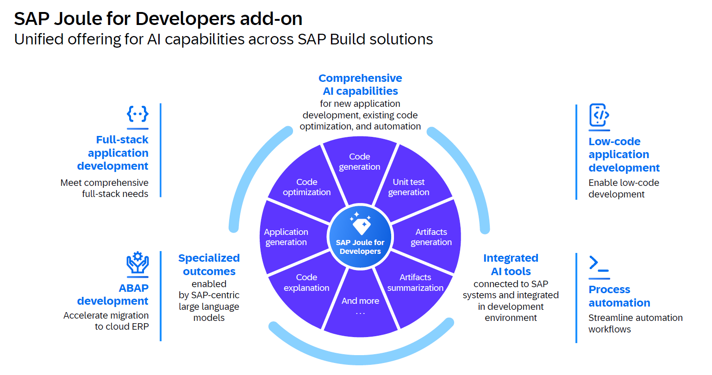
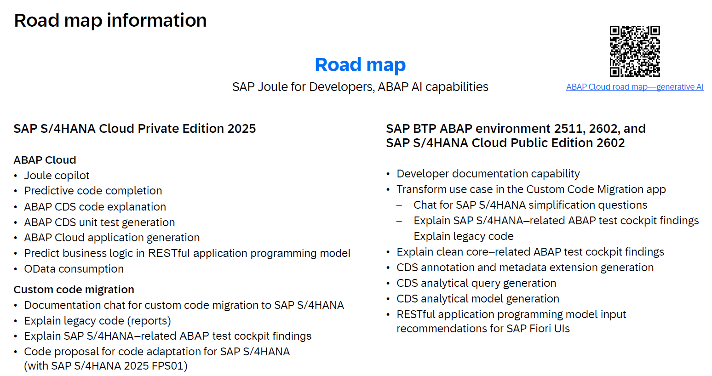

{: .no_toc}
# Generative künstliche Intelligenz (genAI)

1. TOC
{:toc}

## KI in der Entwicklung - Ein Thema mit großer Bedeutung und Dynamik

Das Thema generative KI (im Folgenden in Kurzform KI genannt) ist aktuell *das* zentrale Thema, an dem man auch in der SAP-Entwicklung nicht mehr vorbeikommt. Produkte/Lösungen wie ChatGPT,  Microsoft Copilot, Google GEMINI und natürlich SAP selbst mit Joule werden überall diskutiert und finden (künftig) in zahlreichen Lösungen ihre praktische Anwendung. Auch in der Softwareentwicklung werden diese Lösungen eingesetzt, sogar in der ABAP Entwicklung gibt es entsprechende Möglichkeiten der KI-Unterstützung. 

Die Entwicklung in diesem Bereich geht rasant von statten und in kurzen Zyklen stehen immer neuere Features und Möglichkeiten zur Verfügung - die Ergebnisse werden immer besser. Eine konkrete Prognose, wie es über die nächsten (nicht Jahre sondern) Wochen weitergeht, lässt sich sehr schwer treffen. 

Ein prominentes Beispiel hierfür ist die jüngst angekündigte Integrationsmöglichkeit von MCP-Servern (u.a. auch für den Kontext SAP Dokumentation und auch ABAP) deren Potenzial hoch scheint, aber noch eher schwer zu greifen ist. Auch Vibe Coding war auf der SAP TechEd 2025 überraschend stark vertreten - ein weiterer Ausblick in eine mögliche Zukunft (auch für ABAP?).

Trotz aller Ungewissheiten wollen wir in diesem Kapitel versuchen, Ihnen (Stand heute, SAP TechEd 2025) eine Hilfestellung zur Entscheidungsfindung bzgl. Nutzung/Anwendung von KI in der Softwareentwicklung mit SAP zu geben. Wir stellen deswegen bewusst nicht alle verfügbaren Softwarelösungen vor und gehen auch nicht ins Detail. Als Leitfaden wollen wir Ihnen generelle Hinweise und mögliche Anwendungsszenarien aufzeigen.  

KI stellt Werkzeuge zur Verfügung die dabei helfen bessere Software schneller zu entwickeln. Auch wenn die KI sich rasant weiterentwickelt, wird die KI den menschlichen Entwickler nicht ersetzen können. Als Grundlage guter Entwicklung ist auch mit KI ein gutes Wissen zu moderner Softwareentwicklung unabdingbar. Die KI kann in der Entwicklung in den verschiedenen Phasen der Softwareentwicklung unterstützen. Hierzu geben wir Ihnen ein paar Beispiele in denen der Einsatz von KI Effizienzgewinne bringt.

## Volle Verantwortung bzgl. KI-Ergebnis, aber auch Einsatzgebiet beim Entwickler

Vorweg sind uns als Autoren ein paar grundlegende Aspekte sehr wichtig, auf die wir hinweisen möchten. 

Nach heutigem Wissensstand sind wir als Autoren fest davon überzeugt, dass KI den menschlichen Entwickler nicht ersetzen wird. Als Grundlage guter Entwicklung ist auch mit KI ein fundiertes Wissen rund um moderne Softwareentwicklung unabdingbar. KI kann in der Entwicklung in den verschiedenen Phasen der Softwareentwicklung *unterstützen*. Hierzu zeigen wir in späteren Kapiteln konkrete Einsatzszenarien mit Beispielen auf, in denen der Einsatz von KI Effizienzgewinne bewirken kann.

Ein weiterer sehr wichtiger Aspekt liegt in der konkreten Verwendung potentieller KI-Unterstützung für den Entwickler. Das Handwerk der Programmierung und Software-Entwicklung ist komplex. Selbst mit jahr(zehnt)elanger Erfahrung vergeht kaum ein Tag, an dem wir nicht etwas dazulernen können. Unabhängig davon, ob man seinen Schwerpunkt in Entwicklung, Architektur oder Design sieht - die Herangehensweise und Umsetzung mit einzelnen Tools, um zur Lösung einer Fragestellung zu kommen ist sehr individuell. Mit anderen Worten: Jeder (ABAP) Entwickler hat eigene Präferenzen und entwickelt/analysiert auf persönliche Art und Weise nach eigenen Erfahrungswerten. 

Warum ist dies wichtig? Es wird nicht funktionieren, KI-Unterstützung mit der Motivation auszurollen, dass dies nun jeder im Unternehmen einsetzen *muss*, um eine Effizienzsteigerung von xy % zu erreichen (und im schlimmsten Fall, dies auch noch einzuplanen). Der Großteil der Entwickler wird sich dies (aus unserer Sicht zu Recht) nicht vorschreiben lassen. Was kann also funktionieren? Es ist wichtig bei den Kollegen ein Bewusstsein bzgl. der neuen Möglichkeiten zu schaffen - sinnvolle Anwendungsfälle aufzuzeigen, die dem Entwickler potentiell helfen können. Echte Relevanz im Arbeitsalltag eines Entwicklers wird KI nur dann bekommen, wenn der Entwickler vom Nutzen überzeugt ist und für sich persönlich den Mehrwert erkennt.  

Eng mit diesem Punkt verbunden ist der letzte Aspekt, auf den wir im Vorfeld hinweisen möchten: Verantwortung. Nutzt der Entwickler KI, um etwas (z.B. Code, Unit Tests, RAP Objekte o.ä.) zu generieren, so bleibt die Verantwortung über dem generierten Artefakt weiterhin beim Entwickler. Potentielle Fehler, inperformante Anfragen, Sicherheitslücken usw. fallen am Ende auf den Entwickler zurück - "das wurde (KI-)generiert" spricht niemanden frei von Schuld. Allein unter diesem Aspekt möchten wir nochmals darauf hinweisen, dass aus unserer Sicht jeder Kollege individuell frei entscheiden (dürfen) sollte, ob und in welchem Umfang KI-Unterstützung für den individuellen Task zum Einsatz kommen soll.   

## Hilfestellungen für die Entscheidungsfindung zum Einsatz von KI und KI-Tools

Bevor der Einsatz von KI im Bereich der Entwicklung erfolgen kann, müssen wichtige Fragestellungen beleuchtet, geklärt und zur Entscheidungsfindung herangezogen werden. Dieser Punkt ist von Unternehmen zu Unternehmen sehr unterschiedlich - im Folgenden finden Sie ein paar potentiell wichtige Fragestellungen: 

- Welche Sicherheitsanforderungen werden an die KI gestellt?
  - Private Space vs. Public Space
    - Private Space: KI-Modelle und -Daten werden geschützt und sind vor unbefugtem Zugriff abgesichert
    - Public Space: AI-Systeme und -Daten sind für die breite Öffentlichkeit zugänglich wo ist hier die Datenhaltung - in der EU?

- Welche Modelle werden verwendet?
  - LLM Large Language Model
    - ML Machine Learning
    - Deep Learning
    - Neuronale Netze
    - Andere, wenn ja welche?

- Werden Third-Party AI Produkte verwendet, ja ja welche?
- Welche Datenbasis wurde/wird für das Trainieren verwendet?
- Werden eigene Unternehmensdaten für das Trainieren der Modelle verwendet und wie wird sichergestellt, dass die Daten „beim Unternehmen verbleiben“?
- Erfüllt die Lösung geltenden Regelungen/gesetzliche Vorgaben (z.B. EU AI Act, DSGVO/GDPR, ... )  
- Wie ist die KI-Lösung gemäß den [EU Kritikalitätsstufen](https://www.trail-ml.com/blog/eu-ai-act-how-risk-is-classified) (minimales/kein Risiko, Begrenzt, Hoch, Inakzeptabel) eingruppiert?
- Wird sichergestellt, dass die Lösung keine urheberrechtlich geschützten Daten oder Inhalte verwendet? Wie wird dies sichergestellt?
- Kann die Speicherung von Prompts deaktiviert werden? Wo werden die Prompts gespeichert?
- Hat das Unternehmen welches die Lösung entwickelt hat/vertreibt ein „AI-Ethik-Fundament“, beispielhaft sei hier die SAP genannt „[KI Ethik Handbuch](https://www.sap.com/germany/products/artificial-intelligence/ai-ethics.html)“
- Was ist der Inhalt? Wie passt dieser auf die eigene Unternehmenskultur oder gar mit dem eigenen AI Ethik Fundament?

Neben diesen Fragestellungen birgt der Einsatz von KI auch Themen- bzw. Problemfelder wie man mit ethischen Bedenken der aus den Trainingsdaten übernommenen „Voreingenommenheit“ von KI Modellen (Schlagwort ist hier der sogenannte BIAS) umgeht bzw. wie man dieser begegnet/entgegnet.  

Ein wichtiger Aspekt ist bei Nutzung von KI ist das Thema der Ergebnisprüfung. Von KI produzierte Ergebnisse können algorithmische Verzerrungen („Halluzinationen“) enthalten und/oder fehlerhaft sein. Es ist wichtig, dass derartige Ergebnisse durch sachkundige und erfahrene Entwickler überprüft werden. Dies ist nicht trivial - z.B. das Ergebnis einer [Studie der Purdue University, West Lafayette, USA](https://dl.acm.org/doi/pdf/10.1145/3613904.3642596) im Rahmen der Konferenz CHI 2024 zeigt, dass 39% der Fehler im Ergebnis einer KI unerkannt geblieben sind, da die Fragen „höflich“ beantwortet wurden. Deshalb empfehlen wir die Ergebnisse sachlich und besonnen zu prüfen und zu validieren.

## SAP AI Roadmaps und Tools für die Entwicklung

{: .note }
Wie bereits erwähnt, entwickelt sich das Umfeld und auch die verfügbaren Features im Kontext KI rasend schnell. Aus diesem Grund wollen wir ihnen bzgl. Joule for Developers [die SAP Roadmap](https://roadmaps.sap.com/board?PRODUCT=73554900100800006341&range=CURRENT-LAST) empfehlen, um die jüngsten und künftigen Entwicklungen zu prüfen.  

### Aktueller Stand (SAP TechEd 2025) KI-Unterstützung im SAP Umfeld

SAP stellt mit *SAP Joule for Developers* ein zentrales Offering für das gesamte SAP Build Portfolio bereit. 

Quelle SAP TechEd 2025 – AD104 – Boost your ABAP development with SAP Joule for Developers
{: .img-caption}

Für ABAP wird die entsprechende Komponente offiziell als "SAP Joule for Developers, ABAP AI capabilities" bezeichnet und ist nativ in Eclipse über ADT integriert. Dies ist aus Sicht der Autoren ein fundamentaler Vorteil gegenüber alternativen Werkzeugen, da der Kontext (z.B. ein konkretes RAP Objekt) besser integriert werden kann.

SAP unterscheidet bei SAP Joule for Developers drei primäre Bereiche der KI-Unterstützung im ABAP Entwicklungsumfeld. Im Folgenden finden Sie neben Abgrenzung und Erklärung der Features ebenso Informationen bzgl. deren Verfügbarkeit. Bitte beachten Sie, dass darüber hinaus der Frage der Lizenzierung zu klären ist. Prüfen Sie für Kunden Material 8019124 und für Partner 8019541.

- **Accelerate**
  - Die Zielgruppe für diesen Bereich ist der ABAP Entwickler und die Steigerung seiner Effinzienz während der täglichen Arbeit. SAP unterstützt den Entwickler beispielsweise mittels:
    - Interaktion mit KI über das "Joule Copilot" Fenster
    - Generierung von RAP Business Objekten (BO‘s) und Services
    - Generierung von Unit-Tests für ABAP Klassen und Core Data Services
    - Erläuterung von bereits existierendem (Legacy) code
    - Hilfe bei Code Snippets, Codeanalysen, Dokumentation, vorhanden Hilfsinhalte und Code Prognosen ("Predective code completion")
  - Features im Kontext Accelerate sind auf SAP BTP ABAP Environment, SAP Cloud ERP und SAP Cloud ERP private 2025 (ehemals SAP S/4HANA, private Cloud) verfügbar. Frühere Releases von SAP Cloud ERP private [können die Features per Side-by-Side konsumieren](https://community.sap.com/t5/enterprise-resource-planning-blog-posts-by-sap/abap-ai-chapter-2/ba-p/14210568). Nach aktuellem Stand sind die Features auf On-Premise nicht verfügbar und dies ist auch seitens SAP nicht angedacht.   

- **Transform**
  - Der ABAP Entwickler soll bei der Migration von kundeneigenem Code nach ABAP Cloud und einem Clean Core unterstützt werden. Sowohl existierender Code als auch Meldungen aus dem ATC Check werden erklärt. Darüber hinaus bietet die KI Vorschläge zur Anpassung/Überführung von bestehendem Coding. 
  - Die Verfügbarkeit des Transform Anwendungsfalls ist nach aktuellem Wissenstand bzgl. SAP Cloud ERP private analog zu den Accelerate Features. 

- **Empower**
  - Dieser Hauptbereich befasst sich mit der Integration von KI in Applikationen. D.h. die Zielgruppe bzgl. KI ist hierbei der Enduser. Der ABAP Entwickler hat die Aufgabe, diese zu in die Applikation zu implementieren. SAP stellt hierfür das ABAP AI SDK mittels "ISLM" (Intelligent scenario lifecycle management) zur Verfügung. Es möglicht einen standardisierten Zugriff auf den generative AI hub innerhalb des SAP AI Core auf der SAP BTP.  
  - Der Empower-Bereich ist sowohl auf SAP BTP ABAP Environment, SAP ERP Cloud (inkl. private) als auch S/4HANA On-Premise per Downport bis Release 2021 verfügbar (näheres finden Sie im SAP Hinweis 3513374).

Einen Überblick bzgl. der aktuellen Roadmap zum heutigen Zeitpunkt (SAP TechEd 2025) findet sie auf folgender Folie: 

Aktuelle Roadmap
{: .img-caption}

## Unterstützung bei der ABAP Entwicklung durch alternative KI Werkzeuge

Der Einsatz offizieller SAP Tools wie "Joule für Developers" erfordern wie im vorhergegangenen Kapitel angedeutet den Einsatz von Cloud Systemen wie BTP oder zumindest einen Systembetrieb in der private Cloud in Verbindung mit entsprechenden Verträgen. Befinden Sie sich auf einem anderen SAP System, so bieten sich potenzielle Alternativen. 

### Verwendung von GitHub Copilot

Im März 2025 wurde beispielsweise bekanntgegeben, dass GitHub Copilot in Eclipse verfügbar ist und demnach auch ABAP unterstützt [Introducing ABAP Support in GitHub Copilot for Eclipse](https://devblogs.microsoft.com/java/introducing-abap-support-in-github-copilot-for-eclipse/).  
Eine gute Übersicht hierzu finden Sie in der SAP-Community [Getting Started with ABAP Support in GitHub Copilot](https://community.sap.com/t5/technology-blog-posts-by-members/getting-started-with-abap-support-in-github-copilot-for-eclipse-ide/ba-p/14086717).  

Gegenüber der nativen SAP-Integration von Joule steht der KI hier allerdings zum heutigen Stand der volle SAP-Kontext nicht automatisch zur Verfügung. Der Kontext muss hier explizit über das Copilot Chatfenster in ADT definiert werden und eignet sich dadurch speziell für die Analyse von einer oder auch mehreren Klassen einer Anwendung. Folgende Möglichkeiten bietet der GitHub Copilot:  

- **Code Completion**.
Stand Ende 2025 kann dieses Feature vor allem hilfreich zur Erstellung von Kommentaren oder als etwas smartere Code Completion eingesetzt werden. Die vorgeschlagenen Code Fragmente sind auf jeden Fall intensiv auf Sinnhaftigkeit und Richtigkeit zu prüfen. Hier hängt die Ergebnisqualität auch wieder massiv vom Einsatz von Clean-Code ab. Je verständlicher und lesbarer der Code ist und je erklärender Zeilenkommentare sind, desto eher versteht die KI den Kontext und desto sinnvoller können die Vorschläge generiert werden. Daher steigert diese Funktion vor allem die Effizienz von sehr erfahrenen Entwicklern, die sofort die Sinnhaftigkeit von Vorschlägen erkennen können und deren Code die notwendige Qualitätseigenschaften besitzt.

- **Code Explanation / Code Review**
Code Artefakte die im Kontext gelistet werden, können von Copilot erläutert werden, um ein besseres Verständnis über die Funktion zu erlangen. Als Erweiterung kann Copilot ein Review über eine oder mehrere Codeartefakte durchführen und so eine qualitätssichernde Aufgabe übernehmen, die wiederum den Entwickler entlasten. Hier liegen die Erfolgsfaktoren in gutem "Prompt-Engineering" durch den Anwender. Die gewonnenen Erkenntnisse können verwendet werden, um Defizite und Schwachstellen des Codes zu identifizieren, dessen Qualitätslevel zu bestimmen und schließlich Maßnahmen zur Schulung und Weiterbildung der Entwickler ableiten zu können.

- **Verbesserung von Code**
 Während das Review den Fokus auf Verständnis und Qualitätslevel der Anwendung bzw. einzelner Klassen hat, kann Copilot auch verwendet werden, um einzelne Teile des Codes verbessern zu lassen. Als Beispiel sei hier die Optimierung einer komplexen If-Else-Endif Sektion mit Ersatz durch neue Statements oder Zusammenfassung der Fehlerbehandlung in Try-Catch Blöcken genannt. Anschließend kann eine Prüfung der Verbesserung durch Prompting durchgeführt werden. In Ergänzung des Syntaxchecks liefert Copilot neben Aussagen zur Richtigkeit auch eine Erklärung, warum die Richtigkeit gegeben ist.

- **Weitere Aspekte**
Neben den genannten Punkten bietet Copilot weitere Unterstützung bei Erstellung von Unit Tests oder auch bei der Fehlersuche. Neben dem Chat, der keine Änderung im Code vornimmt, gibt es auch einen Agent Mode der Code, ähnlich wie Joule, erstellt oder ändert. Da auch hier mit laufenden Änderungen und Verbesserungen zu rechnen ist, verweisen wir an dieser Stelle auf die offizielle Dokumentation.

- **Custom Instructions**
Eine wichtige Funktion sind die Custom instructions. Hier kann ein Prompt in den Einstellungen von Copilot hinterlegt werden, der grundsätzliche Definitionen und Anweisungen enthält, die Bestandteil bei jedem im Chatfenster übertragenen Prompt sind. So können Vorgaben zu Reviews, Analysen usw. vereinfacht werden, da allgemeingültige Spezifika im "Custom instruction prompt" definiert sind.

Auch wenn GitHub Copilot nicht die tiefe Integration von Joule besitzt, ist es ein potenziell hilfreiches Werkzeug, um gute Entwickler schneller und besser zu machen und vor allem mit der Qualitätssicherung betraute Personen wie Lead-Developer zu befähigen, in kürzerer Zeit einen besseren Einblick in die Anwendungen zu erhalten. Darauf basierend können zielführende Maßnahmen wie Code-Korrekturen oder auch Schulungen im Entwicklerteam abgeleitet werden.

### Weitere Alternativen

Wir möchten an dieser Stelle erwähnen, dass GitHub Copilot *eine" mögliche Alternative zu SAP Joule for Developers darstellt - es existieren und entstehen darüber hinaus kontinuierlich weitere Möglichkeiten, Amazon Q Developer um eine zu nennen. Wir erheben an dieser Stelle als Autoren keinen Anspruch auf Vollständigkeit und haben Github Copilot ausgewählt, um ihnen eine weitere Möglichkeit etwas detaillierter aufzuzeigen.  

{: .important }
Wie auch bei "Joule for Developers" sind alle Ergebnisse der KI vom Entwickler zu validieren. Die Verantwortung der Richtigkeit liegt beim Verwender des KI-Tools. Daher ist einerseits sicherzustellen, dass die Mitarbeiter entsprechend geschult und sensibilisiert wurden. Darüber hinaus können potentielle Prozesse etabliert werden, um sicherstellen, dass KI generierte Ergebnisse nicht ungeprüft verwendet werden können (Stichwort "Human-in-Command" bzw. "Human-in-the-loop").

## Weiterführende Anwendungsfälle für generative KI in der Softwareentwicklung

Neben den beschriebenen Möglichkeiten zur Steigerung der Effizienz während der Implementierungsphase kann KI auch in weiteren Phasen der Software-Entwicklung zum Einsatz kommen. Anhand einiger Beispielen möchten wir Ihnen erläutern, in welchen Bereichen generative KI bereits heute unterstützend eingesetzt werden kann und welchen Nutzen Sie daraus gewinnen können. Da es verschiedenste Tools gibt und die o.g. Fragestellungen in Unternehmen zu unterschiedlichen Lösungen und Anbieter führen können, nennen wir hier keine konkreten Tools, sondern möchten Ihnen den Anwendungsfall beschreiben und Ihnen Inpiration geben, auch chatbasierte Tools in der Entwicklung einzusetzen.

### KI zur Erstellung, Prüfung und Aufbereitung von Kundenanforderungen

KI eignet sich besonders gut zur Texterstellung, Prüfung und Aufbereitung. Gute Anwendungen basieren auf gut definierten Anforderungen. Um gute Anforderungen zu erhalten, können Sie von Fachanwendern erstellte Anforderungen, die in strukturierter Form vorliegen oder erstellt werden sollen durch KI-Tools analysieren, auf Logik und Konsistenz prüfen und ggf. aufbereiten und strukturieren zu lassen. Hier kann Ihnen die Stärke von KI auch ohne SAP-Integration helfen, um die Basis für Softwareentwicklung auf ein stabiles Fundament zu stellen.  

### KI als Werkzeug bei Dokumentationserstellung

Ein Anwendungsszenario ist die unterstützende Erstellung der Dokumentation von Eigenentwicklungen. So können aktuell verfügbare Chatbasierte Tools vom Entwickler oder dem für die Entwicklung zuständigen Mitarbeiter verwendet werden, um die technische Dokumentation der Anwendung zu erstellen. Dazu muss der generativen KI die Aufgabe (also das gewünschte Ergebnis: Erstelle eine technische Dokumentation), der Kontext und Zweck der Anwendung mitgeteilt werden. Für die technischen Details wird der Code der wichtigsten Klassen, die die Geschäftslogik enthält und ergänzende Informationen in das Chat Tool übertragen. Hierbei sind die Belange des Datenschutzes und ggf. eine Prüfung auf Vertraulichkeit der Anwendung zu berücksichtigen.

Sind bereits erläuternde Informationen als Kommentar oder im besten Fall als ABAP Doc in der Entwicklung enthalten, kann dies von der generativen KI für die Dokumentation herangezogen werden. Bei dieser maschinellen Dokumentationserstellung erhält man bessere Ergebnisse, wenn bei der Entwicklung der Anwendung die Clean Code Prinzipien angewendet wurden. Denn sauberer, lesbarer und für Menschen verständlicher Code kann auch von einer künstlichen Intelligenz besser analysiert werden.

Als Ergebnis des beschriebenen Vorgehens erhält man eine Beschreibung der KI-basierten Auswertung der Informationen aus dem Code. Hier wird schnell offensichtlich, inwiefern der Code die gewünschte Logik erklärbar umsetzt und an welchen Stellen manuelle Korrekturen und Ergänzungen notwendig sind. 
Mit gutem Prompt Engineering und "Iterativem Prompting" bzw. Finetuning der erstellten Dokumentation erhält man eine gute Basis, auf der man die Dokumentation final durch manuelle Überarbeitung fertigstellen kann. Anschließend kann das Ergebnis durch die KI geprüft werden, anhand dessen Sie wiederum weitere Rückschlüsse auf die Qualität der Dokumentation ziehen können.  
Das Ziel ist nicht primär vollautomatisch eine Dokumentation zu erhalten. Dieser Prozess hilft vielmehr bei der Erstellung einer Entwurfsversion bzw. deren Überarbeitung oder auch Finalisierung der Dokumentation, wodurch sich die Qualität erhöht und umfangreiche Tipparbeit eingespart werden kann. Erfolg- und Effizienzfaktoren sind hierbei Code-Basis und deren Struktur, Erfahrungen im Prompt Engineering und das Verständnis über die zu dokumentierende Anwendung.

## KI-Entwicklung auf der SAP BTP über ABAP hinaus

Abschließend sei im KI-Kapitel erwähnt, dass sich bzgl. KI-Entwicklung im SAP Ökosystem über ABAP hinaus ebenfalls sehr viel bewegt. Auch beispielsweise im Kontext SAP Fiori (SAPUI5) oder dem CAP Modell ermöglicht SAP zahlreiche Funktionen nahtlos integrierbar mittels VSCode. Wir erwarten mit der offiziellen Verfügbarkeit von ABAP in VSCode für die 2.Jahreshälfte 2026 ebenso spannende Entwicklungen im Kontext der KI-Integration für ABAP. 

Unabhängig der Implementierungs-Werkzeuge rund um die etablierten Technologien, bringt SAP mit Joule Studio in der BTP die Möglichkeit, Joule Skills zu implementieren und diese innerhalb Agenten zu mächtigen Werkzeugen zu bündeln. Diese Joule Skills wiederum verwenden häufig API's aus dem Back-End die wiederum mit ABAP zu implementieren sind. Auch in diesem Kontext wird uns ABAP demnach weiterhin zumindest indirekt begleiten.  

## Zusammenfassung (KI assistiert)
KI wird die Anwendungsentwicklung in der SAP-Welt nachhaltig verändern – sie wird Entwickler nicht ersetzen, sondern ihre Stärken gezielt unterstützen und Routinearbeiten reduzieren.
Wer die Chancen und Möglichkeiten generativer KI verantwortungsvoll nutzt, gewinnt an Effizienz und Qualität, ohne die eigene Kompetenz einzubüßen. Fundiertes Fachwissen, gute Architektur, sauberes Design und kritisches Denken bleiben die Grundlage jeder Entwicklung – auch und gerade im Zeitalter der KI. Entscheidend ist, dass der Mensch die Kontrolle über das Ergebnis behält und die Verantwortung dafür trägt.

{: .note }
> Diese Zusammenfassung wurde mit Unterstützung einer generativen KI erstellt – selbstverständlich sorgfältig geprüft, überarbeitet, vom Autor finalisiert und von der KI sprachlich abgerundet.