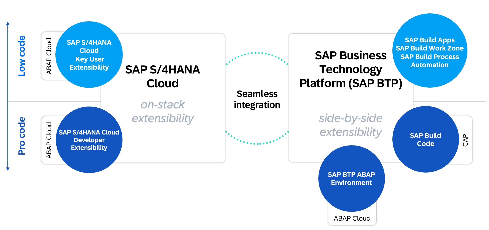
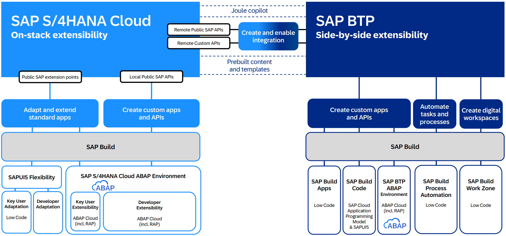

{: .no_toc}
# Architekturkonzepte

1. TOC
{:toc}

## Einstieg

In diesem Abschnitt geht es um die möglichen Architekturen im Bereich Clean Core, dabei erfahren Sie mehr über das Thema On-Stack und Side-by-Side und wie sie diese in ihre Architektur implementieren können. Extensibility und deren Implementierung ist der Schlüsselbestandteil für Ihr Unternehmen, um Clean Core zu erreichen. Dabei beschreibt die Extensibility alle Kundenerweiterungen in einem SAP Standardsystem, ebenso wie Partner-AddOns.

## Szenarien

Grundsätzlich haben Sie die Möglichkeit ihr System über On-Stack und/oder Side-by-Side Extensibility zu erweitern. Dazu erhalten Sie hier eine schematische Darstellung der Möglichkeiten. 

Extensibility Szenarien
{: .img-caption}

### On-Stack

Auf der linken Seite finden Sie die On-Stack Extensibility, unterteilt nach Pro Code und Low Code. Im Bereich Pro Code finden sie die klassische ABAP Cloud Entwicklung mit dem 3-TIER Modell, der Verwendung von freigegebenen APIs und der Erweiterung von Objekten (C0-Objekte). Mehr zum Thema ABAP Cloud, finden Sie im entsprechenden Abschnitt von Clean Core. 

Im Low Code Bereich gibt es vor allem die Key User Extensibility, dabei handelt es sich um einige Fiori Anwendungen mit denen sie das System erweitern können. Die häufigsten Szenarien in diesem Bereich sind:

- Felderweiterung - Erzeugen Sie über die Anwendung neue Z-Felder von der Datenbank bis zur UI.
- UI Anpassungen - Passen Sie Fiori Anwendungen an, nennen Elemente um oder zeigen sich die neuen Z-Felder an. Sie können damit Varianten erzeugen und Ihrem Fachbereich zur Verfügung stellen.
- Eigene Logik - Implementieren Sie eigene BADIs und erweitern den Prozess um eigene Prüfungen.
- Eigene Core Data Services - Erzeugen Sie eigene Core Data Services auf Basis von freigegebenen Views und geben diese als APIs nach Außen zur Verfügung.
- uvm.

Die Apps sind vor allem für Ihre Key User gedacht, da damit einfache Änderungen im System durchgeführt werden können. Die Änderungen werden per Standard Changemanagement (z.B. CTS) produktiv gesetzt.

### Side-by-Side

Auf der rechten Seite finden Sie die Side-by-Side Extensibility, hier geht es um die entkoppelte Entwicklung außerhalb des Kernsystems. In diesem Beispiel wirde die Business Technology Plattform, kurz BTP genannt. Dort finden Sie verschiedene Werkzeuge und Systeme, mit denen sie Anwendungen zur Erweiterung des Systems erstellen können.

- SAP BTP ABAP Environment - Erweiterungen auf Basis von ABAP in der Cloud entwickeln.
- SAP Build Code - Erweiterungen auf Basis von Java oder JavaScript entwickeln.

Neben der Pro Code Lösung finden sie auch hier Low Code und No Code Lösungen aus dem SAP Build Portolio. Dazu eine kleine Übersicht der gängigen Tools und deren Nutzung.

- SAP Build Apps - Erstellen Sie hier Firoi und Mobile Apps per Drag'n Drop und einfachen Scripts. Die Anwendungen werden dann in der BTP zur Verfügung gestellt.
- SAP Build Process Automation - Sie benötigen einen Workflow oder eine Automatisierung, dann können sie diese mit der Process Automation erstellen und SAP, sowie Non-SAP Systeme anbinden.
- SAP Build Work Zone - Wollen Sie einen zentralen Zugriff für alle SAP Anwendungen, egal ob On-Stack oder Side-by-Side, dann kann die Work Zone eine Alternative sein. Neben der Standard Edition, gibt es auch eine Advanced Edition mit kollaborativen Funktionen.

## Strategie

Bevor Sie mit der Arbeit beginnen, sollten Sie sich Gedanken um die Erweiterungsstrategie machen. Das heißt, welche Tools und Umgebungen wollen Sie für die Erweiterungen einsetzen. 

### Modelle

Dabei sollten Sie einige Faktoren des Unternehmens berücksichtigen:

- Plattform - Welches Erweiterungsmodell wollen Sie im Unternehmen nutzen (CAP oder RAP). Damit verbunden, wieviele Entwickler brauchen Sie in den Bereichen.
- Know How - Ist das entsprechende Know How für die Umgebung vorhanden oder muss hier erst aufgebaut werden. Im Bereich ABAP wäre das CDS, RAP und Fiori Elements. Im Bereich CAP JavaScript oder Java, Build Pipelines, Git und BTP.

Dazu die folgende detailierte Grafik mit den verschiedenen Szenarien.

Tools und Strategie
{: .img-caption}

Dabei steht Ihnen das ganze Produktportfolio der SAP zur Verfügung zur Verfügung, wobei jedes Produkt seine eigenen Fertigkeiten und Voraussetzungen benötigt. Die Festlegung einer Strategie empfehlen wir Ihnen daher ausdrücklich.

### Kopplung

Bei der Kopplung geht es um verschiedene Voraussetzungen, die eine Anwendung mit sich bringt. Sollt die Anwendung On-Premise oder Side-by-Side gebaut werden? In diesem [Artikel](https://software-heroes.com/blog/abap-cloud-clean-core-szenarien) finden Sie verschiedene Kriterien, wann sich welche Umgebung lohnt. Grundsätzlich sollten Sie aber auch verstehen, dass sie Clean Core auch On-Premise auf ihrem eigenen System erreichen können und die Side-by-Side Entwicklung nicht zwingend benötigen.

Die beiden Szenarien der Kopplung sind:

- Eng gekoppelt - Die Anwendung sollte On-Premise erstellt werden.
- Lose gekoppelt - Die Anwendung kann auch in der Cloud entwickelt werden.

## Make the Core clean

Haben Sie den Brownfield Ansatz gewählt, ihr System auf S/4HANA migriert und entscheiden sich für Clean Core, dann empfiehlt sich die schrittweise Migration Ihrer Anwendungen. Dabei lohnen sich vor allem die häufig genutzten Anwendungen, um so einen schnellen Benefit von SAP Fiori zu erhalten. So können Sie Anwendung für Anwendung prüfen, welche Sie modernisieren wollen oder vielleicht sogar stilllegen können, da sie nicht mehr benötigt werden. Ein erster Überblick mit einer Invetarisierung macht daher Sinn.