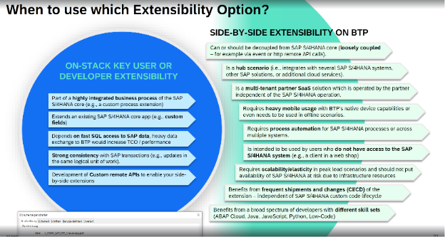
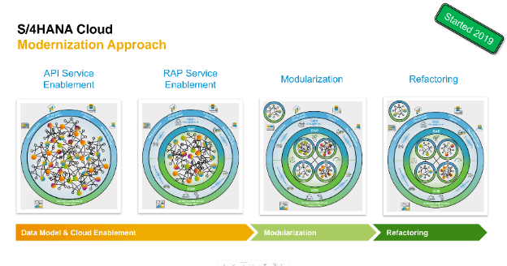

{: .no_toc}
# Architekturkonzepte

1. TOC
{:toc}

## Architekturkonzepte ansprechen und abgrenzen

Extensibility Konzept

-> ABAP Environment,  SAP Build, SAP Build Code, SAP Build Apps gehört zu den Extensibility

Extensibility Szenarien
{: .img-caption}

Entscheidungen
{: .img-caption}

Zusammenfassung
{: .img-caption}

## Ideenpool

Analogie für “Make the core clean”?

Modernisierungsansatz
{: .img-caption}