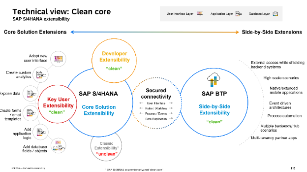
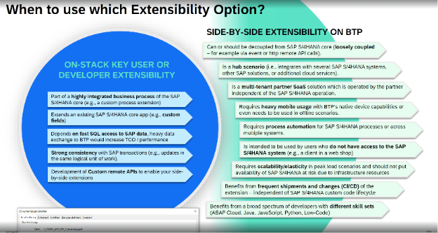
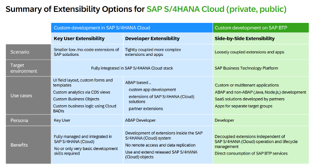
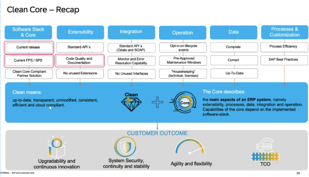
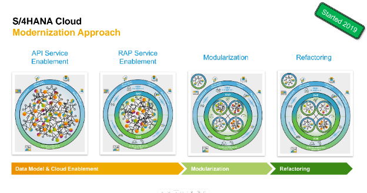

{: .no_toc}
# Clean Core

1. TOC
{:toc}

## Was ist Clean Core

Clean Core ist ein Konzept, und für manchen SAP Kunden eine Philosophie -  Clean Core wird unterschiedlich aufgefasst, interpretiert und gelebt. Ein gemeinsames Verständniss der DSAG-Community wäre das folgende:

**“Keep the core clean”** –  Bedeutet, dass ein Unternehmen nach Clean Core Prinzipien -  definierten Richtlinien in einem Unternehmen - Neuentwicklung aufsetzt.

**“Make the core clean”** – Spricht die Unternehmenstransformation an und behandelt die iterative Reise zu einem Clean Core.

Clean Core hat vier Fokusfelder: Geschäftsprozesse, Kundenerweiterungen, Geschäftsdaten und Integration. Vor allem die neuen Wege der Kundenerweiterungen stehen in diesem Leitpfaden im Fokus.

> „Die Erweiterbarkeitsfunktionen umfassen viele Optionen, die  Kunden und Partner dabei unterstützen, Standard-Business-Software  an ihre Geschäftsanforderungen anzupassen.“

Quelle: SAP Help Portal

Clean Core
{: .img-caption}

Das Clean Core Konzept ist von SAP klar und deutlich bei der TechEd2023 kommuniziert. Die Schritt-für-Schritt Anleitung ist für etablierte Kunden, welche diverse „Legacy“ Technologien in ihren SAP-Systemen nutzen, ist dennoch unklar. 
Es gibt zahlreiche Bestandskunden, welche Mehrwerte durch Eigenentwicklung und Systemerweiterung, in Ihren Systemen geschaffen haben. Diese Mehrwerte gehören laut Definition nicht zum Clean Core. Es existieren unterschiedliche Nachfolge-Technologie-Matrizen für die sogenannten RICEFW-Objekte. Intern stellt sich primär die Fragen: „Wie können wir gegenüber unseren Kunden den Technologie-Wechsel vertreten? Und weshalb sollte ich jetzt gut-funktionierende Prozesse basierend bspw. auf Idocs, Nachrichten, RFCs, und ALV-Transaktionen umziehen?

### Zielgruppe
(Noch offen)
* Kunden die auf S/4 HANA gehen - Greenfield Ansatz und stringent Clean Core bestimmen
* Kunden die Brownfield auf S/4 sind- Clean Core nach und nach definieren und Neuentwicklung konform dazu halten

### Clean Core Definition
Im Kern dreht sich das Konzept des Clean Core darum, wesentliche Geschäftslogiken von nicht wesentlichen Funktionalitäten innerhalb der Software-Suite von SAP zu trennen. Durch die Isolierung von Kerngeschäftsprozessen und Datenstrukturen strebt SAP eine schlankere, agilere Grundlage an, die sich an sich ändernde Geschäftsanforderungen anpassen kann. 

Die neuen Wege der Kundenerweiterung heißt: ABAP Cloud, und “Side-By-Side Extensibility”. 

**ABAP Cloud oder auch “On-Stack Extensibility”** –  Das sind zwei unterschiedliche Technologien: “Developer Extensibility” und “Key-User Extensibility”

**Side-By-Side Extensibility** – Ist die Aulagerungen von Kundenerweiterungen in die Business Technlogy Palltform – BTP.

Ein Beispiel: Statt an unterschiedliche Systeme das MATMAS Idoc – in heterogener Ausprägung an diverse Systeme zu schicken, sollten Sie auf die standardisierte Schnittstelle: Product Master API setzen. Um die SAP und Non-SAP-Systeme zu versorgen, nutzten Sie dann eine Schnittstelle, welche homogen ausprägt werden kann.

Das Datenmodell darunter wird durch Key-User-Extensibility erweitert und auch in generischen Reports wie „embedded Analytics“, oder auch der SAP Analytic Cloud (SAC) verwendet. Bei komplizierter Kunden-Logik muss der Entwickler mit Developer Extensibility und dem RESTful Application Programming Model (RAP) diese Kunden-Logik erweitern.

Grundsätzlich heißt Clean Core, so wie der Hersteller es beschreibt: 
1. Erweiterungen sind klar vom SAP-Code getrennt, und Erweiterungen verändern keine SAP-Objekte.
2. Nutzen Sie die neuen Erweiterungstechnologien und den SAP Standard. Erweiteren Sie mit den neuen Erweiterungsmethoden, wie Key-User, Developer und Side-by-Side Extensibility. 
3. Erweiterungen verwenden nur stabile, freigegebene SAP-APIs und Erweiterungspunkte. Classical Extensibility sollte nur in zugelassenen Business Add-Ins, mit freigegebenen Entwicklungsobjekten stattfinden. 
4. Die Legacy Technologien, wie bspw. RFCs, Idocs und kundeneigene Dynpro Transkationen, oder SAP Gateway Projekte sollen nicht mehr für neue Entwicklungen genutzt werden. 
5. Alte Kundeneigene Entwicklungen / Erweiterungen sollen umziehen auf neue Technologien, oder die Geschäftsprozessanforderung wird im SAP Standard wiedergefunden.

Aus den Herstellerangaben bilden sich vier Anwedungsgebiete und die Fakten um ein Clean Core zu erreichen sehen wie folgt aus:

#### Datenmodelle
* Egal ob einfache oder komplexe Anwendungsfälle zu implementieren haben ist eine Datenmodellierung /ein Umgang mit dem Virtual Data Model (VDM) notwendig. 
* Es soll keine Direktzugriffe auf SAP Standard Tabellen geben.

#### Anwendungslogik
* SAP Standard Coding soll nicht mehr klassisch erweitert werden
* Die Erweiterungen am Standard sollen in definierten, freigegebenen Badis migriert werden.
* Eigenentwicklung muss Clean Core konforme Entwicklungsobjekte benutzen (Stichwort: Release Contracts)

#### Oberflächen
* Grundsätzlich sollen die Kunden die Standard Fiori Apps nutzen, oder SAP GUI for HTML mit Screen Personas verwenden um existierende, SAP Standard Transkationen zu nutzen.
* Die Standard Fiori Apps, und die Standard APIs dahinter sollten erweitert werden.
* Bei Custom Apps soll primär erst Fiori Elements + RAP und Standard APIs genommen werden. Die nächste Stufe wären dann Freestyle Fioris Apps. Oder Cloud Native Applications in der Cloud (Side-by-side Extensibility). Das Portfolio der SAP Build bieten auch weitere Lösungswege.

#### Schnittstellen
* Nur Clean Core-konforme, freigegebene Schnittstellen sollen benutzt werden
* Erweiterungen werden an APIs / Microservices durchgeführt, um die Funktionalität von SAP zu erweitern, ohne die Integrität des Kernsystems zu beeinträchtigen.
* Integration nach außen muss klar geregelt sein, Prozessintegration und die Middleware für das API-Management muss gegeben sein.
* Legacy Technologien wie Idocs, RFCs, und Gateway Projekte müssen sukzessive umgezogen werden.

Zusammenfassend steht das Clean Core Konzept von SAP für einen Paradigmenwechsel im Design von Unternehmenssoftware. Die SAP setzt darauf neue Services nur im Cloud Bereich anzubieten, und die Schnittstellen zu dem Kern weiterauszubauen. Der Mehrwert gut-laufende Lösung auf eine neue Plattform zu bringen, ist erstmal nicht gegeben. Neue Lösungen sollte ein Unternehmen mit den neuen Erweiterugsarten gehen um sich zukunftsicher aufzustellen. Somit profitiert ein SAP Kunde von der Innovationen rund um den Standard.

Durch die Umsetzung der Prinzipien des Clean Core und strategischer Initiativen können Organisationen sich auf zukünftige SAP-Strategien, vor allem Cloud-Technologien vorbereiten. 

Laut SAP geht es bei Clean Core vor allem, dass die Kunden sich die Zukunft nicht versperren und standardisiert Schnittstellen aufbauen. Durch die Standardisierung von Geschäftsprozessen und den Einsatz der SAP BTP können SAP Services komplett verwendet werden.  
Die Clean Core Strategie ist für viele Bestandskunden eine Philosophie, bis interne Richtlinien die Nutzungen der Nachfolge-Technologien regeln. Basierend auf den Richtlinien werden Entwickler organisatorisch ausgerichtet, und geschult. Ein Gremium um die „Clean Core Governance“ einzuhalten ist Pflicht, mit dem Mandat die Richtlinien zu pflegen, zu erweitern und zu forcieren. Research und Development sollte häufig betrieben werden, um die Mehrwerte durch SAP-Service herauszuarbeiten.

### Private/Public Cloud/BTP
...

### Zielbild - Reise mit SAP, der Weg in die Public Cloud?

Clean Core ist relevant und anwendbar für "SAP S/4HANA on-premise" und "SAP S/4HANA Cloud, private edition (RISE)"
SAP S/4HANA Cloud, public edition (GROW) ist per Definition sauber.

### S/4 HANA Transformation

Abgrenzung von Green-, Brown- and Bluefield

## Warum überhaupt Clean Core

* Verbesserung der Upgrade-Fähigkeit, um Upgrades schnell und ohne großen Aufwand für Anpassungen und Tests durchführen zu können
* SAP-Innovationen,  reibungslos zu konsumieren
* Digitalisierung von Geschäftsprozessen ermöglichen
* Wir nutzen und erweitern SAP-Standardlösungen und verwenden eine Quelle wieder, anstatt mehrere Nicht-Standardlösungen zu pflegen (Standard Schnittstellen -> API Hub / Business Accelerator Hub)
* Seien Sie bereit für die nächsten Schritte der Cloud-Transformation, wenn es Sinn macht.-> Geschäftsprozesse in die Cloud bringen, mit dem Tools, welche am meisten Sinn ergeben

### Wirtschaftlichkeit? 

Ist eine Studie vorhanden? Gartner?

### Vor und Nachteile 

SAP vs. Non SAP Technologie

Wenn man innerhalb der Clean

Zielgruppe

Referenz: Vortrag Brettschneider ABAPConf

## Architekturkonzepte ansprechen und abgrenzen

Extensibility Konzept

-> ABAP Environment,  SAP Build, SAP Build Code, SAP Build Apps gehört zu den Extensibility

Extensibility Szenarien
{: .img-caption}

Entscheidungen
{: .img-caption}

Zusammenfassung
{: .img-caption}

## Problemfelder und Herausforderungen
* Clean Core im S/4HANA Kontext in Verbindung mit “legacy” Technologie ``(z.B. embedded TM -> BOPF -> FPM (Jens) / Variantenkonfiguration (Beispiel Timo?) )``
* Die alten Herrausvorderungen bestehen bleiben – z.b. WhiteSpots im Standard Coding.
* Verweis auf Kapitel Organisation
    * Auswirkung auf die Organisation / Entwicklerskills
    * Regeln für Clean Core, Governanace, Clean Code, Skill-set der ABAP Entwickler

Neben den Kundenerweiterungen im SAP Standard, gibt es in jedem SAP-System die Thematik der Custom SAP Applications, das sind Eigenentwicklungen, welche neben den SAP Standard parallel laufen. Die Ablösung solcher Applikationen Bedarf eigene Großprojekte und muss weiterhin von Prozessexperten betreut werden. 
 
Die Dissonanz zwischen der Sichtweise von SAP zum Clean Core und den lang-jährigen Kundenstamm ist die Anwendung der Clean Core Prinzipien / Konzept. 

Die Standardtransaktionen, Standard BAdis und Standard Fiori Apps reichen oftmals nicht mehr aus, um die Geschäftsprozessanforderungen abzudecken. Die klassischen Erweiterungen / RICEFW Objekte haben Mehrwerte geschaffen, welche erst in S/4 HANA - dem Clean Core – wiedergefunden werden müssen. Um die neuen Technologien, bspw. SAP Build, vor allem auf der BTP zu benutzen, erfordert es an Investitionen in Organisation, Technologien und Prozessen.
 
### Technologien

* Von der Verhandlung der Lizenzen, Aufbau der Infrastruktur, Schulung der SAP Basis und Schulung der Entwickler der neuen Technologien bis zum Einkauf von Consulting Services, Betrachtung und Bewertung der Alternativen muss alles in der Evaluierung der Entwicklungslandschaft definiert werden.
* Vor allem alternative Technologien, welche mit vorhandenen ABAP-Entwicklern benutzbar sind, werden gebraucht, da existierende Kundenerweiterungen/ RICEFW Objekte weiterhin gepflegt werden müssen.
 
### Organisation

``(Verweis auf Kapitel Organisation)``

* Der klassische Berater und Entwickler entwickelt sich durch die neuen Technologien zu einem Vollzeit-Entwickler. Hier ist massives Change-Management angesagt. Mehr dazu im Kapitel Organisation.
* Durch die No- und Low-Code Optionen, vor allem bei SAP Build, aber auch Key-User Extensibility können nicht-ITler in Fusion Teams mitarbeiten. Das erfordert auch eine moderne Arbeitsweise, welche agiler Natur sein sollte.
 
### (Geschäfts-)Prozesse
 
* Organisatorische Prozesse können bspw. im Reporting enorm verschlankt werden. Wenn Standard CDS Views, und Standard APIs genommen werden, dann ziehen die Berechtigungsprüfung in der CDS View. So kann man Datenpools anbieten und die Fachbereichs Kollegen können ohne die IT Reporting betreiben. Ein mögliches Problem: Das bringt die Gefahr das un-performante CDS Views (Stichwort: Compatibility-Views) die Systemlast enorm beeinträchtigen.
* Standardprozesse werden von der SAP unterstützt und Standard Fiori Apps kann man recht simpel im UI anpassen. Kunden mit langer SAP Historie haben oftmals Geschäftsprozessanforderungen, welche weit über die Standard Apps hinaus gehen. Auch ein mögliches Thema sind die SAP Gateway-basierten Apps: wenn die Standard Fiori App erstmal auf den SAP Gateway aufgebaut wird und dann nach einem Systemupgrade diese App auf das RAP-Model im Backend umzieht, so ist die Eigenentwicklung erstmal nachzubauen im neuen RAP-Modell.

### Add-Ons
``(Marcus)``
* In Bezug auf Zertifizierung und ABAP Cloud

## Lösungsansatz
Jedes Unternehmen muss für sich intern entscheiden, wie es die neuen Technologien anwendet. Und eine rationale Entscheidung beruht auf wirtschaftlichen Aspekten – Mehrwerte für die Fachbereiche, Zufriedenheit der Kunden, direkte (Lizenzkosten, Betriebskosten) und indirekte Kosten (Mitarbeiter Einstellung, Ausbildung, und Auslaufen des alten Know-hows). 

Eine gesamthafte Analyse erfordert auch die Betrachtung von Alterativen zu SAP-Produkten. Bspw. Cloud Native Applikationen kann man nicht nur auf der SAP BTP erstellen. Die anderen Cloud Anbieter müssen für eine ganzheitliche Bewertung mitbetrachtet werden. Genauso müssen die Tools für API-Management auch definiert und entschieden werden. Die organisatorischen Aspekte von „Fusion Teams“ sollten mit in die Bewertung hineinfließen; Sogenannte Citizen Developer können teilweise IT-Aufgaben, wie Front-End Design übernehmen. Neben SAP und non-SAP Produkten, gibt es auch openSource Projekte, welche diverse Anwendungsfälle, vor allem im Reporting lösen.

Die Umsetzung des Clean-Core-Konzepts erfordert einen strategischen Ansatz und eine sorgfältige Planung. Organisationen können den folgenden Ansatz anwenden, um das Clean Core Konzept von SAP effektiv zu nutzen. 
 
1. API-First-Ansatz: Begrüßen einen API-First-Ansatz für die Entwicklung, indem Sie Kernfunktionalitäten als wiederverwendbare APIs freigeben, die von internen und externen Anwendungen genutzt werden können. Dies fördert Agilität, Skalierbarkeit und Innovation und gewährleistet gleichzeitig Sicherheit und Governance. Stichwort: SOA - Service Oriented Architecture 
    * Neue Schnittstellen, werden nur mit Standard APIs der SAP angelegt.
    * Oder eigene Z* REST APIs werden intern geschaffen.
2. Modularisierung und Standardisierung: Zerlegen Sie monolithische Systeme in modulare Komponenten und standardisieren Sie Datenstrukturen und Schnittstellen, wo möglich. Dies ermöglichten eine größere Flexibilität, Wiederverwendbarkeit und Interoperabilität im gesamten Unternehmen.
    * Entscheiden Sie, wo Kundeneigene Daten gehalten werden sollen. Schaffen Sie die Zusatzdaten zu Standardtabellen, am besten parallel zu der Standardtabelle.
    * Starten Sie Projekte um Z*/Y*-Transaktionen auf Standard Fiori Apps zu kommen.
    * Entscheiden Sie welche Kundenerweiterung bestehen bleiben.
 
3.	Bewertung und Rationalisierung: Führen Sie eine gründliche Bewertung der bestehenden SAP-Landschaften durch, um Bereiche der Komplexität und Redundanz zu identifizieren. Rationalisieren Sie Systeme und Prozesse, um sie mit den Prinzipien des Clean Core in Einklang zu bringen und Prioritäten für Vereinfachungsmaßnahmen zu setzen.
    * Führen Sie Fit-Gap-Workshops durch und starten Sie Bereinigungsprojekte von performanten, unsicheren, oder ungenutzten Code. 
    * Bilden Sie Ihre Architekten aus, um anhand Richtlinien bewusst neue Technologien zu nutzen.

## Entscheidungshilfen

* Verweis auf SAP AEM -> Entscheidungsbaum 
* Verweis auf Kapitel Integration
* Extensibility Browser

Referenz:

Entscheidungshilfe
{: .img-caption}

## Clean ABAP 

``(Timo)``

Differenzierung zu Clean Core

<< Verweise auf Clean ABAP bedeutende Elemente >> 

## ABAP Cloud

``(Björn)``

Tier 1 - 3

* Softwareorganisation mit Paketkonzept (+ Herausforderungen)

Verweis auf Extensibility Leitfäden

Fundamentaler Bestandteil für Clean Core 

Die ersten Schritte für das Unternehmen wäre: Von SAP Classical Extensibility zu ABAP Cloud zu gehen. Damit die Standard APIs die Kundennamensraum-Felder in den Standard Tabelle haben müssen erstmal diese Kunden Felder durch Key User Extensibility erweitert werden.

## Modifikationen in SAP Code

( gemeint sind die echten Änderungen mit klassischen Modifikationen )

* Umgang mit nötigen Modifikationen 
* “NIE MALS SAP CODE Kopieren“
    * Ausnahmeregelung z.B. im Bereich FI wegen Wirtschaftsprüfern / Auditkomplexität definieren? 
* Rechtfertigung für Modifikation: z.B. Implementierung von Alleinstellungsmerkmalen (USPs) / Verbesserung / Prozessoptimierung / andere Savings? (ggf. Text aus altem Leitfaden adaptieren. 

## Ideenpool

Analogie für “Make the core clean”?

Modernisierungsansatz
{: .img-caption}