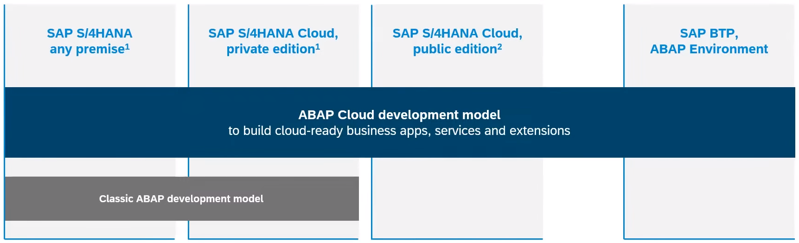

{: .no_toc}
# Lösungsansatz

1. TOC
{:toc}

## Definieren Sie Ihren Lösungsweg
Jedes Unternehmen muss für sich intern entscheiden, wie es die neuen Technologien anwendet. Und eine rationale Entscheidung beruht auf wirtschaftlichen Aspekten – Mehrwerte für die Fachbereiche, Zufriedenheit der Kunden, direkte (Lizenzkosten, Betriebskosten) und indirekte Kosten (Mitarbeiter Einstellung, Ausbildung, und Auslaufen des alten Know-hows). 

Eine gesamthafte Analyse erfordert auch die Betrachtung von Alterativen zu SAP-Produkten. Bspw. Cloud Native Applikationen kann ein Entwickler nicht nur auf der SAP BTP erstellen. Die anderen Cloud-Anbieter müssen für eine ganzheitliche Bewertung mitbetrachtet werden. Genauso müssen die Tools für API-Management auch definiert und entschieden werden. Die organisatorischen Aspekte von „Fusion Teams“ sollten mit in die Bewertung hineinfließen; Sogenannte Citizen Developer können teilweise IT-Aufgaben, wie Front-End Design übernehmen. Neben SAP und non-SAP Produkten, gibt es auch openSource Projekte, welche diverse Anwendungsfälle, vor allem im Reporting lösen.

Die Umsetzung des Clean Core-Konzepts erfordert einen strategischen Ansatz und eine sorgfältige Planung. Organisationen können den folgenden Ansatz anwenden, um das Clean Core-Konzept von SAP effektiv zu nutzen. 
 
1. **API-First-Ansatz**: Begrüßen einen API-First-Ansatz für die Entwicklung, indem Sie Kernfunktionalitäten als wiederverwendbare APIs freigeben, die von internen und externen Anwendungen genutzt werden können. Dies fördert Agilität, Skalierbarkeit und Innovation und gewährleistet gleichzeitig Sicherheit und Governance. Stichwort: SOA - Service Oriented Architecture, oder auch Microservices.
    * Neue Schnittstellen, werden nur mit Standard APIs der SAP angelegt.
    * Oder eigene Z* REST APIs werden intern geschaffen.
2. **Modularisierung und Standardisierung**: Zerlegen Sie monolithische Systeme in modulare Komponenten und standardisieren Sie Datenstrukturen und Schnittstellen, wo möglich. Dies ermöglichten eine größere Flexibilität, Wiederverwendbarkeit und Interoperabilität im gesamten Unternehmen.
    * Entscheiden Sie, wo die kundenspezifischen Daten gespeichert werden sollen. Wenn Sie zusätzliche Daten für Ihre Geschäftsprozesse benötigen, dann am besten integriert in ein Standarddatenprodukt, vermeiden Sie parallele Datenmodelle zur Standardtabellen.
    * Harmonisieren Sie Ihre Geschäftsprozesse und starten Sie Projekte um Z-Transaktionen auf Standard Fiori Apps zu kommen.
    * Entscheiden Sie welche Kundenerweiterung bestehen bleiben. 
3.	**Bewertung und Rationalisierung**: Führen Sie eine gründliche Bewertung der bestehenden SAP-Landschaften durch, um Bereiche der Komplexität und Redundanz zu identifizieren. Rationalisieren Sie Systeme und Prozesse, um sie mit den Prinzipien des Clean Core in Einklang zu bringen und Prioritäten für Vereinfachungsmaßnahmen zu setzen.
    * Führen Sie Fit-Gap-Workshops durch und starten Sie Bereinigungsprojekte von performanten, unsicheren, oder ungenutzten Code. 
    * Bilden Sie Ihre Architekten aus, um anhand Richtlinien bewusst neue Technologien zu nutzen.

## Entscheidungshilfen

Hier finden Sie ein paar Referenzen und mögliche Entscheidungshilfen: 
* Eine Methodik für Unternehmensarchitekten [SAP Application Extension Methodology - SAP AEM](https://help.sap.com/docs/architecture_guidance/2f804cb5e53d4279879009100a2b2082/cd963582f46d421c9abfd28dc25ea7e3.html)
* Der vollständige Leitfaden von SAP, wie Kunden Clean Core-Erweiterungen durchführen können [Extend SAP S/4HANA in the cloud and on premise with ABAP based extensions](https://www.sap.com/documents/2022/10/52e0cd9b-497e-0010-bca6-c68f7e60039b.html)
* Schauen Sie auch Beispiele mit dem [Erweiterungsszenarien-Explorer](https://extensibilityexplorer.cfapps.eu10.hana.ondemand.com/ExtensibilityExplorer/#/ExtensibilityGuide) an
* Was ist das freigegebene Nachfolge-Entwicklungsobjekt? [Cloudification Repository Viewer](https://sap.github.io/abap-atc-cr-cv-s4hc/)
* Weitere Überlegungen finden Sie auch im Kapitel: [Integration](/integration)

## ABAP Cloud

ABAP Cloud ist das neue Entwicklungsmodell für alle Systemlandschaften, egal ob SAP BTP ABAP Environment, S/4HANA Cloud Public Edition und Private Edition oder S/4HANA On-Premise, können Sie das selbe Modell für die Entwicklung von Clean Core und Cloud Ready Anwendungen verwenden. Die Verwendung wird Ihnen im [Extensibility Guide für S/4HANA](https://www.sap.com/documents/2022/10/52e0cd9b-497e-0010-bca6-c68f7e60039b.html) genauer beschrieben. In den folgenden Abschnitten werden Sie einige Details erhalten. ABAP Cloud ist fundamentaler Bestandteil, wenn Sie Clean Core erreichen möchten.

ABAP Cloud - Verfügbarkeit
{: .img-caption}

### Freigegebene APIs

Die Verwendung von freigegebenen APIs (Entwicklungsobjekte mit C1-Freigabe) ist zentraler Bestandteil von ABAP Cloud. SAP gibt Ihnen als Kunde die Zusage, dass diese API stabil ist und für eigene Entwicklungen genutzt werden kann. Damit können in ABAP Cloud nur SAP Objekt verwendet werden, die SAP auch explizit freigegeben hat.

### 3-TIER Modell

Das 3-TIER Modell ist zentraler Bestandteil, wenn Sie einen Übergang von klassischer ABAP Entwicklung in Richtung ABAP Cloud gehen. Dabei sind erst einmal alle Objekte, die außerhalb einer Software Komponente, kurz SWC, mit ABAP Cloud sind, nicht Clean Core. Die Aufgabe besteht für Sie nun darin, die Entwicklungen ABAP Cloud Ready zu migrieren. Dabei werden Objekte von TIER-3 auf TIER-1 verschoben und nicht freigegebene APIs ersetzt. 

Sind die APIs aktuell nicht freigegeben, könnne Sie auf TIER-2 soganannte Wrapper erstellen, die SAP Funktionalität kapseln und für Ihre Entwicklung in TIER-1 freigeben. Im Zuge dessen sollten Sie einen Influence Request bei SAP erstellen, um die Freigabe oder eine alternative API zu erhalten. Weitere Informationen zur Erstellung von Wrappern und welche Objekte sich eignen, finden sie im SAP Guide: [ABAP Cloud API Enablement](https://www.sap.com/documents/2023/05/b0bd8ae6-747e-0010-bca6-c68f7e60039b.html).

### Migration von Reports

Reports/Programme sind heute zentraler Bestandteil zur Ausführung von Logik in einem SAP System, egal ob im Dialog oder im Hintergrund per Batch-Job. Allerdings sollten Sie bei der Migration beachten, dass Reports nicht mehr Teil von ABAP Cloud sind. 

Aktuell gibt es die folgenden Nachfolger:
* Fiori App - Erstellung einer Anwendung auf SAP Fiori Basis mit dem ABAP RESTful Programming Model, kurz RAP. Weitere Informationen zu RAP finden Sie im Kapitel für Entwicklung. Die App ist der Einstiegspunkt für den Anwender.
* Application Job - Diese neue Art von Job basiert in der Entwicklung auf einer Klasse, die durch eine zentrale Routine im System gestartet wird. Der Start erfolgt über eine Fiori Anwendung. Jobs sind vor allem zur Automatisierung von Tätigkeiten im Hintergrund.

### Neue Konzepte

Mit der Einführung von ABAP Cloud, wurden verschiedene Entwicklungskonzepte überarbeitet und Nachfolger zur Verfügung gestellt. Sie sollten daher beachten, dass die alten Konzepte teilweise nicht mehr gültig sind. Dazu einige Beispiele:

| Bereich           | Alt (TIER-3)       | Neu (TIER-1)                        |
|-------------------|--------------------|-------------------------------------|
| Application Log   | SLG0, SLG1         | CL_BALI_OBJECT_HANDLER, ABAP API    |
| Job               | SM36, SM37, Report | Application Job                     |
| E-Mail            | CL_BCS             | CL_BCS_MAIL_MESSAGE                 |
| E-Mail            | SOST               | Monitor Email Transmissions (F5442) |
| Programmiermodell | BOPF               | RAP                                 |
| Tabellenpflege    | SM30               | Business Configuration              |
| Übersetzung       | SE63               | Maintain Translations (F4950)       |

Die vollständige Liste finden Sie [hier](https://software-heroes.com/abap-cloud-api).