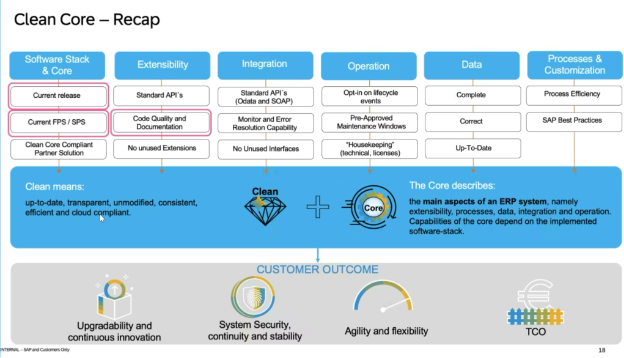

{: .no_toc}
# Lösungsansatz

1. TOC
{:toc}

Jedes Unternehmen muss für sich intern entscheiden, wie es die neuen Technologien anwendet. Und eine rationale Entscheidung beruht auf wirtschaftlichen Aspekten – Mehrwerte für die Fachbereiche, Zufriedenheit der Kunden, direkte (Lizenzkosten, Betriebskosten) und indirekte Kosten (Mitarbeiter Einstellung, Ausbildung, und Auslaufen des alten Know-hows). 

Eine gesamthafte Analyse erfordert auch die Betrachtung von Alterativen zu SAP-Produkten. Bspw. Cloud Native Applikationen kann man nicht nur auf der SAP BTP erstellen. Die anderen Cloud Anbieter müssen für eine ganzheitliche Bewertung mitbetrachtet werden. Genauso müssen die Tools für API-Management auch definiert und entschieden werden. Die organisatorischen Aspekte von „Fusion Teams“ sollten mit in die Bewertung hineinfließen; Sogenannte Citizen Developer können teilweise IT-Aufgaben, wie Front-End Design übernehmen. Neben SAP und non-SAP Produkten, gibt es auch openSource Projekte, welche diverse Anwendungsfälle, vor allem im Reporting lösen.

Die Umsetzung des Clean-Core-Konzepts erfordert einen strategischen Ansatz und eine sorgfältige Planung. Organisationen können den folgenden Ansatz anwenden, um das Clean Core Konzept von SAP effektiv zu nutzen. 
 
1. API-First-Ansatz: Begrüßen einen API-First-Ansatz für die Entwicklung, indem Sie Kernfunktionalitäten als wiederverwendbare APIs freigeben, die von internen und externen Anwendungen genutzt werden können. Dies fördert Agilität, Skalierbarkeit und Innovation und gewährleistet gleichzeitig Sicherheit und Governance. Stichwort: SOA - Service Oriented Architecture 
    * Neue Schnittstellen, werden nur mit Standard APIs der SAP angelegt.
    * Oder eigene Z* REST APIs werden intern geschaffen.
2. Modularisierung und Standardisierung: Zerlegen Sie monolithische Systeme in modulare Komponenten und standardisieren Sie Datenstrukturen und Schnittstellen, wo möglich. Dies ermöglichten eine größere Flexibilität, Wiederverwendbarkeit und Interoperabilität im gesamten Unternehmen.
    * Entscheiden Sie, wo Kundeneigene Daten gehalten werden sollen. Schaffen Sie die Zusatzdaten zu Standardtabellen, am besten parallel zu der Standardtabelle.
    * Starten Sie Projekte um Z*/Y*-Transaktionen auf Standard Fiori Apps zu kommen.
    * Entscheiden Sie welche Kundenerweiterung bestehen bleiben.
 
3.	Bewertung und Rationalisierung: Führen Sie eine gründliche Bewertung der bestehenden SAP-Landschaften durch, um Bereiche der Komplexität und Redundanz zu identifizieren. Rationalisieren Sie Systeme und Prozesse, um sie mit den Prinzipien des Clean Core in Einklang zu bringen und Prioritäten für Vereinfachungsmaßnahmen zu setzen.
    * Führen Sie Fit-Gap-Workshops durch und starten Sie Bereinigungsprojekte von performanten, unsicheren, oder ungenutzten Code. 
    * Bilden Sie Ihre Architekten aus, um anhand Richtlinien bewusst neue Technologien zu nutzen.

## Entscheidungshilfen

* Verweis auf SAP AEM -> Entscheidungsbaum 
* Verweis auf Kapitel Integration
* Extensibility Browser

Referenz:

Entscheidungshilfe
{: .img-caption}

## ABAP Cloud

``(Björn)``

Tier 1 - 3

* Softwareorganisation mit Paketkonzept (+ Herausforderungen)

Verweis auf Extensibility Leitfäden

Fundamentaler Bestandteil für Clean Core 

Die ersten Schritte für das Unternehmen wäre: Von SAP Classical Extensibility zu ABAP Cloud zu gehen. Damit die Standard APIs die Kundennamensraum-Felder in den Standard Tabelle haben müssen erstmal diese Kunden Felder durch Key User Extensibility erweitert werden.