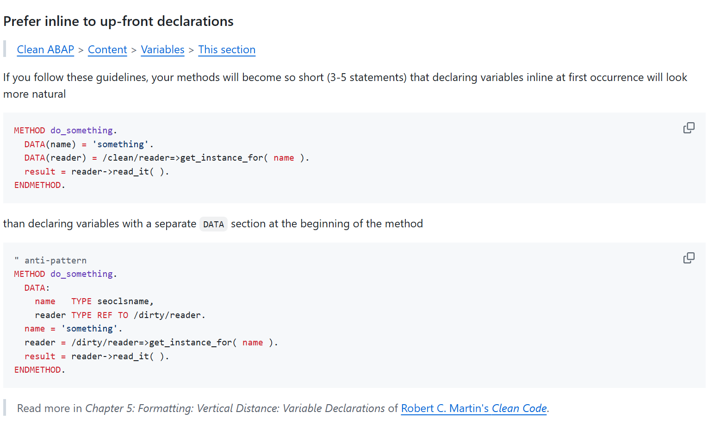

{: .no_toc}
# Was ist Clean Core

1. TOC
{:toc}

## Was ist Clean Core

Clean Core ist ein Konzept und für einige SAP-Kunden eine Philosophie - Clean Core wird unterschiedlich verstanden, interpretiert und gelebt. Ein gemeinsames Verständnis der DSAG-Community wäre folgendes:

**"Clean Core"** - Streng genommen ist das Konzept so zu interpretieren: System-Upgrades sollen keinen Einfluss auf Kundenerweiterungen haben. Daher 
dürfen SAP-Kunden nur freigegebene Schnittstellen für Geschäftsprozesserweiterungen verwenden.

**“Keep the core clean”** - Bedeutet, dass ein Unternehmen Neuentwicklungen nach Clean-Core-Prinzipien - definierten Richtlinien in einem Unternehmen - durchführt.

**Make the core clean"** - Bezieht sich auf die Unternehmenstransformation und die iterative Reise zu einem Clean Core.

Clean Core hat vier Fokusbereiche: Geschäftsprozesse, Kundenerweiterungen, Geschäftsdaten und Integration. Vor allem die neuen Wege der Kundenerweiterungen stehen im Mittelpunkt dieser Roadmap.

> „Die Erweiterbarkeitsfunktionen umfassen viele Optionen, die  Kunden und Partner dabei unterstützen, Standard-Business-Software  an ihre Geschäftsanforderungen anzupassen.“

Quelle: SAP Help Portal

Clean Core
{: .img-caption}

Das Clean Core Konzept mit seinen verschiedenen Facetten wird von SAP in der [TechEd2023 - Clean Core: What It Is, Why to Do It, and How to Get There] (https://www.youtube.com/watch?v=jlzdD55ahqY) klar kommuniziert. Die Schritt-für-Schritt-Anleitung ist jedoch für etablierte Kunden, die verschiedene „Legacy“-Technologien in ihren SAP-Systemen einsetzen, unklar. 
Es gibt zahlreiche Bestandskunden und SAP-Partner, die durch Eigenentwicklungen und Systemerweiterungen Mehrwerte in ihren Systemen geschaffen haben. Diese Mehrwerte gehören per Definition nicht zum Clean Core - die Erweiterungen basieren fast immer auf nicht freigegebenen Schnittstellen. Für die sogenannten RICEFW-Objekte gibt es verschiedene [Nachfolgetechnologie-Matrizen] (https://www.sap.com/documents/2022/10/52e0cd9b-497e-0010-bca6-c68f7e60039b.html). Intern stellen sich vor allem die Fragen: „Wie können wir den Technologiewechsel gegenüber unseren Kunden vertreten? Und warum soll ich gut funktionierende Prozesse, die z.B. auf Idocs, Messages, RFCs und ALV-Transaktionen basieren, jetzt umstellen?

### Zielgruppe
Im Wesentlichen sind im DSAG-Netzwerk zwei große Kundengruppen sichtbar: Die erste Gruppe entscheidet sich für eine große Investition in ihre SAP-Landschaft und arbeitet mit SAP und ihren Partnern zusammen, um auf einen Clean Core im Sinne der SAP-Definition zu gehen. Die andere Gruppe entscheidet sich für einen skalierten Ansatz, bei dem die Investitionen über mehrere Jahre verteilt werden. Hier einige Beispiele für mögliche SAP Kunden:

* Szenario eins: Neue SAP-Kunden, die auf S/4 HANA migrieren. Hier sollte der Greenfield-Ansatz und das strikte Clean Core laut SAP angewendet werden.
* Szenario zwei - Brownfield to Bluefield: Bestandskunden von SAP, die seit Jahrzehnten mit SAP arbeiten und auf S/4 HANA migrieren. Je nach Investitionsbereitschaft kann schrittweise der Clean Core definiert und die Neuentwicklung konform dazu gehalten werden. Bestehende Kundenerweiterungen werden in Großprojekten auf eine Clean Core konforme Entwicklung umgestellt.
* Szenario drei - Brownfield to Greenfield: Bestands SAP Kunden, welche seit Jahrzenten mit SAP zusammenarbeiten und auf S/4 HANA migrieren. Hier kann eine Abbildung der Kundenerweiterungen mit sehr hohem Investitionsvolumen erfolgen.
* Szenario vier - Brownfield im S/4 HANA: Ist identisch mit Szenario zwei.

### Clean Core Definition
Im Kern dreht sich das Clean-Core-Konzept um die Trennung der Kerngeschäftslogik von der Nicht-Kernfunktionalität innerhalb der SAP-Software-Suite. Durch die Isolierung von Kerngeschäftsprozessen und Datenstrukturen strebt SAP eine schlankere und agilere Basis an, die sich an veränderte Geschäftsanforderungen anpassen kann. 

Die neuen Wege der Kundenerweiterung heißen: ABAP Cloud und “Side-by-Side Extensibility”. 

**ABAP Cloud oder auch “On-Stack Extensibility”** - Das sind zwei unterschiedliche Technologien: “Developer Extensibility” und “Key-User Extensibility”.

**Side-by-Side Extensibility** - Ist die Auslagerung von Kundenerweiterungen in die Business Technology Platform - BTP.

Ein Beispiel: Anstatt das MATMAS Idoc in heterogener Form an verschiedene Systeme zu senden, sollte die standardisierte Schnittstelle: Product Master API verwendet werden. Zur Versorgung der SAP- und Non-SAP-Systeme dient dann eine Schnittstelle, die homogen ausgeprägt werden kann.

Das Datenmodell darunter wird durch Key-User-Extensibility erweitert und auch in generischen Reports wie „Embedded Analytics“ oder auch der SAP Analytic Cloud (SAC) verwendet. Bei komplexer Kundenlogik muss der Entwickler diese Kundenlogik mit Developer Extensibility und dem RESTful Application Programming Model (RAP) erweitern.

Grundsätzlich ist Clean Core so, wie es der Hersteller beschreibt: 
1. Erweiterungen sind klar vom SAP-Code getrennt und Erweiterungen verändern keine SAP-Objekte.
2. Nutzen Sie die neuen Erweiterungstechnologien und den SAP-Standard. Erweiterungen verwenden die neuen Erweiterungsmethoden wie Key-User, Developer und Side-by-Side Extensibility. 
3. Erweiterungen verwenden nur stabile, freigegebene SAP APIs und Erweiterungspunkte. Classical Extensibility sollte nur in freigegebenen Business Add-Ins mit freigegebenen Entwicklungsobjekten stattfinden. 
4. Legacy Technologien wie RFCs, Idocs und kundeneigene Dynprotransaktionen oder SAP Gateway Projekte sollten nicht mehr für Neuentwicklungen verwendet werden. 
5. Alte kundeneigene Entwicklungen / Erweiterungen sollen auf neue Technologien migriert werden, oder die Geschäftsprozessanforderung wird im SAP Standard wiedergefunden.

Aus den Herstellerangaben ergeben sich vier Anwendungsbereiche und die Fakten zur Erreichung eines Clean Core sehen wie folgt aus:

#### Datenmodelle
* Unabhängig davon, ob einfache oder komplexe Anwendungsfälle implementiert werden sollen, ist eine Datenmodellierung / ein Umgang mit dem Virtual Data Model (VDM) erforderlich. 
* Es sollte kein direkter Zugriff auf SAP Standardtabellen erfolgen.

#### Anwendungslogik
* SAP Standard Coding soll nicht mehr klassisch erweitert werden.
* Erweiterungen am Standard sollen in definierte, freigegebene Badis migriert werden.
* Eigenentwicklungen müssen Clean Core konforme Entwicklungsobjekte verwenden (Stichwort: Release Contracts).

#### Schnittstellen
* Grundsätzlich sollen Kunden die Standard Fiori Apps oder SAP GUI for HTML mit Screen Personas verwenden, um bestehende SAP Standardtransaktionen zu nutzen.
* Die Standard Fiori Apps und die dahinterliegenden Standard APIs sollen erweitert werden.
* Für Custom Apps sollten zunächst Fiori Elements + RAP und Standard APIs verwendet werden. Der nächste Schritt wären dann Freestyle Fiori Apps. Oder Cloud Native Apps in der Cloud (Side-by-Side Extensibility). Das Portfolio von SAP Build bietet weitere Lösungsansätze.

#### Schnittstellen
* Es werden nur Clean Core konforme, freigegebene Schnittstellen verwendet.
* Erweiterungen werden an APIs / Microservices vorgenommen, um die Funktionalität von SAP zu erweitern, ohne die Integrität des Kernsystems zu beeinträchtigen.
* Die Integration nach außen muss klar geregelt sein, Prozessintegration und Middleware für das API-Management müssen vorhanden sein.
* Legacy-Technologien wie Idocs, RFCs und Gateway-Projekte müssen sukzessive abgelöst werden.

Zusammenfassend stellt das Clean Core Konzept der SAP einen Paradigmenwechsel im Design von Unternehmenssoftware dar. SAP setzt darauf, neue Services nur noch in der Cloud anzubieten und die Schnittstellen zum Core weiter auszubauen. Der Mehrwert, gut laufende Lösungen auf eine neue Plattform zu bringen, ist vorerst nicht gegeben. Neue Lösungen sollte ein Unternehmen mit den neuen Erweiterungsarten gehen, um für die Zukunft gerüstet zu sein. So profitiert ein SAP-Kunde von den Innovationen rund um den Standard. Zum Paradigmenwechsel gehört auch die digitale Transformation: weg vom SAP GUI und Dynpros hin zum Fiori Launchpad, die Endanwender sollen primär im Browser arbeiten. Zu einem Clean Core gehört auch ein massives Change Management durch die IT und die Fachbereiche.

Durch die Umsetzung der Prinzipien des Clean Core und strategischer Initiativen können sich Organisationen auf zukünftige SAP-Strategien, insbesondere Cloud-Technologien, vorbereiten. 

Laut SAP geht es bei Clean Core vor allem, dass die Kunden sich die Zukunft nicht versperren und standardisiert Schnittstellen aufbauen. Durch die Standardisierung von Geschäftsprozessen und den Einsatz der SAP BTP können SAP Services, oder auch Lösungen von SAP Partnern komplett verwendet werden.  
Die Clean Core Strategie ist für viele Bestandskunden eine Philosophie, bis interne Richtlinien die Nutzungen der Nachfolge-Technologien regeln. Basierend auf den Richtlinien werden Entwickler organisatorisch ausgerichtet, und geschult. Ein Gremium um die „Clean Core Governance“ einzuhalten ist Pflicht, mit dem Mandat die Richtlinien zu pflegen, zu erweitern und zu forcieren. Research und Development sollte häufig betrieben werden, um die Mehrwerte durch SAP-Service herauszuarbeiten.

### Private/Public Cloud/BTP
...
siehe [Mapping your journey to SAP S/4HANA Cloud Private Edition - A practical guide for senior IT leadership](https://d.dam.sap.com/x/HvXc6b7/94115_92460_enUS.pdf?rc=19&inline=true)
### Zielbild - Reise mit SAP, der Weg in die Public Cloud?

Clean Core ist relevant und anwendbar für "SAP S/4HANA on-premise" und "SAP S/4HANA Cloud, private edition (RISE)"
SAP S/4HANA Cloud, public edition (GROW) ist per Definition sauber.

### S/4 HANA Transformation

Abgrenzung von Green-, Brown- and Bluefield

## Clean ABAP 

Clean ABAP stellt die Anapssung der Prinzipien aus dem Buch von Robert C. Martin auf ABAP dar. Das offizielle, im Repository der SAP freigegebene Dokument wurde von Florian Hoffmann und Klaus Häuptle 2019 auf den Weg gebracht und wird seit dem als open source durch die ABAP Community erweitert. https://github.com/SAP/styleguides/blob/main/clean-abap/CleanABAP.md

Beispielregel mit Erläuterung:

Der Gedanken von Clean ABAP ist, dass es nicht eine Version von Clean ABAP gibt, mit einem festen unveränderlichen Set an Regeln. 
Teams sind eingeladen, die Regeln anzupassen und veränden so wie sie für ihren spezifischen Fall am besten passen. 
Wichtig ist hier nur, dass diese Regeln verbindlich und alle teams eines Unternehmens hinweg gültig sind. Der Grundgedanken von Clean ABAP - einheitliche Code Reviews - würde gebrochen wenn das Financials Team andere ABAP Regeln hat als Sales.

Die öffentliche Version von Clean ABAL stellt eine excellente Grundlage hierfür dar. 
Alle Regelen von Clean ABAP heute sind und sollten immer begründet und erläutert werden. 

Clean ABAP kann generell auf jede Sprachvesion von ABAP angewendet werden von R2 bis hin zu ABAP Cloud. 

### Clean ABAP & Entwicklungsrichtlinien
Die auf das Untrenehmen angepasste Form von Clean ABAP sollte ein ergänzendes Dokument der gültigen Entwicklungsrichtlinien sein, so dass es überall Anwendung findet. 
Es ist hilfreich die Anwendung der Regeln mit automatischen Tool wie Code Pal for ABAP (https://github.com/SAP/code-pal-for-abap) zu überprüfen und sicherzustellen. 

### Clean ABAP owner
In jedem Entwicklungsteam sollte es - gerne auch rollierend - einen Clean ABAP Owner geben, der Ansprechpatner und Verantwortlicher für Änderungen ist. 
Änderungen und Erweiterungen müssen separat in den Teams kommuniziert und Abgestimmt werden. 
Clean ABAP funktioner am besten wenn alle Beteiligten hiner den Regeln stehen, hierfür sind immer wieder Team Kompromisse und Abstimmungen möglich. 

### Clean ABAP ist ein Prozess  
Die Anwendung / Erlernen von Clean ABAP ist kein einmaliger Workshop oder eine Managementdirektive. 
Es braucht Zeit, Übung, Motivation und den konstanten Willen bessere ABAP Programme zu schreiben. 

Die Tätigkeiten, die das Anwenden von Clean ABAP sichderstellen heißen Pair-Programming, Code Reviews, Refactoring und Schulung.
Hierfür müssen von der Organisation entsprechende Bedingungen geschaffen werden. 

### Differenzierung zu Clean Core
Bei Clean ABAP geht um das schreiben von ABAP Code dessen Fokus auf Verständlichkeit und Wartbarkeit liegt. 
Bei Clean Core der SAP geht es um die Behandlung der Grenzen von Kundenindividuellen Programen im SAP Standard. 

Nur weil eine Umsetzung der Clean Core Stategie enspricht ist diese nicht automatisch Clean ABAP und umgedreht. 

## Modifikationen in SAP Code

( gemeint sind die echten Änderungen mit klassischen Modifikationen )

* Umgang mit nötigen Modifikationen 
* “NIE MALS SAP CODE Kopieren“
    * Ausnahmeregelung z.B. im Bereich FI wegen Wirtschaftsprüfern / Auditkomplexität definieren? 
* Rechtfertigung für Modifikation: z.B. Implementierung von Alleinstellungsmerkmalen (USPs) / Verbesserung / Prozessoptimierung / andere Savings? (ggf. Text aus altem Leitfaden adaptieren. 

### Saubere Modifikationen
Do
 SAP Code öffnen und einen enhancementspot in der Modifikation anlegen. 
 Enhancement spot wie gewohnt ausprägen mit allen Vorteilen der Enhancements z.B dass der Code im Z-Paket liegt. 

Don't 
 In der Modifikation business code zu schreiebn. Dieser sollte inbedingt ausgelagert und separat testbar sein. 
 Wenn die unter Do beschriebene Vorgehensweise nicht möglich sein sollte, verwende Aufrufe von Methoden.
