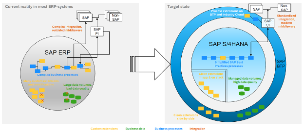

{: .no_toc}
# Was ist Clean Core

1. TOC
{:toc}

## Was ist Clean Core

Clean Core ist ein Konzept, und für manchen SAP Kunden eine Philosophie -  Clean Core wird unterschiedlich aufgefasst, interpretiert und gelebt. Ein gemeinsames Verständniss der DSAG-Community wäre das folgende:

**"Clean Core"** - Streng genommen ist das Konzept so zu interepretieren: Systemupgrades sollen keinen Einfluss auf Kundenerweiterungen haben. Deshalb 
dürfen die SAP Kunden nur freigegebene Schnittstellen für Geschäftprozesserweiterungen nehmen.

**“Keep the core clean”** –  Bedeutet, dass ein Unternehmen nach Clean Core Prinzipien -  definierten Richtlinien in einem Unternehmen - Neuentwicklung aufsetzt.

**“Make the core clean”** – Spricht die Unternehmenstransformation an und behandelt die iterative Reise zu einem Clean Core.

Clean Core hat vier Fokusfelder: Geschäftsprozesse, Kundenerweiterungen, Geschäftsdaten und Integration. Vor allem die neuen Wege der Kundenerweiterungen stehen in diesem Leitpfaden im Fokus.

> „Die Erweiterbarkeitsfunktionen umfassen viele Optionen, die  Kunden und Partner dabei unterstützen, Standard-Business-Software  an ihre Geschäftsanforderungen anzupassen.“

Quelle: SAP Help Portal

Clean Core
{: .img-caption}

Das Clean Core Konzept mit seinen unterschiedlichen Facetten ist von SAP klar und deutlich bei der TechEd2023 kommuniziert. Die Schritt-für-Schritt Anleitung ist für etablierte Kunden, welche diverse „Legacy“ Technologien in ihren SAP-Systemen nutzen, ist dennoch unklar. 
Es gibt zahlreiche Bestandskunden und SAP Partner, welche Mehrwerte durch Eigenentwicklung und Systemerweiterung, in Ihren Systemen geschaffen haben. Diese Mehrwerte gehören laut Definition nicht zum Clean Core - die Erweiterungen beruhen fast immer auf nicht freigegebene Schnittstellen. Es existieren unterschiedliche Nachfolge-Technologie-Matrizen für die sogenannten RICEFW-Objekte. Intern stellt sich primär die Fragen: „Wie können wir gegenüber unseren Kunden den Technologie-Wechsel vertreten? Und weshalb sollte ich jetzt gut-funktionierende Prozesse basierend bspw. auf Idocs, Nachrichten, RFCs, und ALV-Transaktionen umziehen?

### Zielgruppe
(Noch offen)
* SAP Kunden die auf S/4 HANA gehen - Greenfield Ansatz und stringent Clean Core bestimmen
* SAP Kunden die Brownfield auf S/4 sind- Clean Core nach und nach definieren und Neuentwicklung konform dazu halten

### Clean Core Definition
Im Kern dreht sich das Konzept des Clean Core darum, wesentliche Geschäftslogiken von nicht wesentlichen Funktionalitäten innerhalb der Software-Suite von SAP zu trennen. Durch die Isolierung von Kerngeschäftsprozessen und Datenstrukturen strebt SAP eine schlankere, agilere Grundlage an, die sich an sich ändernde Geschäftsanforderungen anpassen kann. 

Die neuen Wege der Kundenerweiterung heißt: ABAP Cloud, und “Side-By-Side Extensibility”. 

**ABAP Cloud oder auch “On-Stack Extensibility”** –  Das sind zwei unterschiedliche Technologien: “Developer Extensibility” und “Key-User Extensibility”

**Side-By-Side Extensibility** – Ist die Aulagerungen von Kundenerweiterungen in die Business Technlogy Palltform – BTP.

Ein Beispiel: Statt an unterschiedliche Systeme das MATMAS Idoc – in heterogener Ausprägung an diverse Systeme zu schicken, sollten Sie auf die standardisierte Schnittstelle: Product Master API setzen. Um die SAP und Non-SAP-Systeme zu versorgen, nutzten Sie dann eine Schnittstelle, welche homogen ausprägt werden kann.

Das Datenmodell darunter wird durch Key-User-Extensibility erweitert und auch in generischen Reports wie „embedded Analytics“, oder auch der SAP Analytic Cloud (SAC) verwendet. Bei komplizierter Kunden-Logik muss der Entwickler mit Developer Extensibility und dem RESTful Application Programming Model (RAP) diese Kunden-Logik erweitern.

Grundsätzlich heißt Clean Core, so wie der Hersteller es beschreibt: 
1. Erweiterungen sind klar vom SAP-Code getrennt, und Erweiterungen verändern keine SAP-Objekte.
2. Nutzen Sie die neuen Erweiterungstechnologien und den SAP Standard. Erweiteren Sie mit den neuen Erweiterungsmethoden, wie Key-User, Developer und Side-by-Side Extensibility. 
3. Erweiterungen verwenden nur stabile, freigegebene SAP-APIs und Erweiterungspunkte. Classical Extensibility sollte nur in zugelassenen Business Add-Ins, mit freigegebenen Entwicklungsobjekten stattfinden. 
4. Die Legacy Technologien, wie bspw. RFCs, Idocs und kundeneigene Dynpro Transkationen, oder SAP Gateway Projekte sollen nicht mehr für neue Entwicklungen genutzt werden. 
5. Alte Kundeneigene Entwicklungen / Erweiterungen sollen umziehen auf neue Technologien, oder die Geschäftsprozessanforderung wird im SAP Standard wiedergefunden.

Aus den Herstellerangaben bilden sich vier Anwedungsgebiete und die Fakten um ein Clean Core zu erreichen sehen wie folgt aus:

#### Datenmodelle
* Egal ob einfache oder komplexe Anwendungsfälle zu implementieren haben ist eine Datenmodellierung /ein Umgang mit dem Virtual Data Model (VDM) notwendig. 
* Es soll keine Direktzugriffe auf SAP Standard Tabellen geben.

#### Anwendungslogik
* SAP Standard Coding soll nicht mehr klassisch erweitert werden
* Die Erweiterungen am Standard sollen in definierten, freigegebenen Badis migriert werden.
* Eigenentwicklung muss Clean Core konforme Entwicklungsobjekte benutzen (Stichwort: Release Contracts)

#### Oberflächen
* Grundsätzlich sollen die Kunden die Standard Fiori Apps nutzen, oder SAP GUI for HTML mit Screen Personas verwenden um existierende, SAP Standard Transkationen zu nutzen.
* Die Standard Fiori Apps, und die Standard APIs dahinter sollten erweitert werden.
* Bei Custom Apps soll primär erst Fiori Elements + RAP und Standard APIs genommen werden. Die nächste Stufe wären dann Freestyle Fioris Apps. Oder Cloud Native Applications in der Cloud (Side-by-side Extensibility). Das Portfolio der SAP Build bieten auch weitere Lösungswege.

#### Schnittstellen
* Nur Clean Core-konforme, freigegebene Schnittstellen sollen benutzt werden
* Erweiterungen werden an APIs / Microservices durchgeführt, um die Funktionalität von SAP zu erweitern, ohne die Integrität des Kernsystems zu beeinträchtigen.
* Integration nach außen muss klar geregelt sein, Prozessintegration und die Middleware für das API-Management muss gegeben sein.
* Legacy Technologien wie Idocs, RFCs, und Gateway Projekte müssen sukzessive umgezogen werden.

Zusammenfassend steht das Clean Core Konzept von SAP für einen Paradigmenwechsel im Design von Unternehmenssoftware. Die SAP setzt darauf neue Services nur im Cloud Bereich anzubieten, und die Schnittstellen zu dem Kern weiterauszubauen. Der Mehrwert gut-laufende Lösung auf eine neue Plattform zu bringen, ist erstmal nicht gegeben. Neue Lösungen sollte ein Unternehmen mit den neuen Erweiterugsarten gehen um sich zukunftsicher aufzustellen. Somit profitiert ein SAP Kunde von der Innovationen rund um den Standard.

Durch die Umsetzung der Prinzipien des Clean Core und strategischer Initiativen können Organisationen sich auf zukünftige SAP-Strategien, vor allem Cloud-Technologien vorbereiten. 

Laut SAP geht es bei Clean Core vor allem, dass die Kunden sich die Zukunft nicht versperren und standardisiert Schnittstellen aufbauen. Durch die Standardisierung von Geschäftsprozessen und den Einsatz der SAP BTP können SAP Services, oder auch Lösungen von SAP Partnern komplett verwendet werden.  
Die Clean Core Strategie ist für viele Bestandskunden eine Philosophie, bis interne Richtlinien die Nutzungen der Nachfolge-Technologien regeln. Basierend auf den Richtlinien werden Entwickler organisatorisch ausgerichtet, und geschult. Ein Gremium um die „Clean Core Governance“ einzuhalten ist Pflicht, mit dem Mandat die Richtlinien zu pflegen, zu erweitern und zu forcieren. Research und Development sollte häufig betrieben werden, um die Mehrwerte durch SAP-Service herauszuarbeiten.

### Private/Public Cloud/BTP
...

### Zielbild - Reise mit SAP, der Weg in die Public Cloud?

Clean Core ist relevant und anwendbar für "SAP S/4HANA on-premise" und "SAP S/4HANA Cloud, private edition (RISE)"
SAP S/4HANA Cloud, public edition (GROW) ist per Definition sauber.

### S/4 HANA Transformation

Abgrenzung von Green-, Brown- and Bluefield

## Clean ABAP 

``(Timo)``

Differenzierung zu Clean Core

<< Verweise auf Clean ABAP bedeutende Elemente >> 

## Modifikationen in SAP Code

( gemeint sind die echten Änderungen mit klassischen Modifikationen )

* Umgang mit nötigen Modifikationen 
* “NIE MALS SAP CODE Kopieren“
    * Ausnahmeregelung z.B. im Bereich FI wegen Wirtschaftsprüfern / Auditkomplexität definieren? 
* Rechtfertigung für Modifikation: z.B. Implementierung von Alleinstellungsmerkmalen (USPs) / Verbesserung / Prozessoptimierung / andere Savings? (ggf. Text aus altem Leitfaden adaptieren. 
