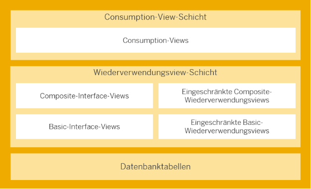
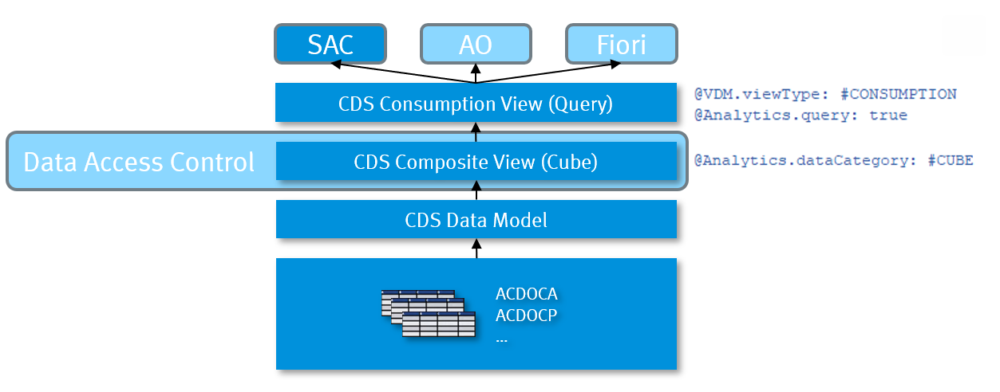

{: .no_toc}
# Alles über Core Data Services

1. TOC
{:toc}

## Core Data Services Views (CDS Views)

Was sind CDS Views und warum sind sie wichtig? 
In SAP S/4HANA soll der Entwickler nicht mehr direkt auf die Datenbanken zugreifen, sondern das [Virtuelle Datenmodell (VDM)](https://help.sap.com/docs/SAP_S4HANA_ON-PREMISE/ee6ff9b281d8448f96b4fe6c89f2bdc8/8573b810511948c8a99c0672abc159aa.html?locale=de-DE) nutzen, um auf die Daten in SAP S/4HANA zuzugreifen, z.B. für Analytics oder Schnittstellen.  Das VDM wird in SAP S/4HANA durch CDS-Views repräsentiert. Diese CDS-Views folgen festen Regeln für die Modellierung und Benennung. Sie stellen Geschäftsdaten aus Datenbanktabellen auf Basis der Geschäftslogik dar und machen die Daten so einfacher nutzbar. 
[CDS Views sind die Schlüsselelemente](https://help.sap.com/doc/abapdocu_cp_index_htm/CLOUD/en-US/abencds.html) für On-Stack Extensibility oder auch ABAP Cloud - siehe [Kapitel Clean Core](/ABAP-Leitfaden//clean-core/what-is-clean-core/). Die Nutzung und Erweiterung eines Datenmodells ist der Schlüssel zum VDM-Konzept. CDS Views werden für viele Zwecke verwendet, z.B. als Schnittstelle zwischen verschiedenen Anwendungen und Add-Ons im selben System sowie zu externen Systemen und Anwendungen. Sie können auch eigene Views erstellen, indem Sie, nach dem Clean Core Gedanken, die von SAP bereitgestellten und freigegebenen Views als Datenquelle verwenden.

## Aufbau von dem VDM



Quelle: SAP Help Darstellung des VDMs
{: .img-caption} 

Vor die Datenbanktabellen werden verschiedene CDS-View-Layer gelegt. Das VDM sorgt beispielsweise dafür, dass die Datenbankfelder verständlich sind und der Benutzer das proprietäre SAP-Datenmodell, beispielsweise MARA-MATNR, als Produktnummer identifizieren kann. Der Basic Interface Layer greift auf die Datenbank zu. Die Composite Interface Views fassen Logik und Basic Interface Views zusammen; das VDM kann verschiedene Abstraktionsschichten enthalten. Die Consumption-Views geben das Datenmodell für den Anwendungsfall frei.  
Im Rahmen des [ABAP RESTful Application Programming Model](../abap/restful_abap.md) (RAP) werden von SAP auch weitere Begriffsdefinitionen, z.B. Business Object Projection Layer, vorgegeben.

Hier wäre die folgende Aufstellung der View Arten. Alle Standard Views beinhalten auch die Kennung / Annotation:

```abap
@VDM.viewType:[..]
```
## View-Typen, Namenskonventionen und Einsatzmöglichkeiten  

| View-Typ / Suffix  | Beschreibung | Annotation |
|--------------------|-------------|------------|
| **I_*** | Basic- und Composite-Interface-Views: Diese CDS-Views dienen dem Lesen von Daten und können für Erweiterungen genutzt werden. | `@VDM.viewType: #BASIC` `@VDM.viewType: #COMPOSITE` |
| **C_*** | Consumption-Views: Eingeschränkte Wiederverwendungsviews. | `@VDM.viewType: #CONSUMPTION` |
| **P_*** | Private Views: Diese Views dürfen nicht verwendet werden, da SAP sie bei System-Upgrades verändern kann. | `@VDM.private: true` |
| **R_*** | Views für transaktionale Verarbeitung: Diese CDS-Views ermöglichen nicht nur das Lesen von Daten, sondern auch Aktionen wie das Anlegen, Ändern oder Löschen von Instanzen eines RAP-Business-Objekts im Kontext des ABAP-RESTful-Anwendungsprogrammiermodells (RAP). | |
| **A_*** | Remote-API-Views: Diese CDS-Views bilden die Grundlage für externe APIs. Weitere Informationen über APIs finden Sie im [SAP Business Accelerator Hub](https://api.sap.com/). | `@VDM.viewType: #CONSUMPTION` `@VDM.lifecycle.contract.type: #PUBLIC_REMOTE_API` |
| **X_*** | View-Erweiterungen: Diese CDS-Views können Daten nur indirekt im Kontext einer anderen CDS-View lesen. Sie bieten Zugriff auf branchen- oder länder-/regionsspezifische Felder, die von SAP definiert wurden. | `@VDM.viewExtension: true` |
| **E_*** | Extension-Include-Views: Diese CDS-Views können Daten nur indirekt im Kontext einer anderen CDS-View lesen. Sie bieten Zugriff auf benutzerdefinierte Felder, die in der App „Benutzerdefinierte Felder“ angelegt wurden. Siehe Abschnitt "Erweiterungen von SAP Standard CDS Views"  | `@VDM.viewType: #EXTENSION` |
| **F_*** | Ableitungsfunktionen: Leiten kontextspezifische Werte ab, mit denen Daten in analytischen Queries eingeschränkt werden können. Weitere Informationen finden Sie unter Ableitungsfunktionen für Finance | |
| **D_*** | Abstrakte Entitäten: Bilden die Grundlage für die Modellierung von Ereignissignaturen und Aktionsparameter-/Ergebnisstrukturen. | |


Desweiten, gibt es die Kennung als Suffix je nach Einsatzbereich des CDS Views.

| Suffix            | View-Typ | Annotation |
|------------------|--------------------------------|-----------------------------------------------------------|
| **Query, Qry, Q** | Analytische Query-View | `@VDM.viewType: #CONSUMPTION`<br>`@Analytics.query: true` |
| **Cube, C**      | Analytische Cube-View | `@Analytics.dataCategory: #CUBE` |
| **Text, Txt, T** | Provider für sprachabhängigen Text | `@ObjectModel.dataCategory: #TEXT` |
| **TP**          | View für transaktionale Verarbeitung | `@VDM.usage.type: [ #TRANSACTIONAL_PROCESSING_SERVICE ]` |
| **VH, StdVH**   | (Standardmäßig) View für Wertehilfe | `@ObjectModel.dataCategory: #VALUE_HELP` |

CDS-Views können für viele verschiedene Zwecke verwendet werden, z. B. zum Erstellen von Fiori-Anwendungen oder zum Analysieren von Daten. Sie können eigene CDS-Views erstellen und dabei auf viele von SAP freigegebene Views zurückgreifen.
Um Ihnen die Suche nach der passenden CDS-View zu erleichtern, hat SAP zwei Funktionen eingeführt: Unterstützte Funktionen und Modellierungsmuster. Diese Merkmale werden als Annotationen spezifiziert und können für jede CDS-View definiert werden.
Sie können die unterstützten Funktionen und Modellierungsmuster von CDS-Views im [View-Browser App](https://fioriappslibrary.hana.ondemand.com/sap/fix/externalViewer/#/detail/Apps('F2170')/S30PCE) sehen. In den ABAP Development Tools finden Sie diese Informationen als Annotation am Anfang jeder CDS-View.

Weitere Details finden Sie unter [SAP Help](https://help.sap.com/docs/SAP_S4HANA_ON-PREMISE/ee6ff9b281d8448f96b4fe6c89f2bdc8/8a8cee943ef944fe8936f4cc60ba9bc1.html)

{: .note }
> Die folgende SAP Community Seite [ZSCV_SEARCH_CDS_VIEWS](https://github.com/alwinvandeput/zscv_search_cds_views) bietet eine Open-Source-Lösung zur Suche von CDS-Views an.

## Klassifierierung von CDS Views

### Unterstützte Funktionen  
Die unterstützten Funktionen geben an, so die SAP, wofür eine CDS-View am besten verwendet werden kann. Eine CDS-View kann mehrere unterstützte Funktionen haben, da sie für verschiedene Zwecke geeignet sein kann.  

Diese Funktionen beschreiben die beste Verwendung einer CDS-View. Sie können beispielsweise die Verwendung einer CDS-View als:  
- Datenquelle  
- Ziel für Verknüpfungen in der CDS-Modellierung  
- Datenlieferant für analytische Abfragen  

Die unterstützten Funktionen einer CDS-View werden in einer einzigen Annotation angegeben:  

```abap
@ObjectModel.supportedCapabilities: [ ..., ... ].
```

### Modellierungsmuster  

Ein Modellierungsmuster beschreibt den Hauptzweck einer CDS-View. Eine CDS-View kann nur ein Modellierungsmuster haben. Der Wert des Modellierungsmusters kann gleich dem Wert einer unterstützten Funktion sein, muss es aber nicht.  

Die Annotation für ein Modellierungsmuster sieht so aus:  

```abap
@ObjectModel.modelingPattern: ...
```

## CDS View Modellierungsmöglichkeiten

Dieser Abschnitt beschreibt die verschiedenen Typ-Definitionen, Funktionsdefinitionen und Datenmodelle innerhalb von ABAP Core Data Services. Dabei werden elementare Typen, SQL-basierte Funktionen (Skalarfunktionen) sowie verschiedene View-Typen wie DDIC-basierte Views, View Entities und Projection Views erläutert. Ergänzt wird dies durch fortgeschrittene Konzepte wie Tabellenfunktionen, Hierarchien, Custom, External und Abstract Entities sowie Tuning-Objekte zur Optimierung von CDS-Modellen.


### Typ-Definitionen

#### Simple Types
Hiermit definieren Sie elementare Datentypen, welche Sie in CDS Objekten oder in ABAP verwenden können.

__Beispiel__

```abap
define type myDate : abap.dats
```

Details finden Sie unter [SAP Help (CDS Simple Types)](https://help.sap.com/doc/abapdocu_latest_index_htm/latest/en-US/abencds_simple_types.htm)

#### Enumerated Types
Definieren Sie einen enumerierten Typ mit Konstanten. Sie können den Typ und die Konstanten in CDS Objekten verwenden.

__Beispiel__

Definition

```js
define type Weekdays : abap.int1 enum
{
    Monday = initial;
    Tuesday = 1;
    Wednesday = 2;
    Thursday = 3;
    Friday = 4;
    Saturday = 5;
    Sunday = 6;
}
```

Verwendung

```abap
define ... as select from ...
{
    ...
}
where
  weekday = Weekdays.#Friday
```

Details finden Sie unter [SAP Help (CDS Enum Types)](https://help.sap.com/doc/abapdocu_latest_index_htm/latest/en-US/abencds_enumeration_types.htm)

## Tabellenfunktionen
Aktuell bietet SAP nur die Definition einer _Skalarfunktionen_ an. Dabei gibt es zwei verschiedene Arten von Funktionen.
* Analytische Skalarfunktionen
  * Diese Art der Funktionen ist aktuell nur SAP intern definierbar. Sie können die von SAP ausgelieferten Funktionen aber nutzen.
* SQL-basierte Skalarfunktionen
  * Sie können eigene Funktionen dieser Art definieren und implementieren. Die Verwendung ist wie bei den eingebauten SQL-Funktionen (wie z.B. CONCAT()). Eine Skalarfunktion kann mehrere Parameter haben und hat immer einen einzigen Rückgabewert.
  * Sie benötigen drei Entwicklungsobjekte für eine Skalarfunktion:
    * Eine Skalarfunktion Definition (CDS Objekt)
    * Eine Skalarfunktion-Implemetierungsreferenz, als Verknüpfung zwischen der Definition und der Implementierung
    * Eine [AMDP Function](https://help.sap.com/doc/abapdocu_latest_index_htm/latest/en-US/abenamdp_function_methods.htm), welche die Implementierung der Skalarfunktion darstellt

Details finden Sie unter [SAP Help (CDS-Skalarfunktionens)](https://help.sap.com/doc/abapdocu_latest_index_htm/latest/en-US/abencds_scalar_functions.htm)

## Annotations
Annotationen können überall in einem CDS Objekt auftauchen. Wo genau eine Annotation angegeben werden kann bzw. darf, hängt von der Annotation ab. Annotationen sollen das CDS Objekt mit Metadaten anreichern, die dann von einem Verwender interpretiert werden können. Beispielsweise kann man ein CDS View Entity mit Annotationen versorgen, die schlussendlich von einer Fiori Elements App ausgewertet werden können (mit einem OData Service als Zwischenschritt).

Es besteht sogar die Möglichkeit eigene CDS Annotationen zu definieren.

Details dazu finden Sie unter [SAP Help (CDS - Definition of Annotations)](https://help.sap.com/doc/abapdocu_latest_index_htm/latest/en-US/abencds_anno_definition.htm)

### Syntax
Um eine Annotation anzugeben, gilt folgende Syntax:

```
@[<]Anno[: value ]
       |[: { subannos } ]
       |[: [ arrelem ] ]
       |[.subAnno[ ... ]]
```

__Beispiel__

```abap
@MainAnnotation.SubAnnotation: 'Value'
```

Details finden Sie unter [SAP Help (CDS DDL - Annotation Syntax)](https://help.sap.com/doc/abapdocu_latest_index_htm/latest/en-US/abencds_annotations_syntax.htm)

### SAP Annotations
Die SAP hat bereits eine Fülle von Annotationen definiert, die verwendet werden können. Dabei gibt es verschiedene Bereiche und Aspekte, die damit abgedeckt werden. 

Ein großer Teil sind die [ABAP Annotationen (SAP Help)](https://help.sap.com/doc/abapdocu_latest_index_htm/latest/en-US/abencds_annotations_abap_tables.htm). Damit können u.a. Metadaten angegeben werden über die Art der Daten, den Datenzugriff, Erweiterbarkeit und Semantik von Daten. Diese Annotationen werden von der ABAP Laufzeit ausgewertet.

__Beispiel__

```abap
...
@Semantics.currencyCode
Currency,
...
```

Außerdem gibt es noch die [Framework-Spezifischen Annotationen (SAP Help)](https://help.sap.com/doc/abapdocu_latest_index_htm/latest/en-US/abencds_annotations_frmwrk_tables.htm). Damit kann man z.B. Metadaten für OData-Services, Benutzeroberflächen oder Analytics definieren. Diese Form der Annotation wird nicht vond er ABAP Laufzeit erkannt, sondern von einem Framework. Das Paradebeispiel im SAP-Umfeld ist dabei Fiori Elements.

__Beispiel__

```abap
...
@UI.lineItem: [{ position: 10 }]
Field,
...
```

## Data Definitions

#### Was sind Data Definitions?
Data Definitions sind CDS-Entitäten, die in der ABAP Development Tools (ADT) erstellt werden. Sie definieren die Struktur und das Verhalten von Datenmodellen, die auf Datenbanktabellen oder anderen CDS Views basieren. Sie ermöglichen es, Daten auf eine abstrakte, semantisch reiche Weise zu modellieren, unabhängig von der zugrunde liegenden Datenbanktechnologie.

#### DDIC-based views - OBSOLET 
> DDIC basierte Views sind ab Release 7.55 ersetzt worden durch View Entities, welche nicht mehr von DDIC Objekten abhängig sind. Bitte nutzen Sie die View Entities. 

Ein DDIC basierte View kann für DDIC Datenbanktabellen, DDIC Views und andere CDS Views erstellt werden. Bei der Definition müssen Sie über eine Annotation ein SQL-View-Name angeben, der im ABAP Dictionary als DDIC View erzeugt wird. Bei der Aktivierung des CDS Views werden ein CDS Entity und der annotierte DDIC View erzeugt bzw. aktualisiert. Per SQL greifen Sie auf die Daten der referenzierten Objekte zu.

__Beispiel__

```abap
@AbapCatalog.sqlViewName: 'CDS_DB_VIEW'
define view ddic_based_view as select from ...
{
  field,
  ...
}
where
  field = 'ABC'
```

Details finden Sie unter [SAP Help (CDS DDIC-Based Views)](https://help.sap.com/doc/abapdocu_latest_index_htm/latest/en-US/abencds_v1_views.htm)

### View Entities
Mit einem CDS View Entity können Sie auf Felder einer Datenquelle (Datenbanktabellen, andere CDS Entitäten) zugreifen, sowie: Berechnungen durchführen, Beziehungen definieren, Metadaten mit Annotationen anreichern, etc. Die View Entities dienen als Basis für die [ABAP Data Models](https://help.sap.com/docs/abap-cloud/abap-data-models/abap-data-models) und werden vom [ABAP RESTful Application Programming Model](../abap/restful_abap.md) verwendet. Sie sind also ein wichtiger Bestandteil für eine moderne ABAP Entwicklung.

__Beispiel__

```abap
view entity view_entity as select from ...
{
  field,
  ...
}
where
  field = 'ABC'
```

Details finden Sie unter [SAP Help (CDS View Entities)](https://help.sap.com/doc/abapdocu_latest_index_htm/latest/en-US/index.htm?file=abencds_v2_views.htm)

### Projection Views
Ein Projection View basiert auf einem anderen CDS View Entity und wird für service-spezifische Anwendungsfälle genutzt. Dazu zählen:
* Transaktionale Abfragen (relevant für [ABAP RESTful Application Programming Model](/../abap/restful_abap.md))
* Transaktionales Interface (relevant für [ABAP RESTful Application Programming Model](../abap/restful_abap.md))
* Analytical Abfragen

> Details finden Sie unter [SAP Help (CDS Projection Views)](https://help.sap.com/doc/abapdocu_latest_index_htm/latest/en-US/abencds_proj_views.htm)

### Tabellenfunktion
Eine Tabellenfunktion besteht aus zwei Teilen. Einem CDS Entity, welches z.B. bei den CDS View Entities oder Projection Views verwendet werden kann, und einer [AMDP Function](https://help.sap.com/doc/abapdocu_latest_index_htm/latest/en-US/index.htm?file=abenamdp_function_methods.htm), welche die Implementierung der Funktion darstellt. Das Ergebnis einer Tabellenfunktion sind Datensätze. Eine AMDP Function ist nur in einer Umgebung nutzbar, deren Datenbanksystem AMDP unterstützt (z.B. SAP HANA). Mit der AMDP Function können Sie plattform-spezifische SQL-Befehle anwenden. Der Vorteil liegt darin, dass Sie spezielle Abfragen durchführen auf die Datenbank und die Ergebnisse als Datenquelle für andere CDS Entities bereitstellen können.

Details finden Sie unter [SAP Help (CDS Tabellenfunktion)](https://help.sap.com/doc/abapdocu_latest_index_htm/latest/en-US/index.htm?file=abencds_table_functions.htm)

### Hierarchies
Mit dieser Art von CDS-View können Sie hierarchische Daten bereitstellen. Dabei werden nur die Eltern-Kind-Hierarchien unterstützt. Als Grundlage muss ein CDS View Entity angegeben werden, welches eine Association auf sich selbst besitzt. Diese Association beschreibt die Beziehung zum Eltern-Knoten. In der Feldliste können Sie Felder die CDS View Entity angeben und spezielle Hierarchie-Attribute, z.B. das Level des Eintrags in der Hierarchie.

Details finden Sie unter [SAP Help (CDS Hierarchies)](https://help.sap.com/doc/abapdocu_latest_index_htm/latest/en-US/index.htm?file=abencds_f1_define_hierarchy.htm)

### Custom Entities
CDS Custom Entities gehören zu den Non-SQL-Entitäten, d.h. sie legen keinen SQL View auf der HANA Datenbank an. Custom Entities sind über eine Annotation mit einer ABAP Klasse verbunden, in der man Geschäftslogik und Datenabfragen implementieren kann, die über SQL hinausgehen. Zum Beispiel Daten in einer Datei, einem BLOB oder von einem Web-Service. Für den tatsächlichen Zugriff müssen Sie eine ABAP Klasse erstellen, welche ein bestimmtes Interface implementiert. In der Definition des CDS Custom Entity müssen Sie die Klasse per Annotation angeben. Außerdem definieren Sie dort mögliche Eingabeparameter und die resultierende Feldliste.

Die Nutzung der CDS Custom Entities ist aber eingeschränkt. Sie können sie nicht im Zusammenhang mit SELECTs verwenden, d.h. weder in einem anderen CDS View noch per ABAP-SQL. Sie können allerdings Associations darauf definieren und diese in der Feldliste anbieten. Allgemein werden die Custom Entities von der RAP Query Engine verarbeitet und wenn eine Abfrage ausgeführt wird, z.B. im Zusammenhang mit einem OData-Service.

Details finden Sie unter [SAP Help (CDS Custom Entities)](https://help.sap.com/doc/abapdocu_latest_index_htm/latest/en-US/index.htm?file=abencds_custom_entities.htm)

### Abstract Entities
CDS Abstract Entities gehören zu den Non-SQL-Entitäten. Sie können sie als komplexe Datenstrukturen für RAP Actions, RAP Functions und RAP Business Events nutzen. In anderen CDS Views ist es nur möglich Associations auf diese Entities zu definieren. Ein Zugriff per SQL oder auf Inhalte ist aber nicht möglich.

Details finden Sie unter [SAP Help (CDS Abstract Entities)](https://help.sap.com/doc/abapdocu_latest_index_htm/latest/en-US/index.htm?file=abencds_f1_define_abstract_entity.htm)

### External Entities

CDS External Entities bieten eine moderne Möglichkeit, sekundäre Datenbankverbindungen in ABAP Cloud zu verwalten. Sie ermöglichen ABAP-Programmen, mittels SQL Daten aus anderen Datenbanksystemen abzurufen und zu bearbeiten. Im Gegensatz zu herkömmlichen sekundären Verbindungen, die nur auf SAP HANA-Datenbanken beschränkt sind, unterstützen CDS External Entities Verbindungen zu verschiedenen Datenbanksystemen, einschließlich SAP S/4HANA Cloud, SAP BTP ABAP Environment und SAP HANA Cloud, basierend auf der SAP HANA Smart Data Access-Technologie.

Details finden Sie unter [SAP Experten Blog: )](https://community.sap.com/t5/technology-blog-posts-by-sap/abap-cds-release-news-2408-external-entities/ba-p/13784415)

### Tuning objects
Aktuell bietet SAP nur einen Konfigurationstyp an: Define View Entity Buffer. Damit kann eine Pufferung der Daten definiert werden (keine Pufferung, Einzelsatz, Bereiche, Vollständig). Diese Einstellung kann sich auf die Performance auswirken. 

Details zur Performance finden sie auch hier:
Siehe SAP Help Seiten [SQL Hint](https://help.sap.com/docs/SAP_HANA_PLATFORM/4fe29514fd584807ac9f2a04f6754767/4ba9edce1f2347a0b9fcda99879c17a1.html?locale=en-US&version=2.0.05) und [Tuning Objects](https://help.sap.com/docs/abap-cloud/abap-data-models/tuning-objects)

## Access Control
Über die Access Controls können Sie durch Angabe von Rollen, Regeln und Bedingungen definieren, welche Nutzer bzw. welcher Nutzerkreis Zugriff auf bestimmte Daten erhält.
CDS-Views bieten Zugriffskontrollen über Data Access Controls / Data Control Language (DCL), ähnlich dem klassischen Authority Check. 

### Eigenschaften  
Zugriffskontrollen in CDS ermöglichen es Ihnen, präzise zu definieren, welche Datensätze für jeden Benutzer zugänglich sind.  
- Diese Zugriffskontrollen arbeiten zusammen mit den üblichen SAP-Berechtigungsobjekten.  
- SAP-Berechtigungsobjekte beziehen sich immer auf ein bestimmtes Feld in einer Tabelle und eine Aktivität, wie z.B. das Anlegen, Ändern oder Anzeigen von Daten.  
- Der Zugriff auf eine CDS View wird über die sogenannte Data Control Language gesteuert.  

Ob eine Zugriffskontrolle angewendet wird, wird durch die folgende Annotation entschieden: 
```abap
@AccessControl.authorizationCheck: []
```

Das Standard VDM beinhaltet immer Zugriffskontrollen. Eine gängige Vorgehensweise ist, die Zugriffskontrollen von den unterliegenden CDS Views auf Ihre kundenspezifischen CDS Views zu vererben.

__Beispiel__


```abap
define role ZC_BusinesspartnerAddress_DAC {
    grant select on ZC_BusinesspartnerAddress_Custom  
        where inheriting conditions from entity C_BusinesspartnerAddresstp_2;
}
```
Es gibt noch weitere Funktionen, die Sie sich hier ansehen können:
[SAP ABAP CDS - Access Control Documentation](https://help.sap.com/doc/abapdocu_cp_index_htm/CLOUD/en-US/abencds_access_control.html) 

{: .note }
> Mit der Transaktion SACMSEL können Berechtigungsprüfergebnisse vereinfacht angezeigt werden.

## Associations
Mit Associations können CDS Entitäten miteinander verknüpft werden. Die Quelle ist immer die eigene CDS View Entität. Als Ziel können DDIC-Tabellen und andere CDS Entitäten definiert werden. Wichtig sind die Angaben zur Kardinalität und die Kondition zur Verknüpfung. Die Kardinalität bestimmt die Relation, also z.B. 1:1 oder 0:n. Die Kondition bestimmt über welche Felder Quelle und Ziel verbunden sind.
Eine Association wird immer nur in eine Richtung definiert. Wenn man zwei Entitäten in beide Richtungen mit einander verbinden möchte, muss man in beiden die Association zur jeweils anderen angeben.
Die Association kann zusätzlich in der Feldliste bekannt gegeben werden, wodurch Verwender auch auf die Association zugreifen können.

__Beispiel__

```abap
association [0..*] to OtherView as _Other on _Other.ForeignKeyField = $projection.KeyField
```

{: .important }
> Achtung! Ab Release 2023, wird eine andere Syntax verwendet. [Siehe Blog-Eintrag](https://community.sap.com/t5/application-development-and-automation-blog-posts/new-cardinality-syntax-for-performance-optimization-in-abap-cds-and-abap/ba-p/13554546)
>
> Details finden Sie unter [SAP Help (CDS View Entity, SELECT, Associations)](https://help.sap.com/doc/abapdocu_latest_index_htm/latest/en-US/abencds_association_v2.htm)

Eine spezielle Form der Association ist eine sog. `ASSOCIATION TO PARENT`. Damit kann man eine CDS Entität als Eltern-Entität definieren. Dies ist vor allem im Kontext von [RAP](/ABAP-Leitfaden/abap/restful_abap/) relevant. Die Association in die andere Richtung, also zur Kind-Entität, wird per `COMPOSITION` definiert. Sie müssen zunächst die Association zur Eltern-Entität eintragen und können erst danach die Association zur Kind-Entität angeben.

Details finden Sie unter [SAP Help (ASSOCIATION TO PARENT)](https://help.sap.com/doc/abapdocu_latest_index_htm/latest/en-US/abencds_to_parent_assoc_v2.htm) und [SAP Help (COMPOSITION)](https://help.sap.com/doc/abapdocu_latest_index_htm/latest/en-US/abencds_composition_v2.htm)

## Erweiterbarkeit
### Stabilitätsverträge  
Um die zuverlässige Nutzung von CDS-Views zu gewährleisten, hat SAP drei Stabilitätsverträge (Englisch: Release Contracts) eingeführt. Diese Verträge definieren, wie CDS-Views in verschiedenen Nutzungsszenarien verwendet werden können:  

1. **Vertrag für Erweiterungen (C0):** Für die Nutzung und Anpassung vorhandener Views.  
2. **Vertrag für den systeminternen Gebrauch (C1):** Für Views innerhalb des gleichen Systems.  
3. **Vertrag für Remote-API-Verwendung (C2):** Für die Nutzung von Views durch externe Systeme und Anwendungen.  

Weitere Informationen finden Sie im [Stabilitätskontrakte für CDS-Views](https://help.sap.com/docs/SAP_S4HANA_ON-PREMISE/ee6ff9b281d8448f96b4fe6c89f2bdc8/2e4edbede2f94fb7b7f6eac856c02b19.html?locale=de-DE).  

### Erweiterungen von SAP Standard CDS Views
Ein großer Vorteil ist die Möglichkeit, beliebige CDS Views mit dem Vertrag für Erweiterungen (C0) und höher zu erweitern. Ein CDS View, der mit dem C0 Vertrag für Erweiterungen klassifiziert wurde, bietet stabile Punkte für Erweiterungen. SAP garantiert Stabilität, sodass es bei S/4HANA Upgrades nicht zu inkompatiblen Änderungen kommen kann. Dies birgt aber auch eine Gefahr! Wenn Sie z.B. Felder aus einer bestehende CDS Views in Ihrer erweiterten CDS View ( ZE_* ) verwenden, dann können diese bei S/4HANA Upgrades verändert werden. Achten Sie darauf nur in den vorgesehenen E_* CDS Views, CDS Views "hinzufügen". Wir empfehlen diese [Learning Journey von SAP](https://learning.sap.com/learning-journeys/acquire-core-abap-skills/extending-cds-views_fab548c5-6438-41e1-8384-c5190f13ea7b), hier wird der Sachverhalt erläutert.

## BW-Integration, embedded Analytics und ODP
Das Operational Data Provisioning Framework (ODP) ermöglicht die Übertragung von Daten aus verschiedenen SAP-Repositories nach SAP BW, SAP BW/4HANA und anderen Systemen oder Servicen. CDS Views können als Quelle für die Datenextraktion dienen.  

#### Voraussetzungen für den Transfer zu SAP BW/4HANA 
Der klassische CDS View oder CDS View Entity sollte folgende Annotationen besitzen:  
- `@Analytics.dataCategory`  
- `@Analytics.dataExtraction.enabled`  

### Voraussetzungen für embedded Analytics
Embedded Analytics funktioniert nicht nur in den Analytical Fiori Apps oder über die Key-User Extensibility Apps. Ein direkter Konsum eines CDS Views, durch die Online Analytical Processing (OLAP) Engine, ist auch direkt in den Buiness Intelligence (BI) Tools möglich. Insbesondere die SAP Analytic Cloud (SAC), aber auch Analyse for Office (AO).

Weitere Informationen finden Sie [in diesem Blog-Eintrag](https://community.sap.com/t5/enterprise-resource-planning-blogs-by-members/sap-s-4hana-embedded-analytics-an-overview/ba-p/13530854#:~:text=It%20is%20a%20collection%20of%20SAP%20Fiori%20tiles,as%20Fiori%20analytical%20apps%20for%20various%20functional%20areas.). 

Hier wäre die Struktur, um z.B. einen CDS View direkt aus der SAC zu konsumieren.
Dazu müssen zwei zusätzliche CDS Views erstellt und mit der Annotation versehen werden.
1. Composite CDS View (Entity) `@Analytics.dataCategory: #CUBE / '#FACT / #DIMENSION` 
2. Consumption CDS View (Entity) `@Analytics.query: true` 


Musteraufbau: Direkter Zugriff vom SAC 
{: .img-caption}

Dabei ist zu beachten, dass für den Consumption CDS View einen **Vertrag für den systeminternen Gebrauch (C1)** vergeben werden muss.
Zusätlich werden noch die folgenden Authorisierungs-Objekte in den Rollen der Anwender benötigt.

```
S_RS_COMP
		RSINFOAREA   *
		RSINFOCUBE   *
		RSZCOMPTP		REP (for analytical reporting) / SOB (for planning functions)
		RSZCOMPID		2C<SQLViewName of Analytical Query>
		ACTVT				03, 16

S_RS_COMP1
		RSZCOMPID		2C<SQLViewName of Analytical Query>
		RSZCOMPTP		REP (for analytical reporting) / SOB (for planning functions)
		RSZOWNER		 * (Only in the catalog role not in authorization default)
		ACTVT				03,16
  
S_RS_AUTH
		BIAUTH		  0BI_ALL
```

Weitere Informationen finden Sie im [SAP Help Portal](https://help.sap.com/docs/SAP_BW4HANA/107a6e8a38b74ede94c833ca3b7b6f51/af11a5cb6d2e4d4f90d344f58fa0fb1d.html). 

### Funktionsweise ODP
Die ODP-Schnittstelle ermöglicht den Zugriff auf Bewegungsdaten und Stammdaten (Attribute, Texte, Hierarchien). Das SAP BW/4HANA-System abonniert operative Delta-Queues und repliziert die Daten. Die Datenänderungsquellen unterstützen ebenfalls Deltaverfahren.

Weitere Informationen finden Sie im [SAP Help Portal](https://help.sap.com/docs/SAP_BW4HANA/107a6e8a38b74ede94c833ca3b7b6f51/202710d1cee84333a4f4d593324bdf51.html).  

## Tipps und Trick

{: .recommendation }  
> 1. Performance Tracing - Untersuchen Sie immer jeden CDS-View! Egal ob SAP Standard oder selbst erstellt. Über einen SQL Trace in ST05 können Sie die SQL Ausführung nachvollziehen, dazu müssen Sie die .PLV Datei extrahieren und in Eclipse anzeigen. So können Sie Zeitverteilungen und Ausführungspläne analysieren. Achten Sie darauf, die Gesamtzahl der zurückgegebenen Datensätze zu überprüfen, um Designprobleme zu erkennen. 
> [Siehe DSAG Eclipse ADT Guides - Performance "Auswahl einer konkreten Selektion"](https://1dsag.github.io/ADT-Leitfaden/troubleshooting/performance-analysis/)
> 2. Massive JOINs und komplexe Abfragen - Für massive JOINs (z.B. 7-14 Tabellen) können CDS Views effizienter sein, indem sie in Schichten mit Assoziationen aufgeteilt werden, um die Performance zu verbessern. Für komplexe Abfragen ermöglichen CDS Views Code Pushdown, aber Vorsicht bei AMDPs auf großen Tabellen (> 1 Million Einträge), da dies die Performance beeinträchtigen kann.
> Bitte beachten Sie, dass AMDPs pro Tabellenzeile selektieren. Mit welcher Selektion gehen Sie in die AMDP?
> 3. Schnelle Abfragen - Halten Sie Selektionen klein und spezifisch, um die Leistung zu optimieren, und vermeiden Sie AMDPs auf großen Tabellen, um den Datenbankzugriff zu beschleunigen. Wir empfehlen den [Hinweis 2000002 - FAQ: SAP HANA SQL Optimization](https://me.sap.com/notes/2000002).
> Falls die Optimierung am SQL Engine selbst stattfinden soll nutzen Sie gerne dann diese Seite [HINT Details](https://help.sap.com/docs/SAP_HANA_PLATFORM/4fe29514fd584807ac9f2a04f6754767/4ba9edce1f2347a0b9fcda99879c17a1.html?locale=en-US&version=2.0.05).
> 4. Potenzial für eine SAC Query prüfen - Für wiederholte, benutzerdefinierte Datenabfragen sind BAPIs, Funktionsbausteine oder ABAP SQL oft besser geeignet, da CDS Views für standardisierte, wiederverwendbare Modelle gedacht sind. Für SAC-Berichte sind CDS Views besonders nützlich, da sie direkt von SAC konsumiert werden können.
> 5. Bereitstellung von Daten für Subsysteme - RAP kann verwendet werden, um CDS Views als OData Services zu exponieren, was ideal für die Bereitstellung von Daten für Subsysteme ist. Dies bietet modifikationsfreie Erweiterbarkeit, insbesondere in Cloud-Umgebungen. [Siehe Kapitel ABAP - RAP](../abap/restful_abap.md) 

