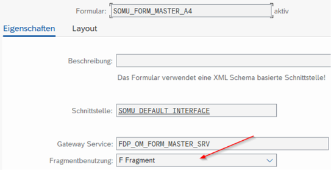

{: .no_toc}
# Formulartechnologien

1. TOC
{:toc}

Im Laufe der Jahre hat SAP verschiedene Formulartechnologien herausgebracht. Inzwischen gibt es drei verschiedene Technologien, welche in S/4HANA verfügbar sind. Dadurch herrscht bei vielen Unternehmen z.T. eine große Mischung was die Verwendung der verschiedenen Formulartechnologien angeht. Dementsprechend müssen die zuständigen Entwickler das entsprechende Knowhow für die verwendeten Formulartechnologien vorhalten.

{: .note }
> Allgemein ist noch auf das Ende der Unterstützungsdauer für die Formulartechnologien SAPscript und SmartForms hinzuweisen, welche im Jahr 2040 liegt (siehe auch die Hinweise 2791338 und 2900377).

## SAPscript (1992 R/3)  

Auch im Jahr 2025 haben sehr viele Unternehmen weiterhin SAPscript Formulare im Einsatz. Häufig sind dies seit Jahren oder z.T. Jahrzehnten bestehende Formulare. Deshalb müssen ABAP Entwickler sich auch weiterhin mit dieser Technologie auskennen um ggf. Anpassungen an den Formularen vornehmen zu können.

Die Übertragung der Daten vom Druckprogramm an das Formular erfolgt per globaler Variablen. Die Variablen müssen exakt gleich im Druckprogramm und im Formular benannt werden, um eine automatische Datenübertragung zu gewährleisten.

Wird ein Formular in anderen Sprachen benötigt, so muss das Formular mit dem selben Namen, aber in der entsprechend anderen Sprache, in der Transaktion SE71 angelegt/gespeichert werden, um die Übersetzung durchführen zu können.

Während der Laufzeit können SAPscript Formulare gedebugged werden. Dafür muss der Debugger in Transaktion SE71 im Menü unter „Hilfsmittel“ als erstes eingeschalten werden. Anschließend wird das Druckprogramm / die Transaktion zum Prozessieren des Formulars ausgeführt.  
Das Debuggen ist relativ unkomfortabel und eigentlich nicht mehr zeitgemäß. Es wird jedes Textelement angesprungen, was z.T. zeitaufwändig ist. Werte von Variablen kann man sich anzeigen lassen in dem der Variablenname ohne „&“ im Debugger eingegeben und mit ENTER bestätigt wird.  

Mittels Funktionsbaustein OPEN_FORM wird das SAPscript Formular aufgerufen.

| Transaktion | Beschreibung |
| --- | --- |
| SE71 | SAPscript Editor |
| SE72 | SAPscript Stil |
| SE78 | Verwaltung Formulargrafiken |
| SO10 | (SAPscript-) Standardtexte |
| TXBA | Verwendungsnachweis Textbausteine |

## SmartForms (2001) 

Im Vergleich zu SAPscript hat SmartForms eine modernere SAP GUI Oberfläche, zur Gestaltung von Formularen. Ab dieser Technologie wurde auch mit einer Schnittstelle zur Datenübertragung zwischen Druckprogramm und Formular gearbeitet. Somit ist jedoch auch eine Möglichkeit mehr da, wo sich evtl. Coding für eine Datenbeschaffung bzw. –steuerung verbergen kann.  

Bei dieser Technologie wurde die Mehrsprachigkeit von SAP besser umgesetzt als im SAPscript. Hier kann mittels Transaktion SE63 übersetzt werden und es muss nicht das komplette Formular in einer neuen Sprache angelegt werden. Des Weiteren wurde eine Anbindung an das SAP Transportwesen integriert. Leider fehlt genauso wie bei SAPscript eine Versionierung der Formularanpassungen im Standard. Dies macht es erforderlich einen manuellen Prozess zu gestalten, mit dem gewährleistet wird auch kurzfristig auf einen älteren Formularstand zurückgehen zu können. Ein Beispiel hierfür wäre, dass anzupassende Formular unter einem neuen Namen (ggf. mit Datumsangabe im Namen) im Entwicklungssystem vor der Änderung in ein lokales Paket zu kopieren und somit diesen letzten im Produktivsystem funktionierenden Stand zu sichern. 

{: .recommendation }
> Stimmen Sie sich bezüglich Vorgehen und Namenskonvention unbedingt in Ihrem Entwicklungsteam ab!  

Der Name des Schnittstellenbausteins wird vom System generiert und unterscheidet sich von SAP System zu SAP System (Entwicklung, Qualitätssicherung, Produktion). Daher ist es nötig den Funktionsbaustein „SSF_FUNCTION_MODULE_NAME“ im Druckprogramm aufzurufen um den tatsächlichen Namen (Importing-Parameter FM_NAME) des generierten Funktionsbausteins zur Laufzeit im jeweiligen SAP System zu ermitteln.  

Möchte man ein SmartForms Formular debuggen setzt man am Besten einen Breakpoint im generierten Schnittstellenfunktionsbaustein. Den Namen des Funktionsbausteins kann man sich über die Transaktion SMARTFORMS im Menü „Umfeld“ anzeigen lassen. Diesen Funktionsbaustein dann z.B. mittels Transaktion SE37 oder SE80 anzeigen und an entsprechender Stelle einen Breakpoint setzen.

Der SAP Standard liefert diverse Testprogramme und Testformulare aus. Diese beginnen mit „SF_\*“.

| Transaktion | Beschreibung |
| --- | --- |
| SMARTFORMS | SmartForms Editor für Formulare und Stile |

## Adobe Forms

### SAP Interactive Forms by Adobe (2005)  

Lassen Sie sich von dem Teil „Interactive“ im Namen nicht täuschen – hierbei handelt es sich sehr wohl um „Druckformulare“ und nicht ausschließlich um interaktive Formulare.  

Das Formularlayout wird mittels LiveCycle Designer (LCD von Adobe) in der Transaktion SFP gestaltet. Der LCD muss dafür im SAP GUI installiert sein. Ebenfalls in der Transaktion SFP wird die Schnittstelle und der Kontext des Formulars angelegt und bearbeitet.

Folgende Funktionalitäten werden bei der Formulargestaltung mit SAP Interactive Forms by Adobe im Vergleich zu SAPscript und SmartForms unterstützt:  

- Grafiken können direkt eingebettet werden  
- Objekte können gedreht werden  
- verschiedene Seitenausrichtungen in einem Formular möglich  
- Grafische Elemente (Falzmarken) möglich  
- Wiederverwendung komplexer Layoutelemente  
- Verwendung von TrueType-Schriftarten möglich  
- Barcodes können auf vielen Druckern gedruckt werden (Postscript, PCL, PDF und Zebra)  
- Barrierefreiheit möglich  
- Drag&Drop Funktion zum Positionieren von Objekten

Adobe Formulare bestehen bzgl. Layout aus verschiedenen Objekten:

- Masterseite:  
    ein oder mehrere Masterseiten sind pro Formular möglich und sind die oberste Ebene eines Formulars um das Formular zu strukturieren. Hier werden Informationen welche sich auf jeder Ausgabeseite wiederholen sollen platziert, ebenso wie die Größe und der Platz des Inhaltsbereichs definiert.  

- Inhaltsbereich:  
    Bereich zur Ausgabe der dynamischen oder statischen Inhalte.  

- Inhaltsseite:  
    enthält die Inhalte, die einem Inhaltsbereich einer Masterseite zugeordnet werden.

Um diese Objekte zu pflegen und zu bearbeiten, muss im Layoutbereich der Transaktion SFP zwischen den Tabreitern „Designansicht“ und „Masterseiten“ gewechselt werden.  
Der Tabreiter „PDF-Vorschau“ ermöglicht eine Vorschau auf das Formularlayout.

{: .note } 
> Wird bei Bearbeiten > Formulareigenschaften > Vorschau eine XFD.xml Datei mit Beispieldaten (welche z.B. aus einem Test- oder Produktivsystem generiert und heruntergeladen wurde) hinterlegt, so werden diese Formularinhalte dann auch in einem Entwicklungssystem unter “PDF-Vorschau” angezeigt. Dies ist äußerst hilfreich um z.B. inhaltsabhängige Formatierungen zu testen o.ä.

 

Vorschau
{: .img-caption}

{: .note } 
> Der LCD lässt Anpassungen im Anzeigenmodus zu. Diese können NICHT gespeichert werden!  
> Vergewissern Sie sich also vor der Arbeit an einem Adobe Formular, dass Sie sich im „Ändern-Modus“ der Transaktion SFP befinden.  

Die Schnittstelle ist ein eigenständiges Objekt mit einem eindeutigen Namen. Sie kann mehrfach verwendet werden und stellt die Zuordnung der Anwendungsdaten, z.B. aus einem Druckprogramm, zum Formular dar.

Aufbau
{: .img-caption}

Folgende Schnittstellentypen stehen zur Verfügung:

- ABAP Dictionary basierte Schnittstelle
- XML Schema basierte Schnittstelle
- Smart Forms kompatible Schnittstelle

Der am häufigsten verwendete Schnittstellentyp ist die „ABAP Dictionary basierte“ Schnittstelle.  
Die Schnittstelle besteht aus drei konkreten Bereichen:

- Formularschnittstelle  
    mit den Unterbereichen: Import, Export, Ausnahmen  

- Globale Definitionen  
    Zur Definition von Variablen um zusätzlich zu Daten der Formularschnittstelle auch andere Daten speichern zu können.  

- Initialisierung  
    Möglichkeit zusätzliche Daten im Formular nachzulesen. Das Coding sollte kurz und knapp gehalten werden. Der Editor hat an dieser Stelle einige Einschränkungen wie z.B. keine Vorwärtsnavigation und kein Pretty-Printer.  
    
{: .recommendation }
> Die Business Logik in eine Klasse auslagern, welche hier aufgerufen wird.  

{: .note }
> Um die Übersichtlichkeit nicht zu verlieren und die Logik des Formulardrucks nicht zu komplex zu machen, sollte vor jeder Implementierung überlegt werden, ob das nötige Coding im aufrufenden Druckprogramm hinterlegt wird oder in der Formularschnittstelle. Die Entscheidung hängt natürlich auch davon ab, ob ein SAP Standarddruckprogramm 
> verwendet wird, oder ein kundeneigenes Druckprogramm.

Wie bei SmartForms wird auch bei Adobe Forms Formularen ein vom SAP System generierter Funktionsbaustein benötigt, um das Formular auszugeben. Da dieser Funktionsbausteinname ebenfalls wie bei SmartForms von System zu System unterschiedlich ist, muss der Funktionsbaustein FP_FUNCTION_MODULE_NAME verwendet werden, um zur Laufzeit den richtigen Namen des Funktionsbausteins zu ermitteln.  
Grundsätzlich hat der generierte Funktionsbaustein die gleichen Import- und Exportparameter wie die Formularschnittstelle (SFP), außerdem sind die Kontextobjekte ebenfalls enthalten.

In das Debugging eines Adobe Formulars kann ebenfalls mittels Breakpoint im generierten Funktionsbaustein eingestiegen werden.  

Adobe Forms Formulare können mittels der Transaktion SFP versioniert werden. Dies kann manuell erfolgen oder wird automatisch durchgeführt, sobald ein Transport vom Entwicklungssystem in ein anderes SAP System erzeugt wird.

Die Übersetzung eines Adobe Formulars kann direkt in der Transaktion SFP durchgeführt werden (Menü: Springen > Übersetzung) oder mittels Transaktion SE63 (Menü: ABAP Objekte > Andere Langtexte > FS Formulare und Stile > PDFB PDF- basierte Formulare).

Der SAP Standard liefert diverse Testprogramme und Testformulare aus. Diese beginnen mit „FP_TEST\*“.

| Transaktion | Beschreibung |
| --- | --- |
| SFP | Adobe Form Builder für Formulare und Formularschnittstellen |

 

### SAP S/4HANA Forms (2015 S/4HANA)  

Grundlage sind Adobe Formulare mit Gateway-Schnittstellen, deren Datenbeschaffung mittels Gateway-Services (also keine klassischen Druckprogramme) erfolgt. Die Pflege erfolgt mit Fiori Apps und somit sind “SAP S/4HANA Forms” public-cloud-fähig.

Das Layout wird ebenfalls mit dem LiveCycle Designer, jedoch als standalone, designed. Hierbei ist zu beachten, das die bearbeiteten Objekte manuell in Transportaufträge aufgenommen werden müssen (mittels Fiori-App ID F1589) und es keine automatische Objektsperre gibt.  

Ebenso wie die “SAP Interactive Forms by Adobe” benötigen die SAP S/4HANA Forms einen Adobe Document Service (ADS -> SAP Forms Service by Adobe).

Zu nennen ist an dieser Stelle, dass kundenindividuelle Bedingungen nur sehr beschränkt abgebildet werden können.

Diese Formulartechnologie ist nur zusammen mit der Ausgabelösung S/4HANA Output Control (siehe Abschnitt XYZ) möglich.

{: .note }   
> - lokale Bearbeitung des Layouts / Formulars -> daher muss sich im Team abgestimmt werden!  
> - keine automatische Transportanbindung -> Bedenken Sie das Sie alle Objekte manuell zusammensuchen und in einen Transport aufnehmen müssen.  

| App ID | Beschreibung |
| --- | --- |
| F1434 | Formularvorlagen pflegen |
| F2894 | Texte verwalten |
| F2761 | Logos verwalten |
| F1589 | Objekte in Transporte aufnehmen |

{: .note }
> Um diese Fiori Apps finden zu können muss die Katalog-ID SAP_BASIS_TCR_T dem angemeldeten Benutzer über eine Rolle zugewiesen werden (Transaktion PFCG).

Transaktion PFCG
{: .img-caption}

Zuordnung Katalog
{: .img-caption}

Zuordnung Benutzer
{: .img-caption}

Adobe Fragments

Es handelt sich hierbei um die Wiederverwendung von Masterformularvorlagen. Dadurch lassen sich Ausgaben aus unterschiedlichen Teilen zusammensetzen. Es wird zwischen den folgenden zwei Teilen unterschieden:

- Masterformular  
    Kopf- und Fußbereich  
    Findung durch Customizing in Abhängigkeit von Organisationsebenen wie z.B. Buchungskreis  

- Inhaltsformular  
    z.B. Rechnung oder Bestellung  
    Findung durch BRF+ in Abhängigkeit zur Ausgabeart (z.B. Bestellung)

Wichtige Fragmente sind z.B:

- SOMU_FORM_MASTER_A4
- SOMU_FORM_MASTER_LETTER

Darstellung im SAP-GUI
{: .img-caption}

Darstellung in Fiori
{: .img-caption}

Adobe Fragments sind nur im Zusammenhang mit Output Control nutzbar
{: .img-caption}

## Fazit

SAP empfiehlt für neue Formulare grundsätzlich SAP Interactive Forms by Adobe zu verwenden.
Dies ist zukunftssicher, da SAPscript und SmartForms von SAP selbst nicht mehr weiterentwickelt werden.

Unternehmen, welche bereits viele Smart Forms Formulare im Einsatz haben, wird empfohlen diese weiterzuverwenden, jedoch neue Entwicklungen mit SAP Interactive Forms by Adobe umzusetzen.

Die Entscheidung welche Techologie verwendet wird, um Neuentwicklungen im Bereich Formulare umzusetzen, sollte nicht davon abhängig gemacht werden welche die vorherschende Techologie bei den Bestandsformularen ist. Allen voran ist es wichtig die Wartbarkeit und Zukunftssicherheit im Blick zu haben und wie sich Ihr Unternehmen zukünftig bzgl. Systemlandschaft und Technologie strategisch weiter ausrichten möchte.

Schaut man sich die bestehenden Systemlandschaften an, so ergibt sich folgende Empfehlung.

| Systemlandschaft | Empfohlene Technologie |
| --- | --- |
| SAP ECC / S/4HANA On-Premise | SAP Interactive Forms by Adobe |
| S/4HANA Cloud (Public / Private Edition) | SAP Interactive Forms by Adobe / SAP S/4HANA Forms (Cloud-Integration) |
| Legacy-System mit vielen Smart Forms | Smart Forms weiterverwenden, neue Entwicklungen mit SAP Interactive Forms by Adobe umsetzen |
| Legacy-System mit vielen SAPscript | SAPscript weiterverwenden, neue Entwicklungen mit SAP Interactive Forms by Adobe umsetzen |
