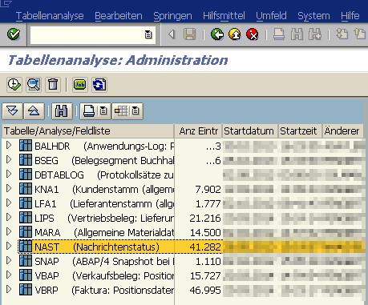
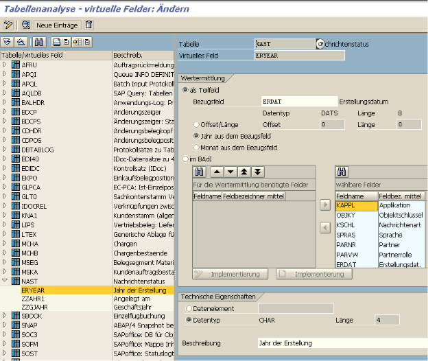

{: .no_toc}
# Ausgabelösungen

1. TOC
{:toc}

Im Folgenden erhalten Sie einen Überblick über die möglichen Ausgabelösungen.

## Nachrichtensteuerung (NAST)  
Mit der Nachrichtensteuerung werden verschiedene Ausgabearten wie Drucken, E-Mail, EDI, Workflows, Systemintegration (ALE) und Sonderfunktionen im SAP pro Nachricht zu diversen Modulen (z.B. SD und MM) gecustomized. Über die sogenannte Konditionstechnik wird die produktive Ausgabe von Formularen und Etiketten gesteuert. Hinter einer Nachricht liegt die Zuordnung des Druckprogramms und des Formulars, welche angestoßen werden, wenn eine Nachricht erzeugt wird.  

Die Transaktion NACE dient als zentraler Einstiegspunkt zur Pflege der Nachrichtenfindung pro Applikation. Die dort gepflegten Einstellungen werden in der Datenbanktabelle TNAPR gespeichert.  
    
_Hinweis:_  
Eine Auswertung aller erzeugten Nachrichten kann über die Transaktion TAANA für die Datenbanktabelle NAST erstellt werden. Hierfür muss diese Transaktion im Produktivsystem ausgeführt werden. Um die Auswertung Jahresweise durchzuführen muss vorher ggf.noch ein neues „virtuelles Feld“ (ERYEAR) hinzugefügt werden. Die Ergebnisliste kann als Excel-Tabelle heruntergeladen werden und dort für eine leichtere Auswertung zur Pivot-Tabelle umgestellt werden.

{: .Recommendation-title }
> Empfehlung
>
> Eine solche Auswertung empfiehlt sich, um sich einen Überblick zu verschaffen, welche Nachrichtenarten überhaupt und hauptsächlich verwendet werden. In welchen Sprachen 
> werden meine Belege (Formulare) ausgegeben und wie groß ist das jeweilige Volumen. Dies hilft bei einer weiteren Planung von Umstellungs- und Go-Live Szenarien.  

Eine genaue Anleitung zur Nutzung der Transaktion TAANA finden Sie unter folgendem Link als [YouTube](https://youtu.be/HsHHBt5znOE) Video.

Pflege der Tabelle
{: .img-caption}

Pflege der Felder
{: .img-caption}

## Post Processing Framework (PPF)

Das PPF dient der Automatisierung von bestimmten Aktionen in der Lieferabwicklung zur Ausgabe von Dokumenten von Belegen per Drucker oder per E-Mail. Verwendung findet es z.B. im eWM und TM. Die Pflege erfolgt über die Transaktion SPPFCADM.  

## Druck-Workbench

Die Ausgabe von Dokumenten erfolgt über die Definition von Korrespondenzarten. Verwendet wird sie vor allem als Branchenlösung im IS-U Bereich (Energieversorger), ist aber auch außerhalb von IS-U grundsätzlich verfügbar. In der Druck-Workbench wird die Datenversorgung eines Anwendungsformulars gekapselt. Es können zur Datenermittlung SAP Standard Objekte oder kundeneigene Objekte verwendet und hinterlegt werden. Mittels Transaktion EFRM werden die relevanten Einstelllungen vorgenommen werden.  

## Applikationsspezifische Lösungen

Applikationsspezifisches Customizing bestimmt die Ausgabe von Dokumenten. Diese Art der Ausgabelösung wird z.B. im FI, PP und QM verwendet. Im FI zum Beispiel wird die Findung des Mahnformulars abhängig von der Mahnstufe durchgeführt.  

## S/4HANA Output Control  

Mit SAP S/4HANA bietet SAP eine weitere Ausgabelösung mit dem Namen „SAP S/4HANA Output Management“ an. Diese beinhaltet den wiederverwendbaren Service „SAP S/4HANA Output Control“, welcher für viele komplexe Ausgabeszenarien verwendet werden kann. Auf Ebene von Organisationseinheiten kann die Findung von Masterformularvorlagen, Logos und allgemeine Kopf- und Fußtexte gecustomized werden. Mit dieser Ausgabelösung können sogenannte „Adobe Fragments“ verwendet werden. Siehe hierzu den entsprechenden Abschnitt. Im Vergleich zur Nachrichtensteuerung (NAST) haben Sie mit der Output Control die Einschränkung, dass keine Workflows und Sonderfunktionen hinterlegt werden können.  

Output Szenarien
{: .img-caption}

{: .warning } 
> In diesem Zusammenhang wird oft BRFplus (oder BRF+) als Ausgabelösung genannt. Dies ist falsch. BRFplus ist _eine optionale Möglichkeit_ um eine Konfiguration für die 
> Dokumentenausgabe zu hinterlegen (= ein Regelwerk, ähnlich der Konditionstechnik NAST).  

Die Einstellungen im S/4HANA Output Control erfolgt in der GUI über den folgenden Pfad:  
Transaktion SPRO > Anwendungsübergreifende Komponenten > Ausgabesteuerung  

{: .note-title }
> Hinweis
>  
> Unter Hinweis [2791338](https://me.sap.com/notes/2791338/E) finden sich FAQs zum Thema Ausgabesteuerung.