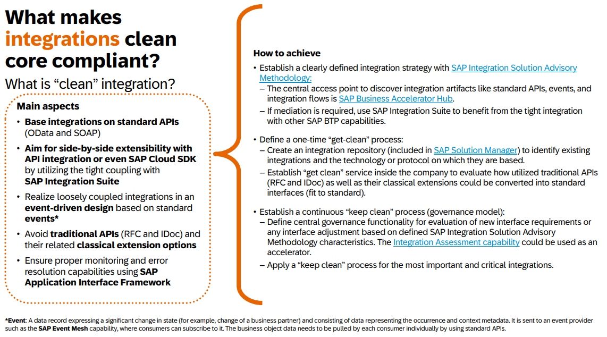

{: .no_toc}

# Integration

1. TOC
{:toc}

Die Integration von SAP Systemen, und auch Non-SAP Systemen, würde an sich den Rahmen dieses Leitfadens sprengen. Daher finden Sie hier vor allem aktuell genutzte Technologien und eine ungefähre Richtung, welche Technologien die nächsten Jahre bestehen werden. Dabei sollten Sie immer im Hinterkopf behalten, dass auch das Thema Middleware eine wichtige Rolle beim Verteilen von Daten und dem Monitoring spielt. Siehe auch Rubrik [Kapitel Clean Core](/ABAP-Leitfaden//clean-core//what-is-clean-core/) 

Zusätzlich sollten Sie beachten, dass mit der zunehmenden Migration von SAP-Systemen in die Cloud, nicht-funktionale Anforderungen (NFRs) wie Verfügbarkeit, Sicherheit, Skalierbarkeit und Beobachtbarkeit (Englisch: observability) von Anfang an zu berücksichtigen. Diese Aspekte sind in On-Premise-Umgebungen oft selbstverständlich, müssen aber in der Cloud neu durchdacht und aktiv integriert werden. Eine unzureichende Planung kann zu hohen Kosten für Nachbesserungen führen, insbesondere wenn ein System erst bei steigender Nutzerzahl oder im Ernstfall seine Grenzen aufzeigt. [Siehe Artikel "The Seven Reasons Your SAP Tech Initiatives Are Failing"](https://secondphase.com.au/seven-reasons-sap-tech-failing/)

### Business Accelerator Hub

Der [Business Accelerator Hub](https://api.sap.com/) von SAP stellt standardisierte Dokumentationen zu allen Arten von Schnittstellen zur Verfügung. Möchten Sie mehr über die verfügbaren Standard Schnittstellen zu Ihrem SAP Produkt erfahren, sollten Sie zuerst einmal hier die Möglichkeiten prüfen. Die Suche nach Produkt, Technologie und Modul vereinfacht das Finden der richtigen Schnittstellen.

## Technologie

In diesem Abschnitt geht es um verschiedene Schnittstellentechnologien und Sie erhalten hier einen groben Überblick über die gängigen Technologien.

### IDoc

Intermediate Document, kurz IDoc, ist ein Datenaustauschformat von SAP, um verschiedene Systeme miteinander zu integrieren. Die Daten können dabei ins System geladen oder daraus exportiert werden. Die meisten IDocs werden auf Positionsbasis erstellt, das heißt der gesamte Datensatz steht auf einer Zeile und es wird per Identifikation (meist der erste Teil der Zeile) das Format für die Daten abgeleitet. In aktuelleren Systemen gibt es auch IDocs im XML Format.

### RFC

Remote Function Call, kurz RFC, ist die Verwendung von klassischen Funktionsbausteinen zur Kommunikation über Systemgrenzen hinweg. Dabei können sogenannte Destionations verwendet werden, um einen Funktionsbaustein in einem anderen System aufzurufen.

Der Aufruf von Funktionsbausteinen von Non-SAP-Systemen ist ebenfalls möglich, dafür gibt es für die verschiedenen Programmiersprachen Adapter, die meist durch SAP zur Verfügung gestellt werden. Dazu finden Sie hier einige Beispiele:

- [JCo](https://support.sap.com/en/product/connectors/jco.html) (Java)
- [SAP Connector for Microsoft .NET](https://support.sap.com/en/product/connectors/msnet.html)
- [SAP Cloud SDK](https://sap.github.io/cloud-sdk/docs/java/features/bapi-and-rfc/overview) (Java)
- [@sap/cds-rfc](https://www.npmjs.com/package/@sap/cds-rfc) (Node.js für CAP)

### SOAP

Simple Object Access Protocol, kurz SOAP, ist ein standardisiertes Schnittstellenformat zum Austausch von XML Nachrichten zwischen verschiedenen Systemen. Die Technologie wird auch außerhalb der SAP Welt für Schnittstellen genutzt. Das Format der Payload beschränkt sich nicht auf XML, sondern es können auch CSV oder BASE64 Daten verwendet werden (muss noch geprüft werden).

### OData

Das Open Data Protocol, kurz OData, ist ein standardisiertes Protokoll für HTTP Kommunikation. Darin werden Standards beschrieben, wie Anfragen und Antworten von Schnittstellen zur Verfügung gestellt wird und wie Integration in das HTTP Protokoll aussieht. Die Kommunikation kann im Format XML, aber auch JSON, erfolgen. OData ist mittlerweile der Standard zum Aufbau von UI und API Schnittstellen im SAP System. Die aktuell verfügbare Version ist "OData v4" und ermöglicht gegenüber "OData v2" weitere Möglichkeiten zur Integration von Anwendungen.

### HTTP

Grundsätzlich können alle Schnittstellen die über Hypertext Transfer Protocol, kurz HTTP, verfügen, auch über SAP und per HTTP Client konsumiert werden. Meist beschränkt sich die Implementierung allerdings auf eine Individualentwicklung und Sie sollten vorher prüfen, ob es nicht Standardaustauschformate wie OData oder SOAP gibt.

### Event

Die aktuelle Integration können Sie mit Events schaffen. Dabei wird zu definierten Zeitpunkten im Standard- oder Kundenprozess ein Event erzeugt, welches in einer Queue (bspw. über SAP Event Mesh) zur Verfügung gestellt wird. Auf die Queue können sich interessierte Anwendungen und Prozesse registrieren, die dann über neue Events benachrichtigt werden. Ein Event ist meist eine einfache Nachricht mit dem auslösenden Event, dem Schlüssel des Objekts und einer Payload.

## Clean Core

Welche Technologien sind bei der Umstellung auf Clean Core eigentlich noch relevant und welche sollten Sie am besten schon heute vermeiden? In diesem Abschnitt erfahren Sie mehr über die empfohlenen Technologien beim Aufbau oder der Migration zu Clean Core. Im SAP Leitfaden "[Supporting Business Transformation with a Cloud ERP Clean Core Strategy](https://www.sap.com/germany/index.html)" finden Sie Hinweise dazu.

Empfehlung zu Clean Core Integration
{: .img-caption}

Dazu erhalten Sie hier die Übersicht der oben genannten Technologien unterteilt in die Bereiche zum Weiterführen und zum Vermeiden. Die Verteilung ergibt sich aus den Empfehlungen des Leitfadens.

| Verwenden   | Vermeiden |
| ----------- | --------- |
| OData       | RFC       |
| SOAP        | IDoc      |
| Events      |           |
| HTTP (REST) |           |

## Empfehlungen für Grenzfälle

Bei der Integration von SAP-Systemen gibt es Grenzfälle, in denen nicht alle standardisierten SAP-Integrationsarten optimal genutzt werden können. In solchen Szenarien ist es essenziell, eine sorgfältige Abgrenzung zu anderen SAP- sowie Non-SAP-Tools vorzunehmen.

### Berücksichtigung zukünftiger Entwicklungen

SAP entwickelt seine Integrationslösungen kontinuierlich weiter. Daher sollte stets geprüft werden, welche Technologien zukünftig an Bedeutung gewinnen und welche möglicherweise durch neuere Lösungen ersetzt werden. Eine zukunftsorientierte Planung hilft, technologische Sackgassen zu vermeiden und die Integration langfristig stabil und nachhaltig zu gestalten. 

### Bestand alter Technologien

Obwohl SAP kontinuierlich neue Integrationslösungen bereitstellt, sind einige ältere Technologien weiterhin wertvoll und können noch nicht vollständig abgelöst werden. Daher ist es wichtig, bestehende Lösungen nicht vorschnell außer Betrieb zu nehmen, sondern ihre Relevanz im jeweiligen Unternehmenskontext zu bewerten. Beispielsweise sind **IDoc** und **RFC** in vielen Legacy-Systemen tief verankert und bieten weiterhin zuverlässige Kommunikationsmöglichkeiten.

### Nachhaltige Architektur und Clean-Core-Strategie

Die Gestaltung einer nachhaltigen Architektur sollte unter Berücksichtigung der **Clean-Core-Strategie** erfolgen. Die Public Cloud dient hier oft als Vorbild für Musterintegrationen, die sich durch hohe Standardisierung und Wartungsfreundlichkeit auszeichnen. Ziel ist es, den individuellen Code-Anteil gering zu halten und Standardlösungen zu bevorzugen.

### Wichtige Entscheidungsfaktoren bei Grenzfällen

- **Kosten:** Der finanzielle Aufwand für Entwicklung(sressourcen), Betrieb, Lizenzen und Wartung muss gegen den Nutzen abgewogen werden.
- **Features:** Prüfen, ob bestehende Integrationslösungen alle benötigten Funktionen abdecken oder Anpassungen erforderlich sind.
- **Vendor Lock-In:** Abhängigkeiten von bestimmten SAP- oder Drittanbieter-Technologien sollten kritisch betrachtet werden.
- **Monitoring:** Eine effektive Überwachung der Integration ist essenziell, um Probleme frühzeitig zu erkennen und zu beheben. Für den Fall von Systemausfällen sind Reprozessierung-szenarien vorzusehen.

### Beispiel: Massendatentransferierung 

#### EDI (Electronic Data Interchange) im S/4HANA

(Web) APIs basierend auf REST oder SOAP haben ihre Grenzen. Dafür sollten anderen Technologien eingesetzt werden. Beispielsweise SAP EDI ist für die Verarbeitung großer Mengen elektronischer Daten konzipiert für 100.000+ Nachrichten pro Tag – und erfolgt mit zahlreichen B2B-Partnern unter Verwendung standardisierter Formate wie EDIFACT.

Im direkten Vergleich wird schnell klar, warum IDocs für SAP EDI die bessere Wahl sind: Sie sind asynchron, für Massendaten ausgelegt und bieten vordefinierte Validierungen sowie robuste Monitoring- und Reprocessing-Mechanismen. APIs hingegen sind **meistens** synchron, verarbeiten Nachrichten einzeln und erfordern zusätzlichen Aufwand für Fehlerbehandlung und Mappings. In Hochlast-Szenarien kann eine API-basierte EDI-Integration daher erhebliche Performance-Probleme und hohe Betriebskosten verursachen.

#### Weitere Lösungswege für Massendatentranferierung

- [SAP Landscape Transformation Replication Server](https://www.sap.com/germany/products/technology-platform/landscape-replication-server.html), ABAP und NetWeaver basiert 
- [SAP HANA Smart Data Integration (SDI)](https://help.sap.com/docs/SUPPORT_CONTENT/hanasdi/4740563873.html?mt=de-DE), SAP HANA Datenbank basiert
- [Master Data Governance (MDG)](https://www.sap.com/documents/2015/07/3a2f4c59-5b7c-0010-82c7-eda71af511fa.html), basiert auf den Data Repliaction Framework im ERP

## Cloud Connector

Sind Sie im Bereich der Business Technology Platform (BTP) unterwegs, benötigen sie auch einen Cloud Connector in ihrer Infrastruktur, um eine Verbindung von der Cloud nach On-Premise aufbauen zu können. Der Cloud Connector fungiert als Gateway und Proxy und routet den Netzwerkverkehr aus dem Internet zu den richtigen Systemen in ihrer Landschaft hinter der Firewall.

### Aufbau

Beim Aufbau Ihrer Cloud Connector Landschaft sollten Sie auf die Trennung der Systemschienen achten, da in Produktion meist die strikteren Regeln für Zugriffe auf Ressourcen gelten. In diesem Fall werden mindestens zwei Instanzen vorgeschlagen, einmal für DEV/TEST und eine für PROD. Je nach laufenden Prozessen und Wichtigkeit, sollten Sie über eine entsprechende ausfallsichere Struktur nachdenken (Hochverfügbarkeit).

### Protokolle

Aktuell gibt es zwei Protokolle, die in den meisten Anwendungsfällen und Zugriffen verwendet werden.

- HTTP - Führend ist hierbei das Protokoll OData und SOAP, es ist aber auch Plain HTTP möglich, um Daten und Systeme in On-Premise anzusprechen.
- RFC - RFC-fähige Funktionsbausteine können ebenfalls konsumiert werden, auch wenn sie nicht mehr die strategische Zielrichtung der SAP sind, so stehen damit viele Funktionen des Systems zur Verfügung, ohne Clean Core zu verletzen.

Die Freigabe der Ressourcen erfolgt in den jeweilig konfigurierten Systemen im Cloud Connector. Bei HTTP werden entsprechende Pfade/URLs freigegeben, bei RFC die entsprechenden Funktionsbausteine. In Produktion empfiehlt sich eine explizite Freigabe von Ressourcen und die Vermeidung von Wildcards (*).

### Erweiterungen

Erstellen Sie Erweiterungen in der BTP, dann tun sie das normalerweise mit CAP (Cloud Application Programming Model) oder RAP (ABAP RESTful Application Programming Model). Damit Sie dann auf Daten zugreifen können, benötigen Sie einen konfigurierten Cloud Connector an dem Sub-Account. Die Konfiguration ist nicht Teil dieses Leitfadens, da er meist durch Ihre SAP Basis durchgeführt wird. 

In den meisten Fällen werden sie im Destination Service der BTP die Verbindung zum On-Premise System konfigurieren. Verwenden Sie das SAP BTP ABAP Environment um Ihre Erweiterungen zu erstellen, dann können Sie diese auch im System als Communication Arrangements und Communication Systems abbilden und benötigen die Konfiguration im Destination Service nicht. Wollen Sie allerdings Standard-Fiori Anwendungen erweitern, benötigen Sie einen Zugriff über den Sub-Account, um auf Ihre Systeme Zugriff zu erhalten.

### Zugriffsrichtung

Bisher hatten Sie vor allem von Zugriffen aus dem Internet oder der BTP Richtung On-Premise gelesen. Der Cloud Connector kann aber auch als Proxy genutzt werden, um von einem On-Premise System auf ein Cloud System zu routen und die direkte Anbindung des Cloud Systems zu vermeiden. Das ABAP Test Cockpit auf dem ABAP Environment ist zum Beispiel so ein Fall.