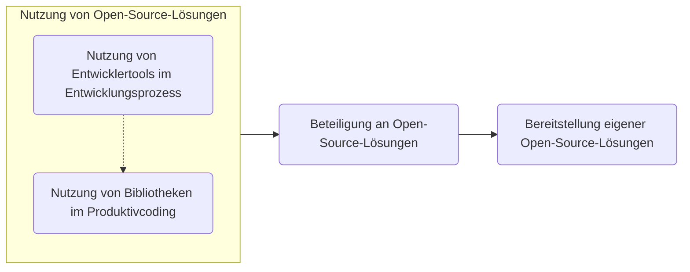

{: .no_toc}

# Open Source

1. TOC
{:toc}

## Einleitung

Open Source hat es in der ABAP-Entwicklung besonders schwer Fuß zu fassen. Immer noch halten sich Einwände, dass der Einsatz von frei verfügbarer Software in den geschäftskritischen SAP-Systemen mit den Unternehmensdaten gar nicht möglich oder zu rechtfertigen sei. Dabei gibt es für viele der berechtigten Einwände Lösungen, um die _Risiken_ zu minimieren und die _Chancen_, die Open-Source-Software bietet, nutzen zu können. In anderen Programmierumfeldern überwiegen die Chancen bereits lange gegenüber den Restrisiken und es wurden Prozesse und Tools geschaffen, um Open-Source-Bestandteile effektiv in den eigenen Entwicklungsprozess zu integrieren. Dieses Kapitel soll einen Überblick über den aktuellen Stand von Open Source in der ABAP-Entwicklung geben sowie Prozesse und Tools vorstellen, um...

1. ...Open-Source-Projekte in die eigenen Lösungen zu integrieren ([Einsatz von Open Source](using-open-source))
2. ...an Open-Source-Projekten mitzuwirken ([Beteiligung an Open Source](contributing-to-open-source))
3. ...eigene Lösungen als Open-Source-Projekt bereitzustellen ([Entwicklung von Open Source](developing-open-source)).

Eine _Open-Source-Strategie_ muss jedes Unternehmen für sich selbst erschließen. Hier finden Sie eine Arbeitsgrundlage und Erfahrungsberichte.

## Was ist Open Source?

Open Source Software (OSS) ist Software, welche unter einer [_Open-Source-Lizenz_](#lizenzen) bereitgestellt wird. In allen drei zuvor genannten Anwendungsfällen ist die Lizenz maßgeblich für die Nutzung, die Modifikation und die Weiterverbreitung des bereitgestellten Codings. Zudem muss dieses _frei verfügbar_ sein, also nicht nur einer bestimmten Gruppe an Personen bereitgestellt werden. Dies ermöglicht es zum Beispiel den Quellcode einer Anwendung vor dem Einsatz zu prüfen und die Binärdateien zur Ausführung selbst zu erzeugen, anstatt darauf zu vertrauen, dass die bereitgestellten Dateien auch zu dem Quellcode gehören. Bugs können im Zweifel selbst behoben werden, statt auf den Softwareanbieter warten zu müssen oder angewiesen zu sein. Zusatzfunktionalität und Integrationen können selbst entwickelt und anderen Nutzern bereitgestellt werden. Versprochene Features wie Ende-zu-Ende-Verschlüsselung und deaktivierte Telemetrie können selbst überprüft werden.

{: .note }
SAP S/4HANA ist nicht "Open Source" nur weil Sie als Entwickler den von der SAP geschriebenen Quellcode lesen können. Open Source ist viel mehr als die bloße Bereitstellung des Codings gegenüber dem Kunden und thematisiert die freie Nutzung, Modifikation und Weiterverbreitung ohne in einem Kundenverhältnis mit dem Softwareanbieter zu stehen.

## Motivation und Chancen

Warum sollten Sie sich mit Open Source in der ABAP-Entwicklung beschäftigen? Langsam aber stetig steigt die Anzahl an Szenarien, in denen Ihnen Open Source, und _auch_ Open-Source-ABAP im Alltag begegnet, statt, dass Sie danach selbst aktiv suchen müssen. Die Anzahl an in der Open Source Community verfügbaren ABAP-Projekten wächst - auf [dotabap.org](https://dotabap.org) werden zum Zeitpunkt der Erstellung dieses Kapitels 290 Projekte gelistet. Die SAP selbst veröffentlicht Software als Open-Source-Projekte, wie zum Beispiel [Code Pal for ABAP](https://github.com/SAP/code-pal-for-abap-cloud) oder auch den [RAP Generator](https://github.com/SAP-samples/cloud-abap-rap) und diverse Tutorials oder Lerninhalte, wie zum Beispiel [RAP100](https://github.com/SAP-samples/abap-platform-rap100) oder [Fiori Elements Feature Showcase for RAP](https://github.com/SAP-samples/abap-platform-fiori-feature-showcase). Sich dem kategorisch zu verschließen führt zunehmend mehr zu verpassten Chancen in...

1. __...der Optimierung der eigenen Entwicklungsprozesse__
    1. Mit Tools wie [ABAP Cleaner](https://github.com/SAP/abap-cleaner), [Code Pal for ABAP](https://github.com/SAP/code-pal-for-abap-cloud) und [abapOpenChecks](https://github.com/larshp/abapOpenChecks) können Sie Entwickler entlasten bei der Umsetzung von Entwicklungsrichtlinien und Best Practices, in dem diese teilweise automatisiert umgesetzt und in anderen Teilen statisch geprüft und Entwickler aktiv auf Findings hingewiesen werden. Und das weit über den Umfang der im SAP-Standard ausgelieferten Möglichkeiten hinaus (ABAP Formatter / Pretty Printer, ABAP Test Cockpit).  
    2. Mit [abapGit](https://abapgit.org/) bietet sich Ihnen die Möglichkeit Ihre Entwicklungsprozesse _Technologie-übergreifend_ mit einheitlichem Tooling zu harmonisieren und Ihre gesamte Unternehmenscodebase in _einer_ Single Source of Truth zu verwalten, statt ABAP als special Snowflake mit Sonderregeln zu betrachten. Sie können Code Reviews mit dafür ausgelegtem Tooling durchführen. Sie können angefangene Änderungen automatisiert zurücknehmen, wenn sie der Fachbereich nach Entwicklungszeit doch nicht mehr haben möchte ohne große manuelle Rückbauaufwände. Und das alles sogar bei Systemen ab SAP Basis 7.02.
    3. Mit Hilfe von [abaplint](https://abaplint.org/) können Sie außerhalb eines SAP-Systems ABAP Coding prüfen, entwickeln und mit dem Transpiler sogar [ausführen](https://transpiler.abaplint.org/). Sie können so Continuous Integration Pipelines aufsetzen ohne dafür spezielle SAP-Systeme aufsetzen zu müssen und statische Codeanalyse und Unit Tests ausführen (mit Einschränkungen im Vergleich zu "nativer" Ausführung in ABAP-Systemen).  
    4. Über Generatoren wie den [RAP Generator](https://github.com/SAP-samples/cloud-abap-rap) oder [ABAP OpenAPI Generator](https://github.com/abap-openapi/abap-openapi) können Sie Boilerplate-Coding generieren und müssen dieses anschließend nur anpassen. So lassen sich Entwicklungsaufwände sparen und insbesondere auch schnell Prototypen aufsetzen.

2. __...der Umsetzung von betriebswirtschaftlichen Anforderungen__
    1. Mit [abap2xlsx](https://github.com/abap2xlsx/abap2xlsx) können Sie die kreativen Anforderungen der Fachbereiche zur Erstellung, zum Auslesen und zur Änderung von Excel-Dateien umsetzen. Und das schon ab SAP Basis 7.31. Sie müssen so nicht Ihre Prozesse anpassen, weil die OLE-basierte SAP API für Excel-Mappen keine Hintergrundjobs unterstützt und ein installiertes Microsoft Office beim Anwender erwartet. Sie müssen insbesondere auch nicht den Entwicklungsaufwand investieren selbst eine Codebase zu implementieren und zu warten, die sich um die Konvertierung und den Umgang mit Excel-Dateien befasst. Und Sie müssen auch nicht in Anbetracht des Implementierungsaufwands die Anforderung als nicht verhältnismäßig umsetzbar abweisen sondern können auf der Arbeit aufsetzen, die andere sich bereits gemacht haben.
    2. Ähnlich verhält es sich bei anderen technischen Problemstellungen, zu denen es bereits etablierte Open-Source-Lösungen gibt. Beispielsweise [ABAP Logger](https://github.com/ABAP-Logger/ABAP-Logger) anstelle eigener Wrapper-Klassen um die Funktionsbausteine des Business Application Log. Oder [ajson](https://github.com/sbcgua/ajson) als JSON-Bibliothek für SAP Basis ab 7.02.

3. __...der Außendarstellung__
    1. Sie können bewerten, ob wiederverwendbare Komponenten Ihrer ABAP-basierten Lösungen nicht auch als Open-Source-Projekt Sinn machen würden. Coding, welches nicht in Konkurrenz Ihr Geschäftsmodell umsetzt, sondern die Optimierung des Entwicklungsprozesses oder übergreifenden Themen wie der User Experience, Revisionssicherheit oder ähnlichem dient, könnte auch von anderen Unternehmen genutzt werden. Wenn Sie diese Komponenten als frei verfügbare Software publizieren, ermöglichen Sie externe Beteiligungen an der Entwicklung von denen Sie profitieren können.  
    Zusätzlich kann dies als Aushängeschild im Recruiting neuer Entwickler dienen. Diese sehen direkt, dass Sie modern entwickeln und sich nicht scheuen den Quellcode nach außen zu zeigen.  
    Beispiele: [IBM](https://github.com/IBM?q=&type=all&language=abap&sort=), [Microsoft](https://github.com/microsoft?q=&type=all&language=abap&sort=), [rku.it](https://github.com/rku-it-GmbH?q=&type=all&language=abap&sort=), [Schwarz IT](https://github.com/SchwarzIT?q=&type=all&language=abap&sort=)
    2. Wenn Ihr Unternehmen Dienstleistungen zur Verfügung stellt, die über Schnittstellen mit Partnern/Kunden umgesetzt werden, welche diese auch in Ihren SAP-Systemen mittels ABAP implementieren, können Sie eine Open Source SDK bereitstellen, welche Ihre API implementiert. Die Nutzer der SDK haben direkt eine Möglichkeit Issues zu öffnen oder ergänzende Features selbst per Pull Request vorzuschlagen und ihren Implementierungsaufwand erheblich zu verringern. Sie können intern die SDK selbst einsetzen oder für Integrationstests verwenden.
    Beispiele: [ABAP SDK für Azure](https://github.com/microsoft/ABAP-SDK-for-Azure), [ABAP SDK für Google Cloud](https://cloud.google.com/solutions/sap/docs/abap-sdk/overview), [AWS SDK für SAP ABAP](https://aws.amazon.com/sdk-for-sap-abap/), [Microsoft AI SDK für ABAP](https://github.com/microsoft/aisdkforsapabap), [ABAP SDK for IBM watsonx](https://github.com/IBM/abap-sdk-nwas-x)

4. __...im Upskilling von Entwicklern__
    1. Durch die Auseinandersetzung mit externen Bibliotheken und deren Implementierung können Sie Ihre Kenntnisse erweitern mit Blick auf objektorientiertes Design und Softwarearchitektur. Sie können mit neuen Technologien oder Ansätzen vertraut werden und das direkt mit produktivem Quellcode, statt Demobeispielen. Dieser Effekt verstärkt sich insbesondere bei der Beteiligung durch eigene Features oder Bugfixes und Code Reviews.

{: .highlight }
Sie sehen es gibt viele Stellen an denen Open Source, _auch in der ABAP-Entwicklung_, einen erheblichen Mehrwert liefern kann. Eine Auseinandersetzung mit dem Thema lohnt sich daher in jedem Fall.

## Erschwerte Rahmenbedingungen und Risiken

ABAP hat es durch einige Rahmenbedingungen besonders schwer im Open-Source-Umfeld Fuß zu fassen.

### Quellcode in der Datenbank

Der Quellcode von quelltextbasierten Entwicklungsobjekten ist in der Tabelle `REPOSRC` der Primärdatenbank des SAP-Systems abgelegt. Metadaten und nicht-quelltextbasierte Entwicklungsobjekte finden sich in einem relationalen Modell in der Datenbank wieder. Dies ist aus Sicht anderer Programmiersprachen unüblich. Standard-Tooling, welches in der Open-Source-Entwicklung eingesetzt wird erwartet die Verwaltung der Quelltexte in einem Dateisystem mit Hilfe von Dateien und Ordnern und ist somit zunächst inkompatibel mit der ABAP-Entwicklung.

{: .solution }
Mit [abapGit](https://abapgit.org/) lassen sich die Datenbanktabelleninhalte und das relationale Modell in Dateien und Ordner serialisieren. Zusätzlich ist der Weg zurück von Dateien und Ordnern in das Modell des SAP-Systems über die Deserialisierung möglich. Somit bietet abapGit eine Schnittstelle zwischen den Formaten und enabled die Nutzung von Dateisystem-basierten Tools.

### Eingebaute Versionsverwaltung ungeeignet für Open Source

Zentraler Dreh- und Angelpunkt in der Open-Source-Entwicklung ist das Versionsverwaltungssystem. Es ermöglicht die Beschaffung, den Austausch und das gemeinsame Arbeiten am Projekt ohne ein zentrales Entwicklungssystem. Die in der ABAP-Plattform eingebaute Versionsverwaltung ist in dem Kontext ungeeignet. Ihr Schwerpunkt ist die revisionssichere Nachverfolgung von Änderungen, nicht der Austausch über das System hinaus. Das Transportwesem mit seinem proprietären binären Austauschformat ist ebenfalls ungeeignet.

{: .solution }
Mit [abapGit](https://abapgit.org/) lassen sich in allen ABAP-Laufzeitumgebungen die Entwicklungsobjekte mit der defacto-Standard-Versionsverwaltung git versionieren und austauschen. Dabei wird eine breite Massen an Objekttypen [unterstützt](https://docs.abapgit.org/user-guide/reference/supported.html). Im Unternehmenskontext kann abapGit ergänzend zur eingebauten Versionsverwaltung und zum klassischen Transportwesen eingesetzt werden.

### Proprietäre Programmiersprache

ABAP ist proprietär. Es gibt keine frei verfügbare Spezifikation der Programmiersprache. Dies schränkt die Entwicklung von Tooling ein, welches im Open-Source-Umfeld benötigt wird. Denn ohne Spezifikation und ohne Compiler außerhalb eines SAP-Systems lassen sich schwierig Continuous-Integration-Maßnahmen in die Entwicklung integrieren. SAP-Systeme lassen sich nicht in den Prozess einbauen, da lizenztechnisch eine Nutzung eines Systems von unbekannten Usern nicht erlaubt ist (TODO Quelle?). In der Open-Source-Entwicklung ist aber ja genau das das Ziel.

{: .solution }
Trotz mangelnden Informationen seitens der SAP haben sich Entwickler in der Open-Source-Community die Mühe gemacht Tooling zu entwickeln. An dieser Stelle ist insbesondere [abaplint](https://abaplint.org/) hervorzuheben. Das Tool ist in der Lage die syntaktische Korrektheit und diverse Code-Style und CI-Prüfungen durchzuführen, ganz ohne SAP-System. Darüber hinaus kann es sogar ABAP-Coding ausführen, indem es dieses nach Javascript transpiliert. Somit lassen sich Unit-Tests in einer CI-Umgebung auf Basis von Pull Requests ausführen ohne ein SAP-System im Zugriff zu haben.  
Über die [ABAP Feature Matrix](https://software-heroes.com/en/abap-feature-matrix) lässt sich herausfinden, welche Features in welchem Release verfügbar sind. Dies ist im Open-Source-Kontext wichtig, weil man oft Releases unterstützen möchte, welche niedriger sind als das Release des Systems auf dem man entwickelt. abaplint bietet außerdem die Möglichkeit automatisiert auf Kompatibilität mit niedrigeren Releases zu prüfen oder sogar automatische Downports durchzuführen. Somit müssen nicht verschiedene Systeme vorgehalten werden.

- ~~Code in der Datenbank~~
- ~~Proprietäre Programmiersprache~~
- ~~Versionsverwaltung Nebensache und unnütz für Open-Source~~
- Monolithisches System
- Geschäftskritische Anwendungen und Prozesse
- Unternehmenskritische Daten im System
- SAP behindert durch Historie mit Code Exchange, gCTS, inkompatible Formate, uneinheitliche Kommunikation
- SAP verstößt selbst gegen Lizenzbedingungen, Issues in Repos werden nicht beachtet
- Namensräume

## Ausbaustufen

Eine mögliche Herangehensweise an das Thema ist die verschiedenen Anwendungsfälle als aufeinander aufbauend zu sehen. Zusätzlich lässt sich der Einsatz von Open-Source-Komponenten in der eigenen Software aufteilen in die Nutzung im Entwicklungsprozess und die Integration in das Produktivcoding.

> Notizen:
>
> An dieser Stelle ist bereits eine Unterscheidung erkennbar, die bei einer stückweisen Einführung einer Open-Source-Strategie im SAP- und speziell im ABAP-Kontext helfen kann. Punkt 1, die Optimierung der Entwicklungsprozesse, betrifft Tooling, welches _im Entwicklungsprozess_ genutzt wird. Dies ist oft zunächst einfacher zu betrachten als Punkt 2, die Umsetzung von betriebswirtschaftlichen Anforderungen. Bibliotheken, die dabei genutzt werden, erreichen zwangsläufig an der Stelle auch Ihr Produktivsystem und sind somit nochmal unter anderen Gesichtspunkten zu betrachten.
>
> - Fertige Lösungen für eigene Probleme existieren bereits
>   - Kostenersparnis gegenüber Eigenentwicklung und Wartung
>   - End-User-Benefit gegenüber "Aufwand zu groß" / rentiert sich nicht
> - Open-Source-Tools für den Entwicklungsprozess erhöhen die Softwarequalität, verkürzen Entwicklungszeiten, verringern Fehler
> - Aushängeschild in der Personalsuche: Nutzung moderner Tools, wir entwickeln modern
> - Möglichkeit externer Contributions
> - Enablement der Nutzung eigener Lösungen für Kunden (SDK/API für ABAP)

## Lizenzen

> Aspekte von Lizenzen:

<!-- markdownlint-disable MD033 -->
<table>
    <tr>
        <th></th>
        <th><a href="https://choosealicense.com/licenses/mit/">MIT</a></th>
        <th>Apache 2.0</th>
        <th>GPL 3.0 </th>
        <th>GPL 2.0 </th>
        <th>...</th>
    </tr>
    <tr>
        <td colspan="6" class="bg-grey-lt-000">Rechte</td>
    </tr>
    <tr>
        <td>Kommerzielle Nutzung</td>
        <td>Erlaubt</td>
        <td></td>
        <td></td>
        <td></td>
        <td>Nicht Erlaubt</td>
    </tr>
    <tr>
        <td>Weiterverbreitung</td>
        <td>Erlaubt</td>
        <td></td>
        <td></td>
        <td></td>
        <td></td>
    </tr>
    <tr>
        <td colspan="6" class="bg-grey-lt-000">Pflichten</td>
    </tr>
</table>
<!-- markdownlint-enable MD033 -->

[choosealicense](https://choosealicense.com)

<https://choosealicense.com/appendix/>

Bereitstellung von Lizenzen in ABAP-Code...
