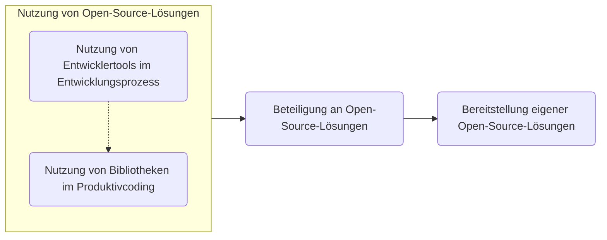

{: .no_toc}

# Open Source

1. TOC
{:toc}

## Einleitung

Open Source hat es in der ABAP-Entwicklung besonders schwer Fuß zu fassen. Immer noch halten sich Einwände, dass der Einsatz von frei verfügbarer Software in den geschäftskritischen SAP-Systemen mit den Unternehmensdaten gar nicht möglich oder zu rechtfertigen sei. Dabei gibt es für viele der berechtigten Einwände Lösungen, um die _Risiken_ zu minimieren und die _Chancen_, die Open-Source-Software bietet, nutzen zu können. In anderen Programmierumfeldern überwiegen die Chancen bereits lange gegenüber den Restrisiken und es wurden Prozesse und Tools geschaffen, um Open-Source-Bestandteile effektiv in den eigenen Entwicklungsprozess zu integrieren. Dieses Kapitel soll Ihnen einen Überblick zum aktuellen Stand von Open Source in der ABAP-Entwicklung geben sowie Prozesse und Tools vorstellen, um...

1. ...Open-Source-Projekte in die eigenen Lösungen zu integrieren ([Einsatz von Open Source](using-open-source))
2. ...an Open-Source-Projekten mitzuwirken ([Beteiligung an Open Source](contributing-to-open-source))
3. ...eigene Lösungen als Open-Source-Projekt bereitzustellen ([Entwicklung von Open Source](developing-open-source)).

{: .highlight }
Eine _Open-Source-Strategie_ muss jedes Unternehmen für sich selbst erschließen. Hier finden Sie eine Arbeitsgrundlage und Erfahrungsberichte.

## Was ist Open Source?

Open Source Software (OSS) ist Software, welche unter einer [_Open-Source-Lizenz_](#lizenzen) bereitgestellt wird. In allen drei zuvor genannten Anwendungsfällen ist die Lizenz maßgeblich für die Nutzung, die Modifikation und die Weiterverbreitung des bereitgestellten Codings. Zudem muss dieses _frei verfügbar_ sein, also nicht nur einer bestimmten Gruppe an Personen bereitgestellt werden. Dies ermöglicht es Ihnen zum Beispiel den Quellcode einer Anwendung vor dem Einsatz zu prüfen und die Binärdateien zur Ausführung selbst zu erzeugen, anstatt darauf zu vertrauen, dass die bereitgestellten Dateien auch zu dem Quellcode gehören. Bugs können Sie im Zweifel selbst beheben, statt auf den Softwareanbieter warten zu müssen oder auf Support angewiesen zu sein. Zusatzfunktionalität und Integrationen können Sie selbst entwickeln und auch anderen Nutzern der Software bereitstellen. Versprochene Features wie Ende-zu-Ende-Verschlüsselung und deaktivierte Telemetrie können Sie selbst überprüfen.

{: .note }
SAP S/4HANA ist nicht "Open Source" nur weil Sie als Entwickler den von der SAP geschriebenen Quellcode lesen können. Open Source ist viel mehr als die bloße Bereitstellung des Codings gegenüber dem Kunden und thematisiert die freie Nutzung, Modifikation und Weiterverbreitung _ohne in einem Kundenverhältnis_ mit dem Softwareanbieter zu stehen.

## Ausbaustufen

Eine mögliche Herangehensweise an das Thema ist die verschiedenen Anwendungsfälle als aufeinander aufbauend zu sehen. Zusätzlich lässt sich der Einsatz von Open-Source-Komponenten in der eigenen Software aufteilen in die Nutzung im Entwicklungsprozess und die Integration in das Produktivcoding.

> Notizen:
>
> An dieser Stelle ist bereits eine Unterscheidung erkennbar, die bei einer stückweisen Einführung einer Open-Source-Strategie im SAP- und speziell im ABAP-Kontext helfen kann. Punkt 1, die Optimierung der Entwicklungsprozesse, betrifft Tooling, welches _im Entwicklungsprozess_ genutzt wird. Dies ist oft zunächst einfacher zu betrachten als Punkt 2, die Umsetzung von betriebswirtschaftlichen Anforderungen. Bibliotheken, die dabei genutzt werden, erreichen zwangsläufig an der Stelle auch Ihr Produktivsystem und sind somit nochmal unter anderen Gesichtspunkten zu betrachten.
>
> - Fertige Lösungen für eigene Probleme existieren bereits
>   - Kostenersparnis gegenüber Eigenentwicklung und Wartung
>   - End-User-Benefit gegenüber "Aufwand zu groß" / rentiert sich nicht
> - Open-Source-Tools für den Entwicklungsprozess erhöhen die Softwarequalität, verkürzen Entwicklungszeiten, verringern Fehler
> - Aushängeschild in der Personalsuche: Nutzung moderner Tools, wir entwickeln modern
> - Möglichkeit externer Contributions
> - Enablement der Nutzung eigener Lösungen für Kunden (SDK/API für ABAP)

## Lizenzen

> Aspekte von Lizenzen:

<!-- markdownlint-disable MD033 -->
<table>
    <tr>
        <th></th>
        <th><a href="https://choosealicense.com/licenses/mit/">MIT</a></th>
        <th>Apache 2.0</th>
        <th>GPL 3.0 </th>
        <th>GPL 2.0 </th>
        <th>...</th>
    </tr>
    <tr>
        <td colspan="6" class="bg-grey-lt-000">Rechte</td>
    </tr>
    <tr>
        <td>Kommerzielle Nutzung</td>
        <td>Erlaubt</td>
        <td></td>
        <td></td>
        <td></td>
        <td>Nicht Erlaubt</td>
    </tr>
    <tr>
        <td>Weiterverbreitung</td>
        <td>Erlaubt</td>
        <td></td>
        <td></td>
        <td></td>
        <td></td>
    </tr>
    <tr>
        <td colspan="6" class="bg-grey-lt-000">Pflichten</td>
    </tr>
</table>
<!-- markdownlint-enable MD033 -->

[choosealicense](https://choosealicense.com)

<https://choosealicense.com/appendix/>

Bereitstellung von Lizenzen in ABAP-Code...
