{: .no_toc}
# Sicherheit

1. TOC
{:toc}

Themenfelder
- CVA als SAP Standardtool
- Tools welche die Sicherheit bei der ABAP Entwicklung verbessern
  - ATC und Codeinspector (SCI)
    - Baseline zum ATC / Konzept zur Bereinigung der Baseline-Befunde?
  - ABAP Cleaner
  - abapOpenChecks
  - CodePAL (ADT „Addon“)
- Sicheres Programmieren/Ausbildung dazu
  - Top 5: Schlimmste „Back Door Findings“
  - SQL injection, Verweisen auf den Hinweis
  - Berechtigungsprüfung mit Berechtigungsobjekten
  - Ausführbare Reports (Berechtigungsgruppen) und RFC Funktionsbausteinen
  - RFC Read Table nicht im ABAP Verwenden, stattdessen Schnittstellen (FB‘s + API‘s) nutzen
  - UCON
  - Prüfung der SY-Felder (über die SAP Klasse?)
  - Benutzergruppenanhängiges Coding – Feature Toogle?
- 3rd Party Software (AddOns)
  - Empfehlungen für die Anschaffung
- Systemeinstellungen zu Screen Personas?
- SAPGUI Scripting?
- Einstellungen auf Mandantenebene für Unit Tests (Hinweis für laufende Einstellungen)

Generell Inhaltsverzeichnis für bessere Navigation einrichten => Bernd

## Einleitung

Dieses Kapitel beschreibt ein paar Themengebiete rundum ABAP Programmierung und es werden ein paar Konzepte erläurtert. Der Fokus liegt hier auf Applikationssicherheit; Die SAP-Basis und System-Sicherheitsthemen nicht näher betrachtet. Wir empfehlen einen Threat-Modelling-Workshop für SAP-System-Angriffszenarien und Ihre Abdeckung durchzuführen.

Das Themengebiet Sicherheit in der ABAP Programmierung ist komplex, und die hier aufgeführten Sicherheitsthemen sind ein guter Start. Bei weiteren Fragen verweisen auf Referenzen und weitergehende Literatur hin.

## Wieso Sicherheit in ABAP Programmierung wichtig ist?

... Copy Paste... “Motzgrundlage”

Ein SAP-System oder eine ABAP-Laufzeit enthält verschiedene Funktionen für das Identitäts- und Zugriffsmanagement von Benutzern, die ABAP-Programme ausführen. Die Funktionen umfassen:

- Werkzeuge zur Benutzerverwaltung, wie z.B. das Anlegen, Sperren und Löschen von Benutzern gemäß den gängigen Compliance-Standards.
- Verschiedene Authentifizierungsprotokolle, einschließlich Single-Sign-On-Optionen
- Durchsetzung von Passwortrichtlinien und Credential Management für Benutzer
- Ein erweiterbares Rollen- und Berechtigungsmanagement mit der Möglichkeit, individuelle Rollen für Benutzer zu entwerfen und zuzuweisen.
- Implizite Zugriffskontrolle auf Programmebene beim Start eines ABAP-Programms durch Überprüfung der Startberechtigungen der Benutzer
- APIs zur Zugriffskontrolle innerhalb eines Programms und implizite Zugriffskontrolle auf Anweisungsebene für bestimmte APIs (z.B. Zugriff auf das Dateisystem).

SAP hat im Laufe der Zeit verschiedene Sicherheits-APIs und Sicherheitsfunktionen in den funktionalen Kern der Sprache und in die propagierten Frameworks implementiert, um es Programmierern zu ermöglichen, Sicherheitsanforderungen in ABAP-Programmen umzusetzen. Ein ABAP-Entwickler kann oft aus mehreren Anweisungen oder APIs auswählen, um bestimmte Funktionen zu implementieren. Implizite Sicherheitsfunktionen wie Eingabevalidierung und Verschlüsselung variieren ebenfalls je nach dem gewählten Framework. Die folgenden APIs und Sicherheitsframeworks stehen zur Wiederverwendung zur Verfügung:

- OS-Befehlsbeschränkung
- RFC-Callback-Whitelisting
- Vereinheitlichtes Konnektivitäts-Framework (UCON)
- HTTP-Pfad-Whitelist
- Ausgabekodierung und
- Dienstprogramme für die Eingabevalidierung
- Virus-Scan-Schnittstelle
- Zugangskontroll-API
- Protokollierungs-APIs (eine Menge) und implizite Protokollierung

## Sicheres Programmieren

### Top 5 – die schlimmsten „Back Door“ Schwachstellen (Volo)

... Copy Paste... “Motzgrundlage”

### Directory Traversal (Write Access)

Directory-Traversal-Angriffe (Verzeichniswechselangriffe) funktionieren durch Manipulation des Dateinamens oder der Pfadinformationen durch Eingabe von Sonderzeichen in eine Zeichenkette, die als Datei-Locator dient.

Wird eine derartige Zeichenkette zur Abänderung von Inhalten einer Datei verwendet, lässt sich eine Anwendung austricksen und dazu bringen, Dateien zu ändern, auf die der Benutzer keinen Zugriff besitzen sollte. Dieser Angriff ist möglich, da es der Anwendung nicht gelingt, Befehlszeichen in Eingaben zu ermitteln und zu entfernen, die als Bestandteil des Datei-Locators verwendet werden.

Das wirkt sich auf Dateien in allen Verzeichnissen aus, für die die anfällige Anwendung Schreibzugriff besitzt. Darunter können auch Dateien im Unternehmens-LAN fallen. Risiko Durch Kontrolle, welche Dateien eine Anwendung ändern werden, sind mindestens folgende Angriffe möglich:

- Schreibzugriff auf entscheidende Konfigurationsdateien. Dies kann Angreifern zuspielen, noch weiter in ein bereits angegriffenes System einzudringen.
- Schreibzugriff auf Protokolldateien.
- Schreibzugriff auf die Datenpersistenz einer produktiven Datenbank.

Alle diese Risiken gefährden die Integrität des produktiven SAP-Servers. Details Viele Anwendungen greifen auf Dateien auf dem SAP-Server zum Schreiben von Daten zu. Typische Anwendungsfälle umfassen die temporäre Persistenz von Datei-Uploads und den Export von Geschäftsdaten zur Übernahme von einem Altsystem. Auf Betriebssystemebene werden Dateien durch Datei-Locators identifiziert. Diese Datei Locators enthaltenen Angaben über die Laufwerk- oder Dateifreigabe, das Verzeichnis, den Namen und die Endung einer bestimmten Datei. Es gibt Fälle, bei denen ein Teil solcher Datei-Locator-Angaben auf externem Input basiert. Beispielsweise kann der Name einer auf den Server hochgeladenen Datei auch verwendet werden, um diese in einen temporären Ordner zu speichern. Eine externe Eingabe kann jedoch Sonderzeichen enthalten, die sich zur Manipulation des übergreifenden File Locators nutzen lassen. Als Folge hiervon werden Dateien von anderen Laufwerken, Dateifreigaben oder sonstige Verzeichnisse unter Umständen verändert. Auch auf Dateien anderer Dateitypen bzw. Erweiterungen lässt sich ggf. zugreifen. Ein solcher Angriff wird als Directory-Traversal-Angriff bezeichnet. Durch unzulässige Verzeichniswechsel kann ein unbefugter Benutzer beliebige Dateien auf dem SAP-Server ändern, auf dem die anfällige Anwendung ausgeführt wird. Je nach dem Dateizugriffsmodus kann ein Angreifer Daten entweder ändern oder löschen. Diese Schwachstelle führt zu einer unsachgemäßen Verwendung der ABAP-Befehle OPEN DATASET FOR OUTPUT, OPEN DATASET FOR APPENDING, DELETE DATASET, TRUNCATE DATASET und TRANSFER. Über solche Sicherheitslücken lässt sich die Integrität eines produktiven SAP-Servers beeinträchtigen. Ein Angreifer kann Dateien löschen oder ändern, die für den ordnungsgemäßen Systembetrieb von Entscheidung sind. Zusätzlich kann ein Angreifer Dateien ändern und löschen, die Geschäftsdaten enthalten. Auf jeden Fall stellt der unberechtigte Schreibzugriff für beliebige Dateien auf einem Server ein kritisches Sicherheitsrisiko dar. Die Wahrscheinlichkeit einer bestimmten Problematik ändert sich, sofern der Eingabe ein Postfix hinzugefügt wird.

### Generic ABAP Module Calls

Durch die Kontrolle, welche ABAP-Module auf einem SAP-System ausgeführt werden, sind mindestens folgende Angriffe möglich: Absturz des SAP-Anwendungsservers Störung der Geschäftslogik, was zu einem inkonsistentem Datenstand führt Manipulation der Geschäftslogik, was einen unprivilegierten Zugriff auf geschützte Funktionen zur Folge hat Einige dieser Risiken können gegen gesetzliche Vorgaben verstoßen, da solche Schwachstellen den unprivilegierten Zugriff auf kritische Geschäftslogik ermöglichen. Details In ABAP gibt es Befehle, die Transaktionen, Funktionsbausteine, Methoden, Formulare und Berichte dynamisch aufrufen. Dynamisch bedeutet, dass der Name des auszuführenden Bausteins basierend auf den Eingaben zur Laufzeit bestimmt wird. Dynamische Baustein-Aufrufe sind eine wichtige Funktion, um flexiblen und wiederverwendbaren Code zu schreiben. Dies kann jedoch sehr gefährlich sein, wenn ein solcher Baustein durch einen böswilligen Benutzer kontrolliert wird. Findings berücksichtigen das Vorhandenseins eines AUTHORITY-CHECK. Zudem werden indirekte (in Untermodulen aufgerufene) AUTHORITY-CHECKs berücksichtigt. Die Wahrscheinlichkeit einer bestimmten Problematik ändert sich, wenn der Eingabe ein Präfix oder Postfix hinzugefügt wird.

### OS Command Injection (CALL 'SYSTEM')

Dieser Testfall prüft, ob eine (externe) Eingabe als ein Betriebssystembefehl mittels Kernel Funktion 'SYSTEM' ausgeführt wird. In solch einem Fall könnte ein Angreifer beliebige Befehle auf dem SAP-Anwendungsserver ausführen. Risiko Das Ausführen von beliebigen Betriebssystembefehlen kann zu folgenden Risiken führen: Absturz des SAP-Anwendungsserver Installation von Malware Erstellung von privilegierten Benutzerkonten Lese- / Schreibzugriff auf alle Dateien des SAP-Anwendungsservers Details Die Kernel-Funktion 'SYSTEM' ermöglicht die Ausführung von beliebigen Betriebssystembefehlen. Werden hierdurch (externe) Eingaben verarbeitet, wird der standardmäßige SAP-Sicherheitsmechanismus für die Ausführung von Betriebssystembefehlen umgangen. Über die Transaktionen SM49 oder SM69 können Administratoren eine Liste der zulässigen Betriebssystembefehle pflegen und für deren Ausführung entsprechende Berechtigungen zuordnen. Auf diese Weise kann ein Administrator den Zugriff auf gefährliche Befehle einschränken. Die Kernel-Funktion 'SYSTEM' umgeht jedoch die Befehlsliste aus SM49 / SM69. Aus diesem Grund lässt sich mittels der Kernel-Funktion 'SYSTEM' jeder Betriebssystembefehl ausführen. Dies stellt ein kritisches Sicherheitsrisiko dar.

### ABAP Command Injection (Report)

Die ABAP-Befehle INSERT REPORT und SUBMIT können zusammen dynamischen ABAP Code während der Laufzeit erzeugen und ausführen, was zu einem sehr hohen Sicherheitsrisiko werden kann, sofern Benutzereingaben Teil eines solchen dynamischen Berichts sind. Risiko Kann ein Benutzer beliebige ABAP-Befehle auf einem SAP-System ausführen, muss das System als vollständig kompromittiert betrachtet werden: Lese- und Schreibzugriff auf alle (geschäftlichen) Daten in der Datenbank Ausführung einer beliebigen Geschäftslogik Solche Sicherheitslücken stellen Compliance-Verstöße dar. Details Der ABAP-Befehl INSERT REPORT wird zur dynamischen Erzeugung eines ABAP-Reports verwendet. Dies erfolgt durch Verkettung von Zeichenketten, die üblicherweise aus einer Datenquelle gelesen werden. Sobald der ABAP-Report zusammengestellt wurde, kann er mit dem Befehl GENERATE REPORT ausgeführt werden. Eine solche Verfahrensweise der Programmierung ist sehr gefährlich, da hierdurch spontan bösartiger Code erstellt werden kann und keine Spuren dieses Codes im System hinterlassen werden.

### Dangerous ABAP Commands

Bei diesem Testfall wird die Verwendung der ABAP-Befehle EDITOR-CALL FOR REPORT und COMMUNICATION geprüft. Beachten Sie, dass dieser Testfall Ausgangspunkte für die weitere Prüfung ermittelt und eine manuelle Nachbearbeitung erfordert. Risiko Das Geschäftsrisiko hängt von der erkannten Funktionalität ab und muss durch manuelle Analysen bestimmt werden. Details Dieser Testfall betrifft die folgenden ABAP-Befehle: EDITOR-CALL FOR REPORT COMMUNICATION Diese Befehle sind entweder kritisch oder obsolet. Sie sollten auf jeden Fall nicht im eigenentwickelten Code enthalten sein. EDITOR-CALL FOR REPORT ermöglicht den Aufruf eines ABAP-Editors für Quellcode. Besondere Entwicklungsberechtigungen sind dennoch erforderlich. Eigenentwickelter Code sollte keinen ABAP-Code-Editor zur Verfügung stellen. Dies sollte ausschließlich über SAP Standardfunktionen möglich sein, die ordnungsgemäß eingeschränkt und geprüft werden können. COMMUNICATION diente zum Austausch von Systemdaten und wurde verwendet, bevor RFC verfügbar war. Diese Art von Datenaustausch ist obsolet. Unter dem Aspekt der Sicherheit ergibt sich ein Risiko, da Sicherheitsfunktionen wie z. B. SNC nicht für den COMMUNICATION-basierten Datenaustausch verwendet werden können.

**ABAP Cleaner (Bernd Reichel)**

## **Einführung**

“ABAP Cleaner” im Bereich “Sicherheit”? Ja, man könnte meinen da passt was nicht so ganz. Der “ABAP Cleaner” hat sein Hauptanwendungsgebiet auf “Clean Code” / “Clean ABAP”, die Verwendung des”ABAP Cleaners” trägt auch zu Erhöhung der Sicherheit bei der ABAP Code Erstellung bei.

SAP hat Ende Mai 2023 den „ABAP Cleaner“ als generell verfügbar im GITHUB veröffentlicht. wird als Eclipse-AddOn (Erweiterung) zusätzlich zu den SAP ADT (ABAP Development Tools) installiert und bettet sich in diese ein. Die Grundfunktionalität liegt auf Clean Code (siehe auch [Clean ABAP Styleguides der SAP](https://github.com/SAP/styleguides/blob/main/clean-abap/CleanABAP_de.md)), in der aktuellen Version (1.16.1 – Mitte Mai 2023 sind über 75 Checks/CleanUp’s enthalten. Diese können auch auf eigene Bedürfnisse konfiguriert werden. Ebenso ruft SAP aktiv dazu auf, bei Erweiterungswünschen diese via GITHUB an die SAP zu melden. Als „Nebeneffekt“ sind einige Prüfungen im Rahmen von Clean Code/Clean ABAP auch eine Stärkung der Sicherheit innerhalb des ABAP-Codes (z.B. Bereinigung obsoleter Sprachelemente, …). Deshalb sollte der ABAP Cleaner grundsätzlich für die ABAP Codeerstellung verwendet werden.  
Desweiteren soll hier auch auf den ADT Guide der DSAG verweisen werden, dieser enthält weitere nützliche Informationen zu den ABAP Development Tools (ADT) der SAP.

**Installation und Funktionsweise**

### **Installation**

Die Programmsourcen liegen auf dem [GITHUB Projekt](https://github.com/SAP/abap-cleaner) von SAP. Die [Installation ist auf der Seite](https://github.com/SAP/abap-cleaner#requirements-and-installation) detailliert beschrieben. Voraussetzung für den ABAP Cleaner ist die Installation der SAP ADT (ABAP Development Tools) und des SAPGUI (nur Windows) oder des JAVAGUI.

Der „ABAP Cleaner“ bettet sich vollständig in die ADT in Eclipse ein. Die Korrekturen am erstellten ABAP Code werden über die ADT Funktion „Quick Fix“ umgesetzt.

SAP liefert für die Konfiguration liefert 2 Profile aust: „DEFAULT“ und „ESSENTIAL“, diese können angepasst/erweitert werden (durch kopieren in jeweils eigene Profile). Grundsätzlich liegen diese beiden Profile lokal auf dem Arbeitsplatzrechner, empfohlen wird für beide Profile eine Grundkonfiguration zu machen und dann per Export/Import Funktion entsprechend zu verteilen und damit eine gemeinsame Nutzung zu vereinfachen.

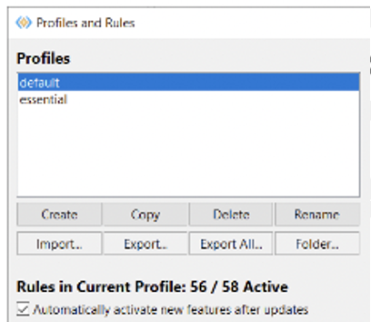

Profile und Regeln
{: .img-caption}

### **Funktionsweise**

Grundsätzlich kann der ABAP Cleaner im Modus „interaktiv“ und „automatisch“ benutzt werden:

- Die automatische Bereinigung wird mit (Ctrl + 4 oder über das Menü 'Source Code / Clean Up With Automated ABAP Cleaner' ) angestartet.
- Die interaktive Bereinigung mit “Ctrl + Shift + 4 oder über das Menü 'Source Code / Clean Up With Interactive ABAP Cleaner...'.

Interaktiver Modus
{: .img-caption}

Bei der automatischen Bereinigung wird der Code vollautomatisch geprüft und bereinigt.

Bei der interaktiven Bereinigung werden die Codingstrecken im Splitt-Screen angezeigt:

Geteiles Bild
{: .img-caption}

Hier bekommt man dann die einzelnen „Befunde“ angezeigt und kann diese interaktiv bearbeiten/anpassen lassen.

## **Regelwerk**

Auf der GITHUB Seite sind alle verfügbaren Checks/Clean-Ups im Detail beschrieben. Details siehe „[ABAP Cleaner Rules](https://github.com/SAP/abap-cleaner/blob/main/docs/rules.md)“:

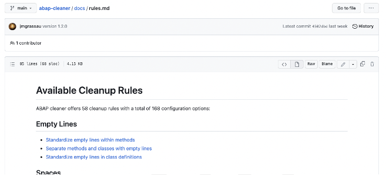

Verfügbare Regeln
{: .img-caption}

## **Hintergrundinformationen/Linksammlung**

SAP liefert einige Richtlinien und Regeln für „sauberen“ ABAP Code aus:

- den [Clean ABAP Styleguide](https://github.com/SAP/styleguides/blob/main/clean-abap/CleanABAP.md),
- die [Clean Code Checks](https://github.com/SAP/code-pal-for-abap/blob/master/docs/check_documentation.md), wie im Projekt [‚Code Pal for ABAP‘](https://github.com/SAP/code-pal-for-abap/) implementiert,(Erweiterung der Checks für den ATC – ABAP Test Cockpit) – siehe auch im Kapitel “ATC”

Grundlage von Clean ABAP oder den Clean ABAP Styleguides ist das Konzept „Clean Code“ von Robert C. Martin, welches auf die Programmiersprache ABAP angewandt wurde.

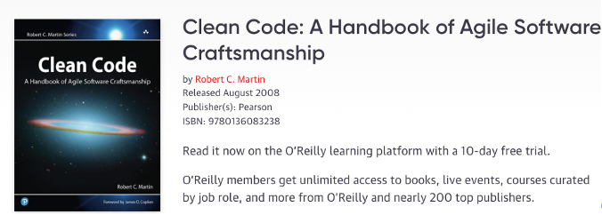

Buch Clean Code
{: .img-caption}

 

Der ABAP Cleaner wurde zwar erst im Mai 2023 als „general available“ zur Verfügung gestellt, er hat aber einen “internen” SAP Entwicklungsweg hinter sich:

Projekt Meilensteine
{: .img-caption}

SAP entwickelt den ABAP Cleaner permanent weiter.

Frage von Peter L.

Ist ABAP Cleaner wirklich Sicherheit ?

Verweis auf ADT Leitfaden Plugins – hier ist aBAP Cleaner beschrieben bzw, installation etc, von plugns generell.

# SAP ATC (ABAP Test Cockpit) (Bernd Reichel)

## Einführung ATC

Das ABAP Test Cockpit (ATC) ist ein Werkzeug zur Ausführung statischer und dynamischer Qualitätsprüfungen für ABAP-Quellcode und dazugehörige Repository-Objekte.

Die SAP-Empfehlung ist ein zentrales ATC-System, dieses System soll recht „schmal“ gehalten sein, sprich nur ein ABAP Netweaver System mit entsprechender Datenbank und der Softwarekomponente SAP_BASIS. SAP spricht von „Sie müssen lediglich ein zentrales ATC-Prüfsystem installieren und konfigurieren: das reine SAP-Basissystem (SAP_BASIS >=7.51) innerhalb Ihrer SAP-Systemlandschaft“. Daraus folgt, man braucht eigentlich nur  ein AS ABAP System mit der Softwarekomponente SAP_BASIS

Aber: Das zentrale ATC System sollte in der gesamten Systemlandschaft das softwaretechnisch neueste System sein, das hat den Vorteil, dass die neuesten Checks dort vorhanden sind und die Remote-Prüfungen einfacher durchlaufen .

SAP liefert alle Checks über die SAP_BASIS Komponente aus, deshalb wird empfohlen, jeweils den aktuellsten Stand einzusetzen, damit man auch mit den aktuellsten Checks arbeitet/prüft. Ein weiterer Vorteil mit dem „schmalen“ System ist, dass das ATC-System bei Bedarf recht „einfach“ aktualisiert (Supportpackage-Update) werden kann. Grundsätzlich sollte man 1–2mal im Jahr das ATC-System aktualisieren (die „Anwendung“ und die Datenbank).

Die Checks/die Prüfungen sind einmal in den „Code Inspector“ integriert, dies ist eine Funktion innerhalb der SAP-Entwicklungsumgebung und der SAP ADT (ABAP Development Tools – Eclipse Erweiterung). Dabei werden die Checks über die Funktion „Prüfen => ABAP Test Cockpit“ angestoßen. Ebenso besteht die Möglichkeit alle RFC fähigen Checks (überwiegend sind alle Checks RFC fähig) auch als periodischer Job im Hintergrund laufen zu lassen und den kompletten Code zu prüfen und ein „Verzeichnis“ der Befunde zu erstellen.

Abgerundet werden die Prüfungen mit der Integration in das SAP CTS „Korrektur- und Transportsystem“ für Systemänderungen/Entwicklungen. Hier kann man das System so einstellen, dass bei jeder Transportfreigabe gegen die Checks des ATC geprüft wird. Werden Befunde festgestellt, so kann eingestellt werden, dass diese die Transportfreigabe verhindern. Damit wird sichergestellt, dass nur einwandfreier Code in die SAP-Systeme transportiert wird. Diese Funktion kann zusätzlich mit einem „Befreiungsworkflow“ erweitert werden.

 

## SAP Systemlandschaft mit einem zentralen ATC

Schema Central ATC
{: .img-caption}

Auf der linken Seite ist das zentrale ATC System zu sehen. Dieses besteht im Standard aus den Komponenten ATC (ABAP Test Cockpit) und dem ACI (ABAP Code Inspektor). Mit einer gesonderten Lizenz kann das CVA (SAP Custom Code Vulnerability Analyser) aktiviert und genutzt werden. Das CVA prüft den eigen erstellte Code gegen SAP Empfehlungen für “Sicheres Programmieren”. Details zum CVA und den Prüfungen werden später noch etwas näher erläutert..

Hinweis: Das ATC System kann mit der open Source Komponente abapGIT (nicht zu verwechseln mit gCTS der SAP) erweitert werden (siehe hierzu die Empfehlungen im Kapital “Open Source”). Im folgenden werden einzelnen Komponenten erläutert

## **abapGIT** (Bernd Reichel)

[abapGIT](https://abapgit.org/) ist ein Open-Source-GIT-Client für ABAP. Dieser ist in ABAP entwickelt und benötigt mindestens eine SAP BASIS Version 702 oder höher.

abapGit ist ein Werkzeug zum Importieren und Exportieren von Code zwischen ABAP-Systemen. Wenn ein Entwickler über einen Entwicklerschlüssel für das System verfügt, kann er diese Aktionen bereits ausführen. abapGit ermöglicht es dem Entwickler, Massenexporte/Änderungen/Importe durchzuführen, aber nicht mehr, als bereits manuell möglich ist.

Mit abapGIT ist es möglich, über ein eigenes GIT ABAP Objekte über Systemgrenzen hinweg recht einfach zu deployen. Gerade in einer Double-Maintenance-Phase war diese Möglichkeit in der Vergangenheit eine große Hilfe und Arbeitserleichterung für die ABAP Entwickler. Außerdem wird abapGIT als Basis für die [abapOpenChecks](https://docs.google.com/document/d/1--6biTn5OvRM4r8CO_19FLBKCQ3_bf1cIttiBDJJeRg/edit#heading=h.2xcytpi) benötigt. Deshalb sollte diese Funktion wieder implementiert werden.

abapGIT wird „einfach“ als einzelner ABAP Report über das GIT-Repository zur Verfügung gestellt. Dieser ABAP Report wird dann in das ATC System und auch in die angeschlossenen Entwicklungssysteme implementiert.

Die Installation wird hier beschrieben: [Installation | abapGit Docs](https://docs.abapgit.org/user-guide/getting-started/install.html) außerdem gibt es in der SAP Basis eine detaillierte Installationsanleitung inkl. Dokumentation wie ein Update/neue Version installiert wird.

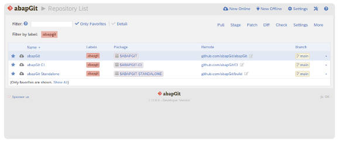

abapGit GUI Client
{: .img-caption}

## **Prüfbereiche**

SAP liefert im Standardumfang des ATC bereits eine Vielzahl von Checks aus. Diese Prüfungen können erweitert werden. So gibt es von SAP im Rahmen des CVA (Code Vulnerability Analyzer) zusätzliche Prüfungen oder auch Erweiterungen, welche durch die SAP und auch die SAP-Community via GITHUB Projekte bereitgestellt werden.

### **SAP ABAP Checks**

SAP liefert mit dem ATC bereits eine große Anzahl von Prüfungen aus, welche direkt vom Code Inspector und vom ATC verwendet werden.

Folgende Teilbereiche liefert SAP aus:

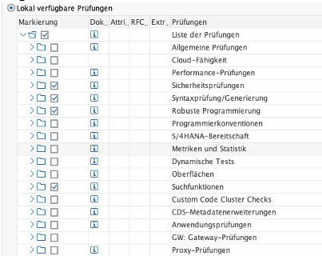

SCI Prüfvariante
{: .img-caption}

Die ABAP-Checks sollten zwischen ABAP Entwicklung und dem Sicherheitsteam abgestimmt werden (welche Prüfungen sind sinnvoll), dann sollten die als „sinnvoll“ erachteten für Hintergrundprüfungen und auch für die Onlineprüfung im Rahmen der Transportfreigaben aktiviert werden

#### **S/4 Readiness-Checks**

Spezielle Checks welche SAP ausliefert sind die sog. „S/4HANA -Readiness“-Checks. Dies sind Prüfungen mit denen der kundeneigene Code auf S/4HANA Tauglichkeit“ überprüft werden können.

Im Detail werden folgende Prüfungen ausgeliefert:

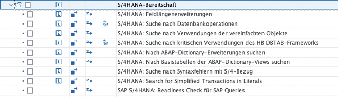

S/4HANA Readiness Prüfvariante
{: .img-caption}

Typischerweise wird im Rahmen eines Custom Code Livecycle Projektes der komplette kundeneigene Code im Hintergrund auf S/4HANA Tauglichkeit geprüft und die Befunde dann mit entsprechenden Tools, häufig auch automatisiert, auf S/4HANA umgestellt bzw. konvertiert werden.

Beispiel:

S/4HANA Readiness Ergebnis
{: .img-caption}

Die S/4HANA Bereitschaftsprüfungen sollten für Hintergrundprüfungen und auch für die Onlineprüfung im Rahmen der Transportfreigaben aktiviert werden, solange man noch auf ECC entsprechenden Code entwickeln. Mit einer Systemkonvertierung auf S/4HANA kann man die Checks dann ausschalten.

#### **abapOpenChecks**

[abapOpenChecks](https://docs.abapopenchecks.org/) sind Checks der SAP Community für den ATC und den Code Inspector. Die Installation erfolgt über abapGIT ([siehe vorherige Kapitel](https://docs.google.com/document/d/1--6biTn5OvRM4r8CO_19FLBKCQ3_bf1cIttiBDJJeRg/edit#heading=h.1ci93xb)).

In der aktuellen Version liefert abapOpenChecks über 100 zusätzliche Checks für den ATC aus und erweitert die von SAP ausgelieferten Prüfungen.

abapOpenChecks Prüfungen (Teil-1)
{: .img-caption}

…

abapOpenChecks Prüfungen (Teil-2)
{: .img-caption}

Eine aktuelle Liste der Prüfungen ist hier einzusehen: [abapOpenChecks - Checks](https://docs.abapopenchecks.org/checks/)

Die abapOpenChecks sollten für Hintergrundprüfungen und auch für die Onlineprüfung im Rahmen der Transportfreigaben aktiviert werden.

### **Sicherheitsprüfungen**

#### **Standard-Sicherheitsprüfungen**

SAP liefert im Rahmen der Standardauslieferung der Check folgende Sicherheitsprüfungen aus:

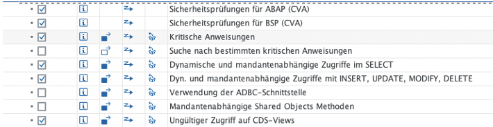

CVA Prüfungen
{: .img-caption}

Die SAP Standard Sicherheitsprüfungen sollten für Hintergrundprüfungen und auch für die Onlineprüfung im Rahmen der Transportfreigaben aktiviert werden. Eventuell kann man auch mit den Entwicklern abgestimmt kritische Anweisungen definieren, auf die man noch prüfen kann/sollte

##### **Zusätzliche CVA-Prüfungen (CVA Code Vulnerability Analyzer)**

Der [CVA ist ein Produkt der SAP](https://me.sap.com/notes/1855773) welches man zusätzlich lizenzieren muss. Im Rahmen der Rahmenvertragsverlängerung (Juli 2022) wurde dieses Produkt zu einem sehr günstigen Preis gekauft. Das Produkt erweitert die SAP-Sicherheitsprüfungen erheblich, die Prüfungen des CVA sind die gleichen Prüfungen mit denen SAP ihren eigenen Code (der Code welche mit den SAP ABAP Systemen ausgeliefert wird) prüft.

Auch diese Prüfungen werden bei jedem Netweaver ABAP – Update erweitert.

Der CVA führt eine statische Analyse des ABAP-Sourcecodes durch und meldet mögliche Sicherheitsrisiken

Auszug aus SAP [Hinweis  1921820 - SAP Code vulnerability Analyzer - Support Package Planning](https://me.sap.com/notes/1921820) zum Prüfumfang des CVA:

Die Checks:

CVA Prüfungen (Teil-1)
{: .img-caption}

…

CVA Prüfungen (Teil-2)
{: .img-caption}

Aus Sicherheitsgründen hat SAP die CVA Check in 2 Prüfvarianten hinterlegt, so dass man „nur“ CVA komplett prüfen kann, d.h einzelne Prüfungen können nicht ausschalten werden.

Komplette Prüfungen
{: .img-caption}

BSP sind Checks für Business Server Pages, diese sind aus technischen Gründen separat.

Die Prüfungen des CVA sollten für Hintergrundprüfungen und auch für die Onlineprüfung im Rahmen der Transportfreigaben aktiviert werden.

#### **Clean Code/Clean ABAP - code pal for ABAP** (Bernd Reichel)

[Code PAL](https://github.com/SAP/code-pal-for-abap/blob/master/docs/check_documentation.md). Dieses Tool bietet eine Reihe von Prüfungen, die bei der Einhaltung des [Clean ABAP-Styleguides](https://github.com/SAP/styleguides/blob/main/clean-abap/CleanABAP.md) helfen. Obwohl nicht alle Empfehlungen aus dem Leitfaden durch statische Codeanalyse überprüft werden können und in bestimmten Situationen die strikte Einhaltung des Leitfadens möglicherweise nicht empfohlen wird, bietet dies zumindest für eine Teilmenge von Empfehlungen eine robuste automatisierte Unterstützung.

CodePal
{: .img-caption}

Wichtig: aktuell (im Juni 2023) sind die Code PAL Checks noch nicht RFC-fähig und können aktuell nur auf dem lokalen Entwicklungssystem geprüft werden, allerdings plant SAP im August 2023 die Checks remotefähig auszuliefern. Die Checks sind auch in den ATC und den Code Inspector integriert/integrierbar.

SAP liefert die Code PAL Checks über GITHUB aus, die Installation erfolgt ebenfalls über abapGIT. Die Installation ist hier beschrieben: [code-pal-for-abap/how-to-install.md at master · SAP/code-pal-for-abap · GitHub](https://github.com/SAP/code-pal-for-abap/blob/master/pages/how-to-install.md)

Im Mai 2023 gibt es folgende Checks (56 Checks):

CodePal Prüfungen (Teil-1)
{: .img-caption}

…

CodePal Prüfungen (Teil-2)
{: .img-caption}

Die aktuelle Liste ist hier zu finden: [code-pal-for-abap/check_documentation.md at master · SAP/code-pal-for-abap · GitHub](https://github.com/SAP/code-pal-for-abap/blob/master/docs/check_documentation.md)

Die Code PAL Checks sollten mit den Entwicklern abgestimmt werden (welche Prüfungen sind sinnvoll), dann sollten die als „sinnvoll“ erachteten für Hintergrundprüfungen und auch für die Onlineprüfung im Rahmen der Transportfreigaben aktiviert werden. Eventuell ist es sinnvoll die Installation erst im August/September 2023 zu machen, wenn die Checks remotefähig sind.

Eine sinnvolle Ergänzung zu den Code PAL Checks ist der ABAP Cleaner, eine Erweiterung zu Eclipse. Hier kann bereits bei der Codeerstellung (bei der Codeeingabe) auf Clean ABAP Konzepteinhaltung geprüft werden.

##### **Clean Code oder Code PAL for ABAP Cloud Checks**

Seit Mitte September 2023 gibt es [eine Version von "code pal" für ABAP in Cloud](https://github.com/SAP/code-pal-for-abap-cloud/) (BTP) Umgebungen. Grundsätzlich scheint (nach der Dokumentation) "code pal for cloud checks" genauso zu funktionieren wie der "normale" "code pal". SAP liefert über das GITHUB neue Checks aus, welche mit "abapgit" importiert werden können. Die Checks sind in einem eigenen Namensbereich /CC4A/CODE_PAL hintergelegt. Details sind von SAP in folgendem Blog beschrieben: "[Clean code checks for ABAP – Cloud Edition](https://blogs.sap.com/2023/09/11/clean-code-checks-for-abap-cloud-edition/)". Ebenso sind die Checks in der Entwicklungsplattform Eclipse verfügbar, so dass bereits beim Entwicklungsprozess auf Clean Code geprüft werden kann, wenn man mit ABAP Cloud entwickelt.

# Sicherheitseinstellungen zu SAP Screen Personas 3.0 – Bernd Reichel

## Allgemeines zu "SAP Screen Personas 3.0"

Was ist “SAP Screen Personas 3.0”?

Aus der [SAP Onlinehilfe](https://help.sap.com/docs/SAP_SCREEN_PERSONAS/e9aec5d380204249836a4fc3fc76f38e/d59f3aac0f574537af49f2ce0033bba8.html):

_SAP Screen Personas 3.0 unterstützt die Transformation klassischer Anwendungen in benutzerorientierte UIs, die auf bestimmte Anwendungsrollen und Geschäftsanforderungen zugeschnitten sind. Die vereinfachten Versionen klassischer Anwendungen werden als Flavors bezeichnet. Diese angepassten UIs können für ein oder mehrere Bilder innerhalb einer klassischen Anwendung oder anwendungsübergreifend verwendet werden. Die Flavors sind von den zugrunde liegenden Transaktionen unabhängig und können auf bestimmte Anwendungsrollen ausgerichtet sein. Eine klassische Anwendung kann über mehrere Flavors verfügen. Beispielsweise kann es ein bestimmtes Flavor pro Benutzergruppe geben._

Technisch basiert SAP Screen Personas 3.0 (Personas) auf einem SICF-Service, der einen vorkonfigurierten  Service des SAP GUI for HTML unter dem Standardknoten /sap/bc/personas startet. Die Engine  hat eigene Services unter dem Standardknoten host/sap/bc/se. Das bedeutet die  Sicherheitsmaßnahmen für das SAP GUI for HTML und ITS gelten für Screen Personas und  seine Services grundsätzlich auch.

SICF Service
{: .img-caption}

Bei SAP Screen Personas handelt es sich um eine Benutzungsoberflächen-Technologie, die als  Add-On im Backend-System implementiert wird, Die Sicherheit ist deshalb abhängig von den für dieses System  verfügbaren Funktionen. zu Datenzugriff-Governance oder Datenschutz. Die  meisten dieser Systemfunktionen werden durch die zugrunde liegenden Systemmechanismen  und -richtlinien vorgegeben. Alle für SAP Screen Personas spezifischen Aspekte oder möglichen  Diskrepanzen und Bereiche von besonderem Interesse werden nachfolgend erläutert.

**Spezielle Sicherheitsaspekte für "Screen  personas 3.0"**

**SSL Verschlüsselung der Verbindung**

Die Services welche von Personas verwendet werden sind SSL zu verschlüsseln:

Verschlüsselung
{: .img-caption}

**Schutz vor Cross Site Request Forgery für ITS**

Zum Schutz von Cross Site Requests ist an den Services unter GUI Konfiguration der Parameter  ~XSRFCHECK = 1 zu setzen. Details sind im Hinweis 1481392 beschrieben.

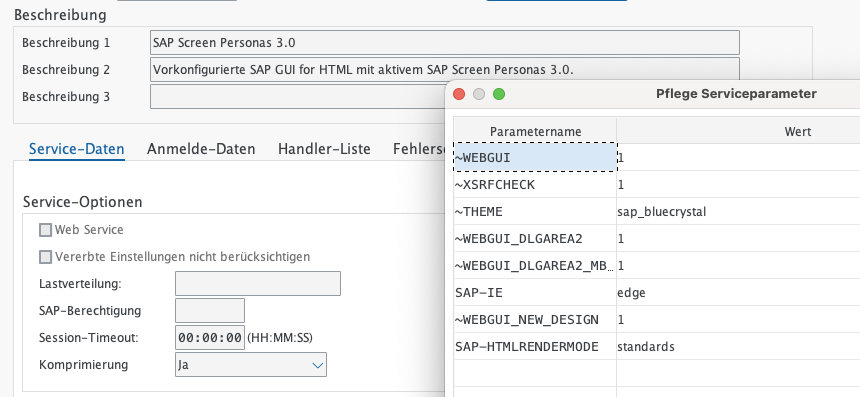

Parametereinstellung
{: .img-caption}

**Allgemeine Empfehlungen für ITS und SAP  GUI for HTML**

**Abmeldung für SAP GUI for HTML aktivieren**

Damit die Abmeldung aus dem HTML GUI sicher funktioniert müssen folgende Dinge beachtet  werden:

- Logoff Service muss in ICF aktiviert werden → Service-Baum /sap/public/bc/icf/logoff  aktivieren
- Im HTML GUI Service sowie in den Personas Services muss als Abmeldeseite der  Logoff Service hinterlegt werden

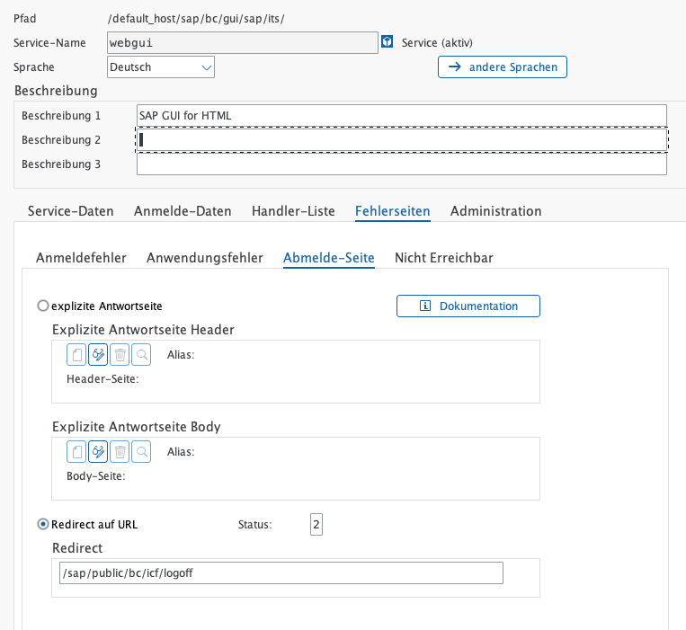

Abmeldung Web-GUI
{: .img-caption}

Bei der Abmeldeseite des WEBGUI Services den Service /sap/public/bc/icf/logoff als Redirect angeben.

Details sind im SAP Hinweis 1777513 beschrieben (ebenso weitere Hintergrundinformationen)

**Domain Relaxing deaktivieren (falls notwendig)**

Das Domain Relaxing ermöglicht es client-seitigen (zum Beispiel auf einem Browser)  Funktionen oder Anwendungen, mit anderen client-seitigen Funktionen in anderen Client Fenstern zu kommunizieren. Das Domain Relaxing ist nötig, falls Anwendungen von  verschiedenen Backend-Systemen (Servern) am Frontend Daten austauschen müssen. Es muss  dafür gesorgt werden, dass für alle betroffenen Anwendungen die gleiche Client Domain eingestellt ist, da andernfalls vom Client (Browser) ein Zugriffsfehler beim Versuch der  Kommunikation beanstandet wird.

Falls es zu einem solchen Browser-Verhalten kommen sollte, muss das Domain Relaxing  deaktiviert werden. Dazu wird in der GUI-Konfiguration des Services der Parameter  ~no_domain_relaxing hinzugefügt und auf 1 (Eins) gesetzt.

Domain Relaxing
{: .img-caption}

Details sind im SAP Hinweis 2111099 beschrieben (ebenso weitere Hintergrundinformationen)

\=> Einfügen Abschnitt

**SAP Berechtigungen**

SAP Screen Personas 3.0 ist nur dann für einen Benutzer aktiviert, wenn er über die  erforderlichen Berechtigungen basierend auf Benutzerrolle verfügt. Die Rollenzuordnung erfolgt  im Rahmen des regulären Benutzerverwaltungsprozesses. SAP liefert folgende Standardrollen  aus:

• Administrator: **/PERSONAS/ADMIN_ROLE** \- Diese Rolle hat vollständigen Zugriff  auf alle Funktionen, die SAP Screen Personas dem Flavor-Consumer zur Laufzeit zur  Verfügung stehen, kann den Zugriff auf alle Funktionen der Flavor-Builder-Aufgaben zur  Design-Zeit ermöglichen und Administrationsaufgaben in der Administrationsumgebung  ausführen.

• Flavor-Konsument: **/PERSONAS/CONSUMER_ROLE** \- Diese Rolle hat  Berechtigungen für den Zugriff auf Flavors für klassische Anwendungen. Flavor Konsumenten können mit dem Flavor-Manager zwischen Flavors und dem  ursprünglichen Bild wählen und Flavors zwischen dem Flavor-Manager und der Flavor Galerie verschieben.

• Flavor-Builder: **/PERSONAS/EDITOR_ROLE** \- Diese Rolle wird verwendet, um  Flavors und andere benutzereigene Objekte mit Bearbeitungsrechten in allen Design Zeit-Editoren zu erstellen.

SAP liefert die Rollen ohne generiertes Berechtigungsprofil aus, deshalb muss das Profil jeweils  generiert und sehr wahrscheinlich auch angepasst werden.

Grundsätzlich gilt: Die Benutzer müssen immer Zugriff auf den Transaktionscode haben,  zusätzlich zu dem, was ihnen in SAP Screen Personas gehört um eine Funktion innerhalb von  Personas ausführen zu können. Also TCD (Applikationsberechtigung) plus Personas  Berechtigungen müssen vorhanden sein.

Die folgenden Tabellen erläutern, wie Personas die verschiedenen Berechtigungsobjekte zum Erstellen von Flavors verwendet und mit den standardmäßig ausgelieferten Rollen verteilt:

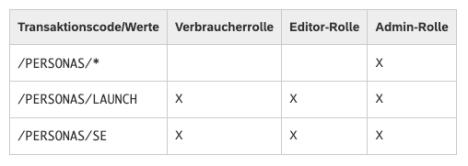

Screen Personas Berechtigungen (Teil 1)
{: .img-caption}

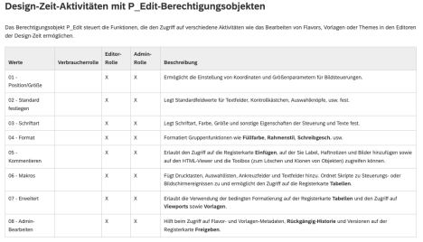

Screen Personas Berechtigungen (Teil 2)
{: .img-caption}

Screen Personas Berechtigungen (Teil 3)
{: .img-caption}