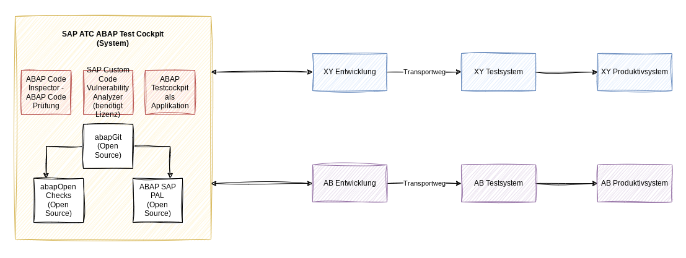
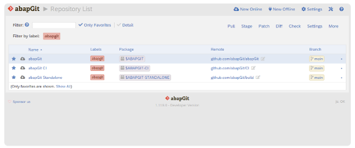
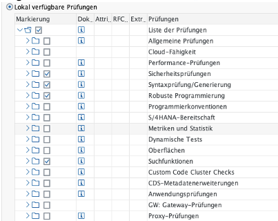
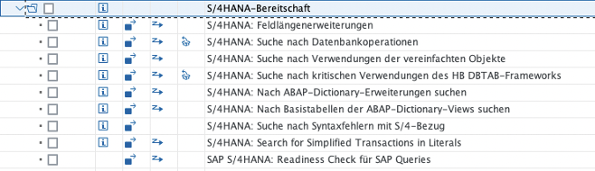
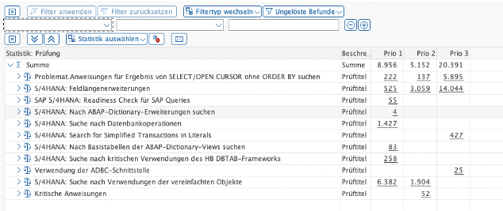
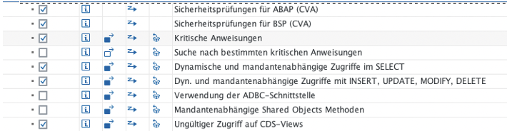
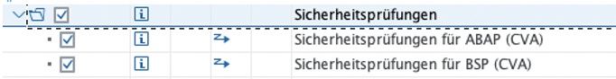

{: .no_toc}

# ABAP Test Cockpit

1. TOC
{:toc}

## Überblick

Das ABAP Test Cockpit (ATC) ist ein Werkzeug zur Ausführung statischer und dynamischer Qualitätsprüfungen für ABAP-Quellcode und dazugehörige Repository-Objekte.

Die SAP-Empfehlung ist ein zentrales ATC-System, dieses System soll recht „schmal“ gehalten sein, sprich nur ein ABAP Netweaver System mit entsprechender Datenbank und der Softwarekomponente SAP_BASIS. SAP spricht von „Sie müssen lediglich ein zentrales ATC-Prüfsystem installieren und konfigurieren: das reine SAP-Basissystem (SAP_BASIS >=7.51) innerhalb Ihrer SAP-Systemlandschaft“. Daraus folgt, man braucht eigentlich nur  ein AS ABAP System mit der Softwarekomponente SAP_BASIS

Aber: Das zentrale ATC System sollte in der gesamten Systemlandschaft das softwaretechnisch neueste System sein, das hat den Vorteil, dass die neuesten Checks dort vorhanden sind und die Remote-Prüfungen einfacher durchlaufen. Sollten Sie daher Probleme haben, ihr ATC Prüfsystem auf dem aktuellen Stand zu halten, sollten Sie sich das SAP BTP ABAP Environment als Option anschauen.

SAP liefert alle Checks über die SAP_BASIS Komponente aus, deshalb wird empfohlen, jeweils den aktuellsten Stand einzusetzen, damit man auch mit den aktuellsten Checks arbeitet/prüft. Ein weiterer Vorteil mit dem „schmalen“ System ist, dass das ATC-System bei Bedarf recht „einfach“ aktualisiert (Supportpackage-Update) werden kann. Grundsätzlich sollte man 1–2mal im Jahr das ATC-System aktualisieren (die „Anwendung“ und die Datenbank).

Die Checks/die Prüfungen sind einmal in den „Code Inspector“ integriert, dies ist eine Funktion innerhalb der SAP-Entwicklungsumgebung und der SAP ADT (ABAP Development Tools – Eclipse Erweiterung). Dabei werden die Checks über die Funktion „Prüfen => ABAP Test Cockpit“ angestoßen. Ebenso besteht die Möglichkeit alle RFC fähigen Checks (überwiegend sind alle Checks RFC fähig) auch als periodischer Job im Hintergrund laufen zu lassen und den kompletten Code zu prüfen und ein „Verzeichnis“ der Befunde zu erstellen.

Abgerundet werden die Prüfungen mit der Integration in das SAP CTS „Korrektur- und Transportsystem“ für Systemänderungen/Entwicklungen. Hier kann man das System so einstellen, dass bei jeder Transportfreigabe gegen die Checks des ATC geprüft wird. Werden Befunde festgestellt, so kann eingestellt werden, dass diese die Transportfreigabe verhindern. Damit wird sichergestellt, dass nur einwandfreier Code in die SAP-Systeme transportiert wird. Diese Funktion kann zusätzlich mit einem „Befreiungsworkflow“ erweitert werden.

## Zentrales ATC

Schema Central ATC
{: .img-caption}

Auf der linken Seite ist das zentrale ATC System zu sehen. Dieses besteht im Standard aus den Komponenten ATC (ABAP Test Cockpit) und dem ACI (ABAP Code Inspektor). Mit einer gesonderten Lizenz kann das CVA (SAP Custom Code Vulnerability Analyser) aktiviert und genutzt werden. Das CVA prüft den eigenen erstellten Code gegen SAP Empfehlungen für “Sicheres Programmieren”. Details zum CVA und den Prüfungen werden später noch etwas näher erläutert.

Hinweis: Das ATC System kann mit der open Source Komponente abapGIT (nicht zu verwechseln mit gCTS der SAP) erweitert werden (siehe hierzu die Empfehlungen im Kapital “Open Source”). Im Folgenden werden einzelnen Komponenten erläutert

## abapGIT

[abapGIT](https://abapgit.org/) ist ein Open-Source-GIT-Client für ABAP. Dieser ist in ABAP entwickelt und benötigt mindestens eine SAP BASIS Version 702 oder höher.

abapGit ist ein Werkzeug zum Importieren und Exportieren von Code zwischen ABAP-Systemen. Wenn ein Entwickler über einen Entwicklerschlüssel für das System verfügt, kann er diese Aktionen bereits ausführen. abapGit ermöglicht es dem Entwickler, Massenexporte/Änderungen/Importe durchzuführen, aber nicht mehr, als bereits manuell möglich ist.

Mit abapGIT ist es möglich, über ein eigenes GIT ABAP Objekte über Systemgrenzen hinweg recht einfach zu deployen. Gerade in einer Double-Maintenance-Phase war diese Möglichkeit in der Vergangenheit eine große Hilfe und Arbeitserleichterung für die ABAP Entwickler. Außerdem wird abapGIT als Basis für die [abapOpenChecks](https://docs.google.com/document/d/1--6biTn5OvRM4r8CO_19FLBKCQ3_bf1cIttiBDJJeRg/edit#heading=h.2xcytpi) benötigt. Deshalb sollte diese Funktion wieder implementiert werden.

abapGIT wird „einfach“ als einzelner ABAP Report über das GIT-Repository zur Verfügung gestellt. Dieser ABAP Report wird dann in das ATC System und auch in die angeschlossenen Entwicklungssysteme implementiert.

Die Installation wird hier beschrieben: [Installation - abapGit Docs](https://docs.abapgit.org/user-guide/getting-started/install.html) außerdem gibt es in der SAP Basis eine detaillierte Installationsanleitung inkl. Dokumentation wie ein Update/neue Version installiert wird.

abapGit GUI Client
{: .img-caption}

## Prüfungen - ABAP Checks

SAP liefert mit dem ATC bereits eine große Anzahl von Prüfungen aus, welche direkt vom Code Inspector und vom ATC verwendet werden.

Folgende Teilbereiche liefert SAP aus:

SCI Prüfvariante
{: .img-caption}

Die ABAP-Checks sollten zwischen ABAP Entwicklung und dem Sicherheitsteam abgestimmt werden (welche Prüfungen sind sinnvoll), dann sollten die als „sinnvoll“ erachteten für Hintergrundprüfungen und auch für die Onlineprüfung im Rahmen der Transportfreigaben aktiviert werden

### S/4 Readiness-Checks

Spezielle Checks welche SAP ausliefert sind die sog. „S/4HANA -Readiness“-Checks. Dies sind Prüfungen mit denen der kundeneigene Code auf S/4HANA Tauglichkeit“ überprüft werden können.

Im Detail werden folgende Prüfungen ausgeliefert:

S/4HANA Readiness Prüfvariante
{: .img-caption}

Typischerweise wird im Rahmen eines Custom Code Livecycle Projektes der komplette kundeneigene Code im Hintergrund auf S/4HANA Tauglichkeit geprüft und die Befunde dann mit entsprechenden Tools, häufig auch automatisiert, auf S/4HANA umgestellt bzw. konvertiert werden.

Beispiel:

S/4HANA Readiness Ergebnis
{: .img-caption}

Die S/4HANA Bereitschaftsprüfungen sollten für Hintergrundprüfungen und auch für die Onlineprüfung im Rahmen der Transportfreigaben aktiviert werden, solange man noch auf ECC entsprechenden Code entwickeln. Mit einer Systemkonvertierung auf S/4HANA kann man die Checks dann ausschalten.

### abapOpenChecks

[abapOpenChecks](https://docs.abapopenchecks.org/) sind Checks der SAP Community für den ATC und den Code Inspector. Die Installation erfolgt über abapGIT ([siehe vorherige Kapitel](https://docs.google.com/document/d/1--6biTn5OvRM4r8CO_19FLBKCQ3_bf1cIttiBDJJeRg/edit#heading=h.1ci93xb)). In der aktuellen Version liefert abapOpenChecks über 100 zusätzliche Checks für den ATC aus und erweitert die von SAP ausgelieferten Prüfungen. Eine aktuelle Liste der Prüfungen ist hier einzusehen: [abapOpenChecks - Checks](https://docs.abapopenchecks.org/checks/). Die abapOpenChecks sollten für Hintergrundprüfungen und auch für die Onlineprüfung im Rahmen der Transportfreigaben aktiviert werden.

### Code Pal for ABAP

Dieses Tool bietet eine Reihe von Prüfungen, die bei der Einhaltung des [Clean ABAP-Styleguides](https://github.com/SAP/styleguides/blob/main/clean-abap/CleanABAP.md) helfen. Obwohl nicht alle Empfehlungen aus dem Leitfaden durch statische Codeanalyse überprüft werden können und in bestimmten Situationen die strikte Einhaltung des Leitfadens möglicherweise nicht empfohlen wird, bietet dies zumindest für eine Teilmenge von Empfehlungen eine robuste automatisierte Unterstützung. SAP liefert die Code PAL Checks über GitHub aus, die Installation erfolgt ebenfalls über abapGIT. Die Installation ist hier beschrieben: [SAP/code-pal-for-abap](https://github.com/SAP/code-pal-for-abap/blob/master/pages/how-to-install.md). Die aktuelle Liste ist hier zu finden: [SAP/code-pal-for-abap](https://github.com/SAP/code-pal-for-abap/blob/master/docs/check_documentation.md)

Die Code Pal Checks sollten mit den Entwicklern abgestimmt werden (welche Prüfungen sind sinnvoll), dann sollten die als „sinnvoll“ erachteten für Hintergrundprüfungen und auch für die Onlineprüfung im Rahmen der Transportfreigaben aktiviert werden.

Eine sinnvolle Ergänzung zu den Code Pal Checks ist der ABAP Cleaner, eine Erweiterung zu Eclipse. Hier kann bereits bei der Codeerstellung (bei der Codeeingabe) auf Clean ABAP Konzepteinhaltung geprüft werden.

### Code Pal for ABAP Cloud

Seit Mitte September 2023 gibt es eine Version von [Code Pal für ABAP Cloud](https://github.com/SAP/code-pal-for-abap-cloud/) (BTP) Umgebungen. Grundsätzlich scheint (nach der Dokumentation) "code pal for cloud checks" genauso zu funktionieren wie der "normale" "code pal". SAP liefert über das GitHub neue Checks aus, welche mit "abapgit" importiert werden können. Die Checks sind in einem eigenen Namensbereich /CC4A/CODE_PAL hintergelegt. Details sind von SAP in folgendem Blog beschrieben: "[Clean code checks for ABAP – Cloud Edition](https://blogs.sap.com/2023/09/11/clean-code-checks-for-abap-cloud-edition/)". Ebenso sind die Checks in der Entwicklungsplattform Eclipse verfügbar, so dass bereits beim Entwicklungsprozess auf Clean Code geprüft werden kann, wenn man mit ABAP Cloud entwickelt.

## Prüfungen - Sicherheit

### Standard-Sicherheitsprüfungen

SAP liefert im Rahmen der Standardauslieferung der Check folgende Sicherheitsprüfungen aus:

CVA Prüfungen
{: .img-caption}

Die SAP Standard Sicherheitsprüfungen sollten für Hintergrundprüfungen und auch für die Onlineprüfung im Rahmen der Transportfreigaben aktiviert werden. Eventuell kann man auch mit den Entwicklern abgestimmt kritische Anweisungen definieren, auf die man noch prüfen kann/sollte

### CVA - Code Vulnerability Analyzer

Der [CVA ist ein Produkt der SAP](https://me.sap.com/notes/1855773) welches man zusätzlich lizenzieren muss. Im Rahmen der Rahmenvertragsverlängerung (Juli 2022) wurde dieses Produkt zu einem sehr günstigen Preis gekauft. Das Produkt erweitert die SAP-Sicherheitsprüfungen erheblich, die Prüfungen des CVA sind die gleichen Prüfungen mit denen SAP ihren eigenen Code (der Code welche mit den SAP ABAP Systemen ausgeliefert wird) prüft. Diese Prüfungen werden bei jedem Netweaver ABAP – Update erweitert.

Der CVA führt eine statische Analyse des ABAP-Sourcecodes durch und meldet mögliche Sicherheitsrisiken. Einen Auszug der Prüfungen finden Sie im Hinweis [1921820](https://me.sap.com/notes/1921820). Aus Sicherheitsgründen hat SAP die CVA Check in 2 Prüfvarianten hinterlegt, so dass man „nur“ CVA komplett prüfen kann, d.h einzelne Prüfungen können nicht ausschalten werden.

Komplette Prüfungen
{: .img-caption}

BSP sind Checks für Business Server Pages, diese sind aus technischen Gründen separat. Die Prüfungen des CVA sollten für Hintergrundprüfungen und auch für die Onlineprüfung im Rahmen der Transportfreigaben aktiviert werden.

### CVA - Code Vulnerability Analyzer (Cloud)

Neben der kostenpflichtigen Variante für On-Premise Systeme können Sie über das ABAP Environment auch die Cloud Variante erhalten. Dazu müssen Sie nur das System provisionieren und anbinden und können die Prüfungen direkt nutzen. In diesem Szenario fallen keine Zusatzkosten für die Lizensierung der CVA Prüfungen an.