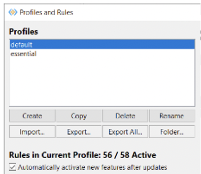
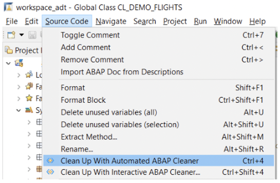
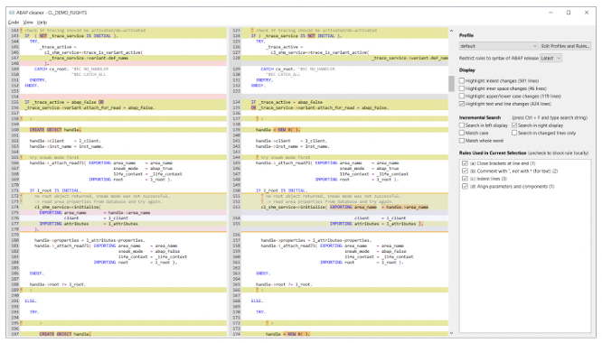
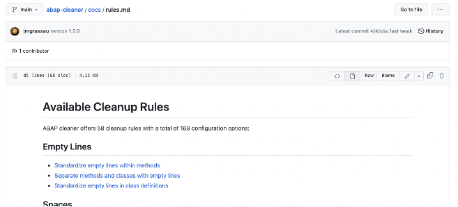
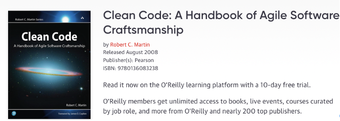
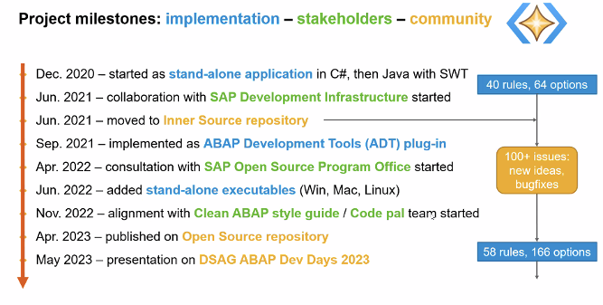

{: .no_toc}

# Entwicklung

1. TOC
{:toc}

## Wieso Sicherheit in ABAP Programmierung wichtig ist?

... Copy Paste... “Motzgrundlage”

Ein SAP-System oder eine ABAP-Laufzeit enthält verschiedene Funktionen für das Identitäts- und Zugriffsmanagement von Benutzern, die ABAP-Programme ausführen. Die Funktionen umfassen:

- Werkzeuge zur Benutzerverwaltung, wie z.B. das Anlegen, Sperren und Löschen von Benutzern gemäß den gängigen Compliance-Standards.
- Verschiedene Authentifizierungsprotokolle, einschließlich Single-Sign-On-Optionen
- Durchsetzung von Passwortrichtlinien und Credential Management für Benutzer
- Ein erweiterbares Rollen- und Berechtigungsmanagement mit der Möglichkeit, individuelle Rollen für Benutzer zu entwerfen und zuzuweisen.
- Implizite Zugriffskontrolle auf Programmebene beim Start eines ABAP-Programms durch Überprüfung der Startberechtigungen der Benutzer
- APIs zur Zugriffskontrolle innerhalb eines Programms und implizite Zugriffskontrolle auf Anweisungsebene für bestimmte APIs (z.B. Zugriff auf das Dateisystem).

SAP hat im Laufe der Zeit verschiedene Sicherheits-APIs und Sicherheitsfunktionen in den funktionalen Kern der Sprache und in die propagierten Frameworks implementiert, um es Programmierern zu ermöglichen, Sicherheitsanforderungen in ABAP-Programmen umzusetzen. Ein ABAP-Entwickler kann oft aus mehreren Anweisungen oder APIs auswählen, um bestimmte Funktionen zu implementieren. Implizite Sicherheitsfunktionen wie Eingabevalidierung und Verschlüsselung variieren ebenfalls je nach dem gewählten Framework. Die folgenden APIs und Sicherheitsframeworks stehen zur Wiederverwendung zur Verfügung:

- OS-Befehlsbeschränkung
- RFC-Callback-Whitelisting
- Vereinheitlichtes Konnektivitäts-Framework (UCON)
- HTTP-Pfad-Whitelist
- Ausgabekodierung und
- Dienstprogramme für die Eingabevalidierung
- Virus-Scan-Schnittstelle
- Zugangskontroll-API
- Protokollierungs-APIs (eine Menge) und implizite Protokollierung

## Sicheres Programmieren

### Top 5 – die schlimmsten „Back Door“ Schwachstellen (Volo)

... Copy Paste... “Motzgrundlage”

### Directory Traversal (Write Access)

Directory-Traversal-Angriffe (Verzeichniswechselangriffe) funktionieren durch Manipulation des Dateinamens oder der Pfadinformationen durch Eingabe von Sonderzeichen in eine Zeichenkette, die als Datei-Locator dient.

Wird eine derartige Zeichenkette zur Abänderung von Inhalten einer Datei verwendet, lässt sich eine Anwendung austricksen und dazu bringen, Dateien zu ändern, auf die der Benutzer keinen Zugriff besitzen sollte. Dieser Angriff ist möglich, da es der Anwendung nicht gelingt, Befehlszeichen in Eingaben zu ermitteln und zu entfernen, die als Bestandteil des Datei-Locators verwendet werden.

Das wirkt sich auf Dateien in allen Verzeichnissen aus, für die die anfällige Anwendung Schreibzugriff besitzt. Darunter können auch Dateien im Unternehmens-LAN fallen. Risiko Durch Kontrolle, welche Dateien eine Anwendung ändern werden, sind mindestens folgende Angriffe möglich:

- Schreibzugriff auf entscheidende Konfigurationsdateien. Dies kann Angreifern zuspielen, noch weiter in ein bereits angegriffenes System einzudringen.
- Schreibzugriff auf Protokolldateien.
- Schreibzugriff auf die Datenpersistenz einer produktiven Datenbank.

Alle diese Risiken gefährden die Integrität des produktiven SAP-Servers. Details Viele Anwendungen greifen auf Dateien auf dem SAP-Server zum Schreiben von Daten zu. Typische Anwendungsfälle umfassen die temporäre Persistenz von Datei-Uploads und den Export von Geschäftsdaten zur Übernahme von einem Altsystem. Auf Betriebssystemebene werden Dateien durch Datei-Locators identifiziert. Diese Datei Locators enthaltenen Angaben über die Laufwerk- oder Dateifreigabe, das Verzeichnis, den Namen und die Endung einer bestimmten Datei. Es gibt Fälle, bei denen ein Teil solcher Datei-Locator-Angaben auf externem Input basiert. Beispielsweise kann der Name einer auf den Server hochgeladenen Datei auch verwendet werden, um diese in einen temporären Ordner zu speichern. Eine externe Eingabe kann jedoch Sonderzeichen enthalten, die sich zur Manipulation des übergreifenden File Locators nutzen lassen. Als Folge hiervon werden Dateien von anderen Laufwerken, Dateifreigaben oder sonstige Verzeichnisse unter Umständen verändert. Auch auf Dateien anderer Dateitypen bzw. Erweiterungen lässt sich ggf. zugreifen. Ein solcher Angriff wird als Directory-Traversal-Angriff bezeichnet. Durch unzulässige Verzeichniswechsel kann ein unbefugter Benutzer beliebige Dateien auf dem SAP-Server ändern, auf dem die anfällige Anwendung ausgeführt wird. Je nach dem Dateizugriffsmodus kann ein Angreifer Daten entweder ändern oder löschen. Diese Schwachstelle führt zu einer unsachgemäßen Verwendung der ABAP-Befehle OPEN DATASET FOR OUTPUT, OPEN DATASET FOR APPENDING, DELETE DATASET, TRUNCATE DATASET und TRANSFER. Über solche Sicherheitslücken lässt sich die Integrität eines produktiven SAP-Servers beeinträchtigen. Ein Angreifer kann Dateien löschen oder ändern, die für den ordnungsgemäßen Systembetrieb von Entscheidung sind. Zusätzlich kann ein Angreifer Dateien ändern und löschen, die Geschäftsdaten enthalten. Auf jeden Fall stellt der unberechtigte Schreibzugriff für beliebige Dateien auf einem Server ein kritisches Sicherheitsrisiko dar. Die Wahrscheinlichkeit einer bestimmten Problematik ändert sich, sofern der Eingabe ein Postfix hinzugefügt wird.

### Generic ABAP Module Calls

Durch die Kontrolle, welche ABAP-Module auf einem SAP-System ausgeführt werden, sind mindestens folgende Angriffe möglich: Absturz des SAP-Anwendungsservers Störung der Geschäftslogik, was zu einem inkonsistentem Datenstand führt Manipulation der Geschäftslogik, was einen unprivilegierten Zugriff auf geschützte Funktionen zur Folge hat Einige dieser Risiken können gegen gesetzliche Vorgaben verstoßen, da solche Schwachstellen den unprivilegierten Zugriff auf kritische Geschäftslogik ermöglichen. Details In ABAP gibt es Befehle, die Transaktionen, Funktionsbausteine, Methoden, Formulare und Berichte dynamisch aufrufen. Dynamisch bedeutet, dass der Name des auszuführenden Bausteins basierend auf den Eingaben zur Laufzeit bestimmt wird. Dynamische Baustein-Aufrufe sind eine wichtige Funktion, um flexiblen und wiederverwendbaren Code zu schreiben. Dies kann jedoch sehr gefährlich sein, wenn ein solcher Baustein durch einen böswilligen Benutzer kontrolliert wird. Findings berücksichtigen das Vorhandenseins eines AUTHORITY-CHECK. Zudem werden indirekte (in Untermodulen aufgerufene) AUTHORITY-CHECKs berücksichtigt. Die Wahrscheinlichkeit einer bestimmten Problematik ändert sich, wenn der Eingabe ein Präfix oder Postfix hinzugefügt wird.

### OS Command Injection (CALL 'SYSTEM')

Dieser Testfall prüft, ob eine (externe) Eingabe als ein Betriebssystembefehl mittels Kernel Funktion 'SYSTEM' ausgeführt wird. In solch einem Fall könnte ein Angreifer beliebige Befehle auf dem SAP-Anwendungsserver ausführen. Risiko Das Ausführen von beliebigen Betriebssystembefehlen kann zu folgenden Risiken führen: Absturz des SAP-Anwendungsserver Installation von Malware Erstellung von privilegierten Benutzerkonten Lese- / Schreibzugriff auf alle Dateien des SAP-Anwendungsservers Details Die Kernel-Funktion 'SYSTEM' ermöglicht die Ausführung von beliebigen Betriebssystembefehlen. Werden hierdurch (externe) Eingaben verarbeitet, wird der standardmäßige SAP-Sicherheitsmechanismus für die Ausführung von Betriebssystembefehlen umgangen. Über die Transaktionen SM49 oder SM69 können Administratoren eine Liste der zulässigen Betriebssystembefehle pflegen und für deren Ausführung entsprechende Berechtigungen zuordnen. Auf diese Weise kann ein Administrator den Zugriff auf gefährliche Befehle einschränken. Die Kernel-Funktion 'SYSTEM' umgeht jedoch die Befehlsliste aus SM49 / SM69. Aus diesem Grund lässt sich mittels der Kernel-Funktion 'SYSTEM' jeder Betriebssystembefehl ausführen. Dies stellt ein kritisches Sicherheitsrisiko dar.

### ABAP Command Injection (Report)

Die ABAP-Befehle INSERT REPORT und SUBMIT können zusammen dynamischen ABAP Code während der Laufzeit erzeugen und ausführen, was zu einem sehr hohen Sicherheitsrisiko werden kann, sofern Benutzereingaben Teil eines solchen dynamischen Berichts sind. Risiko Kann ein Benutzer beliebige ABAP-Befehle auf einem SAP-System ausführen, muss das System als vollständig kompromittiert betrachtet werden: Lese- und Schreibzugriff auf alle (geschäftlichen) Daten in der Datenbank Ausführung einer beliebigen Geschäftslogik Solche Sicherheitslücken stellen Compliance-Verstöße dar. Details Der ABAP-Befehl INSERT REPORT wird zur dynamischen Erzeugung eines ABAP-Reports verwendet. Dies erfolgt durch Verkettung von Zeichenketten, die üblicherweise aus einer Datenquelle gelesen werden. Sobald der ABAP-Report zusammengestellt wurde, kann er mit dem Befehl GENERATE REPORT ausgeführt werden. Eine solche Verfahrensweise der Programmierung ist sehr gefährlich, da hierdurch spontan bösartiger Code erstellt werden kann und keine Spuren dieses Codes im System hinterlassen werden.

### Dangerous ABAP Commands

Bei diesem Testfall wird die Verwendung der ABAP-Befehle EDITOR-CALL FOR REPORT und COMMUNICATION geprüft. Beachten Sie, dass dieser Testfall Ausgangspunkte für die weitere Prüfung ermittelt und eine manuelle Nachbearbeitung erfordert. Risiko Das Geschäftsrisiko hängt von der erkannten Funktionalität ab und muss durch manuelle Analysen bestimmt werden. Details Dieser Testfall betrifft die folgenden ABAP-Befehle: EDITOR-CALL FOR REPORT COMMUNICATION Diese Befehle sind entweder kritisch oder obsolet. Sie sollten auf jeden Fall nicht im eigenentwickelten Code enthalten sein. EDITOR-CALL FOR REPORT ermöglicht den Aufruf eines ABAP-Editors für Quellcode. Besondere Entwicklungsberechtigungen sind dennoch erforderlich. Eigenentwickelter Code sollte keinen ABAP-Code-Editor zur Verfügung stellen. Dies sollte ausschließlich über SAP Standardfunktionen möglich sein, die ordnungsgemäß eingeschränkt und geprüft werden können. COMMUNICATION diente zum Austausch von Systemdaten und wurde verwendet, bevor RFC verfügbar war. Diese Art von Datenaustausch ist obsolet. Unter dem Aspekt der Sicherheit ergibt sich ein Risiko, da Sicherheitsfunktionen wie z. B. SNC nicht für den COMMUNICATION-basierten Datenaustausch verwendet werden können.

## Einführung ABAP Cleaner

“ABAP Cleaner” im Bereich “Sicherheit”? Ja, man könnte meinen da passt was nicht so ganz. Der “ABAP Cleaner” hat sein Hauptanwendungsgebiet auf “Clean Code” / “Clean ABAP”, die Verwendung des”ABAP Cleaners” trägt auch zu Erhöhung der Sicherheit bei der ABAP Code Erstellung bei.

SAP hat Ende Mai 2023 den „ABAP Cleaner“ als generell verfügbar im GITHUB veröffentlicht. wird als Eclipse-AddOn (Erweiterung) zusätzlich zu den SAP ADT (ABAP Development Tools) installiert und bettet sich in diese ein. Die Grundfunktionalität liegt auf Clean Code (siehe auch [Clean ABAP Styleguides der SAP](https://github.com/SAP/styleguides/blob/main/clean-abap/CleanABAP_de.md)), in der aktuellen Version (1.16.1 – Mitte Mai 2023 sind über 75 Checks/CleanUp’s enthalten. Diese können auch auf eigene Bedürfnisse konfiguriert werden. Ebenso ruft SAP aktiv dazu auf, bei Erweiterungswünschen diese via GITHUB an die SAP zu melden. Als „Nebeneffekt“ sind einige Prüfungen im Rahmen von Clean Code/Clean ABAP auch eine Stärkung der Sicherheit innerhalb des ABAP-Codes (z.B. Bereinigung obsoleter Sprachelemente, …). Deshalb sollte der ABAP Cleaner grundsätzlich für die ABAP Codeerstellung verwendet werden.  
Desweiteren soll hier auch auf den ADT Guide der DSAG verweisen werden, dieser enthält weitere nützliche Informationen zu den ABAP Development Tools (ADT) der SAP.

### Installation und Funktion

Die Programmsourcen liegen auf dem [GITHUB Projekt](https://github.com/SAP/abap-cleaner) von SAP. Die [Installation ist auf der Seite](https://github.com/SAP/abap-cleaner#requirements-and-installation) detailliert beschrieben. Voraussetzung für den ABAP Cleaner ist die Installation der SAP ADT (ABAP Development Tools) und des SAPGUI (nur Windows) oder des JAVAGUI.

Der „ABAP Cleaner“ bettet sich vollständig in die ADT in Eclipse ein. Die Korrekturen am erstellten ABAP Code werden über die ADT Funktion „Quick Fix“ umgesetzt.

SAP liefert für die Konfiguration liefert 2 Profile aust: „DEFAULT“ und „ESSENTIAL“, diese können angepasst/erweitert werden (durch kopieren in jeweils eigene Profile). Grundsätzlich liegen diese beiden Profile lokal auf dem Arbeitsplatzrechner, empfohlen wird für beide Profile eine Grundkonfiguration zu machen und dann per Export/Import Funktion entsprechend zu verteilen und damit eine gemeinsame Nutzung zu vereinfachen.

Profile und Regeln
{: .img-caption}

### Funktionsweise

Grundsätzlich kann der ABAP Cleaner im Modus „interaktiv“ und „automatisch“ benutzt werden:

- Die automatische Bereinigung wird mit (Ctrl + 4 oder über das Menü 'Source Code / Clean Up With Automated ABAP Cleaner' ) angestartet.
- Die interaktive Bereinigung mit “Ctrl + Shift + 4 oder über das Menü 'Source Code / Clean Up With Interactive ABAP Cleaner...'.

Interaktiver Modus
{: .img-caption}

Bei der automatischen Bereinigung wird der Code vollautomatisch geprüft und bereinigt.

Bei der interaktiven Bereinigung werden die Codingstrecken im Splitt-Screen angezeigt:

Geteiles Bild
{: .img-caption}

Hier bekommt man dann die einzelnen „Befunde“ angezeigt und kann diese interaktiv bearbeiten/anpassen lassen.

## Regelwerk

Auf der GITHUB Seite sind alle verfügbaren Checks/Clean-Ups im Detail beschrieben. Details siehe „[ABAP Cleaner Rules](https://github.com/SAP/abap-cleaner/blob/main/docs/rules.md)“:

Verfügbare Regeln
{: .img-caption}

## Hintergrundinformationen/Linksammlung

SAP liefert einige Richtlinien und Regeln für „sauberen“ ABAP Code aus:

- den [Clean ABAP Styleguide](https://github.com/SAP/styleguides/blob/main/clean-abap/CleanABAP.md),
- die [Clean Code Checks](https://github.com/SAP/code-pal-for-abap/blob/master/docs/check_documentation.md), wie im Projekt [‚Code Pal for ABAP‘](https://github.com/SAP/code-pal-for-abap/) implementiert,(Erweiterung der Checks für den ATC – ABAP Test Cockpit) – siehe auch im Kapitel “ATC”

Grundlage von Clean ABAP oder den Clean ABAP Styleguides ist das Konzept „Clean Code“ von Robert C. Martin, welches auf die Programmiersprache ABAP angewandt wurde.

Buch Clean Code
{: .img-caption}

 

Der ABAP Cleaner wurde zwar erst im Mai 2023 als „general available“ zur Verfügung gestellt, er hat aber einen “internen” SAP Entwicklungsweg hinter sich:

Projekt Meilensteine
{: .img-caption}

SAP entwickelt den ABAP Cleaner permanent weiter.

Frage von Peter L.

Ist ABAP Cleaner wirklich Sicherheit ?

Verweis auf ADT Leitfaden Plugins – hier ist aBAP Cleaner beschrieben bzw, installation etc, von plugns generell.
