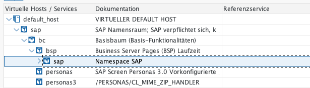
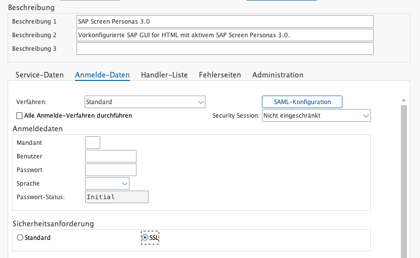
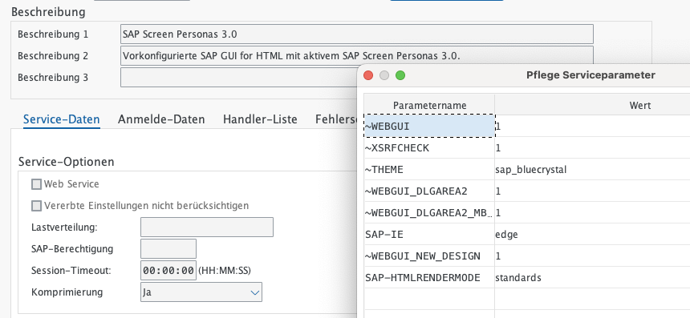
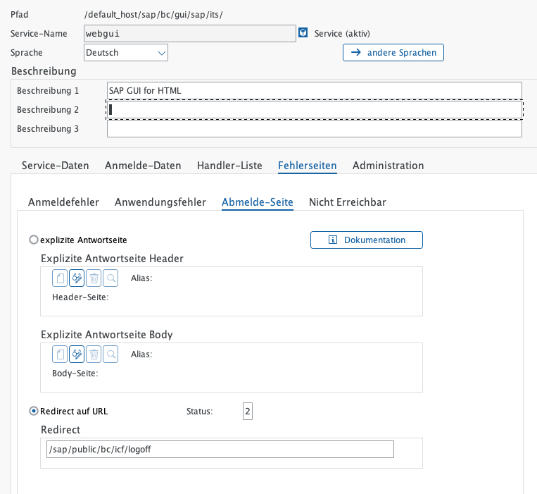
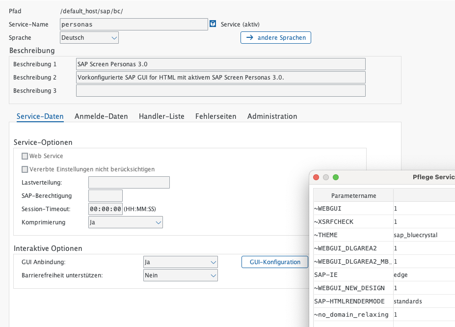
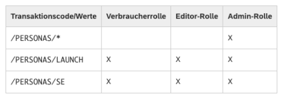
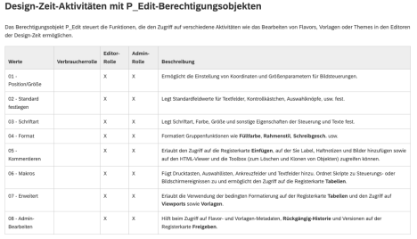
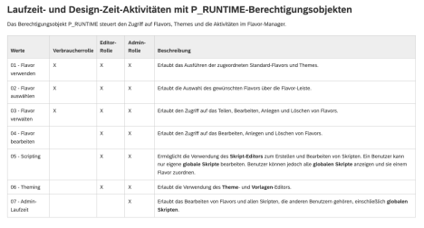

{: .no_toc}

# Sicherheitseinstellungen zu SAP Screen Personas 3.0

1. TOC
{:toc}

## Allgemeines zu "SAP Screen Personas 3.0"

Was ist “SAP Screen Personas 3.0”?

Aus der [SAP Onlinehilfe](https://help.sap.com/docs/SAP_SCREEN_PERSONAS/e9aec5d380204249836a4fc3fc76f38e/d59f3aac0f574537af49f2ce0033bba8.html):

_SAP Screen Personas 3.0 unterstützt die Transformation klassischer Anwendungen in benutzerorientierte UIs, die auf bestimmte Anwendungsrollen und Geschäftsanforderungen zugeschnitten sind. Die vereinfachten Versionen klassischer Anwendungen werden als Flavors bezeichnet. Diese angepassten UIs können für ein oder mehrere Bilder innerhalb einer klassischen Anwendung oder anwendungsübergreifend verwendet werden. Die Flavors sind von den zugrunde liegenden Transaktionen unabhängig und können auf bestimmte Anwendungsrollen ausgerichtet sein. Eine klassische Anwendung kann über mehrere Flavors verfügen. Beispielsweise kann es ein bestimmtes Flavor pro Benutzergruppe geben._

Technisch basiert SAP Screen Personas 3.0 (Personas) auf einem SICF-Service, der einen vorkonfigurierten  Service des SAP GUI for HTML unter dem Standardknoten /sap/bc/personas startet. Die Engine  hat eigene Services unter dem Standardknoten host/sap/bc/se. Das bedeutet die  Sicherheitsmaßnahmen für das SAP GUI for HTML und ITS gelten für Screen Personas und  seine Services grundsätzlich auch.

SICF Service
{: .img-caption}

Bei SAP Screen Personas handelt es sich um eine Benutzungsoberflächen-Technologie, die als  Add-On im Backend-System implementiert wird, Die Sicherheit ist deshalb abhängig von den für dieses System  verfügbaren Funktionen. zu Datenzugriff-Governance oder Datenschutz. Die  meisten dieser Systemfunktionen werden durch die zugrunde liegenden Systemmechanismen  und -richtlinien vorgegeben. Alle für SAP Screen Personas spezifischen Aspekte oder möglichen  Diskrepanzen und Bereiche von besonderem Interesse werden nachfolgend erläutert.

**Spezielle Sicherheitsaspekte für "Screen  personas 3.0"**

**SSL Verschlüsselung der Verbindung**

Die Services welche von Personas verwendet werden sind SSL zu verschlüsseln:

Verschlüsselung
{: .img-caption}

**Schutz vor Cross Site Request Forgery für ITS**

Zum Schutz von Cross Site Requests ist an den Services unter GUI Konfiguration der Parameter  ~XSRFCHECK = 1 zu setzen. Details sind im Hinweis 1481392 beschrieben.

Parametereinstellung
{: .img-caption}

**Allgemeine Empfehlungen für ITS und SAP  GUI for HTML**

**Abmeldung für SAP GUI for HTML aktivieren**

Damit die Abmeldung aus dem HTML GUI sicher funktioniert müssen folgende Dinge beachtet  werden:

- Logoff Service muss in ICF aktiviert werden → Service-Baum /sap/public/bc/icf/logoff  aktivieren
- Im HTML GUI Service sowie in den Personas Services muss als Abmeldeseite der  Logoff Service hinterlegt werden

Abmeldung Web-GUI
{: .img-caption}

Bei der Abmeldeseite des WEBGUI Services den Service /sap/public/bc/icf/logoff als Redirect angeben.

Details sind im SAP Hinweis 1777513 beschrieben (ebenso weitere Hintergrundinformationen)

**Domain Relaxing deaktivieren (falls notwendig)**

Das Domain Relaxing ermöglicht es client-seitigen (zum Beispiel auf einem Browser)  Funktionen oder Anwendungen, mit anderen client-seitigen Funktionen in anderen Client Fenstern zu kommunizieren. Das Domain Relaxing ist nötig, falls Anwendungen von  verschiedenen Backend-Systemen (Servern) am Frontend Daten austauschen müssen. Es muss  dafür gesorgt werden, dass für alle betroffenen Anwendungen die gleiche Client Domain eingestellt ist, da andernfalls vom Client (Browser) ein Zugriffsfehler beim Versuch der  Kommunikation beanstandet wird.

Falls es zu einem solchen Browser-Verhalten kommen sollte, muss das Domain Relaxing  deaktiviert werden. Dazu wird in der GUI-Konfiguration des Services der Parameter  ~no_domain_relaxing hinzugefügt und auf 1 (Eins) gesetzt.

Domain Relaxing
{: .img-caption}

Details sind im SAP Hinweis 2111099 beschrieben (ebenso weitere Hintergrundinformationen)

\=> Einfügen Abschnitt

**SAP Berechtigungen**

SAP Screen Personas 3.0 ist nur dann für einen Benutzer aktiviert, wenn er über die  erforderlichen Berechtigungen basierend auf Benutzerrolle verfügt. Die Rollenzuordnung erfolgt  im Rahmen des regulären Benutzerverwaltungsprozesses. SAP liefert folgende Standardrollen  aus:

• Administrator: **/PERSONAS/ADMIN_ROLE** \- Diese Rolle hat vollständigen Zugriff  auf alle Funktionen, die SAP Screen Personas dem Flavor-Consumer zur Laufzeit zur  Verfügung stehen, kann den Zugriff auf alle Funktionen der Flavor-Builder-Aufgaben zur  Design-Zeit ermöglichen und Administrationsaufgaben in der Administrationsumgebung  ausführen.

• Flavor-Konsument: **/PERSONAS/CONSUMER_ROLE** \- Diese Rolle hat  Berechtigungen für den Zugriff auf Flavors für klassische Anwendungen. Flavor Konsumenten können mit dem Flavor-Manager zwischen Flavors und dem  ursprünglichen Bild wählen und Flavors zwischen dem Flavor-Manager und der Flavor Galerie verschieben.

• Flavor-Builder: **/PERSONAS/EDITOR_ROLE** \- Diese Rolle wird verwendet, um  Flavors und andere benutzereigene Objekte mit Bearbeitungsrechten in allen Design Zeit-Editoren zu erstellen.

SAP liefert die Rollen ohne generiertes Berechtigungsprofil aus, deshalb muss das Profil jeweils  generiert und sehr wahrscheinlich auch angepasst werden.

Grundsätzlich gilt: Die Benutzer müssen immer Zugriff auf den Transaktionscode haben,  zusätzlich zu dem, was ihnen in SAP Screen Personas gehört um eine Funktion innerhalb von  Personas ausführen zu können. Also TCD (Applikationsberechtigung) plus Personas  Berechtigungen müssen vorhanden sein.

Die folgenden Tabellen erläutern, wie Personas die verschiedenen Berechtigungsobjekte zum Erstellen von Flavors verwendet und mit den standardmäßig ausgelieferten Rollen verteilt:

Screen Personas Berechtigungen (Teil 1)
{: .img-caption}

Screen Personas Berechtigungen (Teil 2)
{: .img-caption}

Screen Personas Berechtigungen (Teil 3)
{: .img-caption}