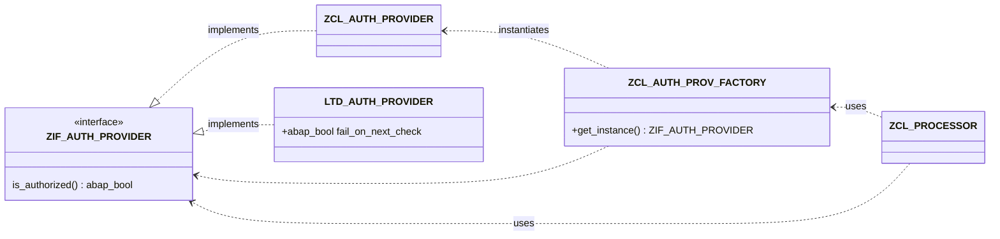

{: .no_toc}
# Grundlagen zu Unit Tests

1. TOC
{:toc}

## Voraussetzungen für ABAP-Unit Tests

Nachdem im vorigen Abschnitt Herausforderungen und Voraussetzungen vor allem organisatorischer Art angesprochen wurden, gehen wir Im Folgenden Abschnitt auf technische Aspekte und Belange ein, die zu berücksichtigen sind um erfolgreich ABAP-Unit Tests zum Einsatz zu bringen.

### Trennung von Datenmodell, Geschäftslogik und Präsentationsschicht

> {: .Zitat }
> "Erst die Funktion implementieren- dann machen wir noch die Unit Tests (wenn dann noch Zeit ist)."

Im SAP-Umfeld hat es sich leider "etabliert", dass alles, was für den Programmablauf benötigt wird, dort passiert, wo es gerade passt. Die Daten werden mit zusätzlichen SELECTS angereichert, aufbereitet und ausgegeben. Bei einem Doppelklick werden weitere Daten gelesen und es wird ein Popup ausgegeben, das den Anwender über irgendetwas informiert. All dies passiert in einem Stück Software, welches als Business Funktion wie in der Geschäftsanforderung beschrieben erstellt wurde und genau diese mit all dem was nötig ist umsetzt.  
So entsteht Code, in der eine Methode ```get_sales_order``` ein BAPI aufruft, der Daten Verbucht nur damit eine Auftragsnummer erstellt werden kann. In dieser klassischen, am Geschäftsprozess orientierten Entwicklung, wie sie viele Jahre üblich war und auch heute noch im Einsatz ist, findet keine Trennung verschiedener Belange gemäß dem "Separation of Concerns"-Prinzips statt-

Eine grundlegende Regel von fachkompetenter Arbeit ist, dass Datenbeschaffung, Geschäftslogik  und Datenausgabe (Präsentationsschicht) in der Anwendung technisch getrennt sind und sich im Code nicht vermischen. In einem Unit Test gibt es keinen Anwender, der eine Info-Meldung wegklicken kann, was das Testen von solchen All-in_one Programmteilen stark erschwert.  

Es gibt Programmbereiche, die nicht mittels Unit Tests überprüft werden können. Dazu gehören alle Programmteile, die von einem Dialog oder anderen Präsentationsfunktionen, wie z.B. ALV-Grid, abhängig sind.  
Eine Trennung von Datenbeschaffung, Geschäftslogik und Anzeige ist in jedem Fall eine Verbesserung für die Softwarequalität. Unit Tests können einfacher umgesetzt werden, wenn vorhandenen Programmen neu strukturiert (refactored) und nach den Regeln von Clean-ABAP geschrieben werden.

Um ein umfangreiches Überarbeiten erstellter Software zu vermeiden, ist daher ein gutes Design der Anwendung, die die Trennung der Belange von Grund auf berücksichtigt und somit auch das Ersetzen nicht zu testender Einheiten (Mocken) ermöglicht, essentiell für die Umsetzung von Unit-Tests. Erläuterungen finden Sie hierzu im Kapitel [MOderne ABAP Entwicklung](/ABAP-Leitfaden/abap/oo-design/#design-und-erstellung-von-sap-anwendungen) und Abschnitt [Testbarkeit durch gutes Design](/ABAP-Leitfaden/abap/oo-design/#testbarkeit-durch-gutes-design).

### Unit Tests sind nicht optional - Unit Tests als Teil der Definition of Done

Erweitern sie Ihre "Definition of Done" und nehmen sie Unit Tests darin auf.  
Es wird langfristig äußerst hilfreich sein das frühzeitige - wenn nicht vorab #TDD - Erstellen von Unit Test in den Entwicklungsprozess zu integrieren. Das spätere Erstellen von Test wird aufgrund von (Projekt-)Zeitdruck kaum funktionieren.\
Jeder Softwareentwickler solle stets die Möglichkeit haben qualitativ hochwertige Software zu erstellen. Hiervon sind automatische Tests ein wichtiger Bestandteil, auch wenn diese Tests länger und umfassender als das eigentliche Programm sein können. Dies ist ein Ausdruck der geschäftlichen Anforderung und Komplexität der Funktion.

### TDD (Test-Driven-Development)

Wenn das Stichwort "Unit Tests" fällt, kommt es fast unweigerlich auch zu dem Thema _Test Driven Development_, kurz _TDD_. TDD ist ein Programmiervorgehen, bei dem - vereinfacht - zuerst definiert wird, welche Eingaben einer Funktion zu welchen Ergebnissen führen soll. Erst danach wird die Implementierung der Funktion realisiert. Durch das zuvor definierte Verhalten kann überprüft werden, ob die gewünschte Funktionalität gegeben ist.

Es geht an dieser Stelle explizit nicht um die Methode des Test Driven Development. Unit Tests können auch dann sinnvoll eingesetzt werden, wenn nicht nach dieser Methode vorgegangen wurde. Das wichtigste ist aus unserer Sicht das Verständnis, wie Unit Tests funktionieren und welche Wichtigkeit sie haben.

## Allgemeines zu Unit Tests - Begriffsdefinitionen und Erläuterungen

### Testlevel

#### Methoden Tests

Tests einzelner Methoden mit dem Fokus die korrekte Arbeitsweise der Methoden sicher zu stellen. Die tests sollten unbedingt unabhägig von der Datenbank ausgeführt werden.  
Aus dieser Definition ergeben sich bereits oft die ersten Grundlagen für ein Refactoring, da viele Methoden mehrere Aufgaben ausführen.
Eine große Anzal oder sehr umfangreiche Unit Tests deuten oft darauf hin, dass sie eine Methode zerlegen sollten.

#### Komponententests

Tests ganzer Klassen oder zusammenhängender Komponenten wie eine Klasse und BAPI zur Verbuchung.
Diese Test sind häufig von der Datenbank abhängig. Hier sollte mit entsprechenden Techniken gearbeitet werden um einen Konsistenten Datenbankzustand für jeden Test herzustellen. 
Hierzu eignen sich die entsprechenden Frameworks der SAP:

- CDS Test Double Framework (Read Access)
- ABAP SQL Test Double Framework (Read and Write Access)  
  siehe [Managing Dependencies with ABAP Unit](https://help.sap.com/docs/ABAP_PLATFORM_NEW/c238d694b825421f940829321ffa326a/04a2d0fc9cd940db8aedf3fa29e5f07e.html?locale=en-US)

#### Integrationstests

Bei Integrationtests werden Teile von oder ganze Prozessen getestet, um das Zusammenspiel der Komponenten abzusichern. 
Diese Tests sind oft davon gekennzeichnet das die Vorbereitung der Ausgangslage an Daten aufwändig ist. Es wird benötigt: Kunde mit Liefersperre, Material ohne bestand, aber mit eingehender Bestellung usw.  
Hier wird eingroßteil der Tests auf eine Effiziente Bereitstellung dieser Testdaten verwendet werden. 

## Vorgehen und Methodik

### Clean Islands

Um zu vermitteln wie eine gute Umsetzung von Unit Tests aussehen kann, können so genannte clean Islands helfen.
Es handelt sich dabei um Pakete oder Klassen die in Bezug auf die Softwarequalität - und auch Unittests - einen vorzeigestatus haben.
Somit diesen sie als Referenz für Teams, Externe und neue Kollegen um analog neue Software zu erstellen.

### Unit Tests modularisieren

Unit Tests bestehen aus Code, der ebenso wie Produktcode modularisiert, gewartet und erweitert werden muss. Es ist fast immer ratsam einen Unit Test in kleine Methoden zu modularisieren, da es in der Natur der Tests liegt das mehrere Fälle identische Ausgangsdaten oder Absicherungen verwenden. Das Ziel muss sein, die Unit Tests übersichtlicher und besser wartbar machen.

>**Empfehlung**  
Erstellen sie jede Testmethode neu. Kopieren Sie keine Methode. Wenn sie nun code benötigen, den Sie bereits geschrieben haben, lagern sie diesen vorerst aus, um ihn in der neuen Testmethode nutzen zu können. Überprüfen sie immer wieder dabei die bisherigen Tests. Eine Engine die in der Lage ist Testdaten in verschiedenen benötigten Fachlichen Konstellationen zu erstellen wird ihnen beim Erstellen von Test sehr gut Dienste Leisten.
{: .highlight}
Es gibt folgende zusätzliche Möglichkeiten, nach denen ebenfalls modularisiert werden kann:

* Methoden zur Zusammenstellung von abhängigen Klassen
* Methoden zum Aufbau von Testdaten
* Methoden zur Modularisierung von Tests


### Datenbankhandling - 

#### Mocken der Datenbankzugriffsobjekte

#### Mocken der Datenbank mit dem OSQL Framewrok 

### Code-Abdeckung (coverage)

In den Entwicklungstools kann nachvollzogen werden, welche Code-Strecken beim Ausführen der Unit Tests durchlaufen wurden. Eine 100%-ige Codeabdeckung sollte dabei das Ziel sein.

Bei vorhandenen Klassen, bei denen nicht auf die Trennung geachtet wurde, ist eine 100%-ige Testabdeckung kaum zu erreichen. Man muss den Aufwand eines Refactorings dem Nutzen entgegenstellen. Wenn eine Klasse keine 100%-ige Testabdeckung hat, ist es sicherlich nicht schlimm, aber es erleichtert die Bewertung, wie vertrauenswürdig Unit Tests zu einem Modul einzustufen sind. Wenn es eine Klasse gibt, die zu 100% Geschäftslogik enthält, dann können Sie bei einer Testabdeckung von 100% relativ sicher sein, dass diese Klasse so funktioniert, wie sie funktionieren soll, wenn wir annehmen, dass die Test korrekt sind.  Wenn eine Klasse jedoch ein Mix aus Geschäftslogik und Datenpräsentation besteht, dann ist es schwer festzustellen, ob Code-Teile nicht gut per Unit Test getestet werden konnten oder ob sie einfach vergessen wurden.


## Exemplarisches schematisches Vorgehen Erstellung einer BAdI Implementierung die mit ABAP Unit Tests unterlegt ist:

- BADI im EWM - Filter und Rundung von Beständen - erklärung aufbau und vergleich kein Unit Test und Implementierung mit Unit test.
- *Schreibt Pete .....
Fachtest:
Beschaffung daten / Aufbau testcase
Sicherheitsnetz
er kann es ausführen ohne Berater und ohne TEstdaten. schneller identifikatinb
weniger Angst was kaputtzumachen

## Weiterführende Links

* [Unit Tests in ABAP](https://help.sap.com/docs/ABAP_PLATFORM_NEW/c238d694b825421f940829321ffa326a/08c60b52cb85444ea3069779274b43db.html?locale=en-US)
* Leseprobe "ABAP To The Future" (Paul Hardy): ABAP Unit and Test Driven Development: <https://tinyurl.com/tddph2>
* [SAP Help "ABAP Unit in Test-Driven Development"](<https://help.sap.com/doc/saphelp_nw75/7.5.5/en-US/4e/c2efe26e391014adc9fffe4e204223/content.htm?no_cache=true>)
* [SAP-Community Blogs: Unit Testing ](https://community.sap.com/t5/forums/searchpage/tab/message?advanced=false&allow_punctuation=false&filter=location&location=blog-board:application-developmentblog-board&q=abap%20unit%20tests)
* [GIVEN - THEN - WHEN (Martin Fowler)](https://martinfowler.com/bliki/GivenWhenThen.html)
* [CACAMBER (Dominik Panzer)](https://github.com/dominikpanzer/cacamber-BDD-for-ABAP)
* [Agile ABAP-Entwicklung von Winfried Schwarzmann - Reinwerk](https://www.rheinwerk-verlag.de/agile-abap-entwicklung)
* [ABAPKoans von Damir Majer](https://github.com/damir-majer/ABAPKoans)

[ABAP Unit Tests - SAP Learning Hub](https://learning.sap.com/learning-journeys/acquire-core-abap-skills/implementing-code-tests-with-abap-unit_b23c7a00-c2e8-406d-8969-b00db3f1fd87)

#  TBD /Notizen / Fragen Anmerkungen zum Kapitel Ecke

### Stichpunkte

* sinnvolle Beispiele
  * Test leiden immer unter (Projekt-)Zeitdruck 
  * Grundsätzlich ist fast alles mit ABAP Unit testbar! 
* NO excuses. 
  * Experten Themen 
  * Unittest / Infrastruktur ausbauen um Aufwand für neue Tests zu verringern. 
* Technik
  * ABAP Unit Tests SAPGUI/ Eclipse
  * Test-Seams
  * Test-Doubles
    * SQL
    * Funktionsbausteine

##### Mermaid Demo
