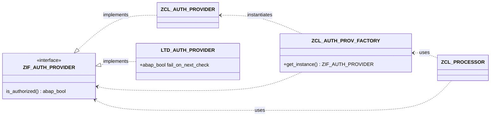

{: .no_toc}
# Testen in SAP 

1. TOC
{:toc}


## Zielgruppe
In diesem Kapitel möchten wir einerseits den Entscheidern und Verantwortlichen Empfehlungen und Hinweise geben, warum ABAP-UNIT Test für die heutige Form der modernen ABAP Programmierung sehr wichtig ist und welchen Nutzen Sie für dieses Investment erhalten können.  
Dieser Leitfaden dient aber auch Entwicklern und Lead-Developern oder vgl. Rollen dazu, ABAP-UNIT Testing sinnvoll einzusetzen, oder falls es noch nicht umfangreich im Einsatz ist, den Einstieg zu erleichtern.  
Vielleicht hilft dieser Leitfaden auch dabei sowohl Entwickler als auch Entscheider zu motivieren, ABAP-UNIT Tests umfangreich im Entwicklungsprozess einzusetzen und die Rahmenbedingungen dafür zu schaffen.

----- raus dann  ----  
== tbd == 
- Management auch relevant
    - return on Invest 
- Hauptzielgruppe Lead / Senior-Entwickler, die motiviert sind 
    - Hilfe zur Selbsthilfe / Lernen
- Rechtfertigen als Quelle nutzen
- Teständerung

------

## Inhalt des Kapitels

Das Thema Testen in SAP ist sehr umfangreich und komplex. Im Rahmen des ABAP-Leitfadens, der moderne ABAP Entwicklung zum Kerninhalt hat, behandeln wir in diesem Kapitel vorrangig das Thema ABAP-UNIT und was aus entwicklungstechnischer Sicht erforderlich ist, sowohl testbare Software im Generellen zu schreiben, aber auch wie ABAP-UNIT Tests gut geschrieben werden können und wie das Vorgehen zur Erstellung von Unit Tests ist. Des Weiteren geben wir Hinweise zu den Herausforderungen und erforderlichen Rahmenbedingungen.  
Ergänzend finden Sie noch ein paar Hinweise zu weiteren Testtools und Methoden, diese werden aber nur kurz angesprochen.  
Unter Unit Tests werden oft verschiedene Definitionen von Tests verstanden. Wenn wir hier von Unit Tests schreiben, handelt es sich um programmierte Tests mit dem ABAP-UNIT Framework, die automatisiert ausgeführt werden können.  
Die manuelle Ausführung einzelner Code Einheiten z.B. mittels SE37 oder SE24 ist hierbei nicht gemeint.


## Einleitung Testing

### Mangelndes Wissen und Qualifikation

Auch im Jahr 2025 bleibt die Herausforderung für Unternehmen bestehen, dass der großteil der SAP Entwickler nur über eine lückenhafte bis nicht vorhandene Ausbildung und Erfahrung im Bereich der automatisierten Softwaretest hat.  
Dies hat eine Vielzahl von Gründen, die vor allem in der Nachfragesituation von SAP Projektkunden liegen. Eine große Anzahl an Fachkräften wird in Beratungsfirmen ausgebildet, diese Fähigkeiten von Kunden nicht nachgefragt sind.  
In vielen extern besetzten Projekten wird durch den hohen Erfolgs- und Zeitdruck auf die vermeintlich optionale Möglichkeit Software durch automatische Tests zu stabilisieren und zu verifizieren verzichtet. Kunden wünsche automatische Tests meist nicht, da sie davon ausgehen, dass diese nicht zu einer Verkürzung der Gesamtentwicklungsdauer beitragen werden. Beratungsfirmen fördern aufgrund der mangelnden Nachfrage diese Fähigkeiten der Entwickler kaum. 
Vielmehr ist es leider teilweise so das Entwickler, die aus eigenem Antrieb / Qualitätbewusstsein oder um sich selber mittelfristig ein Sicherheitsnetz zu erstellen, Unit tests schreiben, somit gegen projektregeln verstoßen und mit Problemen rechnen müssen.

Damit sich Unit Tests in ABAP weiter durchsetzen ist hier in Umdenken aus dem Projektmanagement und bei den Verantwotlichen für den Betrieb von Software nötig.

>Robert C. Martin sagte:  "The only way to go fast is, to go well."

Erst wenn dies in den Organisationen angekommen ist, dass der vermeintliche zusätzliche Aufwand für unit test code kein zusätzlicher Aufwand ist, sondern nur eine Verlagerung der Tätigkeiten vom Fehlersuchen, manuellen Daten erstellen, Testen, hin zur Programmierung, wird es nachhaltig dazu kommen, dass Unit-Test flächendeckend eingesetzt werden. 
Hier sollten wir uns aus dem Bereich SAP vorbilder aus anderen erfolgreichen Unternehmen suchen.

Unit-tests und das Wissen dazu muss sich zu einem geforderten und geprüften Skill etablieren. Für einen ABAP-Entwickler muss analog zu anderen unabdingbaren bauteilen gehören unittests zu erstellen, zu pflegen und weiter zu entwickeln.

### Trennung von Datenmodell, Geschäftslogik und Präsentationsschicht

Im SAP-Umfeld hat es sich leider "etabliert", dass alles, was für den Programmablauf benötigt wird, dort passiert, wo es gerade passt. Die Daten werden mit zusätzlichen SELECTS angereichert, aufbereitet und ausgegeben. Bei einem Doppelklick werden weitere Daten gelesen und es wird ein Popup ausgegeben, das den Anwender über irgendetwas informiert. All dies passiert in einem Stück Software, welches orientiert an der der Business-Funktionen erstellt wurde und genau diese mit all dem was nötig ist umzusetzen. So kommt es zu Code wo eine Methode ```get_sales_order``` durchaus ein BAPI aufruft, der Daten Verbucht nur damit eine Auftragsnummer erstellt werden kann. In dieser klassischen, am Geschäftsprozess orientierten Entwicklung, wie sie viele Jahre üblich war und sich heute auch findet, findet keine Trennung verschiedener Belange statt. 

Eine grundlegende Regel von fachkompetenter Arbeit ist, dass die Geschäftslogik nicht mit der Datenausgabe (Präsentationsschicht) gemischt ist. In einem Unit Test gibt es keinen Anwender, der eine Info-Meldung wegklicken kann, was das Testen von solchen All-in_one Programmteilen stark erschwert. Ein weiterer Aspekt, der von der Geschäftslogik abgekoppelt sein sollte, ist die Datenbeschaffung (Datenmodell).

Es gibt Programmbereiche, die nicht mittels Unit Tests überprüft werden können. Dazu gehören alle Programmteile, die von einem Dialog oder anderen Präsentationsfunktionen wie z.B. ALV-Grid abhängig sind.  
Eine Trennung von Datenbeschaffung, Geschäftslogik und Anzeige ist in jedem Fall eine Verbesserung für die Softwarequalität. Unit Tests können einfacher umgesetzt werden, wenn vorhandenen Programmen neu strukturiert (refactored) und nach den Regeln von Clean ABAP geschrieben werden.

### Unit Tests sind nicht optional

Erweitern sie Ihre "Definition of Done" und nehmen sie Unit Tests darin auf.  
Es wird langfristig äußerst hilfreich sein das frühzeitige - wenn nicht vorab #TDD - Erstellen von Unit Test in den Entwicklungsprozess zu integrieren. Das spätere Erstellen von Test wird aufgrund von (Projekt-)Zeitdruck kaum funktionieren.\
Jeder Entwicker solle stets die Möglichkeit haben qualitativ hochwertige Software zu erstellen. Hiervon sind automatische Tests ein wichtiger Bestandteil, auch wenn diese Tests länger und umfassender als das eigentliche Programm sein können. Dies ist ein Ausdruck der geschäftlichen Anforderung und Komplexität der Funktion.

#### TDD (Test-Driven-Development)

Wenn das Stichwort "Unit Tests" fällt, kommt es fast unweigerlich auch zu dem Thema _Test Driven Development_, kurz _TDD_. TDD ist ein Programmiervorgehen, bei dem - vereinfacht - zuerst definiert wird, welche Eingaben einer Funktion zu welchen Ergebnissen führen soll. Erst danach wird die Implementierung der Funktion realisiert. Durch das zuvor definierte Verhalten kann überpfüt werden, ob die gewünschte Funktionalität gegeben ist.

Es geht an dieser Stelle explizit nicht um die Methode Test Driven Development. Unit Tests können auch dann sinnvoll eingesetzt werden, wenn nicht nach dieser Methode vorgegangen wurde. Das wichtigste ist aus unserer Sicht das Verständnis, wie Unit Tests funktionieren und welche Wichtigkeit sie haben.

## Motivation
Unit Tests helfen dabei, Entwicklungen robuster zu machen. Programmierungen werden dabei automatisiert mit verschiedenen Parametern ausgeführt und auf Korrektheit überprüft. Robustheit und Korrektheit sind zwei Anforderungen, die in der modernen Softwareprogrammierung sehr hoch priorisiert werden sollten. Durch Unit Tests kann automatisiert sichergestellt werden, dass geschäftskritische Prozesse wie erwartet ausgeführt werden.

<<-Warum beschäftigen wir uns mit Unit-Tests?
 - Geschäftskritikalität.>>
 << Unit Test sind der Treiber für Agile Software Entwicklung und schnelle Änderungen => da sie Sicherheit geben. >>

Die Entwickler, die schon einmal eine Änderung an einem Programm gemacht haben und ganz langsam vorsichtig rückwärts wieder raus aus dem Code gegangen sind wissen was es bedeutet, wenn ein Programm nicht wartbar ist.
"Hoffentlich funktioniert noch alles und ich habe nichts kaputt gemacht" Mit jeder dieser Änderungen wird das Programm immer weniger wartbar, weil sich niemand mehr traut Verbesserungen an der Struktur durch zu führen. 
Unit Test bilden hier eine enorme Unterstützung, da sie die Möglichkeit für den Entwickler schaffen zu prüfen, dass alle bisherigen Anforderungen noch wie angefordert funktionieren. 

## Unit Tests als Ausführbar Spezifikation / Fallbeschreibungen

Mit Hilfe von Unit Tests und der Beschreibung dieser Tests lässt sich sehr genau spezifizieren, wie sich die Software unter gegebenen Bedingungen verhalten soll. Diese Tests bieten dann eine Art ausführbare Spezifikation und Dokumentation.

## Allgemeines zu Unit Tests

### Testlevel

#### Methoden Tests

Tests einzelner Methoden mit dem Fokus die korrekte Arbeitsweise der Methoden sicher zu stellen. Die tests sollten unbedingt unabhägig von der Datenbank ausgeführt werden. 
Aus dieser Definition ergeben sich bereits oft die ersten Grundlagen für ein Refactoring, da viele Methoden mehrere Aufgaben ausführen.
Eine große Anzal oder sehr umfangreiche Unit Tests deuten oft darauf hin, dass sie eine Methode zerlegen sollten.

#### Komponententests

Tests ganzer Klassen oder zusammenhängender Komponenten wie eine Klasse und BAPI zur Verbuchung.
Diese Test sind häufig von der Datenbank abhängig. Hier sollte mit entsprechenden Techniken gearbeitet werden um einen Konsistenten Datenbankzustand für jeden Test herzustellen. 
Hierzu eignen sich die entsprechenden Frameworks der SAP:

- CDS Test Double Framework (Read Access)
- ABAP SQL Test Double Framework (Read and Write Access)  
  siehe [Managing Dependencies with ABAP Unit](https://help.sap.com/docs/ABAP_PLATFORM_NEW/c238d694b825421f940829321ffa326a/04a2d0fc9cd940db8aedf3fa29e5f07e.html?locale=en-US)

#### Integrationstests

Bei Integrationtests werden Teile von oder ganze Prozessen getestet, um das Zusammenspiel der Komponenten abzusichern. 
Diese Tests sind oft davon gekennzeichnet das die Vorbereitung der Ausgangslage an Daten aufwändig ist. Es wird benötigt: Kunde mit Liefersperre, Material ohne bestand, aber mit eingehender Bestellung usw.  
Hier wird eingroßteil der Tests auf eine Effiziente Bereitstellung dieser Testdaten verwendet werden. 


### Clean Islands

Um zu vermitteln wie eine gute Umsetzung von Unit Tests aussehen kann, können so genannte clean Islands helfen.
Es handelt sich dabei um Pakete oder Klassen die in Bezug auf die Softwarequalität - und auch Unittests - einen vorzeigestatus haben.
Somit diesen sie als Referenz für Teams, Externe und neue Kollegen um analog neue Software zu erstellen.

### Unit Tests modularisieren

Unit Tests bestehen aus Code, der ebenso wie Produktcode modularisiert, gewartet und erweitert werden muss. Es ist fast immer ratsam einen Unit Test in kleine Methoden zu modularisieren, da es in der Natur der Tests liegt das mehrere Fälle identische Ausgangsdaten oder Absicherungen verwenden. Das Ziel muss sein, die Unit Tests übersichtlicher und besser wartbar machen.

>**Empfehlung**  
Erstellen sie jede Testmethode neu. Kopieren Sie keine Methode. Wenn sie nun code benötigen, den Sie bereits geschrieben haben, lagern sie diesen vorerst aus, um ihn in der neuen Testmethode nutzen zu können. Überprüfen sie immer wieder dabei die bisherigen Tests. Eine Engine die in der Lage ist Testdaten in verschiedenen benötigten Fachlichen Konstellationen zu erstellen wird ihnen beim Erstellen von Test sehr gut Dienste Leisten.

{: .highlight}
Es gibt folgende zusätzliche Möglichkeiten, nach denen ebenfalls modularisiert werden kann:

* Methoden zur Zusammenstellung von abhängigen Klassen
* Methoden zum Aufbau von Testdaten
* Methoden zur Modularisierung von Tests


### Code-Abdeckung (coverage)

In den Entwicklungstools kann nachvollzogen werden, welche Code-Strecken beim Ausführen der Unit Tests durchlaufen wurden. Eine 100%-ige Codeabdeckung sollte dabei das Ziel sein.

Bei vorhandenen Klassen, bei denen nicht auf die Trennung geachtet wurde, ist eine 100%-ige Testabdeckung kaum zu erreichen. Man muss den Aufwand eines Refactorings dem Nutzen entgegenstellen. Wenn eine Klasse keine 100%-ige Testabdeckung hat, ist es sicherlich nicht schlimm, aber es erleichtert die Bewertung, wie vertrauenswürdig Unit Tests zu einem Modul einzustufen sind. Wenn es eine Klasse gibt, die zu 100% Geschäftslogik enthält, dann können Sie bei einer Testabdeckung von 100% relativ sicher sein, dass diese Klasse so funktioniert, wie sie funktionieren soll, wenn wir annehmen, dass die Test korrekt sind.  Wenn eine Klasse jedoch ein Mix aus Geschäftslogik und Datenpräsentation besteht, dann ist es schwer festzustellen, ob Code-Teile nicht gut per Unit Test getestet werden konnten oder ob sie einfach vergessen wurden.


## Weiterführende Links

* [Unit Tests in ABAP](https://help.sap.com/docs/ABAP_PLATFORM_NEW/c238d694b825421f940829321ffa326a/08c60b52cb85444ea3069779274b43db.html?locale=en-US)
* Leseprobe "ABAP To The Future" (Paul Hardy): ABAP Unit and Test Driven Development: <https://tinyurl.com/tddph2>
* [SAP Help "ABAP Unit in Test-Driven Development"](<https://help.sap.com/doc/saphelp_nw75/7.5.5/en-US/4e/c2efe26e391014adc9fffe4e204223/content.htm?no_cache=true>)
* [SAP-Community Blogs: Unit Testing ](https://community.sap.com/t5/forums/searchpage/tab/message?advanced=false&allow_punctuation=false&filter=location&location=blog-board:application-developmentblog-board&q=abap%20unit%20tests)
* [GIVEN - THEN - WHEN (Martin Fowler)](https://martinfowler.com/bliki/GivenWhenThen.html)
* [CACAMBER (Dominik Panzer)](https://github.com/dominikpanzer/cacamber-BDD-for-ABAP)
* [Agile ABAP-Entwicklung von Winfried Schwarzmann - Reinwerk](https://www.rheinwerk-verlag.de/agile-abap-entwicklung)


https://learning.sap.com/learning-journeys/acquire-core-abap-skills/implementing-code-tests-with-abap-unit_b23c7a00-c2e8-406d-8969-b00db3f1fd87

#  TBD /Notizen / Fragen Anmerkungen zum Kapitel Ecke

### Stichpunkte

* sinnvolle Beispiele
  * Test leiden immer unter (Projekt-)Zeitdruck 
  * Grundsätzlich ist fast alles mit ABAP Unit testbar! 
* NO excuses. 
  * Experten Themen 
  * Unittest / Infrastruktur ausbauen um Aufwand für neue Tests zu verringern. 
* Technik
  * ABAP Unit Tests SAPGUI/ Eclipse
  * Test-Seams
  * Test-Doubles
    * SQL
    * Funktionsbausteine

##### Mermaid Demo

