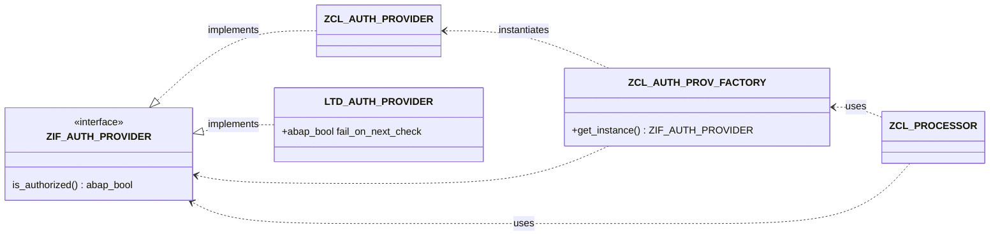

{: .no_toc}
# Testen

1. TOC
{:toc}


## Zielgruppe
- Management auch relevant
    - return on Invest 
- Hauptzielgruppe Lead / Senior-Entwickler, die motiviert sind 
    - Hilfe zur Selbsthilfe / Lernen
- Rechtfertigen als Quelle nutzen 
- Teständerung


## Abgrenzungen 
* Was betrachten wir nicht. ! Am Ende schreiben !
Mit jeder Form von Test die hier erläutert wird ist nicht gemeint, das es ein Programm / App gibt womit erstellter ABAP Code "ausprobiert" werden kann. 
Diese Form von Test hat nichts mit dem professionellen testing von ABAP gemein. 


## Mangelndes Wissen und Qualifikation
Auch im Jahr 2025 bleibt die Herausforderung für Unternehmen bestehen, dass der großteil der SAP Entwickler nur über eine Lückenhafte bis nicht vorhandene Ausbildung und Erfahrung im Bereich der automatisierten Softwaretest hat. 
Dies hat eine Vielzalh von Gründen, die vor allem in der Nachfragesituation von SAP Projektkunden liegen, da eine große Anzahl an Fachkräften in Beratungsfirmen ausgebildet werden, wo von Kunden diese Fähigkeiten nicht nachgefragt sind. 
In vielen Extern besetzten Projekten wird durch den hohen erfolgs und Zeitdruck auf die vermeindlich optionale Möglichkeit software durch autmatische Tests zu verbessern verzichtet. 
Kunden wünsche dies oft nicht, da sie davon ausgehen, dass die nicht zu einer Verkürung der Gesamtentwicklungsdauer beitragen wird. Beratungen fördern aufgrund der mangelnden Nachfrage diese Fähigkeiten der Entwickler viel zu wenig. 
Vielmehr ist es leider schon so das Entwickler, die aus eigenem Antrieb / Qualitätbewustsein oder um sich selber mittelfristig arbeit zu sparen Unit tests erstellen somit gegen projektregeln verstoßen und mit problemen rechnen müssen. 

Damit sich Unit Tests in ABAP weiter durchsetzen ist hier in Umdenken aus dem Projektmanagement und bei den Verantworlichen für den Betrieb von Software nötig. 
Robert C. Martin sagte "The only way to go fast is, to go well" 
Erst wenn dies in den Organisationen angekommen ist dass der vermeintliche zusätzliche Aufwand für unit test code kein zusätzlicher Aufwand ist, sondern nur eine Verlagerung der Tätigkeiten vom Fehlersuchen, manuellen Daten erstelen, Testen, hin zur programmierung, wird es nachhaltig dazu kommen dass Unitest flächendeckend eingesetzt werden. 
Hier sollten wir uns aus dem Bereich SAP vorbilder aus anderen erfolgreichen Unternehmen suchen. 

** tmplade Agilität wird nicht zurende eingesetzt.  nur änderungen am laufenden band alles andere wird nicht umgesetzt **

Unittetst und das Wissen dazu muss sich zu einem nötignen und geprüften Skill etablieren. Für einen ABAP entwickler muss analog zu anderen unabdingbaren bauteilen gehören unittests zu erstellen, zu pflegen und weiter zu entickeln. 

** template: ausbau wissen ABAP OO +++


### Trennung von Datenmodell, Geschäftslogik und Präsentationsschicht

Im SAP-Umfeld hat es sich leider "etabliert", dass alles, was für den Programmablauf benötigt wird, dort passiert, wo es gerade passt. Die Daten werden Selektiert, mit zusätzlichen SELECTS angereichert, aufbereitet und ausgegeben. Bei einem Doppelklick werden weitere Daten gelesen und es wird ein Popup ausgegeben, das den Anwender über irgendetwas informiert. 

Eine grundlegende Voraussetzung von Unit Tests ist, dass die Geschäftslogik nicht mit der Datenausgabe (Präsentationsschicht) gemischt ist. In einem Unit Test gibt es keinen Anwender, der eine Info-Meldung wegklicken kann!

Ein weiterer Aspekt, der von der Geschäftslogik abgekoppelt sein sollte, ist die Datenbeschaffung (Datenmodell). 

Es gibt Programmbereiche, die nicht mittels Unit Tests überprüft werden können. Dazu gehören alle Programmteile, die auf einen Dialog angewiesen sind oder Daten Darstellen (ALV-Grid). Wenn Unit Tests sinnvoll eingesetzt werden sollen, dann muss möglichst von Anfang an darauf geachtet werden, dass die Geschäftslogik von allem anderen getrennt ist. Wenn Unit Tests in vorhandenen Programmen eingesetzt werden sollen, muss eventuell das bestehende Coding refakturiert werden. 

### Code-Abdeckung
In den Entwicklungstools kann nachvollzogen werden, welche Code-Strecken beim Ausführen der Unit Tests durchlaufen wurden. Eine 100%-ige Codeabdeckung sollte dabei das Ziel sein.

Bei vorhanden Klassen, bei denen nicht auf die Trennung geachtet wurde, ist eine 100%-ige Testabdeckung kaum zu erreichen. Man muss den Aufwand einer Refakturing dem Nutzen entgegenstellen. Wenn eine Klasse keine 100%-ige Testabdeckung hat, ist es sicherlich nicht schlimm, aber es erleichetet die Bewertung, wie vertrauenswürdig Unit Tests zu einem Modul einzustufen sind. Wenn es eine Klasse gibt, die zu 100% Geschäftslogik enthält, dann kann man mit einer Testabdeckung von 100% relativ sicher sein, dass diese Klasse so funktioniert, wie sie funktionieren soll. Wenn eine Klasse jedoch ein Mix aus Geschäftslogik und Datenpräsentation besteht, dann ist es schwer festzustellen, ob Code-Teile nicht gut per Unit Test getestet werden konnten oder ob sie einfach vergessen wurden.

Bei anfälligen, kritischen oder komplexen Methoden kann es sinnvoll sein, nur für diese Unit Tests zu erstellen und die restlichen Methoden der Klasse ausser Acht zu lassen.


### Testen von privaten, geschützten und öffentlichen Methoden
Es gibt die Meinung, dass nur öffentliche Methoden getestet werden sollten. Über die Codeabdeckung kann analysiert werden, ob alle Codestrecken durchlaufen wurden.

Allerdings kann das Bereitstellen der notwendigen Daten sehr aufwändig sein, so dass es sinnvoll sein kann, die kleineren Einheiten (private und geschützte Methoden) zu testen. Zudem "verwässern" umfangreiche Datenkonstellationen den Zweck eines Unit Tests.

Beispiel Adressaufbereitung: Nehmen wir an, wir haben eine Klasse, die Adressen entgegen nimmt und analysiert. Die eine Methode ```SEPARATE_HOUSENO_FROM_STREET``` haben wir bereits kennengelernt. Zusätzlich gibt es eine Methode ```CHECK_POST_CODE```, die sicherstellen soll, dass die Postleitzahl 5-stellig ist und nur aus Zahlen besteht. Wenn beide privaten Methoden von der öffentlichen Methode ```CHECK_ADDRESS``` aufgerufen werden, müssen wir zum Testen immer eine komplette Adresse übergeben. Einfacher und auch deutlicher ist es, wenn wir die privaten Methoden separat testen.

### Unit Tests erweitern
Wenn wir uns das Beispiel mit dem Ermitteln der Hausnummer ansehen, dann gibt es viele Fallstricke, die ein unerwartetes Ergebnis hervorrufen können. Die Eingaben, die zu einem fehlerhafte Ergebnis führen, kennen wir im Vorfeld jedoch nicht. Wir lernen sie erst kennen, wenn sich Anwender beschweren, die ein falsches Ergebnis erhalten. In diesem Fall können die Eingaben, die zu fehlerhaften Ausgaben geführt haben, in einen Unit Test aufgenommen werden. Nach der Änderung des Codings werden alle bereits definierten Unit Tests durchgeführt und der Entwickelnde kann sicher sein, dass alles wie zuvor funktioniert.

### GIVEN - WHEN - THEN
GIVEN-WHEN-THEN ist ein Stil, um Unit Test zu formulieren. Mit GIVEN wird eine Bedingung angegeben, unter denen der Test stattfinden soll. WHEN beschreibt die Aktion, die durchgeführt wird und THEN beschreibt das erwartete Ergebnis.

Bezogen auf unser Beispiel mit der Hausnummer könnte die Formulierung heißen:
GIVEN: ABC-Straße 13
WHEN: die Hausnummer aus diesem String ermittelt wird
THEN: Sollte die Hausnummer 13 sein

Link: [CACAMBER - the BDD-Framework for ABAP](https://github.com/dominikpanzer/cacamber-BDD-for-ABAP)


### Unit Test Klasse
* Beschreibung, wie eine Klasse aufgebaut ist
* Risklevel
* Duration
* erstellen in
  * Eclipse
  * SE80
* SETUP 
* TEARDOWN
* FOR TESTING
  * RAISING cx_static_check
* genereller Ablauf

### ASSERT
* Vorstellung CL_ABAP_UNIT_ASSERT

### RAISING cx_static_check

[SAP empfiehlt](https://help.sap.com/doc/saphelp_crm700_ehp03/7.0.3.11/de-DE/dd/587324e2424b14ab5afb3239a77a8d/frameset.htm): Wenn der zu testende Code in der Lage ist, eine Ausnahme auszulösen, sollte die Testmethode selbst diese nicht behandeln, sondern sie in ihrer Signatur deklarieren (abgesehen von provozierten Ausnahmen), so dass der Testfall fehlschlägt, wenn er zur Laufzeit auftritt. 

### Beispiel Testklasse

Das folgende Beispiel zeigt die Testklasse zu der globalen Klasse `ZCL_ADDRESS`, in der die Methode `SPLIT_ADDRESS` dafür zuständig ist, einen String, der Adresse und Hausnummer enthält, in die Bestandteile `Straße` und `Hausnummer` aufzuteilen.

```
CLASS ltcl_verify_addresses DEFINITION FINAL FOR TESTING
  DURATION SHORT
  RISK LEVEL HARMLESS.

  PRIVATE SECTION.
    DATA cut TYPE REF TO zcl_address.
    METHODS:
      setup,
      strasse_17_juni FOR TESTING,
      abc_strasse FOR TESTING,
      parkallee FOR TESTING.
ENDCLASS.


CLASS ltcl_verify_addresses IMPLEMENTATION.

  METHOD strasse_17_juni.
    DATA(address) = cut->split_address( |Straße des 17. Juni 134| ).
    cl_abap_unit_assert=>assert_equals(
      exp = |Straße des 17. Juni|
      act = address-street ).
    cl_abap_unit_assert=>assert_equals(
      exp = |134|
      act = address-house_no ).
  ENDMETHOD.

  METHOD abc_strasse.
    DATA(address) = cut->split_address( |ABC-Straße 89| ).
    cl_abap_unit_assert=>assert_equals(
      exp = |ABC-Straße|
      act = address-street ).
    cl_abap_unit_assert=>assert_equals(
      exp = |89|
      act = address-house_no ).
  ENDMETHOD.

  METHOD parkallee.
    DATA(address) = cut->split_address( |Parkallee 11 a-f| ).
    cl_abap_unit_assert=>assert_equals(
      exp = |Parkallee|
      act = address-street ).
    cl_abap_unit_assert=>assert_equals(
      exp = |11 a-f|
      act = address-house_no ).
  ENDMETHOD.

  METHOD setup.
    cut = NEW #( ).
  ENDMETHOD.

ENDCLASS.
```

### Unit Tests modularisieren

Unit Tests sind auch Programme, die sorgfältig geplant, benannt, gewartet und erweitert werden müssen. Je nachdem, wie umfangreich die zu testenden Einheiten sind, kann es sinnvoll sein, Teile davon zu modularisieren. Das Ziel muss sein, die Unit Tests übersichtlicher und besser wartbar machen.

Es gibt folgende Möglichkeiten, nach denen modularisiert werden kann:
* Methoden zur Zusammenstellung von abhängigen Klassen
* Methoden zum Aufbau von Testdaten
* Methoden zur Modularisierung von Tests

#### Methoden zur Zusammenstellung von abhängigen Klassen

Bei komplizierten Testfällen müssen eventuell umfangreiche Vorarbeiten getan werden, damit die eigentlichen Tests durchgeführt werden können. Es sollten zwar so wenig Abhängigkeiten wie möglich vorhanden sein, aber gänzlich vermeiden lassen sich Abhängigkeiten leider nicht immer. Hilfsmethoden können helfen, das notwendige Setup für einen Test vorzubereiten.

**Beispiel:**

Die Methode `prepare_setup( ).` erstellt zwei Instanzen, die zur Verifizierung der Adresse notwendig sind:
* Strassenverzeichnis
* Postleitzahlenkatalog

#### Hilfsmethoden zum Aufbau von Testdaten

Wenn Testdaten aus vielen Komponenten bestehen (Kopfdaten, Positionsdaten, Partner, Materialien usw.), dann kann das Zusammenstellen dieser Daten umfangreich werden. Entsprechende Hilfsmethoden können die Zusammenstellung erleichtern.

**Beispiel:**

Die Methode `get_setup_for_document( i_doc_id = 123 ).` stellt alle notwendigen Daten zur Verfügung, die zu dem geforderten Dokument gehören.

#### Hilfsmethoden zur Modularisierung von Tests

Bei Tests kann es notwendig sein, dass nicht nur ein Aspekt des Ergebnisses  getestet wird, sondern viele. Solche Programmierungen können in der Regel gut in Methoden ausgelagert werden.

**Beispiel:**

Die Methode `verify_address_is_valid( i_address = data ).` prüft nicht nur, ob Straßenname und Hausnummer erfolgreich extrahiert werden konnten, sondern auch, ob die Postleitzahl aus fünf Zahlen besteht und mit dem Ortsnamen übereinstimmt.


#### Beispiel Testklasse mit Hilfsmethode

In diesem Beispiel wird die Demoklasse aus dem vorherigen Kapitel, die eine Adresse in ihre Bestandteile Straße und Hausnummer aufteilt, aufgegriffen. Diese Klasse hat drei Testmethoden für einzelne Varianten. Da das Schema immer das gleiche ist, wäre es einfacher, wenn die Straßennamen und Hausnummern zusammengesetzt und dann in einer Methode getestet würden. 

Also zum Beispiel:

`verify_address( strasse = 'Beispielstraße'  house_number = '23' )`.

Die Testklasse könnte dann wie folgt aussehen:

```
CLASS ltcl_verify_addresses_helper DEFINITION FINAL FOR TESTING
  DURATION SHORT
  RISK LEVEL HARMLESS.

  PRIVATE SECTION.
    DATA cut TYPE REF TO zcl_address.
    METHODS:
      setup,
      verify_address
        IMPORTING
          i_street   TYPE string
          i_house_no TYPE string,

      test_german_standards FOR TESTING.
ENDCLASS.


CLASS ltcl_verify_addresses_helper IMPLEMENTATION.

  METHOD test_german_standards.

    verify_address( i_street = |Straße des 17. Juni| i_house_no = |134| ).
    verify_address( i_street = |ABC-Straße| i_house_no = |89| ).
    verify_address( i_street = |Parkallee| i_house_no = |11 a-f| ).
  ENDMETHOD.

  METHOD setup.
    cut = NEW #( ).
  ENDMETHOD.

  METHOD verify_address.

    DATA(address_string) = |{ i_street } { i_house_no }|.
    DATA(address_result) = cut->split_address( address_string ).
    cl_abap_unit_assert=>assert_equals(
      exp = i_street
      act = address_result-street
      msg = |Streetname should be { i_street }| ).
    cl_abap_unit_assert=>assert_equals(
      exp = i_house_no
      act = address_result-house_no
      msg = |House number should be { i_house_no }| ).

  ENDMETHOD.

ENDCLASS.
```

Die Testklasse enthält nun nur noch die eine Testmethode `TEST_GERMAN_STANDARDS`, in der alle Tests durchgeführt werden.

Es gibt eine Hilfsmethode `VERIFY_ADDRESS`, die einen Straßennamen und eine Hausnummer entgegennimmt, diese zusammensetzt und durch die zu testende Methode `SPLIT_ADDRESS` wieder aufteilen lässt. Da ein Testfall nun nicht mehr 1:1 einer Testmethode entspricht, wurde der Parameter `MSG` von `CL_ABAP_UNIT_ASSERT=>ASSERT_EQUALS` verwendet, um direkt auf den Fehlerhaften Testfall hinweist.

Die Testklasse ist nun deutlich übersichtlicher und die Testfälle sind auf einen Blick gut erkennbar.

Diese Variante erlaubt es, auch weiterhin Tests durchzuführen, die nach einem anderen Schema funktionieren. 

Hinweis: Dies ist keine Empfehlung, alle Tests in einer Testmethode unterzubringen. Das Beispiel soll lediglich aufzeigen, dass Hilfsmethoden genutzt werden können, um die Unit Tests kompakter, besser wartbar und lesbarer zu gestalten.

### Mocking, faking, spying und stubbing

Eine wichtige Eigenschaft von testbarem Code ist, dass (Geschäfts-)Logik, Datenbeschaffung und Präsentation strikt getrennt sind. Wenn dies gewährleistet ist, dann können abhängige Klassen durch nicht-produktive Objekte ersetzt werden. Diese Objekte können unterschiedliche Aufgaben haben und werden dementsprechend benannt. Die folgenden Arten sind möglich:
* Mock
* Stub
* Faker
* Spy

#### Mock

Ein Mock-Objekt ist ein Objekt, dass dynamisch auf die Eingaben der Aufrufers reagieren kann. Ein Mock-Objekt kann zum Beispiel eine Abfrage in einem externen System oder der Datenbank imitieren und testfallabhängig die gewünschten Daten liefern. 

#### Stub

Ein Stub ist ein Objekt mit minimaler Implementierung der zum Testen notwendigen Methoden. Dieses Objekt ist nur dazu da, um den fehlerfreien Aufruf der zu testenden Methoden zu gewährleisten. 

#### Fake

Ein Fake-Objekt liefert notwendige Daten nach einem vereinfachten Algorithmus. Beispielsweise könnte das Echte Objekt eine umfangreiche Postleitzahlenprüfung vornehmen, bei der Geodaten, Ortsteile und Postleitzahlen auf Grundlage verschiedener Dienste verifiziert werden. Der entsprechende Faker könnte einfache Prüfungen machen, die für die Durchführung der Tests ausreichend sind.

#### Spy

Ein Spion-Objekt kann Eigenschaften von Stubs, Fakes und Mocks enthalten, übernimmt jedoch zusätzlich noch die Funktion, Zugriffe zu protokollieren. So könnte ein Spy zum Beispiel beim Testen aufgerufen werden; es wird jedoch nicht direkt das Ergebnis geprüft, sondern nur, ob diese Methode aufgerufen wurde. Dieser Typ wird gerne verwendet, um sicherzustellen, dass bei bestimmten Aktionen E-Mails oder andere Nachrichten verschickt worden wären. 

#### Links

* [Martin Fowler - Mocks Aren't Stubs](https://www.martinfowler.com/articles/mocksArentStubs.html)

### Test-Doubles

Die Verwendung von Test-Doubles ist notwendig, wenn Abhängigkeiten bestehen, die nicht ausreichend aufgelöst wurden oder aufgelöst werden konnten. Mit entsprechenden Test-Double-Frameworks kann das Ergebnis von Datenbankzugriffe oder Funktionsbausteinaufrufen gefälscht werden. 

Test-Double-Frameworks sind in der Regel umständlich zu bedienen und sehr unübersichtlich. Mit vielen Definitionen und Methoden müssen Eingabeparameter und die gewünschten Ergebnisse vorgegeben werden. Wenn möglich sollten Sie die Abhängigkeiten eliminieren um auf die Verwendung von Test-Doubles verzichten zu können. Dies ist jedoch nicht immer möglich. Deswegen stehen Test-Double-Frameworks für folgende Objekte zur Verfügung:
* Datenbankzugriffe (oSQL)
* Funktionsbausteine

#### Test-Double-Framework für Datenbankzugriffe

tbd

#### Test-Double-Framework für Funktionsbausteine

tbd

### Test-Seams

TODO: Variante der Test-Doubles oder eigene Technik?


### Testumgebung

Die ABAP-Unit-Tests können aus der SAP-Entwicklungsumgebung (SE80, SE24) oder den ABAP-Development-Tools heraus verwendet werden. Die Vorgehensweise unterscheidet sich nur in Kleinigkeiten. Die Techniken, die zur Erstellung notwendig sind, ähneln sich jedoch stark. Unit Test, die in der SE80 erstellt wurden, können auch in Eclipse gewartet und getestet werden und umgekehrt. Die Tastenkombination zum Ausführen der Unit Test ist in beiden Tools STRG + SHIFT + F10. Andere Funktionen sind in der ABAP Workbench teilweise nur durch das Menü erreichbar während es im ADT eine Tastenkombination dafür gibt.

In den folgenden Kapiteln werden diese Themen behandelt:
* Erstellen von Unit Tests
* Ausführen von Unit Tests
* Ergebnisanzeige
* Codeabdeckung (Code Coverage)

Wir gehen davon aus, dass Sie Erfahrung mit dem jeweiligen Tool haben. Aus diesem Grund erfolgt keine Schritt-für-Schritt-Anleitung, sondern lediglich eine grobe Darstellung des Vorgehens.

#### Tastenkombinationen

ADT

* Ctrl + Shift + F9: Unit Test Preview anzeigen
* Ctrl + Shift + F10: Unit Tests ausführen
* Ctrl + Shift + F11: Unit Tests mit Coverage ausführen
* Ctrl + Shift + F12: Unit Test Ausführungsdialog aufrufen
* Ctrl + Shift + (F2: ATC-Prüfung mit Standardvariante ausführen)

ABAP Workbench

* Ctrl + Shift + F10: Unit Tests ausführen
* Ctrl + Shift + F11: Lokale Testklassen anzeigen (nur formularbasierter Editor)
* Ctrl + F11: Lokale Testklassen anzeigen (nur Quelltext-basierter Editor)

#### Eclipse

* Öffnen globale Klasse
* Tab "Test Classes"
* Muster testClass


#### SAPGUI/ SE80

* Öffnen globale Klasse SE24/ SE80
* Menü: Utilities - Test Classes - Generate

### Hilfreiche Tipps

#### Mockdaten aus DB-Tabelle erstellen in Eclipse

#### Testdatenverwaltung in ECATT-Containern


### Weiterführende Links
* Leseprobe "ABAP To The Future" (Paul Hardy): ABAP Unit and Test Driven Development: <https://tinyurl.com/tddph2>
* SAP Help "ABAP Unit in Test-Driven Development": <https://help.sap.com/doc/saphelp_nw75/7.5.5/en-US/4e/c2efe26e391014adc9fffe4e204223/content.htm?no_cache=true>
* SAP-Community Blogs: <https://community.sap.com/t5/forums/searchpage/tab/message?advanced=false&allow_punctuation=false&filter=location&location=blog-board:application-developmentblog-board&q=abap%20unit%20tests>
* GIVEN - THEN - WHEN (Martin Fowler): https://martinfowler.com/bliki/GivenWhenThen.html
* CACAMBER (Dominik Panzer): https://github.com/dominikpanzer/cacamber-BDD-for-ABAP

### Stichpunkte
    
* Motivation, Benefits aufzeigen
* Nötige Skills
  * Gutes ABAP OO design ist Grundlage 
* ABAP OO 
  * Unit test erfordern einen höheren Level an OO-Skills 
    * Beispiel RFC Funktionsbaustein, mit OO versorgen.
* ABAP Unit Tests sind nicht optional.
  * Definition of Done erweitern und unit tests mit aufnehmen
  * Kultur einhalten
* sinnvolle Beispiele
  * Test leiden immer unter (Projekt-)Zeitdruck 
  * Grundsätzlich ist fast alles mit ABAP Unit testbar! 
* NO excuses. 
  * Experten Themen 
  * Unittest / Infrastruktur ausbauen um Aufwand für neue Tests zu verringern. 
* Technik
  * ABAP Unit Tests SAPGUI/ Eclipse
  * Test-Seams
  * Test-Doubles
    * SQL
    * Funktionsbausteine

## Testunterstützung:
* Ecatt? 
  * Wohl nicht mehr relevant
* TestdatenContainer Ecatt für Testdaten 
  * Nutzen für CDS /DB Mocks
* Andere TestFriends:
  * Dynamische Logpoints => ABAP Kaptiel, ADT Leitfaden,  Link 
  * End2End Trace Cross Trace  …
  * https://github.com/dominikpanzer/cacamber-BDD-for-ABAP
  * ATC &  Transportintegration
 
## Empfehlungen für Test-Tools
* Marco Krapf 
* Cloud ALM
  * Marco Krapf 
  * ?Automatische Prozesstests mit CloudALM? 
  * Geht das ? 
  * Stand Sept 2024 laut Marco noch nicht gut nutzbar. ( freundlich formulieren ) 
* Tricentris: https://www.tricentis.com/de/sap
  * Hat erst mal mit ABAP-Entwicklung wenig zu tun, also da wäre nix zu beaachten, aber als allgemeines Tool, um Software zu testen

## Mermaid Demo


