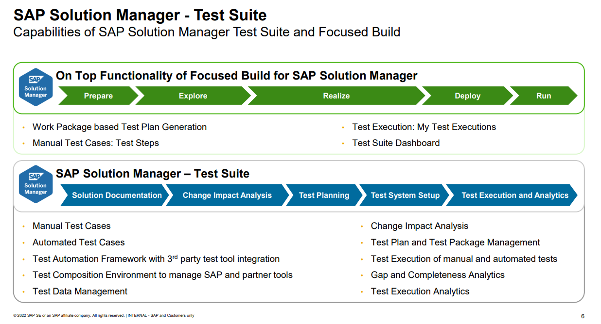
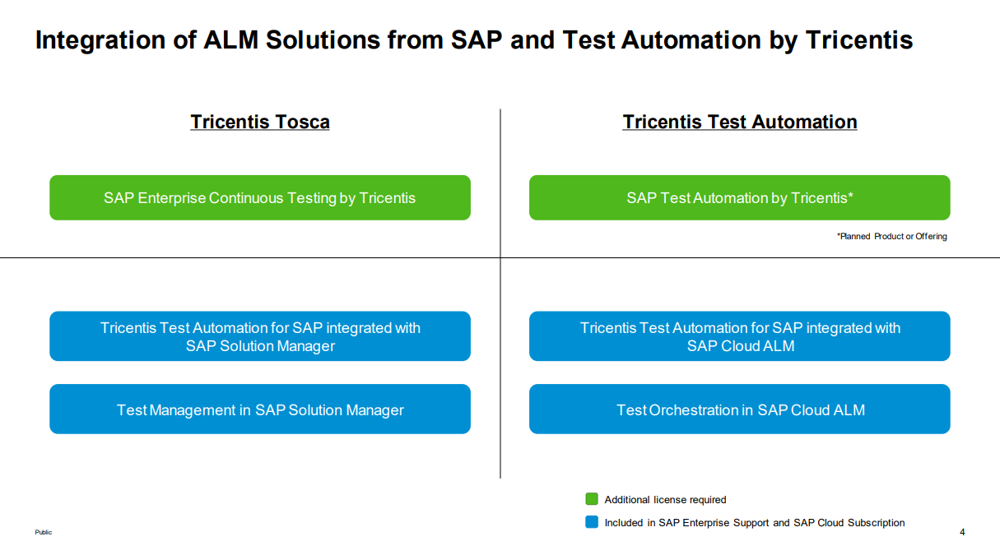

{: .no_toc}
# Empfehlungen für Testwerkzeuge

1. TOC
{:toc}
Die nachfolgend aufgeführten Testwerkzeuge sind nicht ABAP-spezifisch, sondern generell im Rahmen der (SAP)-Softwareentwicklung zu sehen. Das bedeutet auch, dass von Seiten der ABAP-Entwicklung nichts beachtet werden muss, was die Tests in irgendeiner Weise, also weder positiv oder negativ, beeinflussen könnte.

Die Auswahl in diesem Leitfaden beschränkt sich auf die von SAP präferierten und teilweise schon im Lizenzumfang enthaltenen Produkte. Daneben gibt es noch viele weitere Testmanagement-Lösungen auf dem Markt, die zur Unterstützung der ABAP-Entwicklung verwendet werden können.

## Testwerkzeuge im SAP Solution Manager
Der [SAP Solution Manager](https://support.sap.com/en/alm/solution-manager.html) .......die Seite ist auf EN... ist ein ausgereiftes System für das [Application Lifecycle Management](/ABAP-Leitfaden/application-lifecycle-management), das unter anderem verschiedene Testwerkzeuge enthält.

### Test-Suite
Die [Test-Suite des SAP Solution Managers](https://help.sap.com/docs/SUPPORT_CONTENT/sm/3530264795.html) besteht im Wesentlichen aus dem Testplan-Management zur Vorbereitung der Tests und einer Tester-App, mit der die Anwender, d.h. die Tester, die vorbereiteten und freigegebenen Testfälle durchführen. Dazu stehen für den Testmanager verschiedene Funktionen zur Auswertung und Analyse zur Verfügung.

Im Testplan-Management werden Testpläne angelegt und verwaltet. Das Herzstück ist die Auswahl der Testfälle, die als solche in der Struktur der [Lösungsdokumentation (engl. Solution Doumentation, kurz "SolDoc")](https://help.sap.com/docs/SAP_Solution_Manager/c3c5ec585ee248228ddb6c3f08073ea9/2cb3e75e134249a2bd091a40fe2f6d61.html?mt=de-DE) abgelegt sind. Diese können dann in kleinere Einheiten, die sogenannten Testpakete, aufgeteilt und den passenden Testern bzw. Testergruppen zugewiesen werden. Auf diese Weise können passgenaue Testpläne, zum Beispiel für Funktionstests, Integrationstests, Regressionstests, Komponenentests (engl. "Unit Tests") oder Akzeptanz- bzw. Abnahmetests (eng. "User Acceptance Tests") erstellt werden.
Manuelle Testfälle werden oft in **Testdokumenten** (mit Microsoft Word, Microsoft Excel etc.) beschrieben, in denen die durchzuführenden Testschritte detailliert aufgeführt sind. Außerdem besteht die Möglichkeit, **URLs** zu hinterlegen, die zu Testfällen führen, welche an einem anderen Ort liegen. Der dritte Testfalltyp im Standard des SAP Solution Managers sind sogenannte **Testkonfigurationen**, die automatisierte Testfälle ansteuern, die zum Beispiel mittels CBTA (Link zu dem Abschnitt), eCATT (Link zu dem Kapitel) oder mit Tricentis Tosca(!?!) (Link zu dem Kapitel) erstellt wurden (siehe dazu das [Kapitel zu den Testfällen im SAP Help Portal](https://help.sap.com/docs/SAP_Solution_Manager/fbc7b5ecf5094fe0b6a2eb966160008f/df49e0555937e263e10000000a44538d.html?locale=de-DE)).

Als weitere Variante für manuelle Testfälle wurden von SAP **Testschritte** eingeführt, die allerdings nur nach Installation des Add-on "Focused Build" zur Verfügung stehen (Link zu nächstem Abschnitt).

(Screenshot Testfälle in der SolDoc?)

Die Tester, welche die vom Testmanager bereitgestellten und freigegebenen Testfälle ausführen, bekommen diese in der App "Meine Aufgaben / Tester-Arbeitsvorrat" aufgelistet, mit allen für sie relevanten Informationen. Dort können die Testfälle abgarbeitet werden. Im Falle eines Fehlers kann dieser als sogenannter Testfallfehler (engl. "Test defect") gemeldet werden, der dann an das jeweilige Support-Team ausgesteuert wird und - nach Behebung des Fehlers - zum erneuten Testen ansteht.

Die Analysefunktionen der Test Suite bestehen aus verschiedenen Reports, die auf vielfältige Weise die Aktivitäten der Tester aufbereiten und teils grafisch darstellen. Der Testmanager hat damit jederzeit die Übersicht über den Stand und den Fortschritt der Tests.

### Testschritt-Designer
Aus dem Solution Manager Add-on "Focused Build" (Softwarekomponente ST-OST), das von SAP in erster Linie für die agile Softwareentwicklung konzipiert wurde (https://support.sap.com/en/alm/focused-build.html) und seit dem Jahr 2020 kostenlos zur Verfügung gestellt wird, ist beim Testmanagement speziell der **Testschritt-Designer** hervorzuheben, der auch eigenständig als Ergänzung zu den klassischen Testdokumenten verwendet kann, sowie in Kombination mit dokumentenbasierten Testfällen. Testschritte sind eine moderne, elegante Möglichkeit um manuelle Testfälle abzubilden, die im Gegensatz zu herkömmlichen Testdokumenten allerdings einiges mehr an Vorarbeit bei der Erstellung abverlangen. Andererseits können aus gut dokumentierten Prozessen mit detaillierten Prozessschritten durch wenige Klicks Testschritt-Designer-Testfälle generiert werden. https://help.sap.com/docs/Focused_Build_Focused_Insights/53cb8e90c8504f31bb44d4f0029b4b98/84bc67026ded45e58c7f29296a5d3f35.html

(Macht der Link hier irgendwo Sinn? Eher nicht, oder?)
https://support.sap.com/content/dam/support/en_us/library/ssp/alm/sap-solution-manager/focused-solutions/Focused_Build/sp15/FB_TestManagement_L2.pdf

Mit Focused Build wird eine weitere Tester-App namens "Meine Testausführungen" ausgeliefert, die für Testschritt-Designer-Testfälle optimiert und sehr einfach zu bedienen ist. Diese App beschränkt sich auf die für den Tester absolut notwendigen Funktionen. Sie kann auch für rein dokumentenbasierte Testfälle oder für Testpakete mit gemischten Testfällen verwendet werden und macht die Testfallausführung sehr angenehm.
Die "klassische" App "Meine Aufgaben / Tester-Arbeitsvorrat" ist etwas mächtiger, dafür allerdings auch schwieriger zu handhaben. Sie kann ebenso für beide Testfalltypen genutzt werden, wobei beim Aufruf eines Testschritt-Designer-Testfalls in ""Meine Testausführungen" abgesprungen wird, was anfangs eventuell verwirrend sein kann.

(Grafik selber machen auf deutsch, in Anlehnung an die Darstellung von SAP --> "Quelle...in Anlehnung an..."?) [und die einzelnen Punkte kurz beschreiben](https://support.sap.com/content/dam/support/en_us/library/ssp/alm/sap-solution-manager/focused-solutions/Focused_Build/sp15/FB_TestManagement_L2.pdf)

### Komponentenbasierte Testautomatisierung (Component-Based Test Automation, kurz CBTA)
Die komponentenbasierten Testautomatisierung ist das Bordwerkzeug des SAP Solution Managers zur Automatisierung von Testfällen und im Standardlieferumfang enthalten.
https://help.sap.com/docs/SAP_Solution_Manager/fbc7b5ecf5094fe0b6a2eb966160008f/00e90f0489994e76ad5999a63bbf4f30.html?locale=de-DE

Mit CBTA können Testfälle für unterschiedliche Technologien wie etwa SAP GUI, SAP CRM Web Client, Web Dynpro ABAP, Business Server Pages (BSP), SAP UI5/FIORI und viele mehr automatisiert werden.
Die Erstellung erfolgt mittels eines Testrecorders, der ein Testskript mit den auszuführenden Schritten generiert. Die einzelnen modularen Komponenten (das "C" in CBTA), die bei der Aufzeichnung eines Testskripts erzeugt werden, können wiederverwendet und als zusammengesetzte Testskripte für Ende-zu-Ende-Tests verwendet werden. https://help.sap.com/docs/SAP_Solution_Manager/fbc7b5ecf5094fe0b6a2eb966160008f/77f3f335ba9c4f0b8ec79924991d7748.html?locale=de-DE

Die Testskripts werden in sogenannte Testkonfigurationen gepackt und können darüber in der Lösungsdokumentation - neben manuellen Testfällen und URLs - abgelegt werden.

Mit dem Wartungsende des SAP Solution Managers rückt auch das Ende von CBTA näher. Daher ist es ratsam zu überlegen, ob eine zukunftsfähige Drittanbieter-Lösung wie Tricentis Test Automation (Link zu deem Abschnitt) zur Testautomatiserung vielleicht jetzt schon die bessere Alternative ist.

Kann ich den Link hier brauchen?
https://help.sap.com/docs/SUPPORT_CONTENT/sm/3530264810.html

## Testwerkzeuge in SAP Cloud ALM
Als Nachfolgeprodukt des SAP Solution Managers, dessen Mainstream-Wartungsende seitens SAP auf Ende 2027 datiert ist, wurde für das Application Lifecycle Management (ALM, Link zu diesem Kapitel bzw. hab ich oben schon) im Jahr xxx2018?xxx SAP Cloud ALM vorgestellt. Das Cloud-Produkt beinhaltet - wie schon der Solution Manager - unter anderem ein integriertes Testmanagement, das sowohl eigenständig (für manuelle Testfälle) als auch in Verbindung mit einer Testautomatisierungslösung wie Tricentis Test Automation (siehe den nächsten Abschnitt bzw. Link dort hin) eingesetzt werden kann. SAP Cloud ALM und damit auch dessen Testmanagement-Funktionen werden kontinuierlich weiterentwickelt.

Ähnlich wie im SAP Solution Manager gliedert sich das Testmangement in SAP Cloud ALM in eine App für die **Testvorbereitung** von manuellen und automatisierte Testfällen, eine App für die Verwaltung von **Testplänen**, eine für die **Testausführung**, eine Analytics-App für die **Testausführungsanalyse** sowie eine zur Übersicht über Testfallfehler, hier **Defekte** genannt.

Eine (Stand: Anfang 2025) in SAP Cloud ALM noch fehlende Funktion, die von vielen Anwendern im Solution Manager intensiv genutzt wird, ist de Gruppierung von Testfällen innerhalb eines Testplans in Testpakete, mit der Möglichkeit zur passgenauen Zuordnung von Testergruppen inklusive Wiederverwendung (??).

SAP liefert eine große Anzahl an Standardprozessen inklusive Prozessablauf-Diagramme und der zugehörigen Testaktivitäten aus, die sehr leicht in Cloud ALM verwendet und bei Bedarf angepasst werden können, ähnlich wie beim Testschritt-Designer (Link dorthin) aus dem Focused Build-Paket.

## Tricentis Test Automation
--> Harald

Tricentis ist ein eigenständiges Unternehmen, das nicht zu SAP gehört, aber [durch eine strategische Partnerschaft sehr gut in die SAP-Welt integriert](https://support.sap.com/en/alm/partners/test-automation.html) und daher [im SAP-Kontext die empfohlene Lösung zur Testautomatisierung](https://www.tricentis.com/sap) ist.

Eine Schnittstelle zwischen dem SAP Solution Manager und Tricentis Tosca existiert schon seit 2017. Im Jahr 2020 wurde die strategische Partnerschaft zwischen SAP und Tricentis weiter vertieft. Seitdem ist die Automatisierungsfunktionalität von Tricentis Tosca im SAP Solution Manager und inzwischen auch in SAP Cloud ALM integriert. Alle SAP Kunden mit einem SAP Enterprise Support Vertrag sind berechtigt, Tricentis Test Automation für SAP ("TTA for SAP") als Laufzeitlizenz zu nutzen. Darüber hinaus wird die Plattform von Tricentis über den SAP-Vertrieb als SAP Solution Extensions verkauft.

"TTA for SAP" ist eine Untermenge von Tricentis Tosca. Es verwendet die gleichen Konzepte für automatisierte Testfälle wie Tosca selbst, ist aber auf SAP-Anwendungen beschränkt. Weiterhin gibt es Funktionalitäten aus Tosca, die in "TTA for SAP" nicht vorhanden sind, wie z.B. die Testfallentwurfsfunktionen oder das Anforderungs- und Problem-Management.

"TTA for SAP" ist für die Verwendung mit der Test Suite des SAP Solution Manager gedacht. Dabei dient die Test Suite als Testmanagement-Tool (für Tests, Planung, Reporting und mehr) und TTA als Automatisierungs-Tool. Dazu wird in der Test Suite eine Testkonfiguration angelegt, die als Hülle für den automatischen Test dient. Der automatische Testfall kann direkt aus der Test Suite aufgerufen werden. Nach Ablauf des Testfalls wird der Status dann wieder an die Test Suite zurückgemeldet. Dies gilt analog für das Zusammenspiel des Solution Managers mit dem eigenständigen Automatisierungs-Tool Tricentis Tosca.

>>>>>>>>>>>> Harald (09.04.2025)
Tricentis Tosca wird von der SAP als "SAP Enterprise Continuous Testing by Tricentis" (ECT) angeboten.
 
Auch für Cloud ALM gibt es eine integrierte Lösung zur Testautomatisierung. "Tricentis Test Automation for SAP Cloud ALM" ist ein gemeinsames cloudbasiertes Angebot von SAP und Tricentis. Es kombiniert die Application-Lifecycle-Management-Fähigkeiten von SAP Cloud ALM mit den Testautomatisierungsfunktionen von Tricentis. So werden automatisierte, funktionale und durchgängige Softwaretests für alle browserbasierten SAP Produkte und Anwendungen ermöglicht. Tricentis liefert dazu auch Möglichkeiten zur Testorchestrierung, Ausführungsüberwachung und zum Testreporting. Um diese Funktionalität zu verwenden muss ein Tricentis-Tenant eingerichtet und mit SAP Cloud ALM verbunden werden. Allerdings gibt es wie bei TTA Einschränkungen bzgl. Usern und Speicher. Für die volle Funktionalität muss auch hier ein eigenständiges Tricentis-Tool erworben werden, die "SAP Test Automation by Tricentis".
 
Auch für Cloud ALM gibt es eine Schnittstelle zu Drittanbieter-Werkzeugen, das öffentliche "Test Automation API" (Link dazu: https://api.sap.com/api/CALM_TEST_AUTOMATION/overview). 
Über diese Schnittstelle kann neben Produkten anderer Anbieter auch das umfassende Tricentis-Testautomatisierungstool "SAP Test Automation by Tricentis" angeschlossen werden. Damit sind integrierte Tests mit SAP und Drittanbieter-Software möglich. Auch dieses Produkt von Tricentis kann über den SAP-Vertrieb erworben werden.
<<<<<<<<<<<<<<<<<<<

...verschiedene Ausprägungen...Lizenzen teilweise schon dabei...
        ·	Tosca: Integration in SAP SolMan – Link zu https://documentation.tricentis.com/tosca/2310/de/content/sap_solutionmanager/concept.htm 
        ·	TTA: Integration in SAP Cloud ALM – Link zu https://support.sap.com/en/alm/partners/test-automation.html 

    §	Tool für automatische GUI-Tests über sämtliche Technologien (Webseiten, SAP GUI etc.)

(Grafik selber machen auf deutsch, welches Tricentis-Tool für welches ALM-System etc., in Anlehnung an die Darstellung von SAP --> "Quelle...in Anlehnung an..."?) und die einzelnen Punkte kurz beschreiben

### Mögliche Einsatzszenarien für automatisierte Testfälle
#### Tägliche Smoke-Tests
--> Harald
Daily Smoke Tests in Testumgebungen...

#### Regressionstests
--> Harald
Automatisierte Testfälle können hervorragend für Regressionstests in Prä-Produktionssystemen eingesetzt werden...
was muss da beachtet werden???  
Testdaten etc.?

-----------------

Quellen:
SAP Cloud ALM forImplementation: Test Management https://support.sap.com/en/alm/sap-cloud-alm/implementation/sap-cloud-alm-implementation-expert-portal/testmanagement.html?anchorId=section_1012737862
SAP Application Lifecycle Management: Test Automation https://support.sap.com/en/alm/partners/test-automation.html (englisch, abgerufen am ...)
Tricentis: Die empfohlene Testlösungvon SAP https://www.tricentis.com/de/sap

----------------------
