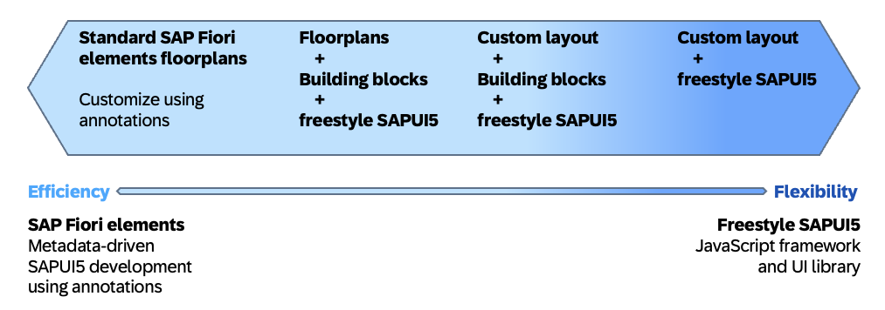

{: .no_toc}
# User Interface (UI)

1. TOC
{:toc}

Dieses Kapitel gibt einen Überblick über verschiedene UI-Technologien, die im Kontext von ABAP-System zum Einsatz kommen. Der Hauptfokus liegt relevanzbedingt auf Fiori (SAPUI5). Im späteren Verlauf wird jedoch auch ein Überblick auf ältere und teils weiterhin relevante Technologien gegeben.

{: .recommendation }
> * Für Neuentwicklungen sollte in den allermeisten Fällen eine Fiori-konforme Oberfläche zum Einsatz kommen.  
> * Wann immer möglich sollten neue Applikationen mit Fiori Elements umgesetzt werden. SAPUI5 Freestyle-Apps verlocken gerne dazu, sich durch zusätzliche Freiheiten in erhöhte Komplexität locken zu lassen und führen in der Regel zu deutlichem Mehraufwand.

## Fiori & SAPUI5

SAP Fiori bezeichnet die neue User Experience aktueller Lösungen der SAP, die auf Basis moderner Design-Prinzipien entstanden sind. Fiori ist die strategische Oberflächentechnologie der SAP und sollte in den meisten Fällen von Neuentwicklungen als gesetzte Technologie angesehen werden. Der Begriff **Fiori** meint dabei jedoch teils unterschiedliche Themen:

* Fiori als Designsprache moderner Oberflächen
* Fiori-Empfehlungen zu guter User Experience
* Fiori Elements Technologie zur annotationsgestützten Generierung von Applikationen
* Entwicklung von Fiori-Apps mit SAPUI5

Die reinen Design- und UX-Empfehlungen der SAP lassen sich theoretisch auch mit anderen Technologien umsetzen. Damit sich neu entworfene Anwendungen jedoch nativ in die SAP-Umgebung einbinden und für Nutzende ähnlich aussehen und sich ähnlich bedienen lassen ist es wichtig, sich an eben diese Empfehlungen zu halten. Dies sollte im Prozess bereits frühzeitig beachtet werden und je nach Situation auch mit Design Thinking oder Mockup-Erstellungen mit SAP's [Fiori Design Stencils](https://www.sap.com/design-system/fiori-design-web/v1-96/resources/libraries/downloads?external) beispielsweise für [Figma](https://www.figma.com/de-de/design/) sichergestellt werden. Sowohl Entwickler als auch Fachberater sollten daher mit den [Fiori Design Guidelines](https://experience.sap.com/fiori-design/) vertraut sein.

Abgesehen von der rein optischen und interaktiven Betrachtung der Fiori Guidelines wird unter Fiori im Allgemeinen auch die tatsächliche Entwicklung und Technologie hinter den Fiori-Apps bezeichnet. Hier lässt sich zwischen den generierten Fiori Elements Apps ohne FrontEnd-Coding und Freestyle-Applikationen entscheiden, die mit SAPUI5 (also Type- bzw. JavaScript) entwickelt werden. Das Flexible Programming Model bietet eine Mischform aus beiden. Diese verschiedenen Möglichkeiten werden später im Kapitel näher erläutert. Allgemein lässt sich jedoch sagen, dass Fiori-Applikationen als Browser-Website von Anwender konsumiert werden. Daher ist die Nutzung auch nicht mehr auf Endgeräte eingeschränkt, auf denen die SAP GUI installierbar ist - ein moderner Webbrowser ist ausreichend. Somit können Fiori Apps auch auf mobilen Geräten wie Smartphones, Tablets oder AR-Headsets genutzt werden.

Einhergehend mit dieser Trennung geht auch die stärkere Unterscheidung von Front- und BackEnd-Entwicklung als Sie dies vielleicht aus bisherigen SAP-Entwicklungen kennen. Das S/4 System liefert als BackEnd die Datenhaltung, Prüfung von Berechtigungen und den Großteil der Transaktionslogik für Apps. Nach außen hin wird dies als OData Service veröffentlicht.  Dieser dient als Schnittstelle für die tatsächliche FrontEnd-App (die im Browser ausgeführte Fiori-App) um Daten zu lesen, schreiben oder Aktionen ausführen zu können. Diese Kommunikation über OData ist per Definition stateless, das BackEnd ist also die Single Source of Truth zum Datenstand und verwaltet den Großteil der Datenlogik. In bestimmten Szenarien kann diese Zweiteilung die Entwicklung verkomplizieren. Beispielsweise entstand dadurch auch die Notwendigkeit des Draft-Konzeptes um die Vorhaltung von Zwischenständen zu Datensätzen zu ermöglichen.

Wenn auch mittlerweile archiviert sei an dieser Stelle dennoch auf den (englischsprachigen) [DSAG UI5 Best Practice Guide](https://1dsag.github.io/UI5-Best-Practice/) hingewiesen.  In der folgenden Tabelle werden die Vor- und Nachteile von SAPUI5 gegenübergestellt: 

| Vorteile SAPUI5                      | Nachteile SAPUI5           |
| ------------------------------------ | ------------------------- | 
| Umfassende SAmmlung von Standard-UI-Elementen, die die Implementierung stark vereinfachen. | JavaScript erforderlich (ABAP nur im BackEnd). Daher Skill-Aufbau notwendig. |
| Modernstes Aussehen | SAP Gateway erforderlich (bei der separaten Installation zusätzliche Kosten) |
| Theoretisch ist alles möglich, was HTML5 in Verbindung mit JavaScript erlaubt. | In Spezialfällen u.U. fehlende Features und schlechtere Performance gegenüber SAP GUI / ALV. |
| Nutzung auf Tablets und Smartphones. | Komplexe Apps erfordern mehr Aufwand (Stateless Apps) |
| Responsive UI (Automatische Anpassung an das jeweilige Endgerät) | |
| Nutzung der Endgerätefähigkeiten wie z.B. Kameras | |
| Native SAP-Fiori-Launchpad-Integration | |
| Relativ neue, ständig weiterentwickelte Technologie. Daher optimale Integration in aktuelle Web-Browser | |

### Fiori Elements
Das Fiori Elements Framework ermöglicht es, größtenteils ohne FrontEnd-Erfahrungen (JavaScript, XML) vollwertige Fiori-Unternehmensanwendungen umzusetzen. Dazu gibt es einige vorgefertigte Floorplans (App-Typen) der SAP, die basierend auf einem OData-Service generiert werden. Der am weitesten verbreitete UseCase ist die Kombination aus [List Report](https://experience.sap.com/fiori-design-web/list-report-floorplan-sap-fiori-element/) und [Object Page](https://experience.sap.com/fiori-design-web/object-page/). Mit diesen Typen lassen sich transaktionale Szenarien umsetzen, in der einzelne Business Datensätze in einer durchsuchbaren Tabelle aufgelistet und in der Object Page übersichtlich angelegt oder geändert werden können. Die [Analytical List Page](https://experience.sap.com/fiori-design-web/analytical-list-page/) ermöglicht eine standardisierte Anzeige zur Auswertung analytischer Datensätze.

Grundsätzlich ist es für die Erstellung ausreichend, den OData-Service mit UI-Annotationen anzureichern. Hierfür werden im CDS Consumption View beziehungsweise Metadata Extensions die gewünschten Konfigurationen hinterlegt. Über den OData-Service veröffentlicht wertet das Fiori Elements Framework die Annotationen zur Laufzeit aus und generiert die Fiori App dementsprechend. Für die Entwicklung transaktionaler Fiori Elements Applikationen bietet sich insbesondere das [ABAP RESTful Application Programming Model (RAP)](../abap/restful_abap.md) an. Zur Entwicklung wird auf den [DSAG ADT Leitfaden](https://1dsag.github.io/ADT-Leitfaden/) verwiesen, da die nötigen UI Annotationen zur Generierung von Fiori Elements Apps nur in der Entwicklungsumgebung Eclipse angelegt werden können.

Im UI5 Demo Kit finden sich einige offizielle [Tutorials und Kurse](https://sapui5.hana.ondemand.com/#/topic/8b49fc198bf04b2d9800fc37fecbb218) der SAP zum Einstieg in die Fiori Elements Entwicklung. Einen guten Überblick zu Möglichkeiten und einen Hinweis zur entsprechenden Umsetzung einzelner Features bietet die [Fiori Elements Feature Map](https://sapui5.hana.ondemand.com/sdk/#/topic/62d3f7c2a9424864921184fd6c7002eb). Grundsätzlich ist auch die Entwicklung mit dem Cloud Application Programming Model (CAP) möglich - im Kontext dieses ABAP Leitfadens jedoch nicht weiter im Fokus.

### Fiori Freestyle
Wenn für eine zu entwickelnde Anwendung die von der SAP zur Verfügung gestellten Floorplans nicht ausreichend sind muss die UI-Oberfläche manuell entwickelt werden. Hierfür kommt eine Fiori Freestyle Entwicklung zum Einsatz. Die Fiori-Entwicklung wird mit dem SAPUI5-Framework umgesetzt, hierfür sind Kenntnisse zu JavaScript, XML-Views sowie dem MVC-Konzept notwendig.

Über Fiori Tools lässt sich eine leere Applikations-Hülle mit Anbindung an einen OData-Service erstellen. Die restliche Applikations-Logik muss dann jedoch selbst implementiert werden. Die Darstellung der tatsächlichen Oberfläche wird über XML-Views definiert. Hierfür stellt SAP eine breite Auswahl an Controls zur Verfügung, die bereits viel Implementierungsaufwand ersparen und ein Fiori-konformes Design unterstützen. Diese sind in der [SAPUI5 API Referenz](https://sapui5.hana.ondemand.com/#/api) nach Version aufgeschlüsselt einsehbar.

Unter dem Namen [OpenUI5](https://openui5.org/) wird SAPUI5 auch unter einer Open-Source-Lizenz vertrieben. Hierbei sind allerdings einige Komponenten nicht in der Distribution enthalten. Grundsätzlich lassen sich damit aber nach Bedarf auch ohne Nutzung eines SAP-BackEnds Fiori-Applikationen umsetzen.

### Flexible Programming Model
Das [Flexible Programmiermodell (FPM)](https://ui5.sap.com/test-resources/sap/fe/core/fpmExplorer/index.html#/overview/introduction) bietet eine Mischform aus generierten Fiori Elements- und manuell entwickelten SAPUI5 Freestyle-Oberflächen. Es steht ab SAPUI5 v1.94 und nur mit OData V4 zur Verfügung. Das FPM ermöglicht es dabei, über eigenständige Container Freestyle-Elemente in einer Fiori Elements Applikation einzubinden. Andererseits können auch Fiori Elements-Bausteine in einer Freestyle-App eingebaut werden. Um einen Eindruck zu den Vorteilen des FPM zu gewinnen bieten sich [dieser CodeJam](https://github.com/SAP-samples/fiori-elements-fpm-exercises-codejam) oder diese [Learning Journey](https://learning.sap.com/learning-journeys/developing-an-sap-fiori-elements-app-based-on-a-cap-odata-v4-service/getting-an-overview-of-the-flexible-programming-model_fc9ea1ee-20a8-4add-b3f9-c8c8e3701ae0) an.
  

  
Flexible Programming Model als Mischform von Fiori Elements und Freestyle SAPUI5, © SAP
{: .img-caption}

Die durchs FPM ermöglichte Flexibilität bietet einem die Möglichkeiten, auch in generierten Applikationen mehr Freiheiten bei der Entwicklung zu genießen. Die strikte Wahl zwischen SAPUI5-Freestyle oder Fiori Elements rückt dadurch ein Stück weit in den Hintergrund. Gekapselt können Fiori Elements Teilbereiche über Building Blocks eingebettet werden. Der [Flexible Programming Model Explorer](https://sapui5.hana.ondemand.com/test-resources/sap/fe/core/fpmExplorer/index.html) liefert live testbare Beispiele über FPM-Implementierungsmöglichkeiten über Extension Points und Building Blocks und erlaubt es, Beispieldateien oder ganze Projekte als Referenz herunterzuladen.

## Legacy Technologien
Dieses Kapitel soll einen kurzen Überblick über bisher nicht genannte Oberflächentechnologien geben. Da diese im Laufe der Zeit immer mehr an Relevanz verlieren wird an dieser Stelle nicht näher auf einzelne Technologien eingegangen.  

| UI-Technologie                       | SAP-Roadmap               | Kommentar           | Empfehlung für Neuentwicklungen           |
| ------------------------------------ | ------------------------- | ------------------- |  ---------------------------------------- |
| Dynpro (klassisch) | nur noch Support | SAP rät von Neuentwicklungen ab. Geringerer Entwicklungsaufwand, vor allem bei einfachen Reports mit generiertem Selektionsbild. Bei Power-Usern beliebt. | Für kleinere Entwicklungen in vielen Fällen weiterhin sinnvoll, in S/4 Cloud jedoch nicht unterstützt. |
| Business Server Pages (BSP) | nur noch Support | Durch Web Dynpro abgelöst | Nicht sinnvoll |
| Webclient UIF | nur noch Support | Im CRM auf Basis der BSP-Technologie entwicklet und im Einsatz | Für klassische CRM-Apps weiterhin relevant. SAP Hybris C4C setzt hier auf SAPUI5 / SAP Fiori |
| Web Dynpro Java | nur noch Support | Sollte nicht mehr verwendet werden | Nicht sinnvoll |
| Web Dynpro ABAP inkl. Floorplan Manager | Kleinere Erweiterungen | In Kombination mit Floorplan Manager weniger aufwändig als Standalone. | Stattdessen SAPUI5 in Erwägung ziehen. |
| SAP Screen Personas | Kleinere Erweiterungen | Konfiguration und Scripting (Java-Script), um existierende Anwendungen auf Basis klassischer Dynpros attraktiver und besser bedienbar zu machen. | Für UI-Überarbeitung existeriender Dynpro-Programme sinnvoll. |
| CRM Web UI | n/a | Aus SAP Change Request Management bekannte Oberflächentechnologie. | Stattdessen SAPUI5 in Erwägung ziehen. |

