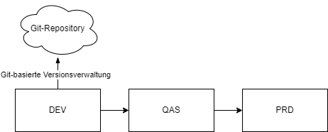
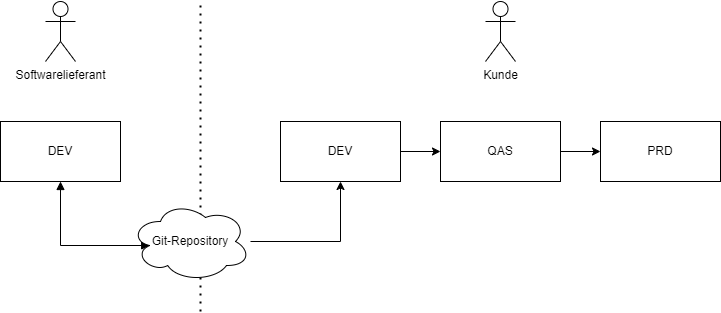
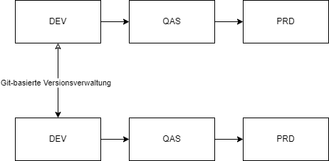
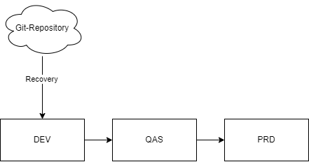
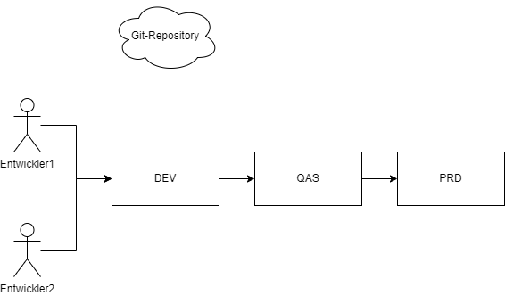
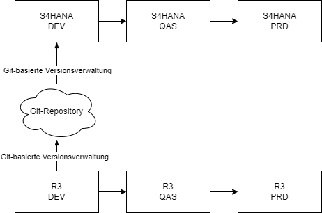

{: .no_toc}
# Versionsverwaltung

1. TOC
{:toc}

## Einleitung/Motivation
Zu den aufbewahrungspflichtigen Dokumenten gem. HGB, AO und GoBS gehören auch die Repositoriy-Objekten in ABAP. Dies wurde lange Zeit durch die integrierte Versionsverwaltung innerhalb der ABAP-Workbench (SE80) erreicht. In den letzten Jahren hat sich aber ABAP weiterentwickelt, sei es der Einsatz einer externen Entwicklungsumgebung (ABAP Development Tools), der Einsatz von Git-Versionsverwaltung oder die Entwicklung weiterer Repository-Objekten, die nicht in der ABAP-Workbench entwickelt werden können. Daher stellt sich für jeden ABAP-Entwickler, die zentrale Frage: 
* Welche Versionsverwaltung soll ich wann nehmen?

Dieses Kapitel soll daher einen Überblick und eine Gegenüberstellung von Versionsverwaltungs-Lösungen innerhalb des SAP-Universums für ABAP-Entwickler geben.

## Git-Grundlagen
Git ist ein verteiltes Versionierungssystem welches frei als Open-Source zur Verfügung gestellt wird. Es wurde vom Linux-Erfinder Linus Torvalds 2005 entwickelt. Im Programmierbereich dient es dazu:
* eigene Änderungen zu überwachen
* Änderungen rückgängig zu machen
* anderen zur Verfügung zu stellen
* Aktualisierungen von anderen einzuholen

Dadurch ergeben sich folgende Vorteile:
* es kann zeitgleich entwickelt werden z. B. für verschiedene Features
* Versionierung verhindert, dass bereits getätigte Arbeiten verloren gehen bzw. überschrieben werden
* Bei Bedarf kann zu früheren Versionen zurückgekehrt werden oder simultan an verschiedenen Versionen gearbeitet werden

### Wichtige Begriffe
* **Repository**: In ein Repository bzw. einem Repo befinden sich alle Dateien inklusive derer vorangegangenen Versionen. Dadurch stehen stets alle Änderungen zur Verfügung, die von einer Datei ins Repo gespielt wurden und es kann nachvollzogen werden Wer, Wann, welche Änderungen durchgeführt hat.
* **Branches**: Beim Einsatz von Git dienen Branches (engl.: to branch - sich verzweigen) dazu, um einen separaten Arbeitszweig zu erstellen. Dieser kann dann auch als neuer Kontext gesehen werden, in dem gearbeitet wird. So kann z.B. die Programmierung eines Features in einem eigenen Branch erfolgen, der bei Fertigstellung und nach dem Testen zurück in den Master-Zweig eingearbeitet wird.
* **Versionierung**: Bei der Versionierung wird im Git alle getätigten Änderungen protokolliert. Mittels einem "Commit" können die Änderungen zu dem Repository hinzugefügt werden, eine neue Version der Datei(n) befinden sich dann im Repo. Anschließend können verschiedene Versionen miteinander verglichen, Änderungen rückgängig oder zu einer früheren Version zurückgekehrt werden.
## Einsatz von gitbasierten Lösungen in der ABAP-Entwicklung

In vielen Programmiersprachen ist eine Verwaltung von Programmcode in einem Git-Repository Standard. Durch den Einsatz von Lars Hvam Petersen, der es durch seine freie OpenSource Lösung abapGit ermöglicht hat, ABAP-Code in ein Git-Repository zu bringen, nehmen Git-Basierte Lösungen in der ABAP-Welt eine immer wichtigere Rolle ein. Der Einsatz von gitbasierten Lösungen in der ABAP-Entwicklung hat folgende technologische Vorteile:

* **Standardmäßige Funktionen für die Versionsverwaltung**: Durch den Einsatz von Git können standardmäßige Funktionen eingesetzt werden, wie das Rollback nicht nur für ein Objekt, sondern für alle Objekte gleichzeitig.
* **Zusammenarbeit von mehreren Entwicklern gleichzeitig an unterschiedlichen Anforderungen**: Mit Hilfe von Git ist es möglich, dass mehrere Entwickler gleichzeitig mit Hilfe von Branches an unterschiedlichen Anforderungen arbeiten kann.
* **Ermöglichen von externen Tools**: Es ist nun möglich nicht nur SAP-Produkte für den Entwicklungsworkflow zu verwenden, sondern kann auch externe Tools verwenden, um seinen Code z.B. zu prüfen. Zudem können CI-Pipelines gebaut werden, die mit dem Standard-Transportmechanismus nicht möglich ist.
* **Versionierung**: Bisher war es nur möglich eine Version zu einem Objekt zu wissen. Nun ist es möglich mit Hilfe von Tags eine Reihe von Objekten zu versionieren. Dies hat den Vorteil, dass nun die Anwendung ein Releasecharakter besitzen kann.
* **Code ist zentral**: Der Code befindet sich an einer zentralen Stellen und alle Änderungen zu der Anwendung werden dorthin gebracht. Neben dem ABAP-Code können auch andere Bestandteile der Anwendung wie z.B. Fiori oder auch .NET Entwicklungen im Git-Repository gespeichert werden. Es kann auch die Dokumentation im Git gespeichert werden.

Neben den technologischen Vorteilen gibt es auch organisatorische Vorteile
* **Git ist Standardlösung**: Es ist einfacher andere Menschen für die SAP-Entwicklung zu begeistern, wenn sie schon Tools oder Technologien aus anderen Programmiersprachen kennen. GIt ist Standardlösung für andere Programmiersprachen und es muss kein neues Know-How aufgebaut werden. Besonders Studenten, die Git schon kennen, können sich dann für ABAP besser begeistern.
* **Einheitliches Format für Programmiersprachen**: Im Git-Repository können nicht nur SAP-Entwicklungen gespeichert werden, sondern es können auch andere Entwicklerteams dort ihren Code zentral hinterlegen.
* **Format**: Das Format ist einheitlich und kann von jedem gelesen werden. Es ist nicht verschlüsselt und alle Änderungen können nachvollzogen werden. So kann auch ein Wirtschaftsprüfer alle Änderungen sehen, wann und von wem es gemacht wurden.

## Versionskontrollsysteme im SAP-Umfeld
Folgende Versionskontrollsysteme gibt es im SAP-Umfeld
### Serverbasierte Versionsverwaltung
Die serverbasierte Versionsverwaltung ist für alle editierbaren Objekte der ABAP Workbench aktiv.
Die Versionsverwaltung kann über
* SE80 - Object Navigator
* SE09 - Transport Organizer
* die Anzeige- und Pflegetransaktionen für Repository Objekte
aufgerufen werden.

Die Versionen werden bei jeder Transportfreigabe versioniert.
### Lokale Versionsverwaltung in ABAP Development Tools
Das eclipsebasierte ABAP Development Tools bietet zwei Basis, eingebaute Versionsverwaltungen für Entwicklungsressourcen an.
* **clientbasierte lokale Versionsverwaltung:** - Das Standardfeature unter Eclipse bietet eine Standardversionsverwaltung. Jedes Mal wenn es bearbeitet und gespeichert wird, speichert es Eclipse nach den persönlichen eingestellten Präferenzen.
* **serverbasierte Revisionshistorie:** - Dies entspricht der lokalen Versionsverwaltung.

Bei der Verwendung der beiden Versionen in Eclipse zum Vergleich was zwischen zwei Ständen unterschiedlich ist, kommt der ABAP Compare Editor in Eclipse zum Einsatz.
### abapGit
abapGit ist ein in ABAP entwickelter Git-Client. Es wurde von Lars Hvam Petersen entwickelt und ist ein OpenSource Projekt. Mit abapGit haben Entwickler die Möglichkeit eine Git-Versionskontrolle mit dem SAP-Applikationsserver zu verbinden und ABAP-Entwicklungsobjekte in einem Git-Repository anzulegen.
### gCTS
Im Gegensatz zu abapGit ist gCTS (Git-enabled Change and Transport System) ein von SAP bereitgestellte Erweiterung zu CTS. Es unterstützt die Integration von Git in das bestehende CTS, um moderne Versionskontrollfunktionen zu ermöglichen.
### Versionsverwaltung in SAP BAS
Mit SAP Business Application Studio steht Unternehmen ein Werkzeug für die Entwicklung ihrer Anwendungen und Erweiterungen mit Bezug zu SAP-Lösungen zur Verfügung. Die Entwicklungsumgebung stellt der Anbieter dabei in Form eines Cloud-basierten Services bereit. Für die einfachere Versionsverwaltung ist eine Integration mit Git vorgesehen. Die Versionierung ist aber auch mit anderen Systemen möglich.
## Vergleich der unterschiedlichen Versionskontrollsystemen
### Versionskontrollsysteme

#### Lokale Versionsverwaltung in der SE80
#### Versionsverwaltung in ABAP Development Tools
#### abapGit in SAP GUI
#### abapGit in Eclipse
#### abapGit in der Cloud
#### gCTS onPremise
#### gCTS in der Cloud
#### SAP BAS
## Einsatzszenarien
### Normale 3-System-Landschaft
Bei diesem Einsatzszenario geht es darum, dass der Code auf dem Entwicklungssystem in ein Git-Repository mit einem Git-Versionsverwaltungssystem übertragen wird.

### Softwarelieferant
Dieses Einsatzszenario dient zum Austausch zwischen Quellcode von einem Softwarelieferant an seinem Kunden über ein Git-Repository.

### Verteilung in verschiedene Systemlandschaften
Hier geht es darum, dass man zwischen seinen verschiedenen Systemlandschaften Quellcode austausch. So ist es möglich ohne Quertransporte den gleichen Quellcode zu nutzen und weiterzuarbeiten.

### Recovery
Dieses Szenario beschreibt die Möglichkeit, dass aus dem Git-Repository ein alter Stand zurückgewonnen werden kann.
Dabei muss nicht jedes Repository-Objekt einzeln zurückgeholt werden, sondern ein alter Stand einer ganzen Anwendung.

### Paralleles Arbeiten

### Custom Code Migration

–	Kundenentwicklung in einer normalen 3-System-Landschaft
–	Entwicklung in verschiedene Systemlandschaften verteilen
–	Recovery in drei Systemlandschaft
–	Paralleles Arbeiten
–	Custom Code Migration (Backup Legacy)

## Entwicklungsprozess mit Versionsverwaltung
–	Standard: Auftrag muss am Anfang angelegt werden
–	GIT: Commit wird nach der Änderung durchgeführt
–	Standard: Verteilen von Code – keine Kontrolle über die Änderungen in anderen Systemen
–	GIT: Zentraler Anlaufpunkt 
–	Standard: Versionierung einer Anwendung nicht möglich
–	GIT:  Versionierung von einer ganzen Anwendung über standardfunktionalitäten möglich
## Annäherung Entwicklungsprozesse ABAP und Non-ABAP über git-basierte Tools
## Security Aspekte 
## Integration an andere Komponenten
## Risiken
## Zusammenfassung
## Empfehlung
## Quellen
https://www.rheinwerk-verlag.de/git-und-sap/?srsltid=AfmBOooMbM45uQOGPLDAiaKz5hHazrf45BIEVjmOIe8mz9HjpdHjgzZq
